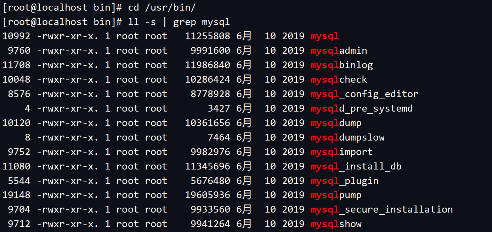
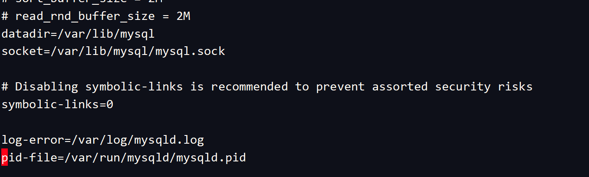
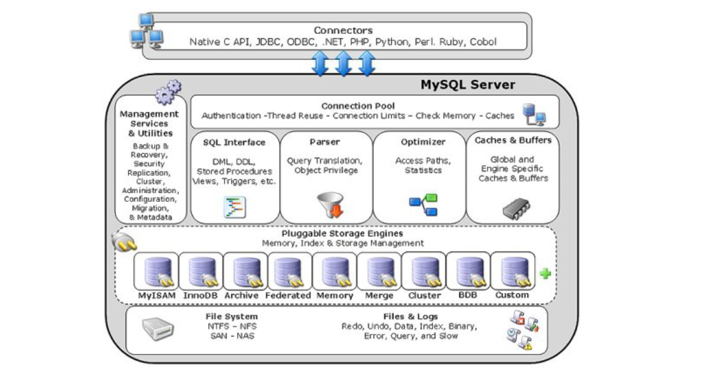
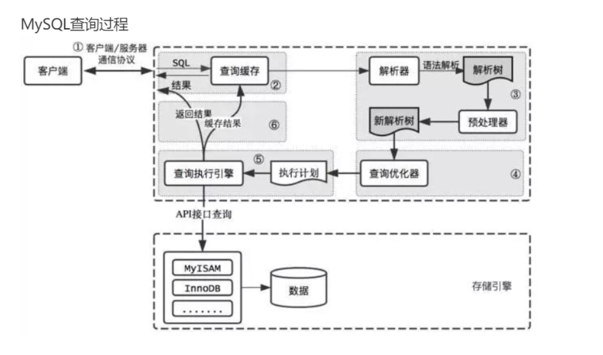

## 一、了解mysql的安装目录

### [#](https://ydlclass.com/doc21xnv/database/dir/#_1、windows中的目录)1、windows中的目录

#### [#](https://ydlclass.com/doc21xnv/database/dir/#_1-整体的目录结构)（1）整体的目录结构


#### [#](https://ydlclass.com/doc21xnv/database/dir/#_2-数据文件目录)（2）数据文件目录


- 1、`bin`目录
- 用于放置一些可执行文件，如mysql.exe、mysqld.exe、mysqlshow.exe等。
- 2、`data`目录
- 用于放置一些日志文件以及数据库。
- 3、`include`目录
- 用于放置一些头文件，如：mysql.h、mysql_ername.h等。
- 4、`lib`目录
- 用于放置一系列库文件。
- 5、`share`目录
- 用于存放字符集、语言等信息。
- 6、`my.ini`这个很重要
- 是MySQL数据库中使用的配置文件。

配置文件很重要，所谓配置文件就是配置一下你的mysql让他成为你想要的的样子。

### [#](https://ydlclass.com/doc21xnv/database/dir/#_2、linux中的文件目录)2、linux中的文件目录

咱们当时使用的是rpm安装，他会有个默认的路径。

#### [#](https://ydlclass.com/doc21xnv/database/dir/#_1-bin)（1）bin



#### [#](https://ydlclass.com/doc21xnv/database/dir/#_2-配置文件)（2）配置文件


#### [#](https://ydlclass.com/doc21xnv/database/dir/#_3-pid文件)（3）pid文件

这个文件用来指导当前运行的mysql实例的进程号！



#### [#](https://ydlclass.com/doc21xnv/database/dir/#_4-数据库文件)（4）数据库文件


### [#](https://ydlclass.com/doc21xnv/database/dir/#_3、附录-常用配置)3、附录：常用配置

- port：端口
- server-id：数据库唯一标识码
- datadir：数据目录路径
- basedir：基本路径
- socket：指定socket文件路径
- skip-name-resolve：禁止mysql对外部连接进行DNS解析，启用时所有远程连接都要使用ip地址方式
- skip-external-locking：避免外部锁，默认开启
- skip-grant-tables：mysql启动时不使用grant-tables授权表，常用于忘记密码情况下
- user：使用的用户
- sql_mode：约束SQL语法模式
- show_query_log_file：慢日志存储路径，5.6及以上版本，log-slow-queries是5.6以下版本
- long_query_time：设置慢查询时间，默认10s
- log-queries-not-using-indexes：记录未使用索引查询
- log_throttle_queries_not_using_indexs：5.6.5版本新增参数，设定每分钟记录到日志未使用索引的语句数目，超过则之后只记录语句数量和花费总时间
- log_output：日志存储方式，默认FILE，TABLE表示写入到mysql.slow_log表
- expire_logs_days：二进制日志保留的时间
- log-bin：设置日志文件路径及名称
- log-bin-index：日志文件后缀形式
- relay-bin：中继日志文件
- relay-bin-index：中继日志文件后缀形式
- max_connections：mysql最大连接数（超出会报Too many connections）
- back_log：mysql暂存的连接数量(每个连接占用256kb)
- wait_timeout：关闭一个非交互的连接之前所需要等待的秒数
- max_connect_errors：最大错误连接数，flush host进行解禁
- max_allowed_packet：接受数据包大小，需要是才会分配内存，设置过大会造成内存溢出
- max_heap_table_size：用户可以创建的内存表大小
- tmp_table_size：mysql的heap表缓冲大小
- read_rnd_buffer_size：mysql随机读缓冲区大小
- sort_buffer_size：mysql执行排序使用的缓冲大小
- join_buffer_size：联合查询操作所能使用的缓冲区大小

### [#](https://ydlclass.com/doc21xnv/database/dir/#_4、mysql修改配置的方法)4、mysql修改配置的方法

（1）设置全局变量方法1(不推荐): 修改参数文件, 然后重启mysqld

```text
# vi /etc/my.cnf
[mysqld]
wait_timeout=10
# service mysqld restart
```

1
2
3
4

不过这个方法太生硬了, 线上服务重启无论如何都应该尽可能避免.

（2）设置全局变量方法2(推荐): 在命令行里通过SET来设置, 然后再修改参数文件**

如果要修改全局变量, 必须要显示指定"GLOBAL"或者"@@global.", 同时必须要有SUPER权限.

```text
mysql> set global wait_timeout=10;
mysql> set @@global.wait_timeout=10;
```

1
2

然后查看设置是否成功:

```text
mysql> select @@global.wait_timeout=10;
or
mysql> show global variables like 'wait_timeout';
```

1
2
3

如果查询时使用的是show variables的话, 会发现设置并没有生效, 除非重新登录再查看. 这是因为使用show variables的话就等同于使用show session variables, 查询的是会话变量, 只有使用show global variables查询的才是全局变量. 如果仅仅想修改会话变量的话, 可以使用类似set wait_timeout=10;或者set session wait_timeout=10;这样的语法.

当前只修改了正在运行的MySQL实例参数, 但下次重启mysqld又会回到默认值, 所以别忘了修改参数文件:

```text
# vi /etc/my.cnf
[mysqld]
wait_timeout=10
```

1
2
3

（3）设置会话变量方法: 在命令行里通过SET来设置

如果要修改会话变量值, 可以指定"SESSION"或者"@@session."或者"@@"或者"LOCAL"或者"@@local.", 或者什么都不使用.

```sql
mysql> set wait_timeout=10;
mysql> set session wait_timeout=10;
mysql> set local wait_timeout=10;
mysql> set @@wait_timeout=10;
mysql> set @@session.wait_timeout=10;
mysql> set @@local.wait_timeout=10;
```

1
2
3
4
5
6

然后查看设置是否成功:

```sql
mysql> select @@wait_timeout;
mysql> select @@session.wait_timeout;
mysql> select @@local.wait_timeout;
mysql> show variables like 'wait_timeout';
mysql> show local variables like 'wait_timeout';
mysql> show session variables like 'wait_timeout';
```

1
2
3
4
5
6

（4）会话变量和全局变量转换方法:

在命令行里通过SET来设置

```bash
# 将会话变量值设置为对应的全局变量值呢:
mysql> set @@session.wait_timeout=@@global.wait_timeout;
# 将会话变量值设置为MySQL编译时的默认值(wait_timeout=28800):
mysql> set wait_timeout=DEFAULT;
```

1
2
3
4

这里要注意的是, 并不是所有的系统变量都能被设置为DEFAULT, 如果设置这些变量为DEFAULT则会返回错误.

## [#](https://ydlclass.com/doc21xnv/database/dir/#二、mysql的系统架构)二、mysql的系统架构

### [#](https://ydlclass.com/doc21xnv/database/dir/#_1、-数据库和数据库实例)1、 数据库和数据库实例

在MySQL的学习研究中，存在两个非常容易混淆的概念，即`数据库`和`数据库实例`。在MySQL中，数据库和数据库实例定义如下：

- 数据库：存储数据的；
- 数据库实例：操作数据库的。

如上定义很清楚了，数据库是用来存储数据的，数据库实例是用来操作数据的，从操作系统的角度，数据库实例表现为一个进程，对应多个线程，

在非集群数据库架构中，数据库与数据库实例存在一 一对应关系，在数据库集群中，可能存在多个数据库实例操作一个数据库情况，即多对一关系。

### [#](https://ydlclass.com/doc21xnv/database/dir/#_2、mysql架构)2、MySQL架构

复杂的架构是为了更好的工作，架构中的每一个角色都可以高效的单独处理一类事件，举个例子。

你去拜访你朋友当然朋友自己迎接你即可。

但是你要拜访市长，可能就要门卫处做身份认证、传达室负责接通电话确认可以、市长办公室负责接待、你可能需要排队等候、你的事情如果办公室就能解决可能就不用见市长了，最后轮到你了，你才能见上市长。

对于MySQL来说，虽然经历了多个版本迭代（MySQL5.5,MySQL 5.6,MySQL 5.7,MySQL 8）,但每次的迭代，都是基于MySQL

基架的，MySQL基架大致包括如下几大模块组件：

**（1）MySQL向外提供的交互接口（Connectors）**

Connectors组件，是MySQL向外提供的交互组件，如java,.net,php等语言可以通过该组件来操作SQL语句，实现与SQL的交互。

**（2）管理服务组件和工具组件(Management Service & Utilities)**

提供对MySQL的集成管理，如备份(Backup),恢复(Recovery),安全管理(Security)等

**（3）连接池组件(Connection Pool)**

负责监听对客户端向MySQL Server端的各种请求，接收请求，转发请求到目标模块。每个成功连接MySQL Server的客户请求都会被

创建或分配一个线程，该线程负责客户端与MySQL Server端的通信，接收客户端发送的命令，传递服务端的结果信息等。

**（4）SQL接口组件(SQL Interface)**

接收用户SQL命令，如DML,DDL和存储过程等，并将最终结果返回给用户。

**（5）查询分析器组件(Parser)**

首先分析SQL命令语法的合法性，并尝试将SQL命令分解成数据结构，若分解失败，则提示SQL语句不合理。

**（6）优化器组件（Optimizer）**

对SQL命令按照标准流程进行优化分析。

**（7）缓存主件（Caches & Buffers）**

缓存和缓冲组件





**（8）MySQL存储引擎**

> 什么是MySQL存储引擎

 MySQL属于关系型数据库，而关系型数据库的存储是以表的形式进行的，对于表的创建，数据的存储，检索，更新等都是由MySQL

存储引擎完成的，这也是MySQL存储引擎在MySQL中扮演的重要角色。

 研究过SQL Server和Oracle的读者可能很清楚，这两种数据库的存储引擎只有一个，而MySQL的存储引擎种类比较多，如MyISAM存储引擎，InnoDB存储引擎和Memory存储引擎.

 MySQL之所以有多种存储引擎，是因为MySQL的开源性决定的。MySQL存储引擎，从种类上来说，大致可归结为官方存储引擎和第三方存储引起。MySQL的开源性，允许第三方基于MySQL骨架，开发适合自己业务需求的存储引擎。

> MySQL存储引擎作用

```
 MySQL存储引擎在MySQL中扮演重要角色，其作比较重要作用，大致归结为如下两方面：
```

 作用一：管理表创建，数据检索，索引创建等

 作用二：满足自定义存储引擎开发。

> MySQL引擎种类

 不同种类的存储引擎，在存储表时的存储引擎表机制也有所不同，从MySQL存储引擎种类上来说，可以分为官方存储引擎和第三方存储引擎。

 比较常用的存储引擎包括InnoDB存储引擎，MyISAM存储引擎和Momery存储引擎。

（九）物理文件（File System）

实际存储`MySQL 数据库文件`和一些`日志文件`等的系统。

## [#](https://ydlclass.com/doc21xnv/database/dir/#三、mysql的存储引擎)三、mysql的存储引擎

> 能看懂多少看多少，以后会一点点了解

### [#](https://ydlclass.com/doc21xnv/database/dir/#_1、mysql常用存储引擎及特点)1、MySQL常用存储引擎及特点

#### [#](https://ydlclass.com/doc21xnv/database/dir/#_1-、innodb存储引擎)（1）、InnoDB存储引擎

从MySQL5.5版本之后，MySQL的默认内置存储引擎已经是InnoDB了，他的主要特点有：

（1）支持事务。默认的事务隔离级别为可重复度，通过MVCC（并发版本控制）来实现的。 （2）使用的锁粒度为行级锁，可以支持更高的并发； （3）支持外键； （4）在InnoDB中存在着缓冲管理，通过缓冲池，将索引和数据全部缓存起来，加快查询的速度； （5）对于InnoDB类型的表，其数据的物理组织形式是聚簇表。所有的数据按照主键来组织。数据和索引放在一块，都位于B+数的叶子节点上；

#### 2）、MyISAM存储引擎

在5.5版本之前，MyISAM是MySQL的默认存储引擎，该存储引擎并发性差，不支持事务，所以使用场景比较少，主要特点为：

（1）不支持事务； （2）不支持外键，如果强行增加外键，不会提示错误，只是外键不其作用； （3）对数据的查询缓存只会缓存索引，不会像InnoDB一样缓存数据，而且是利用操作系统本身的缓存； （4）默认的锁粒度为表级锁，所以并发度很差，加锁快，锁冲突较少，所以不太容易发生死锁； （5）支持全文索引（MySQL5.6之后，InnoDB存储引擎也对全文索引做了支持），但是MySQL的全文索引基本不会使用，对于全文索引，现在有其他成熟的解决方案，比如：ElasticSearch，Solr，Sphinx等。 （6）数据库所在主机如果宕机，MyISAM的数据文件容易损坏，而且难恢复；

### 2、两种引擎的对比

1、由于锁粒度的不同，InnoDB比MyISAM支持更高的并发；

 2、InnoDB为行级锁，MyISAM为表级锁，所以InnoDB相对于MyISAM来说，更容易发生死锁，锁冲突的概率更大，而且上锁的开销也更大，因为需要为每一行加锁； 

3、在备份容灾上，InnoDB支持在线热备，有很成熟的在线热备解决方案；

 4、查询性能上，MyISAM的查询效率高于InnoDB，因为InnoDB在查询过程中，是需要维护数据缓存，而且查询过程是先定位到行所在的数据块，然后在从数据块中定位到要查找的行；而MyISAM可以直接定位到数据所在的内存地址，可以直接找到数据； 

5、SELECT COUNT(*)语句，如果行数在千万级别以上，MyISAM可以快速查出，而InnoDB查询的特别慢，因为MyISAM将行数单独存储了，而InnoDB需要逐行去统计行数；所以如果使用InnoDB，而且需要查询行数，则需要对行数进行特殊处理，如：离线查询并缓存； 

6、MyISAM的表结构文件包括：.frm(表结构定义),.MYI(索引),.MYD(数据)；而InnoDB的表数据文件为:.ibd和.frm(表结构定义)；

### 3、选择合适的存储引擎

1、使用场景是否需要事务支持； 

2、是否需要支持高并发，InnoDB的并发度远高于MyISAM；

 3、是否需要支持外键；

 4、高效缓冲数据，InnoDB对数据和索引都做了缓冲，而MyISAM只缓冲了索引；

 5、索引，不同存储引擎的索引并不太一样；

