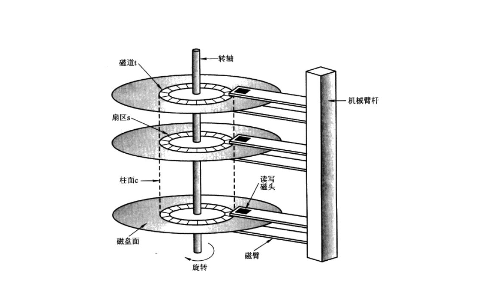
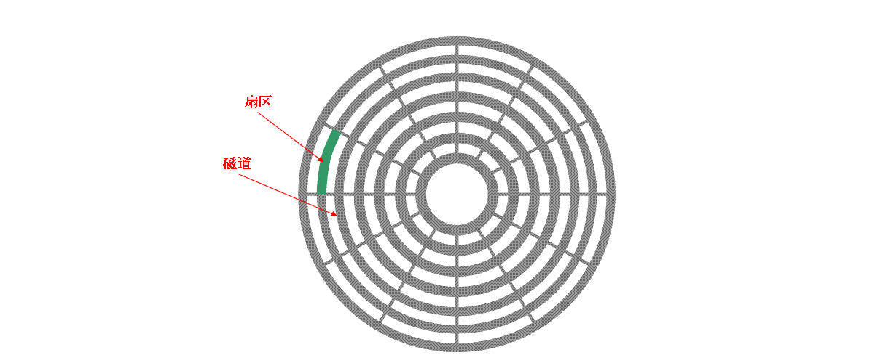
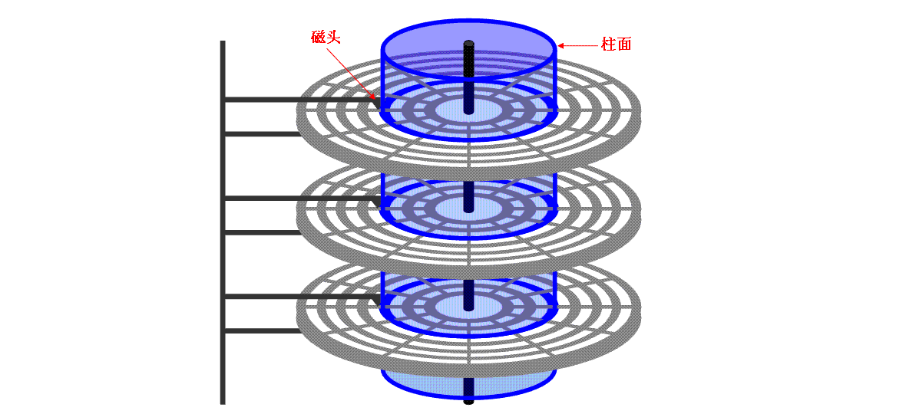
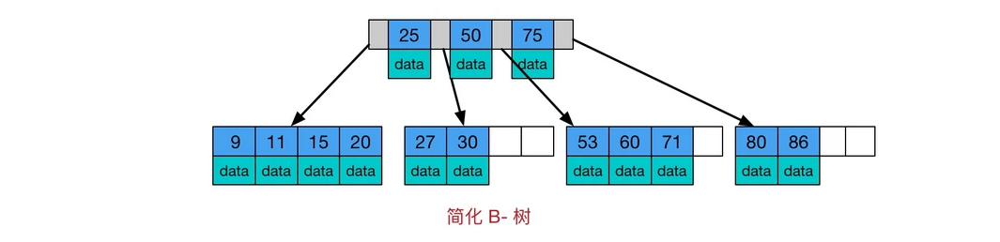
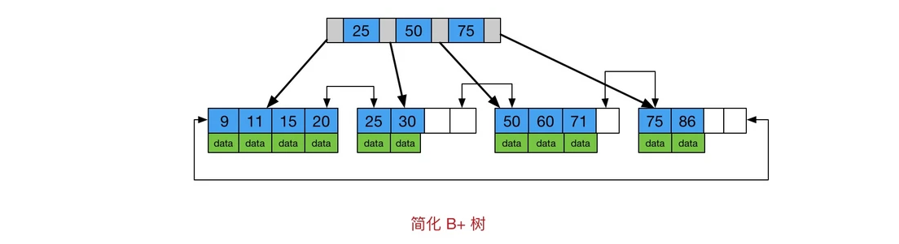
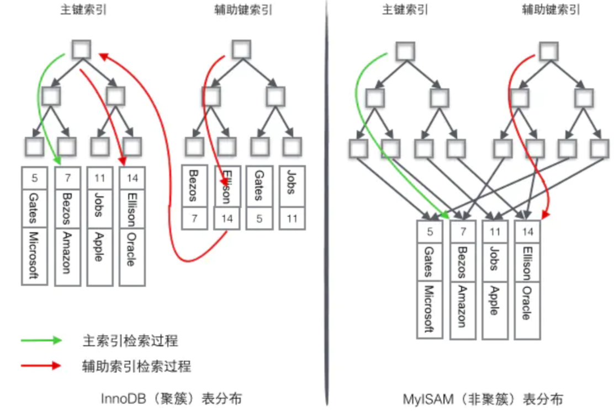
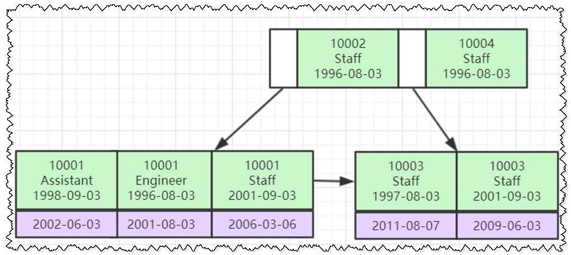
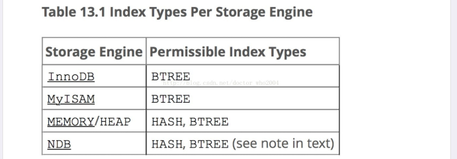
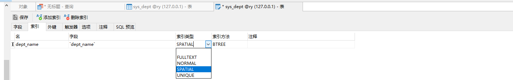

# mysql索引

## [#](https://ydlclass.com/doc21xnv/database/index/#一、计算机硬盘原理)一、计算机硬盘原理

### [#](https://ydlclass.com/doc21xnv/database/index/#_1、磁盘io的问题)1、磁盘IO的问题

mysql的数据一般以文件形式存储在磁盘上，检索需要磁盘I/O操作。与主存不同，磁盘I/O存在机械运动耗费，因此磁盘I/O的时间消耗是巨大的。


### [#](https://ydlclass.com/doc21xnv/database/index/#_2、磁盘的一些概念)2、磁盘的一些概念

#### [#](https://ydlclass.com/doc21xnv/database/index/#_1-盘片、片面-和-磁头)（1）盘片、片面 和 磁头

硬盘中一般会有多个盘片组成，每个盘片包含两个面，每个盘面都对应地有一个读/写磁头。受到硬盘整体体积和生产成本的限制，盘片数量都受到限制，一般都在5片以内。盘片的编号自下向上从0开始，如最下边的盘片有0面和1面，再上一个盘片就编号为2面和3面。 如下图：



#### [#](https://ydlclass.com/doc21xnv/database/index/#_2-扇区-和-磁道)（2）扇区 和 磁道

下图显示的是一个盘面，盘面中一圈圈灰色同心圆为一条条磁道，从圆心向外画直线，可以将磁道划分为若干个弧段，每个磁道上一个弧段被称之为一个扇区（图践绿色部分）。扇区是磁盘的最小组成单元，通常是512字节。（由于不断提高磁盘的大小，部分厂商设定每个扇区的大小是4096字节）



#### [#](https://ydlclass.com/doc21xnv/database/index/#_3-磁头-和-柱面)（3）磁头 和 柱面

硬盘通常由重叠的一组盘片构成，每个盘面都被划分为数目相等的磁道，并从外缘的“0”开始编号，具有相同编号的磁道形成一个圆柱，称之为磁盘的柱面。磁盘的柱面数与一个盘面上的磁道数是相等的。由于每个盘面都有自己的磁头，因此，盘面数等于总的磁头数。 如下图



图3

### [#](https://ydlclass.com/doc21xnv/database/index/#_3、磁盘容量计算)3、磁盘容量计算

存储容量 ＝ 磁头数 × 磁道(柱面)数 × 每道扇区数 × 每扇区字节数

图3中磁盘是一个 3个圆盘6个磁头，7个柱面（每个盘片7个磁道） 的磁盘，图3中每条磁道有12个扇区，所以此磁盘的容量为：

存储容量 6 * 7 * 12 * 512 = 258048

> 每个磁道的扇区数一样是说的老的硬盘，外圈的密度小，内圈的密度大，每圈可存储的数据量是一样的。新的硬盘数据的密度都一致，这样磁道的周长越长，扇区就越多，存储的数据量就越大。

### [#](https://ydlclass.com/doc21xnv/database/index/#_4、磁盘读取响应时间)4、磁盘读取响应时间

1. 寻道时间：磁头从开始移动到数据所在磁道所需要的时间，寻道时间越短，I/O操作越快，目前磁盘的平均寻道时间一般在3－15ms，一般都在10ms左右。
2. 旋转延迟：盘片旋转将请求数据所在扇区移至读写磁头下方所需要的时间，旋转延迟取决于磁盘转速。普通硬盘一般都是7200rpm，慢的5400rpm。
3. 数据传输时间：完成传输所请求的数据所需要的时间。 小结一下：从上面的指标来看、其实最重要的、或者说、我们最关心的应该只有两个：寻道时间；旋转延迟。

> 读写一次磁盘信息所需的时间可分解为：寻道时间、延迟时间、传输时间。为提高磁盘传输效率，软件应着重考虑减少寻道时间和延迟时间。

### 5、块/簇

磁盘块/簇（虚拟出来的）。 块是操作系统中最小的逻辑存储单位。操作系统与磁盘打交道的最小单位是磁盘块。每个块可以包括2、4、8、16、32、64…2的n次方个扇区。

> 为什么存在磁盘块？

读取方便：由于扇区的数量比较小，数目众多在寻址时比较困难，所以操作系统就将相邻的扇区组合在一起，形成一个块，再对块进行整体的操作。

分离对底层的依赖：操作系统忽略对底层物理存储结构的设计。通过虚拟出来磁盘块的概念，在系统中认为块是最小的单位。

### [#](https://ydlclass.com/doc21xnv/database/index/#_6、page)6、page

操作系统经常与内存和硬盘这两种存储设备进行通信，类似于“块”的概念，都需要一种虚拟的基本单位。所以，与内存操作，是虚拟一个页的概念来作为最小单位。与硬盘打交道，就是以块为最小单位。

### 7、扇区、块/簇、page的关系

1. 扇区： 硬盘的最小读写单元
2. 块/簇： 是操作系统针对硬盘读写的最小单元
3. page： 是内存与操作系统之间操作的最小单元。

扇区 <= 块/簇 <= page

### 8、计算机读取数据流程

 当需要从磁盘读取数据时，系统会将数据地址传给磁盘，即确定要读的数据在哪个磁道，哪个扇区。为了读取这个扇区的数据，需要将磁头放到这个扇区上方，为了实现这一点，磁头需要移动对准相应磁道，这个过程叫做`寻道`，所耗费时间叫做`寻道时间`，然后磁盘旋转将目标扇区旋转到磁头下，这个过程耗费的时间叫做**旋转时间**。

### 9、局部性原理与磁盘预读

 由于存储介质的特性，磁盘本身存取就比主存慢很多，再加上机械运动耗费，磁盘的存取速度往往是主存的十万分之一，因此为了提高效率，要**尽量减少磁盘I/O**。为了达到这个目的，磁盘往往不是严格按需读取，而是每次都会预读，即使只需要一个字节，磁盘也会从这个位置开始，顺序向后读取一定长度的数据放入内存。这样做的理论依据是计算机科学中著名的**局部性原理**：

 当一个数据被用到时，其附近的数据也通常会马上被使用。

 程序运行期间所需要的数据通常比较集中。

 由于磁盘顺序读取的效率很高（不需要寻道时间，只需很少的旋转时间），因此对于具有局部性的程序来说，预读可以提高I/O效率。

 预读的长度一般为**页（page）**的整倍数。页是计算机管理存储器的逻辑块，硬件及操作系统往往将主存和磁盘存储区分割为连续的大小相等的块，每个存储块称为一页（在许多操作系统中，页得大小通常为4k），主存和磁盘以页为单位交换数据。当程序要读取的数据不在主存中时，会触发一个缺页异常，此时系统会向磁盘发出读盘信号，磁盘会找到数据的起始位置并向后连续读取一页或几页载入内存中，然后异常返回，程序继续运行。

下图是计算机硬件延迟的对比图，供大家参考：


## 二、mysql数据结构的选型

从第一块内容中我们明白了磁盘是怎么存储文件的，而我们的mysql的数据文件又是存储在磁盘上的，所以我们有必要去研究一下，mysql是怎么保障数据在磁盘上存储，效率还能比较高的原因。

首先，在数据库文件存储在磁盘时，为了提升查询效率，一定会选用合适的数据结构进行文件的存储。接下来咱们探讨一下：

### 1、数组和链表

肯定不能选，这种最基本的数据结构，各自的劣势太明显。

数据库对查询要求是最很高的所以链表这种查询必须全表遍历的基本数据结构是不能用的。

数组这种结构在添加数据时成本太大，插入数据时太过于频繁。

### 2、hash

类似与咱们的hashmap，这样行吗？ 速度快，但是只要是hash就会产生无序的问题，所以不常用但也有。

### 3、树

看来看去也就是树这种结构比较合理了。

二叉查找树可以吗？

在查找一个数据时，二叉树是读取根节点，小则从左找，大则从右找，每次读取一个数据。没有办法合理的利用局部性原理与磁盘预读，IO次数太多太多，其次就是树的层次还是偏高，所以不适合。

那每次读多个数据，每一个节点存多个数据的结构就只有B-树和B+树了；

接下来就讨论这两种数据结构的选型。

### 4、B-树

B-树,这里的 B 表示 balance( 平衡的意思),B-树是一种多路自平衡的搜索树 它类似普通的平衡二叉树，不同的一点是B-树允许每个节点有更多的子节点。下图是 B-树的简化图.



B-树有如下特点:

1. 所有键值分布在整颗树中；
2. 任何一个关键字出现且只出现在一个结点中；
3. 搜索有可能在非叶子结点结束；
4. 在关键字全集内做一次查找,性能逼近二分查找；

### 5、B+ 树

默认是主键，如果没有主键则使用唯一索引，唯一索引也没有则使用rowid，行号。

所以一定要建立主键。

B+树是B-树的变体，也是一种多路搜索树, 它与 B- 树的不同之处在于:

1. 所有关键字存储在叶子节点出现,内部节点(非叶子节点并不存储真正的 data)
2. 为所有叶子结点增加了一个链指针

简化 B+树 如下图



### 6、为什么使用 B+树

1.  相对于 B 树 非叶子节点 没有数据， 一个页就能存更多的id， 可以大大减小层级。   每个节点能节点的范围更大更精确,I/O效率更高。
2. Mysql是一种关系型数据库，区间访问是常见的一种情况，B+树叶节点增加的链指针,加强了区间访问性，可使用在范围区间查询等。

  参考网上的回答：[数据库索引——B+树索引（为什么使用B+树作为MySql的索引结构，用什么好处？） - your_棒棒糖 - 博客园 (cnblogs.com)](https://www.cnblogs.com/Candycan/p/14810842.html)

## 三、为什么要使用索引

1、mysql的数据是存在磁盘上的，磁盘的读取速度是比较慢的使用主键的读取方式会很快，当数据来那个太大非主键的字段查询是会特别耗时。一条语句可能查询10秒以上。

2、建立在主键上的B+树结构可以快速查询出咱们的数据，那使用其他字段就一定要这么慢吗？


## 四、索引的数据结构

### 1、索引的数据结构


最顶层的叶子节点为常驻内存，这样旧可以减少一次io

在数据库中，B+Tree的高度一般都在2~4层。mysql的innoDB存储引擎在设计时是将根节点常驻内存的，也就是说查找某一键值的行记录时最多只需要1~3次磁盘I/O操作。

### 2、有了索引怎么查询

- 从索引里自上而下查询
- 走到叶子节点查询到id
- 根据id去聚簇索引中查找真正的数据，这个过程叫做`回表`
- 如果你要的数据索引都有了不需要回表，就叫`索引覆盖`。

## 五、索引的分类和创建

> 索引的命名

普通索引：idx_字段名

唯一索引：ux_字段名

> 使用的数据

### [#](https://ydlclass.com/doc21xnv/database/index/#使用的数据表)使用的数据表

```sql
-- 学科表
create table subject(
 id int(10) auto_increment,
 name varchar(20),
 teacher_id int(10),
 primary key (id),
 index idx_teacher_id (teacher_id));

-- 教师表
create table teacher(
 id int(10) auto_increment,
 name varchar(20),
 teacher_no varchar(20),
 primary key (id),
 unique index unx_teacher_no (teacher_no(20)));

-- 学生表
create table student(
 id int(10) auto_increment,
 name varchar(20),
 student_no varchar(20),
 primary key (id),
 unique index unx_student_no (student_no(20)));
 
-- 学生成绩表
create table student_score(
 id int(10) auto_increment,
 student_id int(10),
 subject_id int(10),
 score int(10),
 primary key (id),
 index idx_student_id (student_id),
 index idx_subject_id (subject_id));
 
-- 教师表增加名字普通索引 
alter table teacher add index idx_name(name(20));
 
insert into student(name,student_no) values ('zhangsan','20200001'),('lisi','20200002'),('yan','20200003'),('dede','20200004');
 
insert into teacher(name,teacher_no) values('wangsi','T2010001'),('sunsi','T2010002'),('jiangsi','T2010003'),('zhousi','T2010004');
 
insert into subject(name,teacher_id) values('math',1),('Chinese',2),('English',3),('history',4);
 
insert into student_score(student_id,subject_id,score) values(1,1,90),(1,2,60),(1,3,80),(1,4,100),(2,4,60),(2,3,50),(2,2,80),(2,1,90),(3,1,90),(3,4,100),(4,1,40),(4,2,80),(4,3,80),(4,5,100);
```


### 1、聚簇索引和非聚簇索引



1. InnoDB使用的是聚簇索引，将主键组织到一棵B+树中，而行数据就储存在叶子节点上，若使用"where id = 14"这样的条件查找主键，则按照B+树的检索算法即可查找到对应的叶节点，之后获得行数据。
2. 若对Name列进行条件搜索，则需要两个步骤：第一步在辅助索引B+树中检索Name，到达其叶子节点获取对应的主键。第二步使用主键在主索引B+树种再执行一次B+树检索操作，最终到达叶子节点即可获取整行数据。（重点在于通过其他键需要建立辅助索引）

**聚簇索引具有唯一性**，由于聚簇索引是将数据跟索引结构放到一块，因此一个表仅有一个聚簇索引。

**表中行的物理顺序和索引中行的物理顺序是相同的**，在创建任何非聚簇索引之前创建聚簇索引，这是因为聚簇索引改变了表中行的物理顺序，数据行 按照一定的顺序排列，并且自动维护这个顺序；

**聚簇索引默认是主键**，如果表中没有定义主键，InnoDB 会选择一个唯一且非空的索引代替。如果没有这样的索引，InnoDB 会隐式定义一个主键（类似oracle中的RowId）来作为聚簇索引。如果已经设置了主键为聚簇索引又希望再单独设置聚簇索引，必须先删除主键，然后添加我们想要的聚簇索引，最后恢复设置主键即可。

**MyISAM使用的是非聚簇索引，**非聚簇索引的两棵B+树看上去没什么不同，节点的结构完全一致只是存储的内容不同而已，主键索引B+树的节点存储了主键，辅助键索引B+树存储了辅助键。表数据存储在独立的地方，这两颗B+树的叶子节点都使用一个地址指向真正的表数据，对于表数据来说，这两个键没有任何差别。由于索引树是独立的，通过辅助键检索无需访问主键的索引树。

#### （1）使用聚簇索引的优势：

1.由于行数据和聚簇索引的叶子节点存储在一起，同一页中会有多条行数据，访问同一数据页不同行记录时，已经把页加载到了Buffer中（缓存器），再次访问时，会在内存中完成访问，不必访问磁盘。这样主键和行数据是一起被载入内存的，找到叶子节点就可以立刻将行数据返回了，如果按照主键Id来组织数据，获得数据更快。

**自己的理解**： 访问一页时，加载了行数据。。。例如查询2.。。。返回了1,2,3,4行数据。。后面再查3，就可以立马在缓存区拿到，而不用进入磁盘。。。但是 非聚集索引，只是记录了地址信息，没有排序，无法拿到附近的数据。

2.辅助索引的叶子节点，存储主键值，而不是数据的存放地址。好处是当行数据放生变化时，索引树的节点也需要分裂变化；或者是我们需要查找的数据，在上一次IO读写的缓存中没有，需要发生一次新的IO操作时，可以避免对辅助索引的维护工作，只需要维护聚簇索引树就好了。另一个好处是，因为辅助索引存放的是主键值，减少了辅助索引占用的存储空间大小。

**自己的理解**，比如增删改，为了维护节点会造成地址变化。

注：我们知道一次io读写，可以获取到16K大小的资源，我们称之为读取到的数据区域为Page。而我们的B树，B+树的索引结构，叶子节点上存放好多个关键字（索引值）和对应的数据，都会在一次IO操作中被读取到缓存中，所以在访问同一个页中的不同记录时，会在内存里操作，而不用再次进行IO操作了。除非发生了页的分裂，即要查询的行数据不在上次IO操作的换村里，才会触发新的IO操作。

3.因为MyISAM的主索引并非聚簇索引，那么他的数据的物理地址必然是凌乱的，拿到这些物理地址，按照合适的算法进行I/O读取，于是开始不停的寻道不停的旋转。聚簇索引则只需一次I/O。（强烈的对比）

4.不过，如果涉及到大数据量的排序、全表扫描、count之类的操作的话，还是MyISAM占优势些，因为索引所占空间小，这些操作是需要在内存中完成的。

#### （2）主键建议使用自增id

 当使用主键为聚簇索引时，主键最好不要使用uuid，因为uuid的值太过离散，不适合排序且可能出线新增加记录的uuid，会插入在索引树中间的位置，导致索引树调整复杂度变大，消耗更多的时间和资源。

聚簇索引的数据的物理存放顺序与索引顺序是一致的，即：只要索引是相邻的，那么对应的数据一定也是相邻地存放在磁盘上的。如果主键不是自增id，那么可以想 象，它会干些什么，不断地调整数据的物理地址、分页，当然也有其他一些措施来减少这些操作，但却无法彻底避免。但，如果是自增的，那就简单了，它只需要一 页一页地写，索引结构相对紧凑，磁盘碎片少，效率也高。

### 2、主键索引 （primary key）

也简称主键。它可以提高查询效率，并提供唯一性约束。一张表中只能有一个主键。被标志为自动增长的字段一定是主键，但主键不一定是自动增长。一般把主键定义在无意义的字段上（如：编号），主键的数据类型最好是数值。

一种方法在创建表的时候创建，再次是修改表

```sql
ALTER TABLE tbl_name ADD PRIMARY KEY (column_list)
```

1

索引都能在创建表是指定

```sql
create table student_score(
 id int(10) auto_increment,
 student_id int(10),
 subject_id int(10),
 score int(10),
 primary key (id),
 index idx_student_id (student_id),
 index idx_subject_id (subject_id)
); 
```


> 小tips：

int(n)括号里面的数字表示显示宽度，不是代表能存放多少位数，始终占用4个字节的空间int(M) 跟 int 数据类型是相同的。int(M) 只有跟 zerofill 结合起来，才能使我们清楚的看到不同之处 1.创建表t

```sql
mysql> create table t(id int(5) zerofill);
```

1

2.插入数据

```sql
mysql> insert into t(id) values(10);
```

1

3.显示select * from t

```text
00010
```

1

### [#](https://ydlclass.com/doc21xnv/database/index/#_3、普通索引-常规索引-normal)3、普通索引 （常规索引）(normal)

就是普普通通的索引，没有什么特殊要求，创建方式如下

```sql
CREATE INDEX idx_indexName ON mytable(username(length)); 
```

1

```sql
create index idx_myDeptIndex on detail(dept_id);
```

1

```sql
DROP INDEX [idx_indexName] ON mytable; 
```

1

```sql
ALTER TABLE tbl_name ADD INDEX idx_index_name (column_list);
```

1

### [#](https://ydlclass.com/doc21xnv/database/index/#_4、唯一索引-unique)4、唯一索引（UNIQUE ）

索引的值不能重复

**唯一索引（UNIQUE KEY）**

```sql
CREATE UNIQUE INDEX ux_indexName ON mytable(username(length)) 
```

1

修改表结构

```sql
ALTER table mytable ADD UNIQUE [ux_indexName] (username(length))
```

1

- 主键是一种约束，唯一索引是一种索引，两者在本质上是不同的。
- 主键创建后一定包含一个唯一性索引，唯一性索引并不一定就是主键。
- 唯一性索引列允许空值，而主键列不允许为空值。
- 主键列在创建时，已经默认为非空值 + 唯一索引了。
- 主键可以被其他表引用为外键，而唯一索引不能。
- 一个表最多只能创建一个主键，但可以创建多个唯一索引。
- 主键更适合那些不容易更改的唯一标识，如自动递增列、身份证号等。

### [#](https://ydlclass.com/doc21xnv/database/index/#_5、全文索引-fulltext)5、全文索引（FULLTEXT）

做全文检索使用的索引，我们有更好的替代品 ElacticSearch，所以实际使用不多，只当了解。

通过数值比较、范围过滤等就可以完成绝大多数我们需要的查询，但是，如果希望通过关键字的匹配来进行查询过滤，那么就需要基于相似度的查询，而不是原来的精确数值比较。全文索引就是为这种场景设计的。

你可能会说，用 like + % 就可以实现模糊匹配了，为什么还要全文索引？like + % 在文本比较少时是合适的，但是对于大量的文本数据检索，是不可想象的。全文索引在大量的数据面前，能比 like + % 快 N 倍，速度不是一个数量级，但是全文索引可能存在精度问题。

你可能没有注意过全文索引，不过至少应该对一种全文索引技术比较熟悉：各种的搜索引擎。虽然搜索引擎的索引对象是超大量的数据，并且通常其背后都不是关系型数据库，不过全文索引的基本原理是一样的。

> 全文索引的版本支持

1. MySQL 5.6 以前的版本，只有 MyISAM 存储引擎支持全文索引；
2. MySQL 5.6 及以后的版本，MyISAM 和 InnoDB 存储引擎均支持全文索引;
3. 只有字段的数据类型为 char、varchar、text 及其系列才可以建全文索引。

> 使用全文索引的注意

1. 使用全文索引前，搞清楚版本支持情况；
2. 全文索引比 like + % 快 N 倍，但是可能存在精度问题；
3. 如果需要全文索引的是大量数据，建议先添加数据，再创建索引；
4. 对于中文，可以使用 MySQL 5.7.6 之后的版本，或者第三方插件。

1、创建表时创建全文索引

```sql
create table fulltext_test (
    id int(11) NOT NULL AUTO_INCREMENT,
    content text NOT NULL,
    tag varchar(255),
    PRIMARY KEY (id),
    FULLTEXT KEY content_tag_fulltext(content,tag)  // 创建联合全文索引列
) ENGINE=MyISAM DEFAULT CHARSET=utf8;1234567
```

1
2
3
4
5
6
7

2、在已存在的表上创建全文索引

```sql
create fulltext index content_tag_fulltext
    on fulltext_test(content,tag);
```

1
2

3、通过 SQL 语句 ALTER TABLE 创建全文索引

```sql
alter table fulltext_test
    add fulltext index content_tag_fulltext(content,tag);
```

1
2

4、直接使用 DROP INDEX 删除全文索引

```sql
drop index content_tag_fulltext
    on fulltext_test;12
```

1
2

5、通过 SQL 语句 ALTER TABLE 删除全文索引

```sql
alter table fulltext_test
    drop index content_tag_fulltext;
```

1
2

6、全文检索的语法

```sql
select * from test where match(content) against('aaa');
```

1

### [#](https://ydlclass.com/doc21xnv/database/index/#_6、空间索引-spatial)6、空间索引（SPATIAL）

MySQL在5.7之后的版本支持了空间索引，而且支持OpenGIS几何数据模型。这是在地理位置领域使用的一种索引，其他场景用的很少，所以不需要深入学习。

### 7、复合索引（联合索引）重要

当有多个查询条件时，我们推荐使用复合索引。索引的`组合使用`（索引合并）效率是低于`复合索引`的。

比如：我们经常按照 A列 B列 C列进行查询时，通常的做法是建立一个由三个列共同组成的复合索引而不是对每一个列建立普通索引。



关于复合索引的一些知识：

> 为什么要使用联合索引

**减少开销。**建一个联合索引`(Gid,Cid,SId)`，实际相当于建了`(Gid)、(Gid,Cid)、(Gid,Cid,SId)`三个索引。每多一个索引，都会增加写操作的开销和磁盘空间的开销。对于大量数据的表，使用联合索引会大大的减少开销！

**覆盖索引。**对联合索引`(Gid,Cid,SId)`，如果有如下的sql: select `Gid,Cid,SId` from student where `Gid`=1 and `Cid`=2。那么MySQL可以直接通过遍历索引取得数据，而无需回表，这减少了很多的随机io操作。减少io操作，特别的随机io其实是dba主要的优化策略。所以，在真正的实际应用中，覆盖索引是主要的提升性能的优化手段之一。

**效率高。**索引列越多，通过索引筛选出的数据越少。有1000W条数据的表，有如下sql:select from table where `Gid`=1 and `Cid`=2 and `SId`=3,假设假设每个条件可以筛选出10%的数据，如果只有单值索引，那么通过该索引能筛选出1000W10%=100w条数据，然后再回表从100w条数据中找到符合`Gid`=2 and `Cid`= 3的数据，然后再排序，再分页；如果是联合索引，通过索引筛选出1000w10% 10% *10%=1w，效率提升可想而知！

**缺点。**联合索引越多，索引列越多，则创建的索引越多，索引都是存储在磁盘里的，通过索引算法(Btree代表索引算法使用二叉树的形式来做索引的)来查找数据，的确可以极大的提高查询效率，但是与此同时增删改的同时，需要更新索引，同样是需要花时间的，并且索引所占的磁盘空间也不小。

**建议。**单表尽可能不要超过一个联合索引，单个联合索引不超过3个

> 联合索引的创建注意事项

1.`最左前缀匹配原则`，非常重要的原则，mysql会一直向右匹配直到遇到范围查询(>、<、between、like)就停止匹配，比如a = 1 and b = 2 and c > 3 and d = 4 如果建立(a,b,c,d)顺序的索引，d是用不到索引的，如果建立(a,b,d,c)的索引则都可以用到，a,b,d的顺序可以任意调整。

2.=和in可以乱序，比如a = 1 and b = 2 and c = 3 建立(a,b,c)索引可以任意顺序，mysql的查询优化器会帮你优化成索引可以识别的形式。

把范围查询的字段放在后边

> 创建联合索引，就是括号里多了几个列

```sql
alert table test add idx_clo1_col2 table (a1,a2,a3) 
```


```sql
create index idx_clo1_col2 on table(a1,a2,a3);
```


### 8、hash索引

- hash相信大家应该都很熟悉，hash是一种key-value形式的数据结构。实现一般是数组+链表的结构，通过hash函数计算出key在数组中的位置，然后如果出现hash冲突就通过链表来解决。当然还有其他的解决hash冲突的方法。hash这种数据结构是很常用的，比如我们系统使用HashMap来构建热点数据缓存，存取效率很好。
- hash结构存数据首先通过计算key的hash值来确定其在数组中的位置，如果有冲突就在该数组位置建一个链表。这样很明显有几个问题：
- 即使是具有相同特征的key计算出来的位置可能相隔很远，连续查询效率低下。即`不支持范围查询`。
- hash索引存储的是计算得到的hash值和行指针，而不存储具体的行值，所以通过hash索引查询数据需要进行两次查询(首先查询行的位置，然后找到具体的数据)
- hash索引查询数据的前提就是计算hash值，也就是要求key为一个能准确指向一条数据的key，所以对于like等一类的匹配查询是不支持的。
- **所以我们可以知道的是hash索引适用于快速选取某一行的数据，超级大表中定位某一行特别快。**
- **只要是只需要做等值比较查询，而不包含排序或范围查询的需求，都适合使用哈希索引。**

创建的语法

```sql
create index index_test using hash on test1(id);
```


你会发现创建了也没有用，因为InnoDB和myIsam都不支持hash索引。



> 创建自定义hash索引

若存储引擎不支持hash索引，又想拥有hash索引所带来的性能提升，则可以模拟InnoDB一样创建哈希索引。 　　思路也比较简单，就是在B+tree基础上创建一个伪哈希索引。这和真正的hash索引不是一回事，因为还是采用B-Tree进行查找，但是它使用的是hash值而不是键本身进行查找。只需要在查询的where子句中手动指定使用hash函数即可。下面举个简单的例子：

比如：当我们需要存储大量的URL，并需要根据URL进行搜索查找。若用B-Tree来存储URL，存储的内容就会很大。此时的查询语句就是：

```sql
select id from url where url = "www.baidu.com";
```


若删除原来的url列上的索引，而新增一个被索引的url_crc列，使用crc32做hash函数，则可以使用如下方式查询：

```sql
select id from url where url = "www.baidu.com" and url_crc=CRC32("www.baidu.com");
```


这样做的话，性能就会有很大提升，因为mysql优化器会使用这个选择性高而体积很小的基于url_crc列的索引来完成查找。即使有多个记录相同的索引值，查找仍然很快，只需要根据hash值做快速的整数比较就能找到索引条目，然后一一返回对应的行。

**缺点** 1、需要维护hash值，可以手动维护，也可以使用触发器实现。 2、若数据表非常大的话，CRC32（）会出现大量hash冲突，则可以自己实现一个64位的hash函数，这个自定义的hash函数要返回整数而不是字符串，因为范围整数，对此效率更高。一个简单的办法就是使用MD5（）函数返回值的一部分来作为自定义的hash函数。但是这可能比自己写一个hash算法性能要差一些。

案例博客：https://segmentfault.com/a/1190000003741888

## 四、navicat中创建索引

设计表中的索引模块



## 五、使用索引的问题

设计好MySql的索引可以让你的数据库飞起来，大大的提高数据库效率。

但是你设计了索引就一定会用到码？索引就不会给你带来一些问题吗？

设计MySql索引的时候有一下几点注意：

### 1、创建索引

对于`查询占主要`的应用来说，索引显得尤为重要。很多时候性能问题很简单的就是因为我们忘了添加索引而造成的，或者说没有添加更为有效的索引导致。如果不加索引的话，那么查找任何哪怕只是一条特定的数据都会进行一次全表扫描，如果一张表的数据量很大而符合条件的结果又很少，那么不加索引会引起致命的性能下降。但是也不是什么情况都非得建索引不可，比如性别可能就只有两个值，建索引不仅没什么优势，还会影响到更新速度，这被称为过度索引。

#### （1）哪些情况下适合建索引

\1. 频繁作为where条件语句查询的字段

\2. 关联字段需要建立索引，例如外键字段，student表中的classid, classes表中的schoolid 等

\3. 排序字段可以建立索引

\4. 分组字段可以建立索引，因为分组的前提是排序

\5. 统计字段可以建立索引，例如count(),max()

#### [#](https://ydlclass.com/doc21xnv/database/index/#_2-哪些情况下不适合建索引)（2）哪些情况下不适合建索引

1.频繁更新的字段不适合建立索引

2.where条件中用不到的字段不适合建立索引

3.表数据可以确定比较少的不需要建索引

4.数据重复且发布比较均匀的的字段不适合建索引（唯一性太差的字段不适合建立索引），例如性别，真假值

假如索引列TYPE有5个键值，如果有1万条数据，那么 WHERE TYPE = 1将访问表中的2000个数据块。再加上访问索引块，一共要访问大于200个的数据块。如果全表扫描，假设10条数据一个数据块，那么只需访问1000个数据块，既然全表扫描访问的数据块少一些，肯定就不会利用索引了。

\5. 参与列计算的列不适合建索引，索引会失效

### 2、习惯使用复合索引

比如有一条语句是这样的：select * from users where area=’beijing’ and age=22;

如果我们是在area和age上分别创建单个索引的话，由于mysql查询每次只能使用一个索引，所以虽然这样已经相对不做索引时全表扫描提高了很多效

率，但是如果在area、age两列上创建复合索引的话将带来更高的效率。如果我们创建了(area, age,

salary)的复合索引，那么其实相当于创建了(area,age,salary)、(area,age)、(area)三个索引，这被称为最佳左前缀

特性。因此我们在创建复合索引时应该将最常用作限制条件的列放在最左边，依次递减。

### [#](https://ydlclass.com/doc21xnv/database/index/#_3、索引不会包含有null值的列)3、索引不会包含有NULL值的列

a.单列索引无法储null值，复合索引无法储全为null的值。

b.查询时，采用is null条件时，不能利用到索引，只能全表扫描。

为什么索引列无法存储Null值？

a.索引是有序的。NULL值进入索引时，无法确定其应该放在哪里。（将索引列值进行建树，其中必然涉及到诸多的比较操作，null 值是不确定值无法

比较，无法确定null出现在索引树的叶子节点位置。）

b.如果需要把空值存入索引，方法有二：其一，把NULL值转为一个特定的值，在WHERE中检索时，用该特定值查找。其二，建立一个复合索引。例如

create index ind_a on table(col1,1); 通过在复合索引中指定一个非空常量值，而使构成索引的列的组合中，不可能出现全空值。

### [#](https://ydlclass.com/doc21xnv/database/index/#_4-使用短索引)4，使用短索引

对串列进行索引，如果可能应该指定一个前缀长度。例如，如果有一个CHAR(255)的 列，如果在前10 个或20 个字符内，多数值是惟一的，那么就不要对整个列进行索引。短索引不仅可以提高查询速度而且可以节省磁盘空间和I/O操作。

### [#](https://ydlclass.com/doc21xnv/database/index/#_5-排序的索引问题)5，排序的索引问题

mysql查询只使用一个索引，因此如果where子句中已经使用了索引的话，那么order by中的列是不会使用索引的。因此数据库默认排序可以符合要求的情况下不要使用排序操作；尽量不要包含多个列的排序，如果需要最好给这些列创建`复合索引`。

### [#](https://ydlclass.com/doc21xnv/database/index/#_6、mysql索引失效的几种情况)6、MySQL索引失效的几种情况

- 如果条件中有or，即使其中有条件带索引也不会使用(这也是为什么尽量少用or的原因)要想使用or，又想让索引生效，只能将or条件中的每个列都加上索引
- 复合索引不满足最左原则就不能使用索引
- like查询以%开头
- 如果mysql估计使用全表扫描要比使用索引快,则不使用索引

#### 5.MySQL主要提供2种方式的索引：B-Tree索引，Hash索引

- B树索引具有**范围查找和前缀查找的能力**，对于有N节点的B树，检索一条记录的复杂度为O(LogN)。相当于二分查找。
- 哈希索引只能做等于查找，但是无论多大的Hash表，查找复杂度都是O(1)。
- 显然，如果值的差异性大，并且以等值查找（=、 <、>、in）为主，Hash索引是更高效的选择，它有O(1)的查找复杂度。
- 如果值的差异性相对较差，并且以范围查找为主，B树是更好的选择，它支持范围查找。


#### 6.面试回答问题

为什么要建立索引？

因为如果数据比较多的话， 一个个去遍历比较会比较慢。如果使用索引的话，索引是有组织过的数据。是有序的，可以更快的查到数据。有序的结构可以更快查到数据，例如，一个无需的数组，咱们需要遍历全部元素才可以查询到数据。但是如果排过数据，就可以二分查询。

innoDB 当然不是使用数组的形式来构建数据，innoDB采用了 B + 树来进行构建数据，该数据结构，在每个节点上可以保存更多的关键字，来减少层级。这样可以减少IO次数。在叶子节点通过指针链接在一起。可以用来做范围查询。 同时，内存页加载到相邻数据更多，又进一步减少了访问IO次数。 磁盘IO是关系型数据库主要要解决的问题，解决了磁盘IO问题才可以更快响应应用程序。Mysql的索引很大一部分都是围绕这个点进行的。 

[(37条消息) 为什么MySQL使用B+而不是使用B树、二叉树、AVL树呢？（来龙去脉的去理解）_王伟的博客-CSDN博客_mysql为什么用b+,不用b](https://blog.csdn.net/qq_36520235/article/details/94317993)

为什么使用B+ 树而不使用B树？

 原因是，B+ 树的数据都是存在

## 六、explain关键字

> explain关键字可以模拟MySQL优化器执行SQL语句，可以很好的分析SQL语句或表结构的性能瓶颈。

### 1、explain的用途

```text
1. 表的读取顺序如何
2. 数据读取操作有哪些操作类型
3. 哪些索引可以使用
4. 哪些索引被实际使用
5. 表之间是如何引用
6. 每张表有多少行被优化器查询
......
```


### 2、explain的执行效果

```sql
mysql> explain select * from subject where id = 1 
******************************************************
           id: 1
  select_type: SIMPLE
        table: subject
   partitions: NULL
         type: const
possible_keys: PRIMARY
          key: PRIMARY
      key_len: 4
          ref: const
         rows: 1
     filtered: 100.00
        Extra: NULL
******************************************************
```


### 3、explain包含的字段

```text
1. id //select查询的序列号，包含一组数字，表示查询中执行select子句或操作表的顺序
2. select_type //查询类型
3. table //正在访问哪个表
4. partitions //匹配的分区
5. type //访问的类型
6. possible_keys //显示可能应用在这张表中的索引，一个或多个，但不一定实际使用到
7. key //实际使用到的索引，如果为NULL，则没有使用索引
8. key_len //表示索引中使用的字节数，可通过该列计算查询中使用的索引的长度
9. ref //显示索引的哪一列被使用了，如果可能的话，是一个常数，哪些列或常量被用于查找索引列上的值
10. rows //根据表统计信息及索引选用情况，大致估算出找到所需的记录所需读取的行数
11. filtered //查询的表行占表的百分比
12. Extra //包含不适合在其它列中显示但十分重要的额外信息
```


#### （1）id字段

**1. id相同**

```text
执行顺序从上至下
例子：
explain select subject.* from subject,student_score,teacher where subject.id = student_id and subject.teacher_id = teacher.id;
读取顺序：subject > teacher > student_score
```


**2. id不同**

```text
如果是子查询，id的序号会递增，id的值越大优先级越高，越先被执行
例子：
explain select score.* from student_score as score where subject_id =  (select id from subject where teacher_id = (select id from teacher where id = 2));
读取顺序：teacher > subject > student_score
```


**3. id相同又不同**

```text
id如果相同，可以认为是一组，从上往下顺序执行
在所有组中，id值越大，优先级越高，越先执行
例子：
explain select subject.* from subject left join teacher on subject.teacher_id = teacher.id
nion 
 -> select subject.* from subject right join teacher on subject.teacher_id = teacher.id;
 读取顺序：2.teacher > 2.subject > 1.subject > 1.teacher
```


#### （2）select_type字段

**1. SIMPLE**

```text
简单查询，不包含子查询或Union查询
例子：
explain select subject.* from subject,student_score,teacher where subject.id = student_id and subject.teacher_id = teacher.id;
```


**2. PRIMARY**

```text
查询中若包含任何复杂的子部分，最外层查询则被标记为主查询
例子：
explain select score.* from student_score as score where subject_id = (select id from subject where teacher_id = (select id from teacher where id = 2));
```


**3. SUBQUERY**

```text
在select或where中包含子查询
例子：
explain select score.* from student_score as score where subject_id = (select id from subject where teacher_id = (select id from teacher where id = 2));
```


**4. DERIVED**

```text
在FROM列表中包含的子查询被标记为DERIVED（衍生），MySQL
会递归执行这些子查询，把结果放在临时表中
备注：
MySQL5.7+ 进行优化了，增加了derived_merge（派生合并），默认开启，可加快查询效率
```


**5. UNION**

```text
若第二个select出现在uion之后，则被标记为UNION
例子：
explain select subject.* from subject left join teacher on subject.teacher_id = teacher.id
 -> union 
 -> select subject.* from subject right join teacher on subject.teacher_id = teacher.id;
```


**6. UNION RESULT**

```text
从UNION表获取结果的select
例子：
explain select subject.* from subject left join teacher on subject.teacher_id = teacher.id
 -> union 
 -> select subject.* from subject right join teacher on subject.teacher_id = teacher.id;
```


#### （3）type字段

```text
NULL>system>const>eq_ref>ref>fulltext>ref_or_null>index_merge>unique_subquery>index_subquery>range>index>ALL //最好到最差
备注：掌握以下10种常见的即可
NULL>system>const>eq_ref>ref>ref_or_null>index_merge>range>index>ALL
```


**1. NULL**

```text
MySQL能够在优化阶段分解查询语句，在执行阶段用不着再访问表或索引，比如通过id没有找到
例子：
explain select min(id) from subject;
```


**2. system**

```text
表只有一行记录（等于系统表），这是const类型的特列，平时不大会出现，可以忽略
```

**3. const**

只有唯一索引和id才能出现

```text
表示通过索引一次就找到了，const用于比较primary key或uique索引，因为只匹配一行数据，所以很快，如主键置于where列表中，MySQL就能将该查询转换为一个常量
例子：
explain select * from teacher where teacher_no = 'T2010001';
```


**4. eq_ref**

```text
唯一性索引扫描，对于每个索引键，表中只有一条记录与之匹配，常见于主键或唯一索引扫描
例子：
explain select subject.* from subject left join teacher on subject.teacher_id = teacher.id;
```


**5. ref**

```text
非唯一性索引扫描，返回匹配某个单独值的所有行
本质上也是一种索引访问，返回所有匹配某个单独值的行
然而可能会找到多个符合条件的行，应该属于查找和扫描的混合体
例子：
explain select subject.* from subject,student_score,teacher where subject.id = student_id and subject.teacher_id = teacher.id;
```


**6. ref_or_null**

```text
类似ref，但是可以搜索值为NULL的行
例子：
explain select * from teacher where name = 'wangsi' or name is null;
```


**7. index_merge**

```text
表示使用了索引合并的优化方法
例子：
explain select * from teacher where id = 1 or teacher_no = 'T2010001' .
```


**8. range**

```text
只检索给定范围的行，使用一个索引来选择行，key列显示使用了哪个索引
一般就是在你的where语句中出现between、<>、in等的查询。
例子：
explain select * from subject where id between 1 and 3;
```


**9. index**（全索引扫描）

```text
Full index Scan，Index与All区别：index只遍历索引树，通常比All快
因为索引文件通常比数据文件小，也就是虽然all和index都是读全表，但index是从索引中读取的，而all是从硬盘读的。
例子：
explain select id from subject;
```


**10. ALL**（全表扫）

```text
Full Table Scan，将遍历全表以找到匹配行
例子：
explain select * from subject;
```


#### （4）table字段

```text
数据来自哪张表
```


#### （5）possible_keys字段

```text
显示可能应用在这张表中的索引，一个或多个
查询涉及到的字段若存在索引，则该索引将被列出，但不一定被实际使用
```


#### （6）key字段

```text
实际使用到的索引，如果为NULL，则没有使用索引
查询中若使用了覆盖索引（查询的列刚好是索引），则该索引仅出现在key列表
```


#### （7）key_len字段

```text
表示索引中使用的字节数，可通过该列计算查询中使用的索引的长度
在不损失精确度的情况下，长度越短越好
key_len显示的值为索引字段最大的可能长度，并非实际使用长度
即key_len是根据定义计算而得，不是通过表内检索出的
```


#### （8）ref字段

```text
显示索引的哪一列被使用了，如果可能的话，是一个常数，哪些列或常量被用于查找索引列上的值
```


#### （9）rows字段

```text
根据表统计信息及索引选用情况，大致估算出找到所需的记录所需读取的行数
```

#### （10）partitions字段

```text
匹配的分区
```

#### （11）filtered字段

```text
查询的表行占表的百分比
```

#### （12）Extra字段

```text
包含不适合在其它列中显示但十分重要的额外信息
```


1. **Using filesort**

```text
说明MySQL会对数据使用一个外部的索引排序，而不是按照表内的索引顺序进行读取
MySQL中无法利用索引完成的排序操作称为“文件排序”
例子：
explain select * from subject order by name;
```


**2. Using temporary**

```text
使用了临时表保存中间结果，MySQL在对结果排序时使用临时表，常见于排序order by 和分组查询group by
例子：
explain select subject.* from subject left join teacher on subject.teacher_id = teacher.id
 -> union 
 -> select subject.* from subject right join teacher on subject.teacher_id = teacher.id;
```


```text
表示相应的select操作中使用了覆盖索引（Covering Index）,避免访问了表的数据行，效率不错！
如果同时出现using where，表明索引被用来执行索引键值的查找
如果没有同时出现using where，表明索引用来读取数据而非执行查找动作
例子：
explain select subject.* from subject,student_score,teacher where subject.id = student_id and subject.teacher_id = teacher.id;
备注：
覆盖索引：select的数据列只用从索引中就能够取得，不必读取数据行，MySQL可以利用索引返回select列表中的字段，而不必根据索引再次读取数据文件，即查询列要被所建的索引覆盖
```


**3. Using where**

```text
使用了where条件
例子：
explain select subject.* from subject,student_score,teacher where subject.id = student_id and subject.teacher_id = teacher.id;
```


**4. Using join buffer**

```text
使用了连接缓存
例子：
explain select student.*,teacher.*,subject.* from student,teacher,subject;
```


**5. impossible where**

```text
where子句的值总是false，不能用来获取任何元组
例子：
explain select * from teacher where name = 'wangsi' and name = 'lisi';
```


**6. distinct**

```text
一旦mysql找到了与行相联合匹配的行，就不再搜索了
例子：
explain select distinct teacher.name from teacher left join subject on teacher.id = subject.teacher_id;
```


**7. Select tables optimized away**

```text
SELECT操作已经优化到不能再优化了（MySQL根本没有遍历表或索引就返回数据了）
例子：
explain select min(id) from subject;
```


