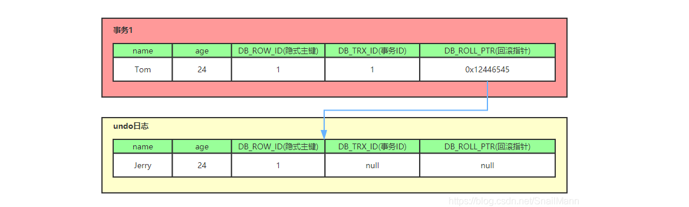
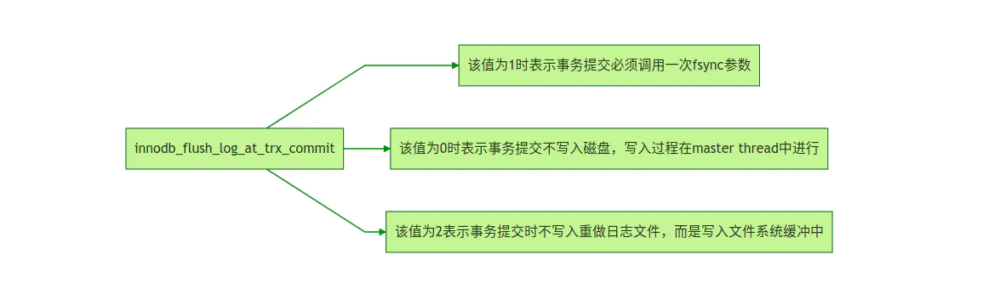

# mysql的锁机制

- 数据库锁机制简单来说，就是数据库为了保证数据的一致性，使各种`共享资源`在被访问时变得`有序而设计`的一种规则。
- MysQL的锁机制比较简单最著的特点是不同的存储引擎支持不同的锁机制。 InoDB支持行锁,(有时也会升级为表锁）MyISAM只支持表锁。
- `表锁`的特点就是开销小、加锁快，不会出现死锁。锁粒度大，发生锁冲突的概率小，并发度相对低。
- `行锁`的特点就是开销大、加锁慢，会出现死锁。锁粒度小，发生锁冲突的概率高，并发度搞。
- 今天我们讲锁主要从InnoDB引擎来讲，因为它既支持行锁、也支持表锁。

## 一、InnoDB行锁的种类

InnoDB默认的事务隔离级别是RR，并且参数innodb_locks_unsafe_for_binling=0的模式下，行锁有三种。

### 1、记录锁（Record Lock）

（1）不加索引，两个事务修改同一行记录

事务一：

```sql
begin;
update teacher set teacher_no = 'T2010005' where name = 'wangsi';
```


事务二：

```sql
begin;
update teacher set teacher_no = 'T2010006' where name = 'wangsi';
```


发现卡住了：

事务一提交了，事务二才获取了。

（2）不加索引，两个事务修改同一表非同行记录

事务一：

```sql
begin;
update teacher set teacher_no = 'T2010005' where name = 'wangsi';
```


事务二：

```sql
begin;
update teacher set teacher_no = 'T2010006' where name = 'wangsi';
```


发现卡住了：

事务一提交了，事务二才获取了。

说明锁的是表！

（3）加索引，修改同一行记录，不行

事务一：

```sql
begin;
update teacher set teacher_no = 'T2010005' where name = 'wangsi';
```


事务二：

```sql
begin;
update teacher set teacher_no = 'T2010006' where name = 'wangsi';
```


发现卡住了：

事务一提交了，事务二才获取了。

（4）加索引，修改同表的不同行，可以修改

事务一：

```sql
begin;
update teacher set teacher_no = 'T2010008' where name = 'wangsi';
```


事务二：

```sql
begin;
update teacher set teacher_no = 'T2010009' where name = 'jiangsi';
```


发现都可一顺利修改，说明锁的的确是行。

证明行行锁是加在索引上的，这是标准的行级锁。

### 2、间隙锁（GAP Lock）

`在RR这个级别下`，为了避免幻读，引入了间隙锁，他锁定的是记录范围，不包含记录本身，也就是不允许在范围内插入数据。

根据检索条件向下寻找最靠近检索条件的记录值A作为左区间，向上寻找最靠近检索条件的记录值B作为右区间，即锁定的间隙为（A，B）。

查看隔离级别：

```sql
show variables like '%iso%';
```


唯一索引 等值判断只会产生记录锁，范围查询会产生间隙锁

普通索引等值判断会产生间隙锁


第一步把teacher表的id的4改成8

事务一：

```sql
begin;
select * from teacher where id < 6 lock in share mode;
```


事务二：

```sql
begin;
insert into teacher values (5,'zhangnan','T888888');
```


发现卡住了，因为他会把小于6的数据锁定，并不允许间隙中间的值插入：

事务三：

```sql
begin;
insert into teacher values (9,'huijun','T66666666');
```

 

发现成功了，因为9不在锁定的范围。

### 3、记录锁和间隙锁的组合（next-key lock）

**临键锁**，是**记录锁与间隙锁的组合**，它的封锁范围，既包含索引记录，又包含索引区间。

**注：\**临键锁的主要目的，也是为了避免\**幻读**(Phantom Read)。如果把事务的隔离级别降级为RC，临键锁则也会失效。

## 二、表锁

1、对于InnoDB表，在绝大部分情况下都应该使用行级锁，因为事务和行锁往往是我们之所以选择InnoDB表的理由。但在个另特殊事务中，也可以考虑使用表级锁。

- 第一种情况是：事务需要更新大部分或全部数据，表又比较大，如果使用默认的行锁，不仅这个事务执行效率低，而且可能造成其他事务长时间锁等待和锁冲突，这种情况下可以考虑使用表锁来提高该事务的执行速度。
- 第二种情况是：事务涉及多个表，比较复杂，很可能引起死锁，造成大量事务回滚。这种情况也可以考虑一次性锁定事务涉及的表，从而避免死锁、减少数据库因事务回滚带来的开销。

2、在InnoDB下 ，使用表锁要注意以下两点。

（１）使用LOCK TALBES虽然可以给InnoDB加表级锁，但必须说明的是，表锁不是由InnoDB存储引擎层管理的，而是由其上一层ＭySQL Server负责的，仅当autocommit=0、innodb_table_lock=1（默认设置）时，InnoDB层才能知道MySQL加的表锁，ＭySQL Server才能感知InnoDB加的行锁，这种情况下，InnoDB才能自动识别涉及表级锁的死锁；否则，InnoDB将无法自动检测并处理这种死锁。

（２）在用LOCAK TABLES对InnoDB锁时要注意，要将AUTOCOMMIT设为0，否则ＭySQL不会给表加锁；事务结束前，不要用UNLOCAK TABLES释放表锁，因为UNLOCK TABLES会隐含地提交事务；COMMIT或ROLLBACK不能释放用LOCAK TABLES加的表级锁，必须用UNLOCK TABLES释放表锁，正确的方式见如下语句。

例如，可以按如下做：

```sql
lock tables teacher write,student read;
select * from teacher;
commit;
unlock tables;
```


表锁的力度很大，慎用。

## 三、InnoDB的锁类型

InnoDB的锁类型主要有读锁(共享锁)、写锁(排他锁)、意向锁和MDL锁。

### 1、读锁

读锁（共享锁，shared lock）简称S锁。一个事务获取了一个数据行的读锁，其他事务能获得该行对应的读锁但不能获得写锁，即一个事务在读取一个数据行时，其他事务也可以读，但不能对该数行增删改的操作。

> 简而言之：就是可以多个事务读，但只能一个事务写。

读锁有两种select方式的应用：

1. 第一种是自动提交模式下的select查询语句，不需加任何锁,直接返回查询结果，这就是一致性非锁定读。
2. 第二种就是通过select.... lock in share mode被读取的行记录或行记录的范围上加一个读锁,让其他事务可以读,但是要想申请加写锁,那就会被阻塞。

事务一：

```sql
begin;
select * from  teacher where id = 1 lock in share mode;
```


事务二：

```sql
begin;
update teacher set name = 'lucy2' where id = 1;
```


卡住了，说明加了锁了。

### 2、写锁

写锁，也叫排他锁，或者叫独占所，简称x锁。一个事务获取了一个数据行的写锁，其他事务就不能再获取该行的其他锁与锁优先级最高。

写锁的应用就很简单了，有以下两种情况：

> 简而言之：就是只能有一个事务操作这个数据，别的事务都不行。

（1）一些DML语句的操作都会对行记录加写锁。

事务一：

```sql
begin;
update teacher set name = 'lucy' where id = 1;
```


事务二：

```sql
begin;
update teacher set name = 'lucy2' where id = 1;
```


卡住了，说明加了锁了。

你发现他还能读，这是应为mysql实现了MVCC模型。

（2）比较特殊的就是select for update，它会对读取的行记录上加一个写锁，那么其他任何事务戴不能对被锁定的行上加任何锁了，要不然会被阻塞。

事务一：

```sql
begin;
select * from  teacher where id = 1 for update;
```


事务二：

```sql
begin;
update teacher set name = 'lucy2' where id = 1;
```


卡住了，说明加了锁了。

你发现他还能读，这是应为mysql实现了MVCC模型。

### 3、MDL锁

MySQL 5.5引入了meta data lock，简称MDL锁，用于保证表中`元数据`的信息。在会话A中，表开启了查询事务后，会自动获得一个MDL锁，会话B就不可以执行任何DDL语句，不能执行为表中添加字段的操作，会用MDL锁来保证数据之间的一致性。

元数据就是描述数据的数据，也就是你的表结构。意识是在你开启了事务之后获得了意向锁，其他事务就不能更改你的表结构。

### 4、意向锁

在mysql的innodb引擎中，意向锁是表级锁，意向锁有两种

意向共享锁（IS） 是指在给一个数据行加共享锁前必须获取该表的意向共享锁

意向排它锁（IX） 是指在给一个数据行加排他锁前必须获取该表的意向排他锁

意向锁和MDL锁都是为了防止在事务进行中，执行DDL语句导致数据不一致。

## 四、从另一个角度区分锁的分类

### 1、乐观锁

乐观锁大多是基于数据版本记录机制实现，一般是给数据库表增加一个"version"字段。读取数据时，将此版本号一同读出，之后更新时，对此版本号加一。此时将提交数据的版本数据与数据库表对应记录的当前版本信息进行比对，如果提交的数据版本号大于数据库表当前版本号，则予以更新，否则认为是过期数据。

比如下单操作：

查询出商品信息。

```sql
select name, version from teacher where id = 1;
```


根据商品信息生成订单。

将商品数量减1。

```sql
update teacher set name = 'lucy'，version = version + 1 where id = 1  and version =  3
```

### 2、悲观锁

总有刁民想害朕

悲观锁依靠数据库提供的锁机制实现。MySQL中的共享锁和排它锁都是悲观锁。数据库的增删改操作默认都会加排他锁，而查询不会加任何锁。此处不赘述。

## [#](https://ydlclass.com/doc21xnv/database/lock/#五、锁等待和死锁)五、锁等待和死锁

锁等待是指一个事务过程中产生的锁，其他事务需要等待上一个事务释放它的锁，才能占用该资源。如果该事务一直不释放，就需要持续等待下去，直到超过了锁等待时间，会报一个等待超时的错误。

MysQL中通过innodb_lock_wait_timeout参数控制,单位是秒。

> 死锁的条件

1. 两行记录，至少两个事务
2. 事务A 操作 第n行数据，并加锁 `update teacher set name = 'a' where id = 1;`
3. 事务B 操作 第m行数据，并加锁 `update teacher set name = 'b' where id = 2;`
4. 事务A 操作 第m行数据 `update teacher set name = 'c' where id = 2;`
5. 事务B 操作 第n行数据 `update teacher set name = 'd' where id = 1;`
6. 形成死锁 `Deadlock found when trying to get lock; try restarting transaction`

死锁是指两个或两个以上的进程在执行过程中，因争夺资源而造成的一种互相等待的现象，就是所谓的锁资源请求产生了回路现象，即死循环。

InnoDB引擎可以自动检测死锁并`回滚该事务`好不容易执行了一个业务给我回滚了，所以死锁尽量不要出现。

## 六、如何避免死锁

1. 出现死锁并不可怕，但我们要尽量避免死锁
2. 如果不同的程序会并发处理同一个表，或者涉及多行记录，尽量约定使用相同顺序访问表，可以大大减少死锁的发生。
3. 业务中尽量采用小事务，避免使用大事务，要即使提交和回滚事务，可减少死锁产生的概率。
4. 同一个事务中尽量做到一次锁定所需要的所有资源，减少死锁发生的概率。
5. 对于非常容易发生死锁的业务，可以尝试使用升级锁的力度，该用表锁减少死锁的发生。

## 七、MVCC，多版本并发控制

此章节本文转载至：https://blog.csdn.net/SnailMann 的博客

**`MVCC`**，全称Multi-Version Concurrency Control，即多版本并发控制。MVCC是一种并发控制的方法，一般在数据库管理系统中，实现对数据库的并发访问，在编程语言中实现事务内存。

**MVCC**在MySQL InnoDB中的实现主要是为了提高数据库并发性能，用更好的方式去处理读-写冲突，做到即使有读写冲突时，也能做到不加锁，非阻塞并发读

------

### （1）什么是当前读和快照读？

在学习MVCC多版本并发控制之前，我们必须先了解一下，什么是MySQL InnoDB下的`当前读`和`快照读`?

- **当前读** 像select lock in share mode(`共享锁`), select for update ; update, insert ,delete(`排他锁`)这些操作都是一种当前读，为什么叫当前读？就是它读取的是记录的最新版本，读取时还要保证其他并发事务不能修改当前记录，会对读取的记录进行加锁
- **快照读** 像不加锁的select操作就是快照读，即不加锁的非阻塞读；快照读的前提是隔离级别不是串行级别，串行级别下的快照读会退化成当前读；之所以出现快照读的情况，是基于提高并发性能的考虑，快照读的实现是基于多版本并发控制，即MVCC,可以认为MVCC是行锁的一个变种，但它在很多情况下，避免了加锁操作，降低了开销；既然是基于多版本，即快照读可能读到的并不一定是数据的最新版本，而有可能是之前的历史版本

**说白了MVCC就是为了实现读-写冲突不加锁，而这个读指的就是`快照读`, 而非当前读，当前读实际上是一种加锁的操作，是悲观锁的实现**

------

### （2）当前读，快照读和MVCC的关系

- 准确的说，MVCC多版本并发控制指的是 **“维持一个数据的多个版本，使得读写操作没有冲突”** 这么一个概念。仅仅是一个理想概念
- 而在MySQL中，实现这么一个MVCC理想概念，**我们就需要MySQL提供具体的功能去实现它，而快照读就是MySQL为我们实现MVCC理想模型的其中一个具体非阻塞读功能**。而相对而言，当前读就是悲观锁的具体功能实现
- 要说的再细致一些，快照读本身也是一个抽象概念，再深入研究。MVCC模型在MySQL中的具体实现则是由 **`3个隐式字段`**，**`undo日志`** ，**`Read View`** 等去完成的，具体可以看下面的MVCC实现原理

------

### 3）MVCC能解决什么问题

**数据库并发场景有三种，分别为：**

- `读-读`：不存在任何问题，也不需要并发控制
- `读-写`：有线程安全问题，可能会造成事务隔离性问题，可能遇到脏读，幻读，不可重复读
- `写-写`：有线程安全问题，可能会存在更新丢失问题，比如第一类更新丢失，第二类更新丢失

**MVCC带来的好处是？** 多版本并发控制（MVCC）是一种用来解决`读-写冲突`的**无锁并发控制**，也就是为事务分配单向增长的时间戳，为每个修改保存一个版本，版本与事务时间戳关联，读操作只读该事务开始前的数据库的快照。 所以MVCC可以为数据库解决以下问题

- 在并发读写数据库时，可以做到在读操作时不用阻塞写操作，写操作也不用阻塞读操作，提高了数据库并发读写的性能
- 同时还可以解决脏读，幻读，不可重复读等事务隔离问题，但不能解决更新丢失问题

**小结一下咯** 总之，MVCC就是因为大牛们，不满意只让数据库采用悲观锁这样性能不佳的形式去解决读-写冲突问题，而提出的解决方案，所以**在数据库中，因为有了MVCC，所以我们可以形成两个组合：**

- `MVCC + 悲观锁` MVCC解决读写冲突，悲观锁解决写写冲突
- `MVCC + 乐观锁` MVCC解决读写冲突，乐观锁解决写写冲突

这种组合的方式就可以最大程度的提高数据库并发性能，并解决读写冲突，和写写冲突导致的问题

### （4）MVCC的实现原理

------

MVCC的目的就是多版本并发控制，在数据库中的实现，就是为了解决`读写冲突`，它的实现原理主要是依赖记录中的 **`3个隐式字段`**，**`undo日志`** ，**`Read View`** 来实现的。所以我们先来看看这个三个point的概念

> 隐式字段

每行记录除了我们自定义的字段外，还有数据库隐式定义的`DB_TRX_ID`,`DB_ROLL_PTR`,`DB_ROW_ID`等字段

- DB_TRX_ID 6byte，最近修改(修改/插入)事务ID：记录创建这条记录/最后一次修改该记录的事务ID
- DB_ROLL_PTR 7byte，回滚指针，指向这条记录的上一个版本（存储于rollback segment里）
- DB_ROW_ID 6byte，隐含的自增ID（隐藏主键），如果数据表没有主键，InnoDB会自动以DB_ROW_ID产生一个聚簇索引
- 实际还有一个删除flag隐藏字段, 既记录被更新或删除并不代表真的删除，而是删除flag变了

 如上图，`DB_ROW_ID`是数据库默认为该行记录生成的唯一隐式主键，`DB_TRX_ID`是当前操作该记录的事务ID,而`DB_ROLL_PTR`是一个回滚指针，用于配合undo日志，指向上一个旧版本

------

> undo日志

undo log主要分为两种：

- **insert undo log** 代表事务在`insert`新记录时产生的`undo log`, 只在事务回滚时需要，并且在事务提交后可以被立即丢弃
- **update undo log** 事务在进行`update`或`delete`时产生的`undo log`; 不仅在事务回滚时需要，在快照读时也需要；所以不能随便删除，只有在快速读或事务回滚不涉及该日志时，对应的日志才会被`purge`线程统一清除

> purge线程，想成是一个环卫工人

- 从前面的分析可以看出，为了实现InnoDB的MVCC机制，更新或者删除操作都只是设置一下老记录的deleted_bit，并不真正将过时的记录删除。
- 为了节省磁盘空间，InnoDB有专门的purge线程来清理deleted_bit为true的记录。

对MVCC有帮助的实质是update undo log，undo log实际上就是存旧记录链，**它的执行流程如下：**

一、 比如persion表有一条记录，记录如下，`name`为Jerry, `age`为24岁，`隐式主键`是1，`事务ID`和`回滚指针`，我们假设为NULL


二、 现在来了一个事务1对该记录的name做出了修改，改为Tom

- 在事务1修改该行(记录)数据时，数据库会先对该行加排他锁
- 然后把该行数据拷贝到`undo log`中，作为旧记录，既在`undo log`中有当前行的拷贝副本
- 拷贝完毕后，修改该行`name`为Tom，并且修改隐藏字段的事务ID为当前`事务1`的ID, 我们默认从`1`开始，之后递增，回滚指针指向拷贝到`undo log`的副本记录，既表示我的上一个版本就是它
- 事务提交后，释放锁



三、又来了个事务2修改person表的同一个记录，将`age`修改为30岁

- 在`事务2`修改该行数据时，数据库也先为该行加锁
- 然后把该行数据拷贝到`undo log`中，作为旧记录，发现该行记录已经有`undo log`了，那么最新的旧数据作为链表的表头，插在该行记录的`undo log`最前面
- 修改该行`age`为30岁，并且修改隐藏字段的事务ID为当前`事务2`的ID, 那就是`2`，回滚指针指向刚刚拷贝到`undo log`的副本记录
- 事务提交，释放锁
- 

从上面，我们就可以看出，不同事务或者相同事务的对同一记录的修改，会导致该记录的`undo log`成为一条记录版本线性表，既链表，`undo log`的链首就是最新的旧记录，链尾就是最早的旧记录（**当然就像之前说的该undo log的节点可能是会purge线程清除掉，向图中的第一条insert undo log，其实在事务提交之后可能就被删除丢失了，不过这里为了演示，所以还放在这里**）

------

### （5）Read View(读视图)

什么是Read View，说白了Read View就是事务进行`快照读`操作的时候生产的`读视图`(Read View)，在该事务执行的快照读的那一刻，会生成数据库系统当前的一个快照，记录并维护系统当前活跃事务的ID（**当每个事务开启时，都会被分配一个ID, 这个ID是递增的，所以最新的事务，ID值越大**）

所以我们知道 `Read View`主要是用来做可见性判断的, 即当我们某个事务执行快照读的时候，对该记录创建一个 Read View 读视图，把它比作条件用来判断当前事务能够看到哪个版本的数据，既可能是当前最新的数据，也有可能是该行记录的`undo log`里面的某个版本的数据。

## 八、Redo log

MySQL数据库作为现在互联网公司内最流行的关系型数据库，相信大家都有工作中使用过。InnoDB是MySQL里最为常用的一种存储引擎，主要面向在线事务处理(OLTP)的应用。今天就让我们来探究一下InnoDB是如何一步一步实现事务的，这次我们先讲事务实现的redo log。

首先我们先明确一下InnoDB的修改数据的基本流程，当我们想要修改DB上某一行数据的时候，InnoDB是把数据从磁盘读取到内存的缓冲池上进行修改。数据在内存中被修改，与磁盘中相比就存在了差异，我们称这种有差异的数据为**脏页**。InnoDB对脏页的处理不是每次生成脏页就将脏页刷新回磁盘，这样会产生海量的IO操作，严重影响InnoDB的处理性能。对于此，InnoDB有一套完善的处理策略，与我们这次主题关系不大，表过不提。既然脏页与磁盘中的数据存在差异，那么如果在这期间DB出现故障就会造成数据的丢失。为了解决这个问题，redo log就应运而生了。

### 1、Redo log工作原理

在讲Redo log工作原理之前，先来学习一下MySQL的一些基础：

**一、日志类型**


redo log在数据库重启恢复的时候被使用，因为其属于物理日志的特性，恢复速度远快于逻辑日志。而我们经常使用的binlog就属于典型的逻辑日志。

**二、 checkpoint**

坦白来讲checkpoint本身是比较复杂的，checkpoint所做的事就是把脏页给刷新回磁盘。所以，当DB重启恢复时，只需要恢复checkpoint之后的数据。这样就能大大缩短恢复时间。当然checkpoint还有其他的作用。

**三、 LSN(Log Sequence Number)**

LSN实际上就是InnoDB使用的一个版本标记的计数，它是一个单调递增的值。数据页和redo log都有各自的LSN。我们可以根据数据页中的LSN值和redo log中LSN的值判断需要恢复的redo log的位置和大小。

**四、 工作原理**

好的，现在我们来看看redo log的工作原理。说白了，redo log就是存储了数据被修改后的值。当我们提交一个事务时，InnoDB会先去把要修改的数据写入日志，然后再去修改缓冲池里面的真正数据页。

我们着重看看redo log是怎么一步步写入磁盘的。redo log本身也由两部分所构成即重做日志缓冲(redo log buffer)和重做日志文件(redo log file)。这样的设计同样也是为了调和内存与磁盘的速度差异。InnoDB写入磁盘的策略可以通过`innodb_flush_log_at_trx_commit`这个参数来控制。



当该值为1时，当然是最安全的，但是数据库性能会受一定影响。

为0时性能较好，但是会丢失掉master thread还没刷新进磁盘部分的数据。

这里我想简单介绍一下master thread，这是InnoDB一个在后台运行的主线程，从名字就能看出这个线程相当的重要。它做的主要工作包括但不限于：刷新日志缓冲，合并插入缓冲，刷新脏页等。master thread大致分为每秒运行一次的操作和每10秒运行一次的操作。master thread中刷新数据，属于checkpoint的一种。所以如果在master thread在刷新日志的间隙，DB出现故障那么将丢失掉这部分数据。

当该值为2时，当DB发生故障能恢复数据。但如果操作系统也出现宕机，那么就会丢失掉，文件系统没有及时写入磁盘的数据。

这里说明一下，`innodb_flush_log_at_trx_commit`设为非0的值，并不是说不会在master thread中刷新日志了。master thread刷新日志是在不断进行的，所以redo log写入磁盘是在持续的写入。

**五、 宕机恢复**

DB宕机后重启，InnoDB会首先去查看数据页中的LSN的数值。这个值代表数据页被刷新回磁盘的LSN的大小。然后再去查看redo log的LSN的大小。如果数据页中的LSN值大说明数据页领先于redo log刷新回磁盘，不需要进行恢复。反之需要从redo log中恢复数据。