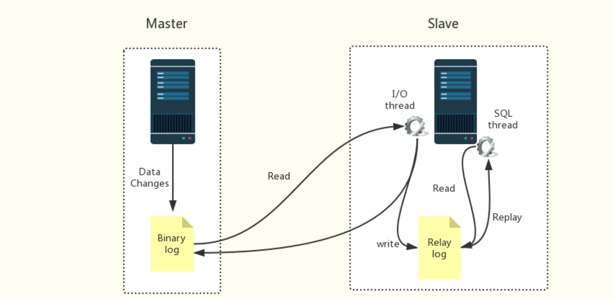
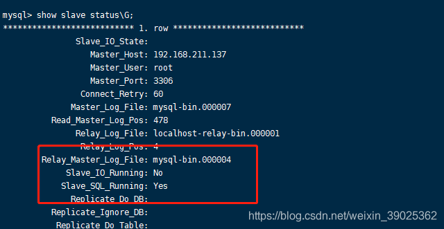

## mysql实现主从复制/主从同步

如果一个项目只有一个数据库服务器，而这个服务器万一宕机，就会导致业务停顿，造成影响。这个时候 就需要做高可用，避免单点问题。

## [#](https://ydlclass.com/doc21xnv/database/sync/#一、什么是mysql-的主从复制)一、什么是mysql 的主从复制？

------

### [#](https://ydlclass.com/doc21xnv/database/sync/#_1、简介)1、简介

指一台服务器充当主数据库服务器，另一台或多台服务器充当从数据库服务器，主服务器中的数据自动复制到从服务器之中。对于多级复制，数据库服务器即可充当主机，也可充当从机。

MySQL主从复制的基础是**主服务器对数据库修改记录二进制日志**，从服务器通过主服务器的二进制日志自动执行更新。 一句话表示就是，主数据库做什么，从数据库就跟着做什么。

### [#](https://ydlclass.com/doc21xnv/database/sync/#_2、-主从复制工作原理剖析)2、 主从复制工作原理剖析

- Master 数据库只要发生变化，立马记录到Binary log 日志文件中
- Slave数据库启动一个I/O thread连接Master数据库，请求Master变化的二进制日志
- Slave I/O获取到的二进制日志，保存到自己的Relay log 日志文件中。
- Slave 有一个 SQL thread定时检查Realy log是否变化，变化那么就更新数据



## [#](https://ydlclass.com/doc21xnv/database/sync/#二、为什么要用mysql-的主从)二、为什么要用mysql 的主从

------

### [#](https://ydlclass.com/doc21xnv/database/sync/#_1、实现服务器负载均衡)1、**实现服务器负载均衡**

 即可以通过在主服务器和从服务器之间切分处理客户查询的负荷，从而得到更好的客户相应时间。通常情况下，数据库管理员会有两种思路。

 一是在主服务器上只实现数据的更新操作。包括数据记录的更新、删除、新建等等作业。而不关心数据的查询作业。数据库管理员将数据的查询请求全部 转发到从服务器中。这在某些应用中会比较有用。如某些应用，像基金净值预测的网站。其数据的更新都是有管理员更新的，即更新的用户比较少。而查询的用户数 量会非常的多。此时就可以设置一台主服务器，专门用来数据的更新。同时设置多台从服务器，用来负责用户信息的查询

 二是在主服务器上与从服务器切分查询的作业。在这种思路下，主服务器不单单要完成数据的更新、删除、插入等作业，同时也需要负担一部分查询作业。而从服务器的话，只负责数据的查询。当主服务器比较忙时，部分查询请求会自动发送到从服务器重，以降低主服务器的工作负荷。

### [#](https://ydlclass.com/doc21xnv/database/sync/#_2、通过复制实现数据的异地备份)2、**通过复制实现数据的异地备份**

 可以定期的将数据从主服务器上复制到从服务器上，这无疑是先了数据的异地备份。在传统的备份体制下，是将数据备份在本地。此时备份 作业与数据库服务器运行在同一台设备上，当备份作业运行时就会影响到服务器的正常运行。有时候会明显的降低服务器的性能。同时，将备份数据存放在本地，也 不是很安全。如硬盘因为电压等原因被损坏或者服务器被失窃，此时由于备份文件仍然存放在硬盘上，数据库管理员无法使用备份文件来恢复数据。这显然会给企业 带来比较大的损失。

### [#](https://ydlclass.com/doc21xnv/database/sync/#_3、提高数据库系统的可用性)3、**提高数据库系统的可用性**

 数据库复制功能实现了主服务器与从服务器之间数据的同步，增加了数据库系统的可用性。当主服务器出现问题时，数据库管理员可以马上让从服务器作为主服务器，用来数据的更新与查询服务。然后回过头来再仔细的检查主服务器的问题。此时一般数据库管理员也会采用两种手段。

 一是主服务器故障之后，虽然从服务器取代了主服务器的位置，但是对于主服务器可以采取的操作仍然做了一些限制。如仍然只能够进行数据的查询，而 不能够进行数据的更新、删除等操作。这主要是从数据的安全性考虑。如现在一些银行系统的升级，在升级的过程中，只能够查询余额而不能够取钱。这是同样的道 理。

 二是从服务器真正变成了主服务器。当从服务器切换为主服务器之后，其地位完全与原先的主服务器相同。此时可以实现对数据的查询、更新、删除等操 作。为此就需要做好数据的安全性工作。即数据的安全策略，要与原先的主服务器完全相同。否则的话，就可能会留下一定的安全隐患

## [#](https://ydlclass.com/doc21xnv/database/sync/#三、怎么配置mysql主从复制)三、怎么配置mysql主从复制

------

### [#](https://ydlclass.com/doc21xnv/database/sync/#_1、环境准备)1、环境准备

本地安装两个mysql，或者使用虚拟机，需要准备两个mysql，

环境，可以使伪集群，也可以是真集群

```text
mysql1(master): 192.168.120.200:3306
mysql2(slave):  192.168.120.201:3306
```

1
2

### [#](https://ydlclass.com/doc21xnv/database/sync/#_2、mysql-配置文件配置)2、mysql 配置文件配置

mysql1(master): 配置文件设置

```bash
#mysql master1 config 
[mysqld]
server-id = 1        # 节点ID，确保唯一

# log config
log-bin = master-bin     #开启mysql的binlog日志功能
sync_binlog = 1         #控制数据库的binlog刷到磁盘上去 , 0 不控制，性能最好，1每次事物提交都会刷到日志文件中，性能最差，最安全
binlog_format = mixed   #binlog日志格式，mysql默认采用statement，建议使用mixed
expire_logs_days = 7                           #binlog过期清理时间
max_binlog_size = 100m                    #binlog每个日志文件大小
binlog_cache_size = 4m                        #binlog缓存大小
max_binlog_cache_size= 512m              #最大binlog缓存大
binlog-ignore-db=mysql #不生成日志文件的数据库，多个忽略数据库可以用逗号拼接，或者 复制这句话，写多行

auto-increment-offset = 1     # 自增值的偏移量
auto-increment-increment = 1  # 自增值的自增量
slave-skip-errors = all        #跳过从库错误
```

1
2
3
4
5
6
7
8
9
10
11
12
13
14
15
16
17

mysql2(slave): 201 mysql.cnf 配置

```bash
[mysqld]
server-id=2
log-bin=mysql-bin
relay-log=mysql-relay-bin
replicate-wild-ignore-table=mysql.%
replicate-wild-ignore-table=test.%
replicate-wild-ignore-table=information_schema.%
```

1
2
3
4
5
6
7

重启两个mysql，让配置生效

### [#](https://ydlclass.com/doc21xnv/database/sync/#_3、master数据库-创建复制用户并授权)3、master数据库，创建复制用户并授权

1.进入master的数据库，为master创建复制用户

```bash
CREATE USER repl IDENTIFIED BY 'Root12345_';
```

1

2.赋予该用户复制的权利

```csharp
grant replication slave on *.* to 'repl'@'192.168.120.200'  identified by 'Root12345_';
FLUSH PRIVILEGES;
```

1
2

3.查看master的状态

```ruby
show master status;
mysql> show master status;
+------------------+----------+--------------+------------------+-------------------+
| File             | Position | Binlog_Do_DB | Binlog_Ignore_DB | Executed_Gtid_Set |
+------------------+----------+--------------+------------------+-------------------+
| mysql-bin.000005      120|              | mysql            |                   |
+------------------+----------+--------------+------------------+-------------------+
1 row in set (0.00 sec)
```

1
2
3
4
5
6
7
8

4,配置从库

```bash
mysql> CHANGE MASTER TO 
MASTER_HOST = '192.168.120.200',  
MASTER_USER = 'repl', 
MASTER_PASSWORD = 'Root12345_',
MASTER_PORT = 3306,
MASTER_LOG_FILE='master-bin.000001',
MASTER_LOG_POS=120,
MASTER_RETRY_COUNT = 60,
MASTER_HEARTBEAT_PERIOD = 10000; 

# MASTER_LOG_FILE与主库File 保持一致
# MASTER_LOG_POS=120 , #与主库Position 保持一致
```

1
2
3
4
5
6
7
8
9
10
11
12

启动从库slave进程

```css
mysql> slave start;
Query OK, 0 rows affected (0.04 sec)
```

1
2

查看是否配置成功

```sql
-- 主库添加一条数据
-- 从库查询
```

1
2

## [#](https://ydlclass.com/doc21xnv/database/sync/#四、可能遇到的问题)四、可能遇到的问题

> 在配置mysql主从复制的时候出现错误：

Fatal error: The slave I/O thread stops because master and slave have equal MySQL server UUIDs; these UUIDs must be different for replication to work.

### [#](https://ydlclass.com/doc21xnv/database/sync/#_1-现象)1.现象

 Slave_IO_Running:No，mysql的IO线程没有正常工作

### [#](https://ydlclass.com/doc21xnv/database/sync/#_2-原因)2.原因

笔者使用两台虚拟机，一主一从，从库的mysql是直接克隆的。在mysql 5.6的复制引入了uuid的概念，各个复制结构中的server_uuid得保证不一样，但是查看到直接克隆data文件夹后server_uuid是相同的。

### [#](https://ydlclass.com/doc21xnv/database/sync/#_3-解决)3.解决

找到data文件夹下的auto.cnf文件，修改里面的server_uuid值，保证各个db的server_uuid不一样，重启db即可。 找出auto.cnf

```bash
 find / -name 'auto.cnf'
```

1

修改server_uuid的值

```bash
vim /var/lib/mysql/auto.cnf
```

1

使用

```sql
select uuid();
```

1

生成一个uuid即可。

重启数据库即可。