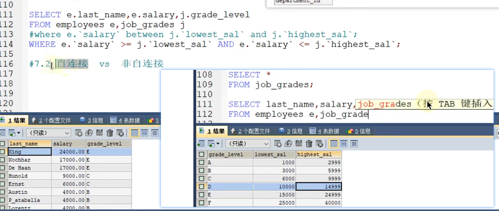

1. 事务四大提醒ACID
   - 原子性： 要么都成功要么都失败
   - 一致性： 执行前后状态必须是一致的，比如转账
   - 隔离性： 事务之间不会相互影响。由锁机制和MVCC机制来实现
   - 持久性： 事务成功必须写入磁盘
2. 4个特性与WAL 有关系

​		[预写日志(WAL)介绍 - xuwc - 博客园 (cnblogs.com)](https://www.cnblogs.com/xuwc/p/14037750.html)

​		WAL(Write Ahead Log)预写日志

- 原子性: 事务的原子性是通过Redo Log和Undo Log保证的。
  - 每一个写事务，都会修改BufferPool，从而产生相应的Redo/Undo日志，这些日志信息会被记录
    到日志文件中。在 MySOL 中，任何 Buffer Pool中的页被刷到磁盘之前，都会先写入到日志文件中,
    如果Buffer Pool 中的数据提交(commit)，此时数据库挂了，那在数据库再次启动之后，可以通
    Redo志将其恢复出来，以保证脏页写的数据不会丢失。如果数据没有提交（没有commit)，此时数
    据库挂了,就需要通过Undo来实现了。
- 持久性：如何实现
  - 通过Redo Log 和WAL实现的。

### 等值连接 与 非等值连接

