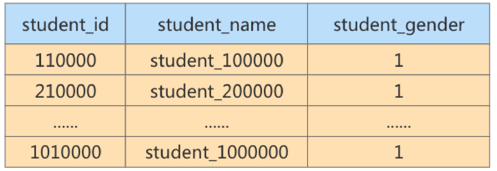

# 第 08 章_索引的创建与设计原则

## 1. 索引的声明与使用

### 1. 1 索引的分类

MySQL的索引包括普通索引、唯一性索引、全文索引、单列索引、多列索引和空间索引等。

- 从`功能逻辑`上说，索引主要有 4 种，分别是普通索引、唯一索引、主键索引、全文索引。

- 按`照物理实现方式`，索引可以分为 2 种：聚簇索引和非聚簇索引。

- 按照`作用字段个数`进行划分，分成单列索引和联合索引。

1. 普通索引

2. 唯一性索引

3. 主键索引

4. 单列索引

5. 多列(组合、联合)索引

   最左前缀

6. 全文索引

7. 补充：空间索引

   使用`参数SPATIAL`可以设置索引为`空间索引`。空间索引只能建立在空间数据类型上，这样可以提高系统获取空间数据的效率。MySQL中的空间数据类型包括GEONETRY、POINT、LINESTRING和POLYGON等。目前只有MyISAM存储引擎支持空间检索，而且索引的字段不能为空值。对于初学者来说，这类索引很少会用到。

**小结：不同的存储引擎支持的索引类型也不一样 **

**InnoDB** ： 支持 B-tree、Full-text 等索引，不支持 Hash索引；

 **MyISAM** ： 支持 B-tree、Full-text 等索引，不支持 Hash 索引； 

Memory ： 支持 B-tree、Hash 等索引，不支持 Full-text 索引；

NDB ： 支持 Hash 索引，不支持 B-tree、Full-text 等索引； 

Archive ： 不支持 B-tree、Hash、Full-text 等索引；

### 1. 2 创建索引

MySQL支持多种方法在单个或多个列上创建索引:在创建表的定义语句`CREATE TABLE`中指定索引列，使用`ALTER TABLE`语句在存在的表上创建索引，或者使用`CREATE INDEX`语句在已存在的表上添加索引。

#### 1. 创建表的时候创建索引

使用CREATE TABLE创建表时，除了可以定义列的数据类型外，还可以定义主键约束、外键约束或者唯一性约束，而不论创建哪种约束，在定义约束的同时相当于在指定列上创建了一个索引。

举例：

```mysql
CREATE TABLE dept(
dept_id INT PRIMARY KEY AUTO_INCREMENT,
dept_name VARCHAR( 20 )
);
```
```mysql
CREATE TABLE emp(
emp_id INT PRIMARY KEY AUTO_INCREMENT,
emp_name VARCHAR( 20 ) UNIQUE,
dept_id INT,
CONSTRAINT emp_dept_id_fk FOREIGN KEY(dept_id) REFERENCES dept(dept_id)
);
```

但是，如果显式创建表时创建索引的话，基本语法格式如下：

```mysql
CREATE TABLE table_name [col_name data_type]
[UNIQUE | FULLTEXT | SPATIAL][INDEX |KEY][index_name] (col_name [length]) [ASC | DESC]

```


- UNIQUE、FULLTEXT和SPATIAL为可选参数，分别表示唯一索引、全文索引和空间索引；
- INDEX与KEY为同义词，两者的作用相同，用来指定创建索引；
- index_name指定索引的名称，为可选参数，如果不指定，那么MySQL默认col_name为索引名；
- col_name为需要创建索引的字段列，该列必须从数据表中定义的多个列中选择；
- length为可选参数，表示索引的长度，只有字符串类型的字段才能指定索引长度；
- ASC或DESC指定升序或者降序的索引值存储。

**1.创建普通索引**

在book表中的year_publication字段上建立普通索引，SQL语句如下：

```mysql
#显式的方式创建
#1创建普通的索引
CREATE TABLE book (
    book_id INT ,
    book_name VARCHAR (100) ,
    AUTHORS VARCHAR (100) ,
    info VARCHAR(100) ,
    COMMENT VARCHAR (100) ,
    year_publication YEAR,
    #声明索引
	INDEX idx_bname (book_name))
;

#通过命令查看索引
#方式l:
mysql> show  create table book \G
*************************** 1. row ***************************
       Table: book
Create Table: CREATE TABLE `book` (
  `book_id` int(11) DEFAULT NULL,
  `book_name` varchar(100) DEFAULT NULL,
  `AUTHORS` varchar(100) DEFAULT NULL,
  `info` varchar(100) DEFAULT NULL,
  `COMMENT` varchar(100) DEFAULT NULL,
  `year_publication` year(4) DEFAULT NULL,
  KEY `idx_bname` (`book_name`)
) ENGINE=InnoDB DEFAULT CHARSET=utf8
1 row in set (0.00 sec)

# 方式2： 
show index from book;
```

#### show index from book

太好用了，必须要会

**2.创建唯一索引**

举例：

```mysql
# 创建唯一索引
CREATE TABLE book (
    book_id INT ,
    book_name VARCHAR (100) ,
    #声明索引
	UNIQUE INDEX uk_idx_bname (book_name))
;

show index from book;
```


该语句执行完毕之后，使用SHOW CREATE TABLE查看表结构：

**3.主键索引**

设定为主键后数据库会自动建立索引，innodb为聚簇索引，语法：

```mysql
CREATE TABLE book (
    # 创建主键索引
    book_id INT  primary key,
    book_name VARCHAR (100)
;

```


删除主键索引：

```mysql
ALTER TABLE student
drop PRIMARY KEY ;
```

修改主键索引：必须先删除掉(drop)原索引，再新建(add)索引

**4.创建组合索引**

```mysql
# 创建唯一索引
CREATE TABLE book (
    book_id INT ,
    book_name VARCHAR (100) ,
    author VARCHAR (100) ,
    #声明索引
	INDEX union_key_ba (book_name,author))
;

show index from book;
```


**5.创建全文索引**

**6.创建空间索引**

空间索引创建中，要求空间类型的字段必须为非空。

举例：创建表test5，在空间类型为GEOMETRY的字段上创建空间索引，SQL语句如下：

#### 2.在已经存在的表上创建索引

在已经存在的表中创建索引可以使用ALTER TABLE语句或者CREATE INDEX语句。

1. 使用ALTER TABLE语句创建索引 ALTER TABLE语句创建索引的基本语法如下：

   ```mysql
   ALTER TABLE table_name ADD [UNIQUE | FULLTEXT | SPATIAL] [INDEX | KEY]
   [index_name] (col_name[length],...) [ASC | DESC]
   
   ALTER TABLE book ADD INDEX index_name(book_name);
   ALTER TABLE book ADD UNIQUE uk_idx_bname(book_name);
   ALTER TABLE book ADD UNIQUE mul_bid_na(book_name,author);
   ```

   

2. 使用CREATE INDEX创建索引 CREATE INDEX语句可以在已经存在的表上添加索引，在MySQL中，CREATE INDEX被映射到一个ALTER TABLE语句上，基本语法结构为：

   ```mysql
   CREATE [UNIQUE | FULLTEXT | SPATIAL] INDEX index_name
   ON table_name (col_name[length],...) [ASC | DESC]
   
   create 索引类型 索引名称 on 表名(字段);
   create index idx_cmt on book(comment);
   create unique index idx_cmt on book(comment);
   create index idx_cmt on book(comment,author);
   ```

   

#### 3 删除索引

1. 使用ALTER TABLE删除索引 ALTER TABLE删除索引的基本语法格式如下：

   ```mysql
   ALTER TABLE table_name DROP INDEX index_name;
   ```

2. 使用DROP INDEX语句删除索引 DROP INDEX删除索引的基本语法格式如下：

   ```mysql
   DROP INDEX index_name ON table_name;
   ```

> 在需要大量删除表数据，修改表数据时，可以考虑先删除索引。等修改完数据之后再插入

> AUTO_INCREMENT 约束字段的唯一索引不能被删除

>  提示 删除表中的列时，如果要删除的列为索引的组成部分，则该列也会从索引中删除。如果组成索引的所有列都被删除，则整个索引将被删除。

## 2.MySQL 8. 0 索引新特性

### 2. 1 支持降序索引

降序索引以降序存储键值。虽然在语法上，从MySQL 4版本开始就已经支持降序索引的语法了，但实际上该DESC定义是被忽略的，直到MySQL 8.x版本才开始真正支持降序索引(仅限于InnoDB存储引擎)。

MySQL在8.0**版本之前创建的仍然是升序索引，使用时进行反向扫描，这大大降低了数据库的效率**。在某些场景下，降序索引意义重大。例如，如果一个查询，需要对多个列进行排序，且顺序要求不一致，那么使用降序索引将会避免数据库使用额外的文件排序操作，从而提高性能。

举例：分别在MySQL 5. 7 版本和MySQL 8. 0 版本中创建数据表ts 1 ，结果如下：

```mysql
CREATE TABLE ts1(a int, b int, index idx_a_b(a, b desc) ) ;
```


在MySQL 5. 7 版本中查看数据表ts 1 的结构，结果如下：

```mysql
mysql> show create table ts1 \G
*************************** 1. row ***************************
       Table: ts1
Create Table: CREATE TABLE `ts1` (
  `a` int(11) DEFAULT NULL,
  `b` int(11) DEFAULT NULL,
  KEY `idx_a_b` (`a`,`b`)
) ENGINE=InnoDB DEFAULT CHARSET=utf8
1 row in set (0.00 sec)
```

从结果可以看出，索引仍然是默认的升序。

在MySQL 8. 0 版本中查看数据表ts 1 的结构，结果如下：

```mysql
mysql> show create table ts1 \G
*************************** 1. row ***************************
       Table: ts1
Create Table: CREATE TABLE `ts1` (
  `a` int DEFAULT NULL,
  `b` int DEFAULT NULL,
  KEY `idx_a_b` (`a`,`b` DESC)
) ENGINE=InnoDB DEFAULT CHARSET=utf8mb3
1 row in set (0.00 sec)
```


从结果可以看出，索引已经是降序了。下面继续测试降序索引在执行计划中的表现。

分别在MySQL 5. 7 版本和MySQL 8. 0 版本的数据表ts 1 中插入 800 条随机数据，执行语句如下：

```mysql
CREATE TABLE ts1(a int,b int,index idx_a_b(a,b desc));
```
```mysql
DELIMITER //
CREATE PROCEDURE ts_insert () BEGIN
	DECLARE
		i INT DEFAULT 1;
	WHILE
			i < 800 DO
			INSERT INTO ts1 SELECT
			rand()* 80000,
			rand()* 80000;
		
		SET i = i + 1;
		
	END WHILE;
	COMMIT;
	
END // 
DELIMITER;
#调用
CALL ts_insert ();
```


在MySQL 5.7版本中查看数据表ts1的执行计划，结果如下：

```mysql
mysql> explain select * from ts1 order by a, b desc limit 5;
+----+------+----------+-----------------------------+
| id | rows | filtered | Extra                       |
+----+------+----------+-----------------------------+
|  1 | 1598 |   100.00 | Using index; Using filesort |
+----+------+----------+-----------------------------+
1 row in set, 1 warning (0.01 sec)
```

从结果可以看出，执行计划中扫描数为 1598，而且使用了Using filesort。


>  提示 Using filesort是MySQL中一种速度比较慢的外部排序，能避免是最好的。多数情况下，管理员可以通过优化索引来尽量避免出现Using filesort，从而提高数据库执行速度。


在MySQL 8.0版本中查看数据表ts1的执行计划。

```mysql
mysql> explain select * from ts1 order by a, b desc limit 5;
+----+---------+-----+----------+-------------+
| id | key     |rows | filtered | Extra       |
+----+---------+-----+----------+-------------+
|  1 | idx_a_b |   5 |   100.00 | Using index |
+----+---------+-----+----------+-------------+
1 row in set, 1 warning (0.03 sec)
```

从结果可以看出，执行计划中扫描数为 5 ，而且没有使用Using filesort。

> 注意 降序索引只对查询中特定的排序顺序有效，如果使用不当，反而查询效率更低。例如，上述查询排序条件改为order by a desc, b desc，MySQL 5.7的执行计划要明显好于MySQL 8.0。


### 2.2 隐藏索引

在MySQL 5.7版本及之前，只能通过显式的方式删除索引。此时，如果发现删除索引后出现错误，又只能通过显式创建索引的方式将删除的索引创建回来。如果数据表中的数据量非常大，或者数据表本身比较大，这种操作就会消耗系统过多的资源，操作成本非常高。

从MySQL 8.x开始支持`隐藏索引（invisible indexes）`，只需要将待删除的索引设置为隐藏索引，使查询优化器不再使用这个索引（即使使用force index（强制使用索引），优化器也不会使用该索引）确认将索引设置为隐藏索引后系统不受任何响应，就可以彻底删除索引。`这种通过先将索引设置为隐藏索引，再删除索引的方式就是软删除`。

同时，你想验证某个索引删除之后的`查询性能影响`，就可以暂时先隐藏该索引

>  注意:
>
> 主键不能被设置为隐藏索引。当表中没有显式主键时，表中第一个唯一非空索引会成为隐式主键，也不能设置为隐藏索引。

索引默认是可见的，在使用CREATE TABLE，CREATE INDEX或者ALTERTABLE等语句时可以通过VISIBLE或者INVISIBLE关键词设置索引的可见性。

创建表时直接创建 

**1.在MySQL中创建**

隐藏索引通过SQL语句INVISIBLE来实现，其语法形式如下：

```mysql
CREATE TABLE tablename(
	propname1 type1 [ CONSTRAINT1],propname2 type2[ CONSTRAINT2],
    ...
	propnamen typen,
	INDEX [indexname ](propname1 [ ( length)]) INVISIBLE
);

create table book2(
	id int primary key,
    book_name varchar(32)
);

```

上述语句比普通索引多了一个关键字INVISIBLE，用来标记索引为不可见索引。

**2.在已经存在的表上创建**

可以为已经存在的表设置隐藏索引，其语法形式如下：

```mysql
CREATE [UNIQUE | FULLTEXT | SPATIAL] INDEX index_name ON table_name (col_name[length] [ASC | DESC] ,...) [INVISIBLE|VISIBLE]
```


**3.通过ALTER TABLE语句创建**

```mysql
ALTER TABLE book2 ADD index idx_name(book_name) INVISIBLE;
```

**4.切换索引可见状态** 

已存在的索引可通过如下语句切换可见状态：

```mysql
ALTER TABLE book2 alter index idx_name visible; # 切换成非隐藏索引
ALTER TABLE book2 alter index idx_name invisible; # 切换成非隐藏索引
```

如果将index_cname索引切换成可见状态，通过explain查看执行计划，发现优化器选择了idx_name索引。

>  注意 当索引被隐藏时，它的内容仍然是和正常索引一样实时更新的。如果一个索引需要长期被隐藏，那么可以将其删除，因为索引的存在会影响插入、更新和删除的性能。

通过设置隐藏索引的可见性可以查看索引对调优的帮助。


**5.使隐藏索引对查询优化器可见**

> 只是有个全局的地方设置可见性，没什么用

在MySQL 8.x版本中，为索引提供了一种新的测试方式，可以通过查询优化器的一个开关（use_invisible_indexes）来打开某个设置，使隐藏索引对查询优化器可见。如果 use_invisible_indexes设置为off(默认)，优化器会忽略隐藏索引。如果设置为on，即使隐藏索引不可见，优化器在生成执行计划时仍会考虑使用隐藏索引。

（ 1 ）在MySQL命令行执行如下命令查看查询优化器的开关设置。

```mysql
mysql> select @@optimizer_switch \G
*************************** 1. row ***************************
@@optimizer_switch: index_merge=on,index_merge_union=on,index_merge_sort_union=on,index_merge_intersection=on,engine_condition_pushdown=on,index_condition_pushdown=on,mrr=on,mrr_cost_based=on,block_nested_loop=on,batched_key_access=off,materialization=on,semijoin=on,loosescan=on,firstmatch=on,duplicateweedout=on,subquery_materialization_cost_based=on,use_index_extensions=on,condition_fanout_filter=on,derived_merge=on,use_invisible_indexes=off,skip_scan=on,hash_join=on,subquery_to_derived=off,prefer_ordering_index=on,hypergraph_optimizer=off,derived_condition_pushdown=on
1 row in set (0.12 sec)
```


在输出的结果信息中找到如下属性配置。

```properties
use_invisible_indexes=off
```

此属性配置值为off，说明隐藏索引默认对查询优化器不可见。

（ 2 ）使隐藏索引对查询优化器可见，需要在MySQL命令行执行如下命令：

```mysql
mysql> set session optimizer_switch="use_invisible_indexes=on" ;
Query OK, 0 rows affected (0.06 sec)
```

SQL语句执行成功，再次查看查询优化器的开关设置。

此时，在输出结果中可以看到如下属性配置。

```mysql
mysql> select @@optimizer_switch \G
*************************** 1. row ***************************
@@optimizer_switch: index_merge=on,index_merge_union=on,index_merge_sort_union=on,index_merge_intersection=on,engine_condition_pushdown=on,index_condition_pushdown=on,mrr=on,mrr_cost_based=on,block_nested_loop=on,batched_key_access=off,materialization=on,semijoin=on,loosescan=on,firstmatch=on,duplicateweedout=on,subquery_materialization_cost_based=on,use_index_extensions=on,condition_fanout_filter=on,derived_merge=on,use_invisible_indexes=on,skip_scan=on,hash_join=on,subquery_to_derived=off,prefer_ordering_index=on,hypergraph_optimizer=off,derived_condition_pushdown=on
1 row in set (0.03 sec)
```

use_invisible_indexes属性的值为on，说明此时隐藏索引对查询优化器可见。


## 3. 索引的设计原则


### 3. 1 数据准备

第 1 步：创建数据库、创建表

```mysql
CREATE DATABASE atguigudb1;
USE atguigudb1;

#1.创建学生表和课程表
CREATE TABLE `student_info` (
`id` INT( 11 ) NOT NULL AUTO_INCREMENT,
`student_id` INT NOT NULL ,
`name` VARCHAR( 20 ) DEFAULT NULL,
`course_id` INT NOT NULL ,
`class_id` INT( 11 ) DEFAULT NULL,
`create_time` DATETIME DEFAULT CURRENT_TIMESTAMP ON UPDATE CURRENT_TIMESTAMP,
PRIMARY KEY (`id`)
) ENGINE=INNODB AUTO_INCREMENT= 1 DEFAULT CHARSET=utf8;

CREATE TABLE `course` (
`id` INT( 11 ) NOT NULL AUTO_INCREMENT,
`course_id` INT NOT NULL ,
`course_name` VARCHAR( 40 ) DEFAULT NULL,
PRIMARY KEY (`id`)
) ENGINE=INNODB AUTO_INCREMENT= 1 DEFAULT CHARSET=utf8;
```


第 2 步：创建模拟数据必需的存储函数

```mysql
#函数 1 ：创建随机产生字符串函数

DELIMITER //
CREATE FUNCTION rand_string(n INT)
	RETURNS VARCHAR( 255 ) #该函数会返回一个字符串
BEGIN
	DECLARE chars_str VARCHAR( 100 ) DEFAULT
'abcdefghijklmnopqrstuvwxyzABCDEFJHIJKLMNOPQRSTUVWXYZ';
	DECLARE return_str VARCHAR( 255 ) DEFAULT '';
	DECLARE i INT DEFAULT 0 ;
    WHILE i < n DO
        SET return_str =CONCAT(return_str,SUBSTRING(chars_str,FLOOR( 1 +RAND()* 52 ), 1 ));
        SET i = i + 1 ;
    END WHILE;
    RETURN return_str;
END //
DELIMITER ;
```


```mysql
#函数 2 ：创建随机数函数
DELIMITER //
CREATE FUNCTION rand_num (from_num INT ,to_num INT) RETURNS INT( 11 )
BEGIN
DECLARE i INT DEFAULT 0 ;
SET i = FLOOR(from_num +RAND()*(to_num - from_num+ 1 )) ;
RETURN i;
END //
DELIMITER ;
```

创建函数，假如报错：

```mysql
This function has none of DETERMINISTIC......
```


由于开启过慢查询日志bin-log, 我们就必须为我们的function指定一个参数。

主从复制，主机会将写操作记录在bin-log日志中。从机读取bin-log日志，执行语句来同步数据。如果使用函数来操作数据，会导致从机和主键操作时间不一致。所以，默认情况下，mysql不开启创建函数设置。

- 查看mysql是否允许创建函数：

  ```mysql
  show variables like 'log_bin_trust_function_creators';
  ```

- 命令开启：允许创建函数设置：

  ```mysql
  set global log_bin_trust_function_creators= 1 ;  # 不加global只是当前窗口有效。
  ```

  

- mysqld重启，上述参数又会消失。永久方法：

  - windows下：my.ini[mysqld]加上：

    ```properties
    log_bin_trust_function_creators= 1
    ```

  - linux下：/etc/my.cnf下my.cnf[mysqld]加上：

    ```properties
    log_bin_trust_function_creators= 1
    ```

    

第 3 步：创建插入模拟数据的存储过程


```mysql
#存储过程 1 ：创建插入课程表存储过程
DELIMITER //
CREATE PROCEDURE insert_course( max_num INT )
BEGIN
    DECLARE i INT DEFAULT 0 ;
    SET autocommit = 0 ;  #设置手动提交事务
    REPEAT #循环
    SET i = i + 1 ;  #赋值
    INSERT INTO course (course_id, course_name ) VALUES
    (rand_num( 10000 , 10100 ),rand_string( 6 ));
    UNTIL i = max_num
    END REPEAT;
	COMMIT;  #提交事务
END //
DELIMITER ;
```

```mysql
#存储过程 2 ：创建插入学生信息表存储过程

DELIMITER //
CREATE PROCEDURE insert_stu( max_num INT )
BEGIN
DECLARE i INT DEFAULT 0 ;
	SET autocommit = 0 ;  #设置手动提交事务
	REPEAT #循环
    SET i = i + 1 ;  #赋值
    INSERT INTO student_info (course_id, class_id ,student_id ,NAME ) VALUES
    (rand_num( 10000 , 10100 ),rand_num( 10000 , 10200 ),rand_num( 1 , 200000 ),rand_string( 6 ));
    UNTIL i = max_num
	END REPEAT;
	COMMIT;  #提交事务
END //
DELIMITER ;
```


第 4 步：调用存储过程

```mysql
CALL insert_course( 100 );
CALL insert_stu( 1000000 );
```


### 3.2 哪些情况适合创建索引

#### 1.字段的数值有唯一性的限制

> 业务上具有唯一特性的字段，即使是组合字段，也必须建成唯一索引。（来源：Alibaba）
>
> 说明：不要以为唯一索引影响了 insert 速度，这个速度损耗可以忽略，但提高查找速度是明显的。

#### 2.频繁作为 WHERE 查询条件的字段

某个字段在SELECT语句的 WHERE 条件中经常被使用到，那么就需要给这个字段创建索引了。尤其是在数据量大的情况下，创建普通索引就可以大幅提升数据查询的效率。

比如student_info数据表（含 100 万条数据），假设我们想要查询 student_id=123110 的用户信息。

#### 3.经常 GROUP BY 和 ORDER BY 的列

索引就是让数据按照某种顺序进行存储或检索，因此当我们使用 GROUP BY 对数据进行分组查询，或者使用 ORDER BY 对数据进行排序的时候，就需要`对分组或者排序的字段进行索引`。如果待排序的列有多个，那么可以在这些列上建立组合索引。

#### 4.UPDATE、DELETE 的 WHERE 条件列

对数据按照某个条件进行查询后再进行 UPDATE 或 DELETE 的操作，如果对 WHERE 字段创建了索引，就能大幅提升效率。原理是因为我们需要先根据 WHERE 条件列检索出来这条记录，然后再对它进行更新或删除。 如果进行更新的时候，更新的字段是`非索引字段`，提升的效率会更明显，这是因为非索引字段更新不需要对索引进行维护。

#### 5.DISTINCT 字段需要创建索引

有时候我们需要对某个字段进行去重，使用 DISTINCT，那么对这个字段创建索引，也会提升查询效率。

比如，我们想要查询课程表中不同的 student_id 都有哪些，如果我们没有对 student_id 创建索引，执行

SQL 语句：

```mysql
SELECT DISTINCT( student_id)FROM 'student_info `;
```

运行结果（ 600637 条记录，运行时间 0.683s）：

```mysql
... 加索引语句
SELECT DISTINCT( student_id)FROM 'student_info `;
```


如果我们对 student_id 创建索引，再执行 SQL 语句：

运行结果（ 600637 条记录，运行时间 0.010s）：

你能看到 SQL 查询效率有了提升，同时显示出来的 student_id 还是按照`递增的顺序`进行展示的。这是因

为索引会对数据按照某种顺序进行排序，所以在去重的时候也会快很多。 因为紧挨着所以去重特别方便

#### 6.多表 JOIN 连接操作时，创建索引注意事项

首先，`连接表的数量尽量不要超过 3 张`，因为每增加一张表就相当于增加了一次嵌套的循环，数量级增

长会非常快，严重影响查询的效率。

其次，对 `WHERE 条件创建索引，`因为 WHERE 才是对数据条件的过滤。如果在数据量非常大的情况下，

没有 WHERE 条件过滤是非常可怕的。

最后，`对用于连接的字段创建索引，`并且该字段在多张表中的`类型必须一致`。比如 course_id 在

student_info 表和 course 表中都为 int(11) 类型，而不能一个为 int 另一个为 varchar 类型。

举个例子，如果我们只对 student_id 创建索引，执行 SQL 语句：

```mysql
SELECT course_id,name，student_info.student_id, course_name
FROM student_info JOIN course
ON student_info .course_id = course.course_id
WHERE name = '462eed7ac6e791292a79' ;
```

运行结果（ 1 条数据，运行时间 0.189s）：

这里我们对 name 创建索引，再执行上面的 SQL 语句，运行时间为 0.002s。

#### 7.使用列的类型小的创建索引

我们这里所说的`类型大小`指的就是该类型表示的数据范围的大小。

我们在定义表结构的时候要显式的指定列的类型，以整数类型为例，有`TINYINT`、`MEDIUMINT`、`INT`、
`BIGINT`等，它们占用的存储空间依次递增，能表示的整数范围当然也是依次递增。如果我们想要对某个整数列建立索引的话，在表示的整数范围允许的情况下，尽量让索引列使用较小的类型，比如我们能使用`INT`就不要使用`BIGINT`，能使用`MEDIUMINT` 就不要使用`INT`。这是因为:

- 数据类型越小，在查询时进行的比较操作越快
- 数据类型越小，索引占用的存储空间就越少，在一个数据页内就可以放下更多的记录，从而减少磁盘I/0带来的性能损耗，也就意味着可以把更多的数据页缓存在内存中，从而加快读写效率。

这个建议对于表的`主键来说更加适用`，因为不仅是聚簇索引中会存储主键值，其他所有的二级索引的节点处都会存储一份记录的主键值，如果主键使用更小的数据类型，也就意味着节省更多的存储空间和更高效的I/O。

#### 8.使用字符串前缀创建索引

假设我们的字符串很长，那存储一个字符串就需要占用很大的存储空间。在我们需要为这个字符串列建立索引时，那就意味着在对应的B+树中有这么两个问题:

- B+树索引中的记录需要把该列的完整字符串存储起来，更费时。而且字符串越长，`在索引中占用的存储空间越大。`
- 如果B+树索引中索引列存储的字符串很长，那在做字符串`比较时会占用更多的时间。`

我们可以通过截取字段的前面一部分内容建立索引，这个就叫`前缀索引`。这样在查找记录时虽然不能精确的定位到记录的位置，但是能定位到相应前缀所在的位置，然后根据前缀相同的记录的主键值回表查询完整的字符串值。既`节约空间`，又`减少了字符串的比较时间`，还大体能解决排序的问题。

例如，TEXT和BLOG类型的字段，进行全文检索会很浪费时间，如果只检索字段前面的若干字符，这样可以提高检索速度。

创建一张商户表，因为地址字段比较长，在地址字段上建立前缀索引

```mysql
create table shop(address varchar( 120 ) not null);

alter table shop add index(address( 12 ));
```


问题是，截取多少呢？截取得多了，达不到节省索引存储空间的目的；截取得少了，重复内容太多，字段的散列度(选择性)会降低。 **怎么计算不同的长度的选择性呢**？

先看一下字段在全部数据中的选择度：

```mysql
select count(distinct address) / count(*) from shop;
```

通过不同长度去计算，与全表的选择性对比：

公式：

```mysql
count(distinct left(列名, 索引长度))/count(*)
```


例如：

```mysql
select count(distinct left(address, 10 )) / count(*) as sub10, -- 截取前 10 个字符的选择度
count(distinct left(address, 15 )) / count(*) as sub11, -- 截取前 15 个字符的选择度
count(distinct left(address, 20 )) / count(*) as sub12, -- 截取前 20 个字符的选择度
count(distinct left(address, 25 )) / count(*) as sub13 -- 截取前 25 个字符的选择度
from shop;
```

**引申另一个问题：索引列前缀对排序的影响**

如果使用了索引列前缀，比方说前边只把address列的前12个字符放到了二级索引中，下边这个查询可能就有点儿尴尬了:

```mysql
SELECT * FROM shop
ORDER BY address  # 这个地方order by 就不准了 如果用前12个建立索引的话
LIMIT 12;
```

因为二级索引中不包含完整的address列信息，所以无法对前12个字符相同，后边的字符不同的记录进行排序，也
就是使用索引列前缀的方式`无法支持使用索引排序`，只能使用文件排序。

**拓展：Alibaba《Java开发手册》**

【`强制`】在 varchar 字段上建立索引时，必须指定索引长度，没必要对全字段建立索引，根据实际文本区分度决定索引长度。

说明：索引的长度与区分度是一对矛盾体，一般对字符串类型数据，长度为 20 的索引，区分度会高达`90% 以上`，可以使用 count(distinct left(列名, 索引长度))/count(*)的区分度来确定。

#### 9.区分度高(散列性高)的列适合作为索引

`列的基数`指的是某一列中不重复数据的个数，比方说某个列包含值2，5，8，2，5，8，2，5，8，虽然有9条记录，但该列的基数却是`3`。也就是说，**在记录行数一定的情况下，列的基数越大，该列中的值越分散;列的基数越小，该列中的值越集中**。这个列的基数指标非常重要，直接影响我们是否能有效的利用索引。最好为列的基数大的列建立索引，为基数太小列的建立索引效果可能不好。

可以使用公式 `select count(distinct a)/count(*) from t1`计算区分度，越接近1越好，一般超过33%就算是比较高效的索引了。

拓展:联合索引把区分度高(散列性高)的列放在前面。

#### 10.使用最频繁的列放到联合索引的左侧

这样也可以较少的建立一些索引。同时，由于"最左前缀原则"，可以增加联合索引的使用率。

#### 11.在多个字段都要创建索引的情况下，联合索引优于单值索引

### 3. 3 限制索引的数目

在实际工作中，我们也需要注意平衡，索引的数目不是越多越好。我们需要限制每张表上的索引数量，建议单张表索引数量`不超过6个`。原因:

① 每个索引都需要占用`磁盘空间`，索引越多，需要的磁盘空间就越大。

② 索引会影响`INSERT`、`DELETE`、`UPDATE`等语句的性能，因为表中的数据更改的同时，索引也会进行调整和更新，会造成负担。

③优化器在选择如何优化查询时，会根据统一信息，对每一个可以用到的`索引来进行评估`，以生成出一个最好的执行计划，如果同时有很多个索引都可以用于查询，会增加MySQL优化器生成执行计划时间，降低查询性能。

### 3. 4 哪些情况不适合创建索引

#### 1. 在where中使用不到的字段，不要设置索引

WHERE条件(包括GROUP BY、ORDER BY)里用不到的字段不需要创建索引，索引的价值是快速定位，如果起不到定位的字段通常是不需要创建索引的。举个例子:

```mysql
SELECT course_id,student_id, create_time
FROM student_info
WHERE student_id = 41251;
```

因为我们是按照student_id来进行检索的，所以不需要对其他字段创建索引，即使这些字段出现在SELECT 字段中。

#### 2. 数据量小的表最好不要使用索引

如果表记录太少，比如少于1000个，那么是不需要创建索引的。表记录太少，是否创建索引`对查询效率的影响并不大`。甚至说，查询花费的时间可能比遍历索引的时间还要短，索引可能不会产生优化效果。

举例：创建表 1 ：

```mysql
CREATE TABLE t_without_index(
a INT PRIMARY KEY AUTO_INCREMENT,
b INT
);
```
提供存储过程 1 ：


```mysql
#创建存储过程

DELIMITER //
CREATE PROCEDURE t_wout_insert()
BEGIN
	DECLARE i INT DEFAULT 1 ;
    WHILE i <= 900
    DO
		INSERT INTO t_without_index(b) SELECT RAND()* 10000 ;
		SET i = i + 1 ;
	END WHILE;
	COMMIT;
END //
DELIMITER ;

#调用
CALL t_wout_insert();
```


创建表 2 ：

```mysql
CREATE TABLE t_with_index(
a INT PRIMARY KEY AUTO_INCREMENT,
b INT,
INDEX idx_b(b)
);
```


创建存储过程 2 ：


```mysql
#创建存储过程

DELIMITER //
CREATE PROCEDURE t_with_insert()
BEGIN
DECLARE i INT DEFAULT 1 ;
WHILE i <= 900
DO
INSERT INTO t_with_index(b) SELECT RAND()* 10000 ;
SET i = i + 1 ;
END WHILE;
COMMIT;
END //
DELIMITER ;
#调用
CALL t_with_insert();
```
查询对比：

你能看到运行结果相同，但是在数据量不大的情况下，索引就发挥不出作用了。

```mysql
mysql> select * from t_without_index where b = 9879 ;
+------+------+
| a | b |
+------+------+
| 1242 | 9879 |
+------+------+
1 row in set (0.00 sec)

mysql> select * from t_with_index where b = 9879 ;
+-----+------+
| a | b |
+-----+------+
| 112 | 9879 |
+-----+------+
1 row in set (0.00 sec)
```
> 结论：在数据表中的数据行数比较少的情况下，比如不到 1000 行，是不需要创建索引的。

#### 3. 有大量重复数据的列上不要建立索引

在条件表达式中经常用到的不同值较多的列上建立索引，但字段中如果有大量重复数据，也不用创建索引。比如在学生表的"`性别`"字段上只有“男”与“·女"两个不同值，因此无须建立索引。如果建立索引，不但不会提高查询效率，反而会`严重降低数据更新速度`。

举例 1 ：要在 100 万行数据中查找其中的 50 万行（比如性别为男的数据），一旦创建了索引，你需要先访问 50 万次索引，然后再访问 50 万次数据表，这样加起来的开销比不使用索引可能还要大。

举例 2 ：假设有一个学生表，学生总数为 100 万人，男性只有 10 个人，也就是占总人口的 10 万分之 1 。

学生表 student_gender 结构如下。其中数据表中的 student_gender 字段取值为 0 或 1 ， 0 代表女性， 1 代表男性。


```mysql
CREATE TABLE student_gender(
student_id INT( 11 ) NOT NULL,
student_name VARCHAR( 50 ) NOT NULL,
student_gender TINYINT( 1 ) NOT NULL,
PRIMARY KEY(student_id)
)ENGINE = INNODB;	
```


如果我们要筛选出这个学生表中的男性，可以使用：

```mysql
SELECT * FROM student_gender WHERE student_gender = 1
```

运行结果（ 10 条数据，运行时间 0.696s）：



你能看到在未创建索引的情况下，运行的效率并不高。如果针对 student_gender字段创建索引呢?

```mysql
SELECT * FROM student gender WHERE student_gender = 1
```


同样是10条数据，运行结果相同，时间却缩短到了0.052s，大幅提升了查询的效率。

其实通过这两个实验你也能看出来，索引的价值是帮你快速定位。如果想要定位的数据有很多，那么索引就失去了它的使用价值，比如通常情况下的性别字段。

> 在这个例子中，索引可以快速定位出男生是有用的。

#### 4.避免对经常更新的表创建过多的索引

第一层含义: 频繁`更新的字段`不一定要创建索引。因为更新数据的时候，也需要更新索引，如果索引太多，在更新索引的时候也会造成负担，从而影响效率。

第二层含义: 避免对`经常更新的表`创建过多的索引，并且索引中的列尽可能少。此时，虽然提高了查询速度，同时却会降低更新表的速度。

#### 5.不建议用无序的值作为索引

例如身份证、UUID(在索引比较时需要转为ASCII，并且插入时可能造`成页分裂`)、MD5、HASH、无序长字符串等。


#### 6.删除不再使用或者很少使用的索引

表中的数据被大量更新，或者数据的使用方式被改变后，原有的一些索引可能不再需要。数据库管理员应当定期找出这些索引，将它们删除，从而减少索引对更新操作的影响。

#### 7.不要定义冗余或重复的索引

**① 冗余索引**

举例：建表语句如下


```mysql
CREATE TABLE person_info(
    id INT UNSIGNED NOT NULL AUTO_INCREMENT,
    name VARCHAR( 100 ) NOT NULL,
    birthday DATE NOT NULL,
    phone_number CHAR( 11 ) NOT NULL,
    country varchar( 100 ) NOT NULL,
    PRIMARY KEY (id),
    KEY idx_name_birthday_phone_number (name( 10 ), birthday, phone_number),
    KEY idx_name (name( 10 ))
);		
```
我们知道，通过`idx_name_birthday_phone_number`索引就可以对`name`列进行快速搜索，再创建一个专门针对`name`列的索引就算是一个`冗余索引`，维护这个索引只会增加维护的成本，并不会对搜索有什么好处。

**② 重复索引**

另一种情况，我们可能会对某个列`重复建立索引`，比方说这样：


```mysql
CREATE TABLE repeat_index_demo (
col1 INT PRIMARY KEY,
col2 INT,
UNIQUE uk_idx_c1 (col1),
INDEX idx_c1 (col1)
);
```

我们看到，col 1 既是主键、又给它定义为一个唯一索引，还给它定义了一个普通索引，可是主键本身就会生成聚簇索引，所以定义的唯一索引和普通索引是重复的，这种情况要避免。

## 3.5小结

索引是一把`双刃剑`，可提高查询效率，但也会降低插入和更新的速度并占用磁盘空间。

选择索引的最终目的是为了使查询的速度变快，上面给出的原则是最基本的准则，但不能拘泥于上面的准则，在以后的学习和工作中进行不断的实践，根据应用的实际情况进行分析和判断，选择最合适的索引方式。

