# **第09章_性能分析工具的使用**

## 1. 数据库服务器的优化步骤 

当我们遇到数据库调优问题的时候，该如何思考呢？这里把思考的流程整理成下面这张图。

整个流程划分成了`观察（Show status）`和`行动（Action）`两个部分。字母 S 的部分代表观察（会使用相应的分析工具），字母 A 代表的部分是行动（对应分析可以采取的行动）。

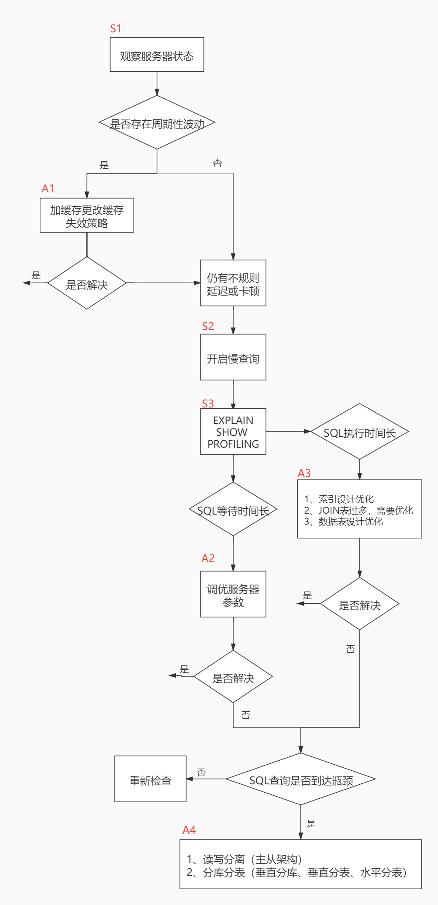


**小结：**


## 2. 查看系统性能参数 

在MySQL中，可以使用`SHOW STATUS`语句查询一些MySQL数据库服务器的`性能参数`、`执行频率`。 

SHOW STATUS语句语法如下：

```mysql
SHOW [GLOBAL|SESSION] STATUS LIKE'参数';
```


一些常用的性能参数如下： 

- Connections：连接MySQL服务器的次数。 
- Uptime：MySQL服务器的上线时间。
- Slow_queries：慢查询的次数。 
- Innodb_rows_read：Select查询返回的行数
- Innodb_rows_inserted：执行INSERT操作插入的行数 
- Innodb_rows_updated：执行UPDATE操作更新的行数 
- Innodb_rows_deleted：执行DELETE操作删除的行数 
- Com_select：查询操作的次数。 
- Com_insert：插入操作的次数。对于批量插入的 INSERT 操作，只累加一次。 
- Com_update：更新操作的次数。 
- Com_delete：删除操作的次数。

## 3. 统计SQL的查询成本：last_query_cost 

我们依然使用第8章的 student_info 表为例：

```mysql
CREATE TABLE `student_info` (
`id` INT(11) NOT NULL AUTO_INCREMENT,
`student_id` INT NOT NULL ,
`name` VARCHAR(20) DEFAULT NULL, `course_id` INT NOT NULL ,
`class_id` INT(11) DEFAULT NULL,
`create_time` DATETIME DEFAULT CURRENT_TIMESTAMP ON UPDATE CURRENT_TIMESTAMP,
PRIMARY KEY (`id`)
) ENGINE=INNODB AUTO_INCREMENT=1 DEFAULT CHARSET=utf8;
```


如果我们想要查询 id=900001 的记录，然后看下查询成本，我们可以直接在聚簇索引上进行查找：

```mysql
SELECT student_id, class_id, NAME, create_time FROM student_info WHERE id BETWEEN 900001 AND 900100;
```

运行结果（100 条记录，运行时间为 `0.046s`）

然后再看下查询优化器的成本，实际上我们只需要检索一个页即可：

```mysql
mysql> SHOW STATUS LIKE 'last_query_cost';
+-----------------+----------+
| Variable_name | Value |
+-----------------+----------+
| Last_query_cost | 1.000000 |
+-----------------+----------+
```

如果我们想要查询 id 在 900001 到 9000100 之间的学生记录呢？  

```mysql
SELECT student_id, class_id, NAME, create_time FROM student_info
WHERE id BETWEEN 900001 AND 900100;
```

运行结果（100 条记录，运行时间为 `0.046s` ）  

然后再看下查询优化器的成本，这时我们大概需要进行 20 个页的查询。

```mysql
mysql> SHOW STATUS LIKE 'last_query_cost';
+-----------------+-----------+
| Variable_name   |   Value   |
+-----------------+-----------+
| Last_query_cost | 21.134453 |
+-----------------+-----------+
```

你能看到页的数量是刚才的 20 倍，但是查询的效率并没有明显的变化，实际上这两个 SQL 查询的时间基本上一样，就是因为采用了顺序读取的方式将页面一次性加载到缓冲池中，然后再进行查找。虽然`页数量（last_query_cost）增加了不少`，但是通过缓冲池的机制，并没有增加多少查询时间。

**使用场景：**它对于比较开销是非常有用的，特别是我们有好几种查询方式可选的时候。


## 4.定位执行慢的 SQL：慢查询日志  

### 4.1 开启慢查询日志参数

**1.开启slow_query_log**

```mysql
mysql > set global slow_query_log='ON';
```


然后我们再来查看下慢查询日志是否开启，以及慢查询日志文件的位置：

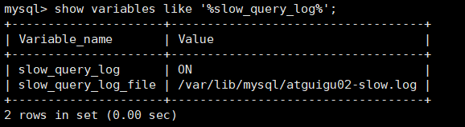

你能看到这时慢查询分析已经开启，同时文件保存在 `/var/lib/mysql/atguigu02-slow.log` 文件
中。


**2. 修改long_query_time阈值**

接下来我们来看下慢查询的时间阈值设置，使用如下命令：

```mysql
mysql > show variables like '%long_query_time%';
```

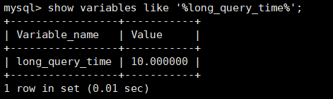

```mysql
# 测试发现：设置global的方式对当前session的long_query_time失效。对新连接的客户端有效。所以可以一并执行下述语句

mysql > set global long_query_time = 1;
mysql> show global variables like '%long_query_time%';
mysql> set long_query_time=1;
mysql> show variables like '%long_query_time%';  
```


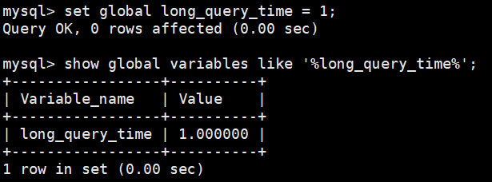

### 4.2 查看慢查询数目

查询当前系统中有多少条慢查询记录  

```mysql
SHOW GLOBAL STATUS LIKE '%Slow_queries%';
```


### 4.3 案例演示  

**步骤1. 建表**  

```mysql
CREATE TABLE `student` (
`id` INT(11) NOT NULL AUTO_INCREMENT,
`stuno` INT NOT NULL ,
`name` VARCHAR(20) DEFAULT NULL,
`age` INT(3) DEFAULT NULL,
`classId` INT(11) DEFAULT NULL,
PRIMARY KEY (`id`)
) ENGINE=INNODB AUTO_INCREMENT=1 DEFAULT CHARSET=utf8;
```


**步骤2：设置参数 log_bin_trust_function_creators**  

创建函数，假如报错：

```mysql
This function has none of DETERMINISTIC......
```

命令开启：允许创建函数设置：

```mysql
set global log_bin_trust_function_creators=1; # 不加global只是当前窗口有效。
```

**步骤3：创建函数**

随机产生字符串：（同上一章）

```mysql
DELIMITER //
CREATE FUNCTION rand_string(n INT)
	RETURNS VARCHAR(255) #该函数会返回一个字符串
BEGIN
    DECLARE chars_str VARCHAR(100) DEFAULT
    'abcdefghijklmnopqrstuvwxyzABCDEFJHIJKLMNOPQRSTUVWXYZ';
    DECLARE return_str VARCHAR(255) DEFAULT '';
    DECLARE i INT DEFAULT 0;
	WHILE i < n DO
        SET return_str =CONCAT(return_str,SUBSTRING(chars_str,FLOOR(1+RAND()*52),1));
        SET i = i + 1;
	END WHILE;
	RETURN return_str;
END //
DELIMITER ;

```

产生随机数值：（同上一章）

```mysql
#测试
SELECT rand_string(10);

DELIMITER //
CREATE FUNCTION rand_num (from_num INT ,to_num INT) RETURNS INT(11)
BEGIN
DECLARE i INT DEFAULT 0;
SET i = FLOOR(from_num +RAND()*(to_num - from_num+1)) ;
RETURN i;
END //
DELIMITER ;

#测试：
SELECT rand_num(10,100);
```

**步骤4：创建存储过程**

```mysql
DELIMITER //
CREATE PROCEDURE insert_stu1( START INT , max_num INT )
BEGIN
DECLARE i INT DEFAULT 0;
    SET autocommit = 0; #设置手动提交事务
    REPEAT #循环
    SET i = i + 1; #赋值
    INSERT INTO student (stuno, NAME ,age ,classId ) VALUES
    ((START+i),rand_string(6),rand_num(10,100),rand_num(10,1000));
    UNTIL i = max_num
    END REPEAT;
    COMMIT; #提交事务
END //

DELIMITER ;
```

**步骤5：调用存储过程**

```mysql
#调用刚刚写好的函数, 4000000条记录,从100001号开始

CALL insert_stu1(100001,4000000);
```

### 4.4 测试及分析

**1.测试**

```mysql
mysql> SELECT * FROM student WHERE stuno = 3455655;
+---------+---------+--------+------+---------+
|    id   |  stuno  |  name  |  age | classId |
+---------+---------+--------+------+---------+
| 3523633 | 3455655 | oQmLUr |  19  |    39   |
+---------+---------+--------+------+---------+
1 row in set (2.09 sec)

mysql> SELECT * FROM student WHERE name = 'oQmLUr';
+---------+---------+--------+------+---------+
|    id   |  stuno  |  name  |  age | classId |
+---------+---------+--------+------+---------+
| 1154002 | 1243200 | OQMlUR |  266 |   28    |
| 1405708 | 1437740 | OQMlUR |  245 |   439   |
| 1748070 | 1680092 | OQMlUR |  240 |   414   |
| 2119892 | 2051914 | oQmLUr |  17  |   32    |
| 2893154 | 2825176 | OQMlUR |  245 |   435   |
| 3523633 | 3455655 | oQmLUr |  19  |   39    |
+---------+---------+--------+------+---------+

6 rows in set (2.39 sec)
```

从上面的结果可以看出来，查询学生编号为“3455655”的学生信息花费时间为2.09秒。查询学生姓名为“oQmLUr”的学生信息花费时间为2.39秒。已经达到了秒的数量级，说明目前查询效率是比较低的，下面
的小节我们分析一下原因  。

**2.分析**

```mysql	
show status like 'slow_queries';
```

### 4.5 慢查询日志分析工具：mysqldumpslow

在生产环境中，如果要手工分析日志，查找、分析SQL，显然是个体力活，MySQL提供了日志分析工具`mysqldumpslow` 。

查看mysqldumpslow的帮助信息  

```mysql	
mysqldumpslow --help
```


mysqldumpslow 命令的具体参数如下：

- -a: 不将数字抽象成N，字符串抽象成S
- **-s: 是表示按照何种方式排序：**
  - c: 访问次数
  - l: 锁定时间
  - r: 返回记录
  - **t: 查询时间**
  - al:平均锁定时间
  - ar:平均返回记录数
  - at:平均查询时间 （默认方式）
  - ac:平均查询次数
- **-t: 即为返回前面多少条的数据；**  
- **-g: 后边搭配一个正则匹配模式，大小写不敏感的**  

举例：我们想要按照查询时间排序，查看前五条 SQL 语句，这样写即可：  


```mysql	
mysqldumpslow -s t -t 5 /var/lib/mysql/atguigu01-slow.log
```


```mysql	
[root@bogon ~]# mysqldumpslow -s t -t 5 /var/lib/mysql/atguigu01-slow.log

Reading mysql slow query log from /var/lib/mysql/atguigu01-slow.log
Count: 1 Time=2.39s (2s) Lock=0.00s (0s) Rows=13.0 (13), root[root]@localhost
	SELECT * FROM student WHERE name = 'S'

Count: 1 Time=2.09s (2s) Lock=0.00s (0s) Rows=2.0 (2), root[root]@localhost
	SELECT * FROM student WHERE stuno = N
	
Died at /usr/bin/mysqldumpslow line 162, <> chunk 2.
```

**工作常用参考：**

```mysql
#得到返回记录集最多的10个SQL
mysqldumpslow -s r -t 10 /var/lib/mysql/atguigu-slow.log

#得到访问次数最多的10个SQL
mysqldumpslow -s c -t 10 /var/lib/mysql/atguigu-slow.log

#得到按照时间排序的前10条里面含有左连接的查询语句
mysqldumpslow -s t -t 10 -g "left join" /var/lib/mysql/atguigu-slow.log

#另外建议在使用这些命令时结合 | 和more 使用 ，否则有可能出现爆屏情况
mysqldumpslow -s r -t 10 /var/lib/mysql/atguigu-slow.log | more
```


### 4.6 关闭慢查询日志  

MySQL服务器停止慢查询日志功能有两种方法：

**方式1：永久性方式**

```mysql
[mysqld]
slow_query_log=OFF
```

或者，把slow_query_log一项注释掉 或 删除

```mysql
mysqld]
#slow_query_log =OFF
```


重启MySQL服务，执行如下语句查询慢日志功能。

```mysql
SHOW VARIABLES LIKE '%slow%'; #查询慢查询日志所在目录
SHOW VARIABLES LIKE '%long_query_time%'; #查询超时时长
```


**方式2：临时性方式**  

使用SET语句来设置。 （1）停止MySQL慢查询日志功能，具体SQL语句如下。  

```mysql
SET GLOBAL slow_query_log=off;
```


（2）**重启MySQL服务**，使用SHOW语句查询慢查询日志功能信息，具体SQL语句如下

```mysql
SHOW VARIABLES LIKE '%slow%';
#以及
SHOW VARIABLES LIKE '%long_query_time%';
```

### 4.7 删除慢查询日志


## 5. 查看 SQL 执行成本：SHOW PROFILE


```mysql
mysql> show variables like 'profiling';
+---------------+-------+
| Variable_name | Value |
+---------------+-------+
| profiling     | OFF   |
+---------------+-------+
1 row in set (0.34 sec)
```


通过设置 profiling='ON’ 来开启 show profile：  


```mysql
mysql> set profiling = 'ON';
Query OK, 0 rows affected, 1 warning (0.06 sec)

mysql> show variables like 'profiling';
+---------------+-------+
| Variable_name | Value |
+---------------+-------+
| profiling     | ON    |
+---------------+-------+
1 row in set (0.13 sec)
```

然后执行相关的查询语句。接着看下当前会话都有哪些 profiles，使用下面这条命令：  

```mysql
mysql> show profiles;
+----------+------------+-------------------------------------+
| Query_ID | Duration   | Query                               |
+----------+------------+-------------------------------------+
|        1 | 0.13515975 | show variables like 'profiling'     |
|        2 | 0.06386950 | select * from student_info limit 10 |
+----------+------------+-------------------------------------+
2 rows in set, 1 warning (0.01 sec)

```

你能看到当前会话一共有 2 个查询。如果我们想要查看最近一次查询的开销，可以使用：

```mysql

mysql> show profile;
+--------------------------------+----------+
| Status                         | Duration |
+--------------------------------+----------+
| starting                       | 0.029330 |
| Executing hook on transaction  | 0.001174 |
| starting                       | 0.002804 |
| checking permissions           | 0.002918 |
| Opening tables                 | 0.009026 |
| init                           | 0.001605 |
| System lock                    | 0.000503 |
| optimizing                     | 0.000013 |
| statistics                     | 0.007651 |
| preparing                      | 0.000084 |
| executing                      | 0.005307 |
| end                            | 0.000017 |
| query end                      | 0.000178 |
| waiting for handler commit     | 0.000028 |
| closing tables                 | 0.001087 |
| freeing items                  | 0.000399 |
| cleaning up                    | 0.001748 |
+--------------------------------+----------+
17 rows in set, 1 warning (0.04 sec)

```


```mysql
mysql> show profile cpu,block io for query 2;
+--------------------------------+----------+----------+------------+--------------+---------------+
| Status                         | Duration | CPU_user | CPU_system | Block_ops_in | Block_ops_out |
+--------------------------------+----------+----------+------------+--------------+---------------+
| starting                       | 0.029330 | 0.017180 |   0.000000 |        49712 |             0 |
| Executing hook on transaction  | 0.001174 | 0.001079 |   0.000000 |         3624 |             0 |
| starting                       | 0.002804 | 0.002169 |   0.000000 |         4728 |             0 |
| checking permissions           | 0.002918 | 0.002437 |   0.000000 |         8168 |             0 |
| Opening tables                 | 0.009026 | 0.005841 |   0.000000 |        14120 |             0 |
| init                           | 0.001605 | 0.000392 |   0.000000 |           80 |             0 |
| System lock                    | 0.000503 | 0.000130 |   0.000000 |           24 |             0 |
| optimizing                     | 0.000013 | 0.000010 |   0.000000 |            0 |             0 |
| statistics                     | 0.007651 | 0.003072 |   0.000000 |         4160 |             0 |
| preparing                      | 0.000084 | 0.000071 |   0.000000 |            0 |             0 |
| executing                      | 0.005307 | 0.001609 |   0.000000 |          568 |             0 |
| end                            | 0.000017 | 0.000011 |   0.000000 |            0 |             0 |
| query end                      | 0.000178 | 0.000047 |   0.000000 |            8 |             0 |
| waiting for handler commit     | 0.000028 | 0.000025 |   0.000000 |            0 |             0 |
| closing tables                 | 0.001087 | 0.000279 |   0.000000 |           56 |             0 |
| freeing items                  | 0.000399 | 0.000259 |   0.000000 |            8 |             0 |
| cleaning up                    | 0.001748 | 0.000381 |   0.000000 |           56 |             0 |
+--------------------------------+----------+----------+------------+--------------+---------------+
17 rows in set, 1 warning (0.01 sec)
```

**show profile的常用查询参数：**

① ALL：显示所有的开销信息。 

② BLOCK IO：显示块IO开销。 

③ CONTEXT SWITCHES：上下文切换开销。 

④ CPU：显示CPU开销信息。 

⑤ IPC：显示发送和接收开销信息。 

⑥ MEMORY：显示内存开销信息。 

⑦ PAGE FAULTS：显示页面错误开销信息。 

⑧ SOURCE：显示和Source_function，Source_file，Source_line相关的开销信息。 

⑨ SWAPS：显示交换次数开销信息。  

## 6. 分析查询语句：EXPLAIN

### 6.1 概述

官网介绍

https://dev.mysql.com/doc/refman/5.7/en/explain-output.html
https://dev.mysql.com/doc/refman/8.0/en/explain-output.html  

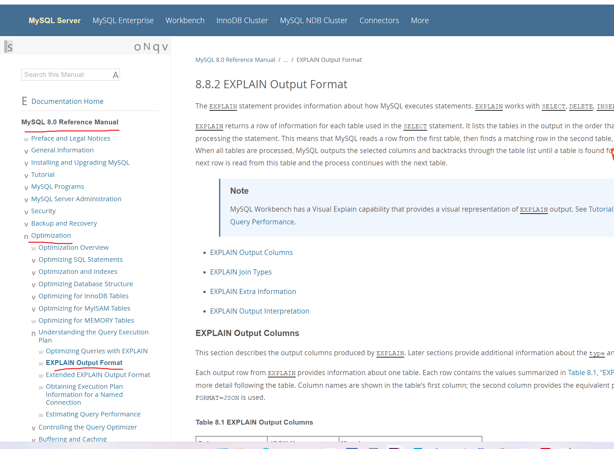


**版本情况**

- MySQL 5.6.3以前只能 EXPLAIN SELECT ；MYSQL 5.6.3以后就可以 `EXPLAIN` `SELECT`，`UPDATE`，`DELETE`
- 在5.7以前的版本中，想要显示 `partitions` 需要使用 `explain partitions` 命令；想要显示`filtered` 需要使用 `explain extended` 命令。在5.7版本后，默认explain直接显示partitions和filtered中的信息。  

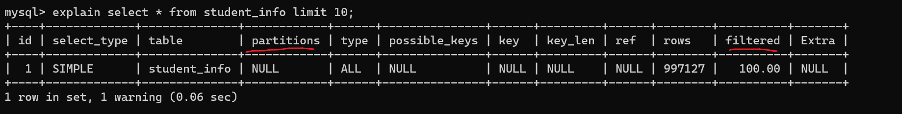


### 6.2 基本语法

EXPLAIN 或 DESCRIBE语句的语法形式如下：

```mysql
EXPLAIN SELECT select_options
或者
DESCRIBE SELECT select_options
```


如果我们想看看某个查询的执行计划的话，可以在具体的查询语句前边加一个 `EXPLAIN` ，就像这样：

```mysql
mysql> EXPLAIN SELECT 1;
```

`EXPLAIN` 语句输出的各个列的作用如下  

| 列名          | 描述                                                    |
| ------------- | ------------------------------------------------------- |
| id            | 在一个大的查询语句中每个SELECT关键字都对应一个 唯一的id |
| select_type   | SELECT关键字对应的那个查询的类型                        |
| table         | 表名                                                    |
| partitions    | 匹配的分区信息                                          |
| type          | 针对单表的访问方法                                      |
| possible_keys | 可能用到的索引                                          |
| key           | 实际上使用的索引                                        |
| key_len       | 实际使用到的索引长度                                    |
| ref           | 当使用索引列等值查询时，与索引列进行等值匹配的对象信息  |
| rows          | 预估的需要读取的记录条数                                |
| filtered      | 某个表经过搜索条件过滤后剩余记录条数的百分比            |
| Extra         | 一些额外的信息                                          |

### 6.3 数据准备  

**1.建表**

```mysql
CREATE TABLE s1 (
	id INT AUTO_INCREMENT,
	key1 VARCHAR(100),
	key2 INT,
	key3 VARCHAR(100),
	key_part1 VARCHAR(100),
	key_part2 VARCHAR(100),
	key_part3 VARCHAR(100),
	common_field VARCHAR(100),
	PRIMARY KEY (id),
	INDEX idx_key1 (key1),
	UNIQUE INDEX idx_key2 (key2),
	INDEX idx_key3 (key3),
	INDEX idx_key_part(key_part1, key_part2, key_part3)
) ENGINE=INNODB CHARSET=utf8;
```


```mysql
CREATE TABLE s2 (
    id INT AUTO_INCREMENT,
    key1 VARCHAR(100),
    key2 INT,
    key3 VARCHAR(100),
    key_part1 VARCHAR(100),
    key_part2 VARCHAR(100),
    key_part3 VARCHAR(100),
    common_field VARCHAR(100),
    PRIMARY KEY (id),
    INDEX idx_key1 (key1),
    UNIQUE INDEX idx_key2 (key2),
    INDEX idx_key3 (key3),
	INDEX idx_key_part(key_part1, key_part2, key_part3)
) ENGINE=INNODB CHARSET=utf8;
```


**2. 设置参数 log_bin_trust_function_creators**

创建函数，假如报错，需开启如下命令：允许创建函数设置：

```mysql
set global log_bin_trust_function_creators=1; # 不加global只是当前窗口有效。
```

**3. 创建函数**

```mysql
DELIMITER //
CREATE FUNCTION rand_string1 ( n INT ) 
	RETURNS VARCHAR ( 255 ) #该函数会返回一个字符串
BEGIN
	DECLARE
		chars_str VARCHAR ( 100 ) DEFAULT 'abcdefghijklmnopqrstuvwxyzABCDEFJHIJKLMNOPQRSTUVWXYZ';
	DECLARE
		return_str VARCHAR ( 255 ) DEFAULT '';
	DECLARE
		i INT DEFAULT 0;
	WHILE
			i < n DO
			
			SET return_str = CONCAT(
				return_str,
			SUBSTRING( chars_str, FLOOR( 1+RAND ()* 52 ), 1 ));
		
		SET i = i + 1;
		
	END WHILE;
	RETURN return_str;
	
END // 
DELIMITER;
```


**4. 创建存储过程**

创建往s1表中插入数据的存储过程：  

```mysql
DELIMITER //
CREATE PROCEDURE insert_s1 (IN min_num INT (10),IN max_num INT (10))
BEGIN
    DECLARE i INT DEFAULT 0;
    SET autocommit = 0;
    REPEAT
    SET i = i + 1;
    INSERT INTO s1 VALUES(
    (min_num + i),
    rand_string1(6),
    (min_num + 30 * i + 5),
    rand_string1(6),
    rand_string1(10),
    rand_string1(5),
    rand_string1(10),
    rand_string1(10));
    UNTIL i = max_num
    END REPEAT;
    COMMIT;
END //
DELIMITER ;
```

创建往s2表中插入数据的存储过程：  


```mysql
DELIMITER //
CREATE PROCEDURE insert_s2 (
	IN min_num INT ( 10 ),
	IN max_num INT ( 10 )) BEGIN
	DECLARE i INT DEFAULT 0;
	SET autocommit = 0;
	REPEAT
 	SET i = i + 1;
		INSERT INTO s2 VALUES(
				( min_num + i ),
				rand_string1 ( 6 ),
				( min_num + 30 * i + 5 ),
				rand_string1 ( 6 ),
				rand_string1 ( 10 ),
				rand_string1 ( 5 ),
				rand_string1 ( 10 ),
				rand_string1 ( 10 ));
		UNTIL i = max_num 
	END REPEAT;
	COMMIT;
	
END // 
DELIMITER;
```


**5. 调用存储过程**

s1表数据的添加：加入1万条记录：

```mysql
CALL insert_s1(10001,10000);
```

s2表数据的添加：加入1万条记录：

```mysql
CALL insert_s2(10001,10000);
```

### 6.4 EXPLAIN各列作用

为了让大家有比较好的体验，我们调整了下 `EXPLAIN` 输出列的顺序。

#### 1. table

不论我们的查询语句有多复杂，里边儿 `包含了多少个表` ，到最后也是需要对每个表进行 `单表访问` 的，所
以MySQL规定**EXPLAIN语句输出的每条记录都对应着某个单表的访问方法**，该条记录的table列代表着该
表的表名（有时不是真实的表名字，可能是简称）  


#### 2. id

我们写的查询语句一般都以 SELECT 关键字开头，比较简单的查询语句里只有一个 SELECT 关键字，比
如下边这个查询语句：  


```mysql
SELECT * FROM s1 WHERE key1 = 'a';
```

稍微复杂一点的连接查询中也只有一个 SELECT 关键字，比如：

```mysql
SELECT * FROM s1 INNER JOIN s2
ON s1.key1 = s2.key1
WHERE s1.common_field = 'a';
```

```mysql
mysql> EXPLAIN SELECT * FROM s1 WHERE key1 = 'a';
```

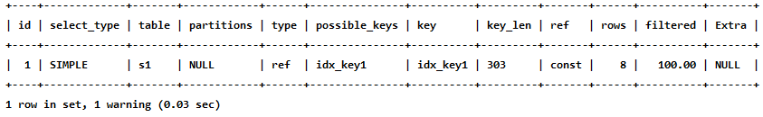


```mysql
mysql> EXPLAIN SELECT * FROM s1 INNER JOIN s2;
```

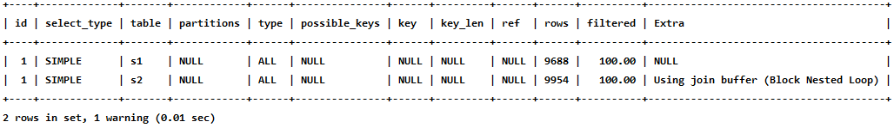


```mysql
mysql> EXPLAIN SELECT * FROM s1 WHERE key1 IN (SELECT key1 FROM s2) OR key3 = 'a';
```

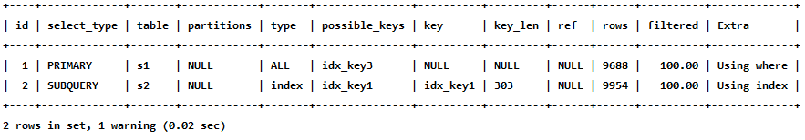

```mysql
mysql> EXPLAIN SELECT * FROM s1 WHERE key1 IN (SELECT key2 FROM s2 WHERE common_field
= 'a')
```


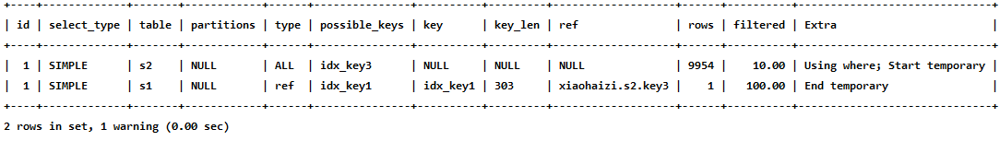

```mysql
mysql> EXPLAIN SELECT * FROM s1 UNION SELECT * FROM s2;

```

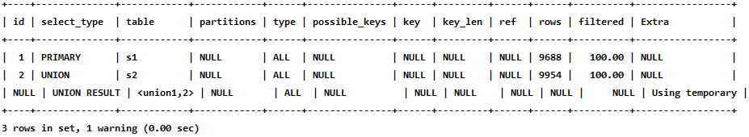


```mysql
mysql> EXPLAIN SELECT * FROM s1 UNION ALL SELECT * FROM s2;
```

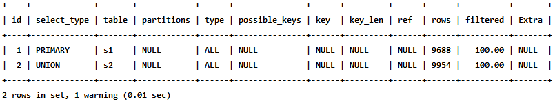

**小结:**  

- id如果相同，可以认为是一组，从上往下顺序执行
- 在所有组中，id值越大，优先级越高，越先执行
- 关注点：id号每个号码，表示一趟独立的查询, 一个sql的查询趟数越少越好  

#### 3. select_type  

| 名称                     | 描述                                                         |
| ------------------------ | ------------------------------------------------------------ |
| SIMPLE                   | Simple  SELECT (not using UNION or subqueries)               |
| PRIMARY                  | Outermost  SELECT                                            |
| UNION                    | Second  or later SELECT statement in a UNION                 |
| UNION RESULT             | Result  of a UNION                                           |
| SUBQUERY                 | First  SELECT in subquery                                    |
| DEPENDENT     SUBQUERY   | First  SELECT in subquery, dependent on outer query          |
| DEPENDENT     UNION      | Second  or later SELECT statement in a UNION, dependent on outer query |
| DERIVED                  | Derived  table                                               |
| MATERIALIZED             | Materialized  subquery                                       |
| UNCACHEABLE     SUBQUERY | A  subquery for which the result cannot be cached and must be re-evaluated  for     each row of the outer query |
| UNCACHEABLE     UNION    | The  second or later select in a UNION that belongs to an uncacheable  subquery     (see UNCACHEABLE SUBQUERY) |

```mysql

```


#### 4. partitions (可略)

如果想详细了解，可以如下方式测试。创建分区表：  


```mysql
-- 创建分区表，
-- 按照id分区，id<100 p0分区，其他p1分区
CREATE TABLE user_partitions (
    id INT auto_increment,
    NAME VARCHAR(12),PRIMARY KEY(id))
    PARTITION BY RANGE(id)(
    PARTITION p0 VALUES less than(100),
    PARTITION p1 VALUES less than MAXVALUE
);
```


```mysql
DESC SELECT * FROM user_partitions WHERE id>200;
```

查询id大于200（200>100，p1分区）的记录，查看执行计划，partitions是p1，符合我们的分区规则

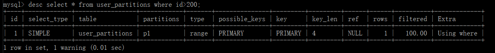

#### 5. type ☆

完整的访问方法如下： `system` ， `const` ， `eq_ref` ， `ref` ， `fulltext` ， `ref_or_null` ，`index_merge` ， `unique_subquery` ， `index_subquery` ， `range` ， `index` ， `ALL` 。

我们详细解释一下：

- `system`  

```mysql
mysql> CREATE TABLE t(i int) Engine=MyISAM;
Query OK, 0 rows affected (0.05 sec)

mysql> INSERT INTO t VALUES(1);
Query OK, 1 row affected (0.01 sec)
```

然后我们看一下查询这个表的执行计划：

```mysql
mysql> EXPLAIN SELECT * FROM t;
```


- `const`

```mysql
mysql> EXPLAIN SELECT * FROM s1 WHERE id = 10005;
```


- `eq_ref`

```mysql
mysql> EXPLAIN SELECT * FROM s1 INNER JOIN s2 ON s1.id = s2.id;
```

从执行计划的结果中可以看出，MySQL打算将s2作为驱动表，s1作为被驱动表，重点关注s1的访问
方法是 `eq_ref` ，表明在访问s1表的时候可以 `通过主键的等值匹配` 来进行访问。  


- `ref`

```mysql
mysql> EXPLAIN SELECT * FROM s1 WHERE key1 = 'a';		
```


- `fulltext`

  全文索引

- `ref_or_null`


```mysql
mysql> EXPLAIN SELECT * FROM s1 WHERE key1 = 'a' OR key1 IS NULL;
```


- `index_merge`


```mysql
mysql> EXPLAIN SELECT * FROM s1 WHERE key1 = 'a' OR key3 = 'a';
```


从执行计划的 `type` 列的值是 `index_merge` 就可以看出，MySQL 打算使用索引合并的方式来执行
对 `s1` 表的查询。  

- `unique_subquery`


```mysql
mysql> EXPLAIN SELECT * FROM s1 WHERE key2 IN (SELECT id FROM s2 where s1.key1 =
s2.key1) OR key3 = 'a';
```


- `index_subquery`


```mysql
mysql> EXPLAIN SELECT * FROM s1 WHERE common_field IN (SELECT key3 FROM s2 where
s1.key1 = s2.key1) OR key3 = 'a';
```


- `range`


```mysql
mysql> EXPLAIN SELECT * FROM s1 WHERE key1 IN ('a', 'b', 'c');
```


​	或者


```mysql
mysql> EXPLAIN SELECT * FROM s1 WHERE key1 > 'a' AND key1 < 'b';
```


- `index`


```mysql
mysql> EXPLAIN SELECT key_part2 FROM s1 WHERE key_part3 = 'a';			
```


- `ALL`


```mysql
mysql> EXPLAIN SELECT * FROM s1;
```


**小结:**

**结果值从最好到最坏依次是： system > const > eq_ref > ref > fulltext > ref_or_null > index_merge >
unique_subquery > index_subquery > range > index > ALL 其中比较重要的几个提取出来（见上图中的蓝色）。SQL 性能优化的目标：至少要达到 range 级别，要求是 ref 级别，最好是 consts级别。（阿里巴巴
开发手册要求）**  


**6. possible_keys和key**


```mysql
mysql> EXPLAIN SELECT * FROM s1 WHERE key1 > 'z' AND key3 = 'a';
```


**7. key_len ☆**


```mysql
mysql> EXPLAIN SELECT * FROM s1 WHERE id = 10005;
```


```mysql
mysql> EXPLAIN SELECT * FROM s1 WHERE key2 = 10126;
```


```mysql
mysql> EXPLAIN SELECT * FROM s1 WHERE key1 = 'a';
```


```mysql
mysql> EXPLAIN SELECT * FROM s1 WHERE key_part1 = 'a';
```


```mysql
mysql> EXPLAIN SELECT * FROM s1 WHERE key_part1 = 'a' AND key_part2 = 'b';
```


**练习：**

**key_len的长度计算公式：**  


```mysql
varchar(10)变长字段且允许NULL = 10 * ( character set：
utf8=3,gbk=2,latin1=1)+1(NULL)+2(变长字段)

varchar(10)变长字段且不允许NULL = 10 * ( character set：utf8=3,gbk=2,latin1=1)+2(变长字段)

char(10)固定字段且允许NULL = 10 * ( character set：utf8=3,gbk=2,latin1=1)+1(NULL)

char(10)固定字段且不允许NULL = 10 * ( character set：utf8=3,gbk=2,latin1=1)
```


#### 8. ref


```mysql
mysql> EXPLAIN SELECT * FROM s1 WHERE key1 = 'a';
```


```mysql
mysql> EXPLAIN SELECT * FROM s1 INNER JOIN s2 ON s1.id = s2.id;
```


```mysql
mysql> EXPLAIN SELECT * FROM s1 INNER JOIN s2 ON s2.key1 = UPPER(s1.key1);
```


#### 9. rows ☆


```mysql
mysql> EXPLAIN SELECT * FROM s1 WHERE key1 > 'z';
```


#### 10. filtered


```mysql
mysql> EXPLAIN SELECT * FROM s1 WHERE key1 > 'z' AND common_field = 'a';
```


```mysql
mysql> EXPLAIN SELECT * FROM s1 INNER JOIN s2 ON s1.key1 = s2.key1 WHERE
s1.common_field = 'a';
```


#### 11. Extra ☆


```mysql
mysql> EXPLAIN SELECT 1;
```

- Impossible WHERE

```mysql
mysql> EXPLAIN SELECT * FROM s1 WHERE 1 != 1;

```


- Using where

  


```mysql
mysql> EXPLAIN SELECT * FROM s1 WHERE common_field = 'a';
```


```mysql
mysql> EXPLAIN SELECT * FROM s1 WHERE key1 = 'a' AND common_field = 'a';
```


- `No matching min/max row`


```mysql
mysql> EXPLAIN SELECT MIN(key1) FROM s1 WHERE key1 = 'abcdefg';

```

- `Using index`


```mysql
mysql> EXPLAIN SELECT key1 FROM s1 WHERE key1 = 'a';
```


- `Using index condition`


```mysql
SELECT * FROM s1 WHERE key1 > 'z' AND key1 LIKE '%a';
mysql> EXPLAIN SELECT * FROM s1 WHERE key1 > 'z' AND key1 LIKE '%b';

```

- `Using join buffer (Block Nested Loop)`  

```mysql
mysql> EXPLAIN SELECT * FROM s1 INNER JOIN s2 ON s1.common_field =
s2.common_field;
```


- `Not exists`
- `Using intersect(...) 、 Using union(...) 和 Using sort_union(...)`  
- `Zero limit`
- `Using filesort`
- `Using temporary`  


#### 12. 小结

- EXPLAIN不考虑各种Cache
- EXPLAIN不能显示MySQL在执行查询时所作的优化工作
- EXPLAIN不会告诉你关于触发器、存储过程的信息或用户自定义函数对查询的影响情况
- 部分统计信息是估算的，并非精确值  


```mysql

```


```mysql

```


```mysql

```


```mysql

```


```mysql

```