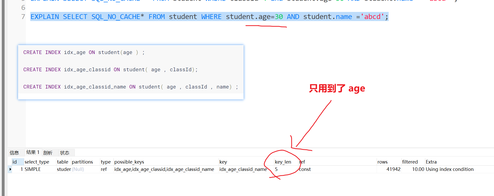
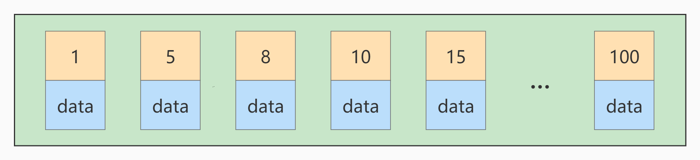
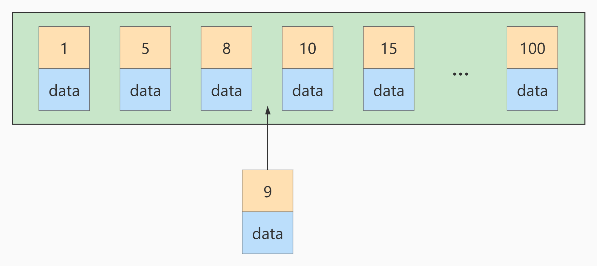
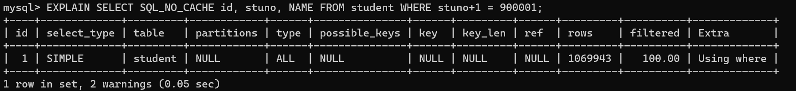
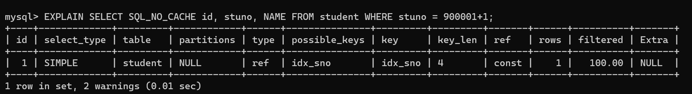
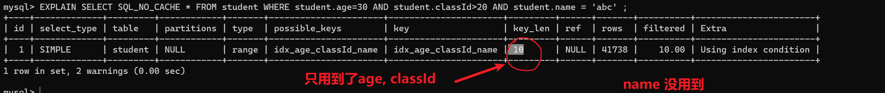
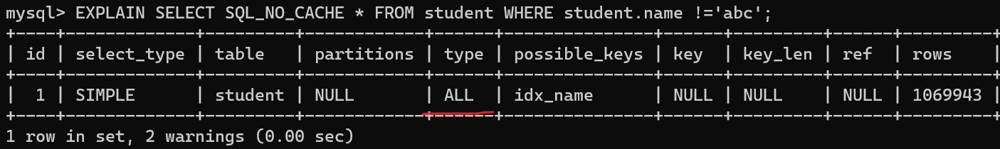
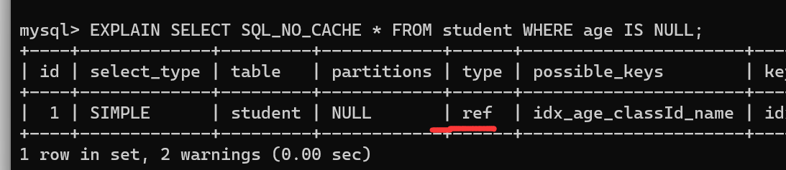
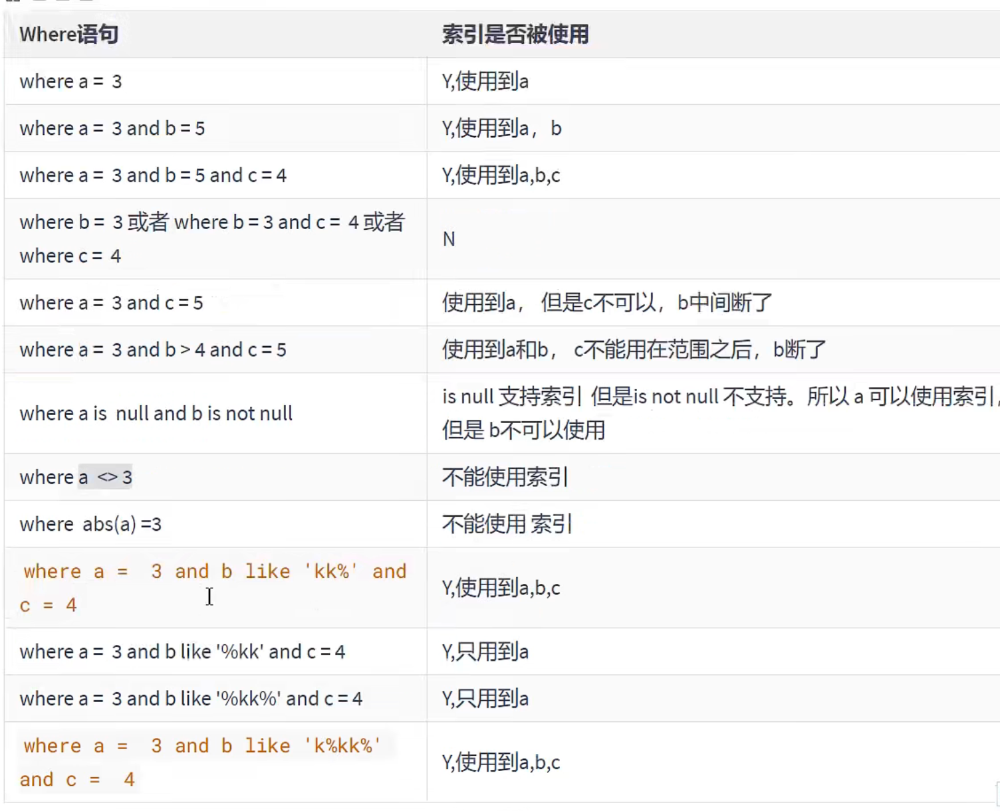

# 第10章_索引优化与查询优化  

都有哪些维度可以进行数据库调优?简言之:

- 索引失效、没有充分利用到索引——索引建立
- 关联查询太多JOIN (设计缺陷或不得已的需求)——SQL优化
- 服务器调优及各个参数设置(缓冲、线程数等)———调整my.cnf。
- 数据过多――分库分表

关于数据库调优的知识点非常分散。不同的DBMS，不同的公司，不同的职位，不同的项目遇到的问题都不尽相同。这里我们分为三个章节进行细致讲解。

虽然SQL查询优化的技术有很多，但是大方向上完全可以分成`物理查询优化`和`逻辑查询优化`两大块。

- 物理查询优化是通过`索引`和`表连接方式`等技术来进行优化，这里重点需要掌握索引的使用。
- 逻辑查询优化就是通过SQL`等价变换`提升查询效率，直白一点就是说，换一种查询写法执行效率可能更高。

## 1. 数据准备

学员表 插 50万 条， 班级表 插 1万 条。

**步骤1：建表**  

```mysql
CREATE TABLE `class` (
`id` INT(11) NOT NULL AUTO_INCREMENT,
`className` VARCHAR(30) DEFAULT NULL,
`address` VARCHAR(40) DEFAULT NULL,
`monitor` INT NULL ,
PRIMARY KEY (`id`)
) ENGINE=INNODB AUTO_INCREMENT=1 DEFAULT CHARSET=utf8;

CREATE TABLE `student` (
`id` INT(11) NOT NULL AUTO_INCREMENT,
`stuno` INT NOT NULL ,
`name` VARCHAR(20) DEFAULT NULL,
`age` INT(3) DEFAULT NULL,
`classId` INT(11) DEFAULT NULL,
PRIMARY KEY (`id`)
#CONSTRAINT `fk_class_id` FOREIGN KEY (`classId`) REFERENCES `t_class` (`id`)
) ENGINE=INNODB AUTO_INCREMENT=1 DEFAULT CHARSET=utf8;
```

**步骤2：设置参数**
命令开启：允许创建函数设置  :

```mysql
set global log_bin_trust_function_creators=1; # 不加global只是当前窗口有效。  
```

**步骤3：创建函数**
保证每条数据都不同  

```mysql
#随机产生字符串
DELIMITER //
CREATE FUNCTION rand_string(n INT) RETURNS VARCHAR(255)
BEGIN
DECLARE chars_str VARCHAR(100) DEFAULT
'abcdefghijklmnopqrstuvwxyzABCDEFJHIJKLMNOPQRSTUVWXYZ';
DECLARE return_str VARCHAR(255) DEFAULT '';
DECLARE i INT DEFAULT 0;
WHILE i < n DO
SET return_str =CONCAT(return_str,SUBSTRING(chars_str,FLOOR(1+RAND()*52),1));
SET i = i + 1;
END WHILE;
RETURN return_str;
END //
DELIMITER ;
#假如要删除
#drop function rand_string;
```

随机产生班级编号  

```mysql
#用于随机产生多少到多少的编号
DELIMITER //
CREATE FUNCTION rand_num (from_num INT ,to_num INT) RETURNS INT(11)
BEGIN
DECLARE i INT DEFAULT 0;
SET i = FLOOR(from_num +RAND()*(to_num - from_num+1)) ;
RETURN i;
END //
DELIMITER ;

#假如要删除
#drop function rand_num;
```

**步骤4：创建存储过程**  

```mysql
#创建往stu表中插入数据的存储过程
DELIMITER //
CREATE PROCEDURE insert_stu( START INT , max_num INT )
BEGIN
DECLARE i INT DEFAULT 0;
SET autocommit = 0; #设置手动提交事务
REPEAT #循环
SET i = i + 1; #赋值
INSERT INTO student (stuno, name ,age ,classId ) VALUES
((START+i),rand_string(6),rand_num(1,50),rand_num(1,1000));
UNTIL i = max_num
END REPEAT;
COMMIT; #提交事务
END //
DELIMITER ;
#假如要删除
#drop PROCEDURE insert_stu;
```

创建往class表中插入数据的存储过程  

```mysql
#执行存储过程，往class表添加随机数据
DELIMITER //
CREATE PROCEDURE `insert_class`( max_num INT )
BEGIN
DECLARE i INT DEFAULT 0;
SET autocommit = 0;
REPEAT
SET i = i + 1;
INSERT INTO class ( classname,address,monitor ) VALUES
(rand_string(8),rand_string(10),rand_num(1,100000));
UNTIL i = max_num
END REPEAT;
COMMIT;
END //
DELIMITER ;
#假如要删除
#drop PROCEDURE insert_class;
```

**步骤5：调用存储过程**

```mysql
#执行存储过程，往class表添加1万条数据
CALL insert_class(10000);

#执行存储过程，往stu表添加50万条数据
CALL insert_stu(100000,500000);
CALL insert_stu(600000,1000000);
```

 

**步骤6：删除某表上的索引**
创建存储过程  

```mysql
DELIMITER //
CREATE PROCEDURE `proc_drop_index`(dbname VARCHAR(200),tablename VARCHAR(200))
BEGIN
    DECLARE done INT DEFAULT 0;
    DECLARE ct INT DEFAULT 0;
    DECLARE _index VARCHAR(200) DEFAULT '';
    DECLARE _cur CURSOR FOR SELECT index_name FROM
    information_schema.STATISTICS WHERE table_schema=dbname AND table_name=tablename AND
    seq_in_index=1 AND index_name <>'PRIMARY' ;
    #每个游标必须使用不同的declare continue handler for not found set done=1来控制游标的结束
    DECLARE CONTINUE HANDLER FOR NOT FOUND set done=2 ;
    #若没有数据返回,程序继续,并将变量done设为2
    OPEN _cur;
    FETCH _cur INTO _index;
    WHILE _index<>'' DO
        SET @str = CONCAT("drop index " , _index , " on " , tablename );
        PREPARE sql_str FROM @str ;
        EXECUTE sql_str;
        DEALLOCATE PREPARE sql_str;
        SET _index='';
        FETCH _cur INTO _index;
    END WHILE;
    CLOSE _cur;
END //
DELIMITER ;
```

执行存储过程  

```mysql
CALL proc_drop_index("dbname","tablename");
```

## 2. 索引失效案例  

MySQL中`提高性能`的一个最有效的方式是对数据表`设计合理的索引`。索引提供了高效访问数据的方法，并且加快查询的速度，因此索引对查询的速度有着至关重要的影响。

- 使用索引可以`快速地定位`表中的某条记录，从而提高数据库查询的速度，提高数据库的性能。
- 如果查询时没有使用索引，查询语句就会`扫描表中的所有记录`。在数据量大的情况下，这样查询的速度会很慢。

大多数情况下都（默认）采用`B+树`来构建索引。只是空间列类型的索引使用`R-树`，并且MEMORY表还支持`hash索引`。

其实，用不用索引，最终都是优化器说了算。优化器是基于什么的优化器?基于`cost开销(CostBaseOptimizer)`，它不是基于`规则(Rule-BasedOptimizer)`，也不是基于`语义`。怎么样开销小就怎么来。另外，**SQL语句是否使用索引，跟数据库版本、数据量、数据选择度都有关系。**

> 开销不是基于时间

### 2.1 全值匹配我最爱

意思是创建联合索引多个索引同时生效。

系统中经常出现的sql语句如下:

```mysql
EXPLAIN SELECT SQL_NO_CACHE * FROM student WHERE age=30;
EXPLAIN SELECT SQL_NO_CACHE * FROM student WHERE age=30 and classId=4;
EXPLAIN SELECT SQL_NO_CACHE * FROM student WHERE age=30 and classId=4 AND name = 'abcd';
```


建立索引前执行:(关注执行时间)

```mysql
mysql> SELECT SQL_NO_CACHE * FROM student WHERE age=30 and classId=4 AND name = 'abcd' ;
Empty set，1 warning ( 0.28 sec)
```


建立索引

```mysql
CREATE INDEX idx_age ON student(age ) ;

CREATE INDEX idx_age_classid ON student( age , classId);

CREATE INDEX idx_age_classid_name ON student( age , classId , name) ;
```

建立索引后执行:

```mysql
mysql> SELECT SQL_NO_CACHE * FROM student WHERE age=30 and classId=4 AND name = 'abcd';
Empty set,1 warning (0.01 sec)
```

可以看到，创建索引前的查询时间是0 .28秒，创建索引后的查询时间是0.01秒，索引帮助我们极大的提高了查询效率。

### 2.2 最佳左前缀法则  

在MySQL建立联合索引时会遵守最佳左前缀匹配原则，即最左优先，在检索数据时从联合索引的最左边开始匹配。

举例1:

```mysql
EXPLAIN SELECT SQL_NO_CACHE * FROM student WHERE student.age=30 AND student.name = 'abcd';
# 走`idx_age_classid_name`   使用了Using index condition
```


举例2:

```mysql
EXPLAIN SELECT SQL_NO_CACHE * FROM student WHERE student.classid=1 AND student.name = 'abcd' ;

# 没有索引匹配上。 
```


举例3:**索引idx_age_classid_name还能否正常使用?**

```mysql
EXPLAIN SELECT SQL_NO_CACHE * FROM student WHERE classid=4 and student.age=30 AND student.name = 'abcd' ;
```


如果索引了多列，要遵守最左前缀法则。指的是查询从索引的最左前列开始并且不跳过索引中的列。

```mysql
mysq1> EXPLAIN SELECT SQL_NO_CACHE* FROM student WHERE student.age=30 AND student.name ='abcd';
```




**结论:**MySQL可以为多个字段创建索引，一个索引可以包括16个字段。对于多列索引，**过滤条件要使用索引必须按照索引建立时的顺序，依次满足，一旦跳过某个字段，索引后面的字段都无法被使用。**如果查询条件中没有使用这些字段中第1个字段时，多列(或联合）索引不会被使用。

> **拓展：Alibaba《Java开发手册》**
>
> 索引文件具有 B-Tree 的最左前缀匹配特性，如果左边的值未确定，那么无法使用此索引。  

### 2.3 主键插入顺序  

对于一个使用`InnoDB`存储引擎的表来说，表中的数据实际上都是存储在`聚簇索引`的叶子节点的。而记录又是存储在数据页中的，数据页和记录又是按照记录`主键值从小到大`的顺序进行排序，所以如果我们`插入`的记录的`主键值是依次增大`的话，那我们每插满一个数据页就换到下一个数据页继续插，而如果我们插入的主键值忽大忽小的话，就比较麻烦了，假设某个数据页存储的记录已经满了，它存储的主键值在`1~100`之间:



如果此时再插入一条主键值为 `9` 的记录，那它插入的位置就如下图：



可这个数据页已经满了，再插进来咋办呢？我们需要把当前 `页面分裂` 成两个页面，把本页中的一些记录
移动到新创建的这个页中。页面分裂和记录移位意味着什么？意味着： `性能损耗 ！`所以如果我们想尽量
避免这样无谓的性能损耗，最好让插入的记录的 `主键值依次递增` ，这样就不会发生这样的性能损耗了。
所以我们建议：让主键具有 `AUTO_INCREMENT` ，让存储引擎自己为表生成主键，而不是我们手动插入 ，
比如： `person_info` 表：  


```mysql
CREATE TABLE person_info(
    id INT UNSIGNED NOT NULL AUTO_INCREMENT,
    name VARCHAR(100) NOT NULL,
    birthday DATE NOT NULL,
    phone_number CHAR(11) NOT NULL,
    country varchar(100) NOT NULL,
    PRIMARY KEY (id),
    KEY idx_name_birthday_phone_number (name(10), birthday, phone_number)
);
```

我们自定义的主键列 `id` 拥有 `AUTO_INCREMENT` 属性，在插入记录时存储引擎会自动为我们填入自增的
主键值。这样的主键占用空间小，顺序写入，减少页分裂。  

### 2.4 计算、函数、类型转换(自动或手动)导致索引失效  

1.这两条sql哪种写法更好

```mysql
EXPLAIN SELECT SQL_NO_CACHE * FROM student WHERE student.name LIKE 'abc%';

EXPLAIN SELECT SQL_NO_CACHE * FROM student WHERE LEFT(student.name,3) = 'abc';
# 这个索引失效。因为用上函数了。
```

2.创建索引  

```mysql
CREATE INDEX idx_sno ON student (stuno) ;
```

3.第一种：索引优化生效  

```mysql
mysql> EXPLAIN SELECT SQL_NO_CACHE * FROM student WHERE student.name LIKE 'abc%';
```

```mysql
mysql> SELECT SQL_NO_CACHE * FROM student WHERE student.name LIKE 'abc%';
+---------+---------+--------+------+---------+
| id | stuno | name | age | classId |
+---------+---------+--------+------+---------+
| 5301379 | 1233401 | AbCHEa | 164 | 259 |
| 7170042 | 3102064 | ABcHeB | 199 | 161 |
| 1901614 | 1833636 | ABcHeC | 226 | 275 |
| 5195021 | 1127043 | abchEC | 486 | 72 |
| 4047089 | 3810031 | AbCHFd | 268 | 210 |
| 4917074 | 849096 | ABcHfD | 264 | 442 |
| 1540859 | 141979 | abchFF | 119 | 140 |
| 5121801 | 1053823 | AbCHFg | 412 | 327 |
| 2441254 | 2373276 | abchFJ | 170 | 362 |
| 7039146 | 2971168 | ABcHgI | 502 | 465 |
| 1636826 | 1580286 | ABcHgK | 71 | 262 |
| 374344 | 474345 | abchHL | 367 | 212 |
| 1596534 | 169191 | AbCHHl | 102 | 146 |
...
| 5266837 | 1198859 | abclXe | 292 | 298 |
| 8126968 | 4058990 | aBClxE | 316 | 150 |
| 4298305 | 399962 | AbCLXF | 72 | 423 |
| 5813628 | 1745650 | aBClxF | 356 | 323 |
| 6980448 | 2912470 | AbCLXF | 107 | 78 |
| 7881979 | 3814001 | AbCLXF | 89 | 497 |
| 4955576 | 887598 | ABcLxg | 121 | 385 |
| 3653460 | 3585482 | AbCLXJ | 130 | 174 |
| 1231990 | 1283439 | AbCLYH | 189 | 429 |
| 6110615 | 2042637 | ABcLyh | 157 | 40 |
+---------+---------+--------+------+---------+
401 rows in set, 1 warning (0.01 sec)
```

第二种：索引优化失效  

```mysql
mysql> EXPLAIN SELECT SQL_NO_CACHE * FROM student WHERE LEFT(student.name,3) = 'abc';
```


```mysql
mysql> SELECT SQL_NO_CACHE * FROM student WHERE LEFT(student.name,3) = 'abc';
+---------+---------+--------+------+---------+
| id | stuno | name | age | classId |
+---------+---------+--------+------+---------+
| 5301379 | 1233401 | AbCHEa | 164 | 259 |
| 7170042 | 3102064 | ABcHeB | 199 | 161 |
| 1901614 | 1833636 | ABcHeC | 226 | 275 |
| 5195021 | 1127043 | abchEC | 486 | 72 |
| 4047089 | 3810031 | AbCHFd | 268 | 210 |
| 4917074 | 849096 | ABcHfD | 264 | 442 |
| 1540859 | 141979 | abchFF | 119 | 140 |
| 5121801 | 1053823 | AbCHFg | 412 | 327 |
| 2441254 | 2373276 | abchFJ | 170 | 362 |
| 7039146 | 2971168 | ABcHgI | 502 | 465 |
| 1636826 | 1580286 | ABcHgK | 71 | 262 |
| 374344 | 474345 | abchHL | 367 | 212 |
| 1596534 | 169191 | AbCHHl | 102 | 146 |
...
| 5266837 | 1198859 | abclXe | 292 | 298 |
| 8126968 | 4058990 | aBClxE | 316 | 150 |
| 4298305 | 399962 | AbCLXF | 72 | 423 |
| 5813628 | 1745650 | aBClxF | 356 | 323 |
| 6980448 | 2912470 | AbCLXF | 107 | 78 |
| 7881979 | 3814001 | AbCLXF | 89 | 497 |
| 4955576 | 887598 | ABcLxg | 121 | 385 |
| 3653460 | 3585482 | AbCLXJ | 130 | 174 |
| 1231990 | 1283439 | AbCLYH | 189 | 429 |
| 6110615 | 2042637 | ABcLyh | 157 | 40 |
+---------+---------+--------+------+---------+
401 rows in set, 1 warning (3.62 sec)
```

type为“ALL”，表示没有使用到索引，查询时间为 3.62 秒，查询效率较之前低很多。  

**再举例：**

- student表的字段stuno上设置有索引  

  ```mysql
  CREATE INDEX idx_sno ON student(stuno);
  
  EXPLAIN SELECT SQL_NO_CACHE id, stuno, NAME FROM student WHERE stuno+1 = 900001;
  # 计算导致索引失效
  ```

  运行结果：  

  

  类型是ALL原因是计算导致了索引失效。

  

- 索引优化生效(没有计算)：  

  ```mysql
  EXPLAIN SELECT SQL_NO_CACHE id, stuno, NAME FROM student WHERE stuno = 900000;
  ```

  

**再举例：**

- student表的字段name上设置有索引  

  ```mysql
  CREATE INDEX idx_sno ON student (stuno) ; # 上面已经运行过了
  ```

- 索引失效：

  ```mysql
  EXPLAIN SELECT id,stuno，name FROM student WHERE SUBSTRING( name，1,3)='abc';
  ## 使用函数导致失效，可以改用like abc%
  ```

  

### 2.5 类型转换导致索引失效

下列哪个sql语句可以用到索引。（假设name字段上设置有索引）  

```mysql
# 未使用到索引
EXPLAIN SELECT SQL_NO_CACHE * FROM student WHERE name=123;
# name=123发生类型转换，索引失效
```


```mysql
# 使用到索引
EXPLAIN SELECT SQL_NO_CACHE * FROM student WHERE name='123';

# 使用到索引
```


### 2.6 范围条件右边的列索引失效  

```mysql
ALTER TABLE student DROP INDEX idx_name;
ALTER TABLE student DROP INDEX idx_age;
ALTER TABLE student DROP INDEX idx_age_classid;

show index from student;

EXPLAIN SELECT SQL_NO_CACHE * FROM student WHERE student.age=30 AND student.classId>20 AND student.name = 'abc' ;
```



因为用上了范围查找，，在范围查找的索引后面的索引就失效了。

> tips ： 因为范围条件导致的索引失效，可以考虑把确定的索引放在前面。
>
> 例如上面这个例子，
>
> ```mysql
> create index idx_age_name_cid on student(age, name, classId);
> ```
>
> 这里name 放在了范围查找 classId前面。。索引就能生效了。


**哪些属于范围？**

1. 大于等于，大于，小于等于，小于
2. `between`

> 应用开发中范围查询，例如： 金额查询，日期查询往往都是范围查询。创建联合索引时考虑放在后面。

### 2.7 不等于(!= 或者<>)索引失效

- 为name字段创建索引

  ```mysql
  CREATE INDEX idx_name ON student(NAME);
  ```

  

- 查看索引是否失效

  ```mysql
  EXPLAIN SELECT SQL_NO_CACHE * FROM student WHERE student.name ='abc';
  ```

  


>  没救 索引只能查到知道的东西

### 2.8 is null可以使用索引，is not null无法使用索引  

```mysql
EXPLAIN SELECT SQL_NO_CACHE * FROM student WHERE age IS NULL;
```




```mysql
# is not null 索引失效
EXPLAIN SELECT SQL_NO_CACHE * FROM student WHERE age IS NOT NULL;
```


> 结论:最好在设计数据表的时候就将`字段设置为 NOT NULL 约束`，比如你可以将INT类型的字段，默认值设置为0。将字符类型的默认值设置为空字符串。
>
> 拓展: 同理，在查询中使用`not like` 也无法使用索引，导致全表扫描。


### 2.9 like以通配符%开头索引失效  

在使用LIKE关键字进行查询的查询语句中，如果匹配字符串的第一个字符为“%”，索引就不会起作用。只有“%"不在第一个位置，索引才会起作用。

> 拓展：Alibaba《Java开发手册》
> 【强制】页面搜索严禁左模糊或者全模糊，如果需要请走搜索引擎来解决。  

### 2.10 OR 前后存在非索引的列，索引失效  

在WHERE子句中，如果在OR前的条件列进行了索引，而在OR后的条件列没有进行索引，那么索引会失效。也就是说，**OR前后的两个条件中的列都是索引时，查询中才使用索引**。

因为OR的含义就是两个只要满足一个即可，`因此只有一个条伴列进行了索引是没有意义的`，只要有条件列没有进行索引，就会进行全表扫描，因此索引的条件列也会失效。


### 2.11 数据库和表的字符集统一使用utf8mb4  

统一使用utf8mb4( 5.5.3版本以上支持)兼容性更好，统一字符集可以避免由于字符集转换产生的乱码。不
同的 字符集 进行比较前需要进行 `转换` 会造成索引失效。  

### 2.12练习及一般性建议

**练习**:假设:index(a,b,c)


**一般性建议:**

- 对于单列索引,l尽量选择针对当前query过滤性更好的索引
- 在选择组合索引的时候，当前query中过滤性最好的字段在索引字段顺序中，位置越靠前越好。。在选择组合
- 索引的时候，尽量选择能够包含当前query中的where子句中更多字段的索引。
- 在选择组合索引的时候，如果某个字段可能出现范围查询时，尽量把这个字段放在索引次序的最后面。

**总之，书写SQL语句时，尽量避免造成索引失效的情况。**

## 3. 关联查询优化


### 3.1 数据准备

### 3.2 采用左外连接

下面开始 EXPLAIN 分析  