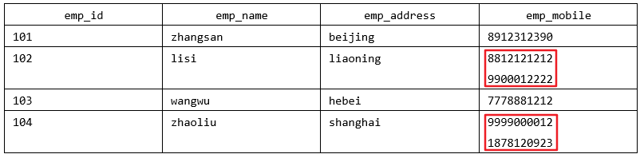
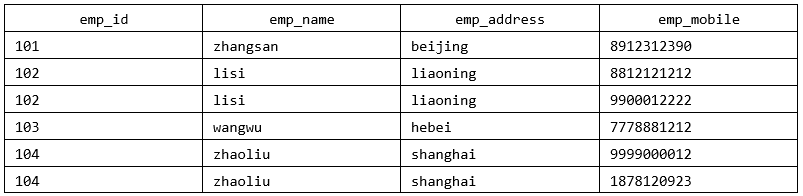
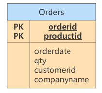
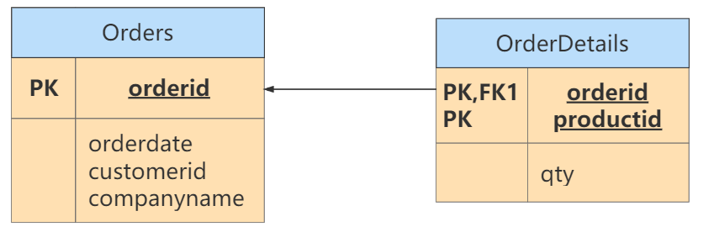
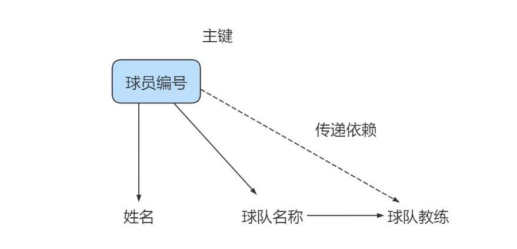
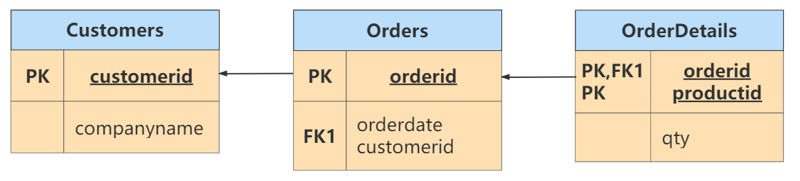
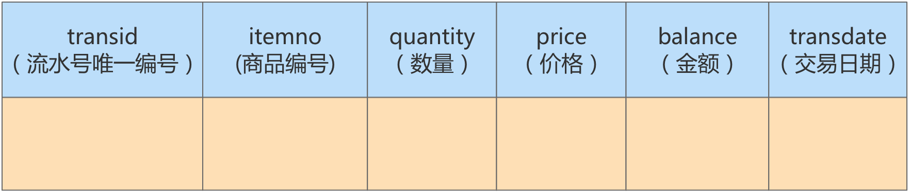
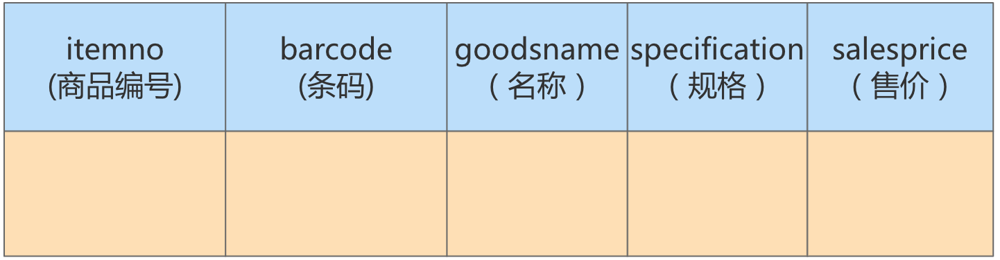
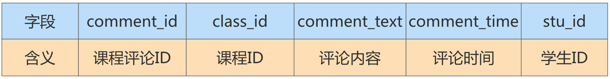
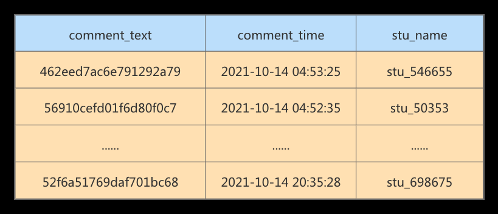

# 第11章_数据库的设计规范

## 范式

### 2.3键和相关属性的概念

范式的定义会使用到主键和候选键，数据库中的键(Key)由一个或者多个属性组成。数据表中常用的几种键和属性的定义:

- `超键`︰能唯─标识元组的属性集叫做超键。
- `候选键`︰如果超键不包括多余的属性，那么这个超键就是候选键。·主键:用户可以从候选键中选择一个作为主键。
- `外键`∶如果数据表R1中的某属性集不是R1的主键，而是另一个数据表R2的主键，那么这个属性集就是数据表R1的外键。
- `主属性`:包含在任一候选键中的属性称为主属性。
- `非主属`性:与主属性相对，指的是不包含在任何一个候选键中的属性。

通常，我们也将候选键称之为“`码`”，把主键也称为“`主码`”。因为键可能是由多个属性组成的，针对单个属性，我们还可以用主属性和非主属性来进行区分。
举例:


### 2.4第一范式

第一范式主要是确保数据表中每个字段的值必须具有`原子性`，也就是说数据表中每个字段的值为`不可再次拆分`的最小数据单元。

我们在设计某个字段的时候，对于字段×来说，不能把字段×拆分成字段X-1和字段X-2。事实上，任何的DBMS都会满足第一范式的要求，不会将字段进行拆分。

**举例1:**

假设一家公司要存储员工的姓名和联系方式。它创建一个如下表:



该表不符合1NF，因为规则说“表的每个属性必须具有原子(单个）值”lisi和zhaoliu员工的emp_mobile值违反了该规则(有两个电话)。为了使表符合1NF，我们应该有如下表数据:



**举例2：**

| 字段名称  | 字段类型     | 是否是主键 | 说明                                |
| --------- | ------------ | ---------- | ----------------------------------- |
| id        | INT          | 是         | 主键id                              |
| username  | VARCHAR(30)  | 否         | 用户名                              |
| password  | VARCHAR(50)  | 否         | 密码                                |
| user_info | VARCHAR(255) | 否         | 用户信息 (包含真实姓名、电话、住址) |

其中，user_info字段为用户信息，可以进一步拆分成更小粒度的字段,不符合数据库设计对第一范式的要求。将
user_info拆分后如下:

| 字段名称  | 字段类型     | 是否是主键 | 说明     |
| --------- | ------------ | ---------- | -------- |
| id        | INT          | 是         | 主键id   |
| username  | VARCHAR(30)  | 否         | 用户名   |
| password  | VARCHAR(50)  | 否         | 密码     |
| real_name | VARCHAR(30)  | 否         | 真实姓名 |
| phone     | VARCHAR(12)  | 否         | 联系电话 |
| address   | VARCHAR(100) | 否         | 家庭住址 |

**举例3：**

属性的原子性是 `主观的` 。例如，Employees关系中雇员姓名应当使用1个（fullname）、2个（firstname和lastname）还是3个（firstname、middlename和lastname）属性表示呢？答案取决于应用程序。如果应用程序需要分别处理雇员的姓名部分（如：用于搜索目的），则有必要把它们分开。否则，不需要。

表1：  

| 姓名 | 年龄 | 地址                   |
| ---- | ---- | ---------------------- |
| 张三 | 20   | 广东省广州市三元里78号 |
| 李四 | 24   | 广东省深圳市龙华新区   |


表2：

| 姓名 | 年龄 | 省   | 市   | 地址       |
| ---- | ---- | ---- | ---- | ---------- |
| 张三 | 20   | 广东 | 广州 | 三元里78号 |
| 李四 | 24   | 广东 | 深圳 | 龙华新区   |


### 2.5 第二范式(2nd NF)

第二范式要求，在满足第一范式的基础上，还要<font color='red'>满足数据表里的每一条数据记录，都是可唯一标识的。而且所有非主键字段，都必须完全依赖主键，不能只依赖主键的一部分</font>。如果知道主键的所有属性的值，就可以检索到任何元组(行)的任何属性的任何值。(要求中的主键，其实可以拓展替换为候选键)。


**举例1：**

`成绩表` （学号，课程号，成绩）关系中，（学号，课程号）可以决定成绩，但是学号不能决定成绩，课
程号也不能决定成绩，所以“（学号，课程号）→成绩”就是 `完全依赖关系` 。

**举例2：**

`比赛表 player_game` ，里面包含球员编号、姓名、年龄、比赛编号、比赛时间和比赛场地等属性，这
里候选键和主键都为（球员编号，比赛编号），我们可以通过候选键（或主键）来决定如下的关系：  

```mysql
(球员编号, 比赛编号) → (姓名, 年龄, 比赛时间, 比赛场地，得分)
```

但是这个数据表不满足第二范式，因为数据表中的字段之间还存在着如下的对应关系：  

```mysql
# 姓名和年龄部分依赖球员编号。
(球员编号) → (姓名，年龄)

# 比赛时间, 比赛场地部分依赖(球员编号, 比赛编号)。
(比赛编号) → (比赛时间, 比赛场地)
```


对于非主属性来说，并非完全依赖候选键。这样会产生怎样的问题呢？  

**1. 数据冗余 ：**如果一个球员可以参加 m 场比赛，那么球员的姓名和年龄就重复了 m-1 次。一个比赛
也可能会有 n 个球员参加，比赛的时间和地点就重复了 n-1 次。

**2. 插入异常 ：**如果我们想要添加一场新的比赛，但是这时还没有确定参加的球员都有谁，那么就没
法插入。

**3. 删除异常 ：**如果我要删除某个球员编号，如果没有单独保存比赛表的话，就会同时把比赛信息删
除掉。

**4. 更新异常 ：**如果我们调整了某个比赛的时间，那么数据表中所有这个比赛的时间都需要进行调
整，否则就会出现一场比赛时间不同的情况。


为了避免出现上述的情况，我们可以把球员比赛表设计为下面的三张表。  

| 表名                        | 属性（字段）                       |
| --------------------------- | ---------------------------------- |
| 球员 player 表              | 球员编号、姓名和年龄等属性         |
| 比赛 game 表                | 比赛编号、比赛时间和比赛场地等属性 |
| 球员比赛关系 player_game 表 | 球员编号、比赛编号和得分等属性     |

这样的话，每张数据表都符合第二范式，也就避免了异常情况的发生。

> 1NF 告诉我们字段属性需要是原子性的，而 2NF 告诉我们一张表就是一个独立的对象，一张表只表达一个意思  


**举例3：**

定义了一个名为 Orders 的关系，表示订单和订单行的信息：



违反了第二范式，因为有非主键属性仅依赖于候选键（或主键）的一部分。例如，可以仅通过orderid找到订单的 orderdate，以及 customerid 和 companyname，而没有必要再去使用productid。

修改：

Orders表和OrderDetails表如下，此时符合第二范式  



> 小结: 第二范式(2NF）要求实体的属性完全依赖主关键字。如果存在不完全依赖，那么这个属性和主关键字的这一部分应该分离出来形成一个新的实体，新实体与元实体之间是一对多的关系。

### 2.6 第三范式(3rd NF)

第三范式是在第二范式的基础上，确保数据表中的每一个非主键字段都和主键字段直接相关，也就是说，**要求数**
**据表中的所有非主键字段不能依赖于其他非主键字段**。(即，不能存在非主属性A依赖于非王属性B，非士属任B依赖于主键C的情况，即存在“A→B一C”"的决定关系）通俗地讲，该规则的意思是所有`非主键属性`之间不能有依
赖关系，必须`相互独立`。

这里的主键可以拓展为候选键。

**举例1：**

`部门信息表` ：每个部门有部门编号（dept_id）、部门名称、部门简介等信息。

`员工信息表` ：每个员工有员工编号、姓名、部门编号。列出部门编号后就不能再将部门名称、部门简介等与部门有关的信息再加入员工信息表中。

如果不存在部门信息表，则根据第三范式（3NF）也应该构建它，否则就会有大量的数据冗余。

**举例2：**  

| 字段名称      | 字段类型      | 是否是主键 | 说明                |
| ------------- | ------------- | ---------- | ------------------- |
| id            | INT           | 是         | 商品主键id （主键） |
| category_id   | INT           | 否         | `商品类别id`        |
| category_name | VARCHAR(30)   | 否         | `商品类别名称`      |
| goods_name    | VARCHAR(30)   | 否         | 商品名称            |
| price         | DECIMAL(10,2) | 否         | 商品价格            |

商品类别名称依赖于商品类别编号，不符合第三范式。

**修改：**

表1：符合第三范式的 商品类别表 的设计  

| 字段名称      | 字段类型    | 是否是主键 | 说明           |
| ------------- | ----------- | ---------- | -------------- |
| id            | INT         | 是         | 商品类别主键id |
| category_name | VARCHAR(30) | 否         | 商品类别名称   |

表2：符合第三范式的 商品表 的设计  

| 字段名称    | 字段类型      | 是否是主键 | 说明       |
| ----------- | ------------- | ---------- | ---------- |
| id          | INT           | 是         | 商品主键id |
| category_id | VARCHAR(30)   | 否         | 商品类别id |
| goods_name  | VARCHAR(30)   | 否         | 商品名称   |
| price       | DECIMAL(10,2) | 否         | 商品价格   |

商品表goods通过商品类别id字段（category_id）与商品类别表goods_category进行关联。

**举例3：**

`球员player表` ：球员编号、姓名、球队名称和球队主教练。现在，我们把属性之间的依赖关系画出
来，如下图所示：  




你能看到球员编号决定了球队名称，同时球队名称决定了球队主教练，非主属性球队主教练就会传递依
赖于球员编号，因此不符合 3NF 的要求。

如果要达到 3NF 的要求，需要把数据表拆成下面这样：  

| 表名   | 属性（字段）             |
| ------ | ------------------------ |
| 球员表 | 球员编号、姓名和球队名称 |
| 球队表 | 球队名称、球队主教练     |

**举例4：**

修改第二范式中的举例3。

此时的Orders关系包含 orderid、orderdate、customerid 和 companyname 属性，主键定义为 orderid。customerid 和companyname均依赖于主键——orderid。例如，你需要通过orderid主键来查找代表订单中客户的customerid，同样，你需要通过 orderid 主键查找订单中客户的公司名称（companyname）。然而， customerid和companyname也是互相依靠的。为满足第三范式，可以改写如下：  



> 符合3NF后的数据模型通俗地讲，2NF和3NF通常以这句话概括：“每个非键属性依赖于键，依赖于整个键，并且除了键别无他物”。  

### 2.7小结

关于数据表的设计，有三个范式要遵循。

(1）第一范式(1NF)，确保每列保持`原子性`

​		数据库的每一列都是不可分割的原子数据项，不可再分的最小数据单元，而不能是集合、数组、记录等非原子数据项。

(2）第二范式(2NF)，确保每列都和主键`完全依赖`

​		尤其在复合主键的情况下，非主键部分不应该依赖于部分主键。

(3）第三范式(3NF）确保每列都和主键列`直接相关`，而不是间接相关

**范式的优点:** 数据的标准化有助于消除数据库中的`数据冗余`，第三范式(3NF）通常被认为在性能、扩展性和数据完整性方面达到了最好的平衡。

**范式的缺点: **范式的使用，可能`降低查询的效率`。因为范式等级越高，设计出来的数据表就越多、越精细，数据的冗余度就越低，进行数据查询的时候就可能需要`关联多张表`，这不但代价昂贵，也可能使一些索`引策略无效`。

范式只是提出了设计的标准，实际上设计数据表时，未必一定要符合这些标准。开发中，我们会出现为了性能和读取效率违反范式化的原则，通过`增加少量的冗余`或重复的数据来提高数据库的`读性能`，减少关联查询,join表的次数，实现空间换取时间的目的。因此在实际的设计过程中要理论结合实际，灵活运用。

> 范式本身没有优劣之分，只有适用场景不同。没有完美的设计，只有合适的设计，我们在数据表的设计中，还需要根据需求将范式和反范式混合使用。

## 3. 反范式化  

3.1 概述
规范化 vs 性能
\1. 为满足某种商业目标 , 数据库性能比规范化数据库更重要
\2. 在数据规范化的同时 , 要综合考虑数据库的性能
\3. 通过在给定的表中添加额外的字段，以大量减少需要从中搜索信息所需的时间
\4. 通过在给定的表中插入计算列，以方便查询
3.2 应用举例
举例1：
员工的信息存储在 employees 表 中，部门信息存储在 departments 表 中。通过 employees 表中的
department_id字段与 departments 表建立关联关系。如果要查询一个员工所在部门的名称：  

```mysql
select employee_id,department_name
from employees e join departments d
on e.department_id = d.department_id;
```

如果经常需要进行这个操作，连接查询就会浪费很多时间。可以在 employees 表中增加一个冗余字段
department_name，这样就不用每次都进行连接操作了。
举例2：
反范式化的 goods商品信息表 设计如下：  

| 字段名称      | 字段类型      | 是否是主键 | 说明            |
| ------------- | ------------- | ---------- | --------------- |
| id            | INT           | 是         | 商品id （主键） |
| category_id   | VARCHAR(30)A  | 否         | 商品类别id      |
| category_name | VARCHAR(30)   | 否         | 商品类别名称    |
| goods_name    | VARCHAR(30)   | 否         | 商品名称        |
| price         | DECIMAL(10,2) | 否         | 商品价格        |

举例3： 我们有 2 个表，分别是 商品流水表（atguigu.trans ）和 商品信息表
（atguigu.goodsinfo） 。商品流水表里有 400 万条流水记录，商品信息表里有 2000 条商品记录。
商品流水表：  




商品信息表：  



新的商品流水表如下所示：


举例4：
课程评论表 class_comment ，对应的字段名称及含义如下：



学生表 student ，对应的字段名称及含义如下：


在实际应用中，我们在显示课程评论的时候，通常会显示这个学生的昵称，而不是学生 ID，因此当我们想要查询某个课程的前 1000 条评论时，需要关联 class_comment 和 student这两张表来进行查询。

**实验数据：模拟两张百万量级的数据表**

为了更好地进行 SQL 优化实验，我们需要给学生表和课程评论表随机模拟出百万量级的数据。我们可以
通过存储过程来实现模拟数据。

**反范式优化实验对比**
如果我们想要查询课程 ID 为 10001 的前 1000 条评论，需要写成下面这样：  


```mysql
SELECT p.comment_text, p.comment_time, stu.stu_name
FROM class_comment AS p LEFT JOIN student AS stu
ON p.stu_id = stu.stu_id
WHERE p.class_id = 10001
ORDER BY p.comment_id DESC
LIMIT 1000;
```

运行结果（1000 条数据行）  



运行时长为 `0.395` 秒，对于网站的响应来说，这已经很慢了，用户体验会非常差。

如果我们想要提升查询的效率，可以允许适当的数据冗余，也就是在商品评论表中增加用户昵称字段，
在 class_comment 数据表的基础上增加 stu_name 字段，就得到了 class_comment2 数据表。

这样一来，只需单表查询就可以得到数据集结果：  

```mysql
SELECT comment_text, comment_time, stu_name
FROM class_comment2
WHERE class_id = 10001
ORDER BY class_id DESC LIMIT 1000;
```

运行结果（1000 条数据）：  


优化之后只需要扫描一次聚集索引即可，运行时间为 `0.039` 秒，查询时间是之前的 1/10。 你能看到，
在数据量大的情况下，查询效率会有显著的提升。

### 3.3 反范式的新问题

存储 空间变大 了

一个表中字段做了修改，另一个表中冗余的字段也需要做同步修改，否则 数据不一致

若采用存储过程来支持数据的更新、删除等额外操作，如果更新频繁，会非常 消耗系统资源

在 数据量小 的情况下，反范式不能体现性能的优势，可能还会让数据库的设计更加 复杂  

### 3.4 反范式的适用场景

当冗余信息有价值或者能 大幅度提高查询效率 的时候，我们才会采取反范式的优化。
\1. 增加冗余字段的建议
\2. 历史快照、历史数据的需要
在现实生活中，我们经常需要一些冗余信息，比如订单中的收货人信息，包括姓名、电话和地址等。每
次发生的 订单收货信息 都属于 历史快照 ，需要进行保存，但用户可以随时修改自己的信息，这时保存这
些冗余信息是非常有必要的。
反范式优化也常用在 数据仓库 的设计中，因为数据仓库通常 存储历史数据 ，对增删改的实时性要求不
强，对历史数据的分析需求强。这时适当允许数据的冗余度，更方便进行数据分析。  