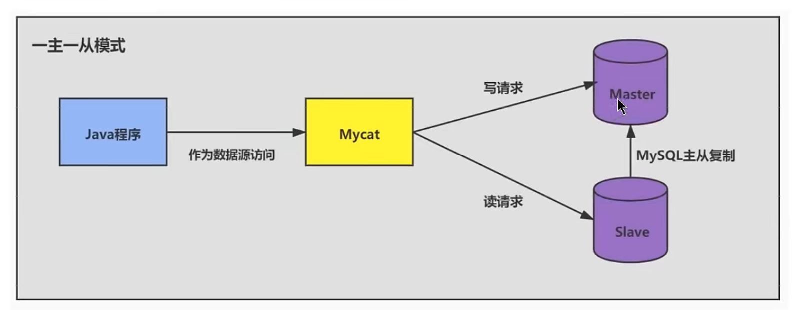
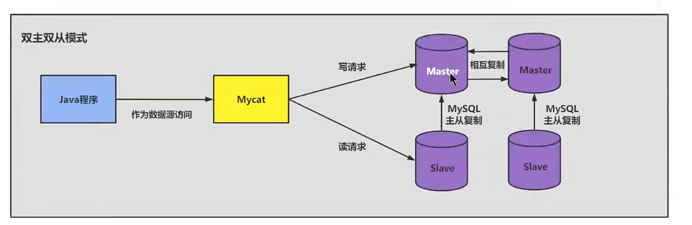
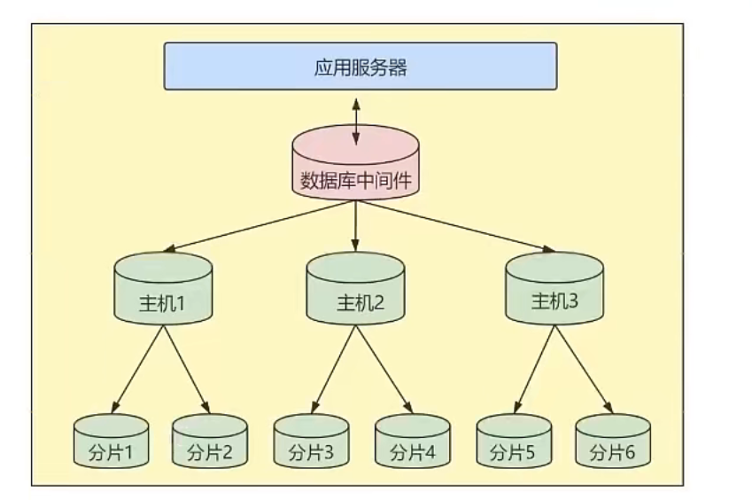
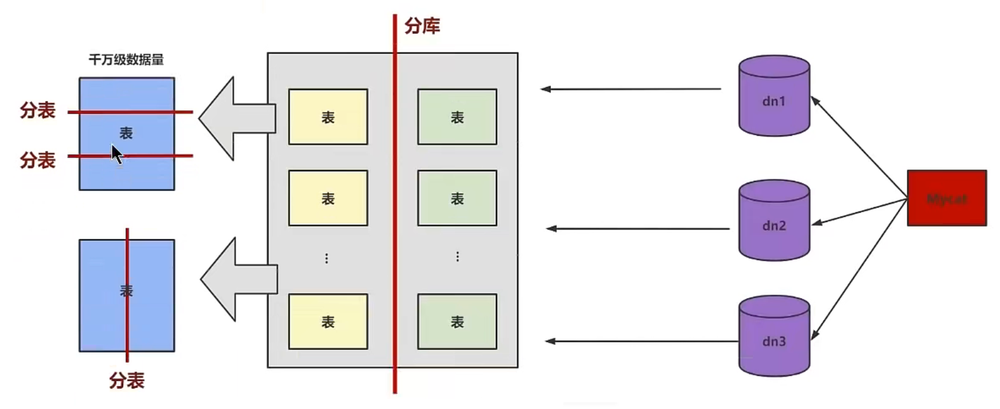

# 第12章_数据库其它调优策略


## 1.数据库调优的措施

### 1.1调优的目标

- 尽可能`节省系统资源`，以便系统可以提供更大负荷的服务。(吞吐量更大)。
- 合理的结构设计和参数调整，以提高用户操作`响应的速度`。(响应速度更快)
- 减少系统的瓶颈，提高MySQL数据库整体的性能。

### 1.2如何定位调优问题

不过随着用户量的不断增加，以及应用程序复杂度的提升，我们很难用“`更快`”去定义数据库调优的目标，因为用户在不同时间段访问服务器遇到的瓶颈不同，比如双十一促销的时候会带来大规模的`并发访问`;还有用户在进行不同业务操作的时候，数据库的`事务处理`和`SQL查询`都会有所不同。因此我们还需要更加精细的定位，去确定调优的目标。

如何确定呢?一般情况下，有如下几种方式:

- **用户的反馈(主要)**

  用户是我们的服务对象，因此他们的反馈是最直接的。虽然他们不会直接提出技术建议，但是有些问题往往是用户第一时间发现的。我们要重视用户的反馈，找到和数据相关的问题。

- **日志分析（主要)**
  我们可以通过查看数据库日志和操作系统日志等方式找出异常情况，通过它们来定位遇到的问题。

- 服务器资源使用监控

  通过监控服务器的CPU、内存、I/o等使用情况，可以实时了解服务器的性能使用，与历史情况进行对比。

- 数据库内部状况监控

  在数据库的监控中，`活动会话（Active Session)监控`是一个重要的指标。通过它，你可以清楚地了解数据库当前是否处于非常繁忙的状态，是否存在sQL堆积等。

- 其它
  除了活动会话监控以外，我们也可以对`事务、锁等待`等进行监控，这些都可以帮助我们对数据库的运行状态有更全面的认识。

### 1.4调优的维度和步骤

我们需要调优的对象是整个数据库管理系统，它不仅包括SQL查询,还包括数据库的部署配置、架构等。从这个
角度来说，我们思考的维度就不仅仅局限在SQL优化上了。通过如下的步骤我们进行梳理:

#### 第1步:选择适合的DBMS

如果对`事务性处理`以及`安全性要求高`的话，可以选择商业的数据库产品。这些数据库在事务处理和查询性能上都比较强，比如采用SQL Server、Oracle，那么`单表存储上亿条数据`是没有问题的。如果数据表设计得好，即使不采用`分库分表`的方式，查询效率也不差。

除此以外，你也可以采用开源的MySQL进行存储，它有很多存储引擎可以选择，如果进行事务处理的话可以选择InnoDB，非事务处理可以选择MylSAM。

NoSQL阵营包括`键值型数据库`、`文档型数据库`、`搜索引擎`、`列式存储`和`图形数据库`。这些数据库的优缺点和使用场景各有不同，比如咧式存储数据库可以大幅度降低系统的I/O，适合于分布式文件系统，但如果数据需要频繁地增删改，那么列式存储就不太适用了。

**DBMS的选择关系到了后面的整个设计过程，所以第一步就是要选择适合的DBMS。**如果已经确定好了DBMS，那么这步可以跳过。.

#### 第2步:优化表设计

选择了DBMS之后，我们就需要进行表设计了。而数据表的设计方式也直接影响了后续的SQL查询语句。RDBMS中，每个对象都可以定义为一张表，表与表之间的关系代表了对象之间的关系。如果用的是MySQL，我们还可以根据不同表的使用需求，选择不同的存储引擎。除此以外，还有一些优化的原则可以参考:

1.表结构要尽量`遵循三范式的原则`。这样可以让数据结构更加清晰规范减少冗余字段，同时也减少了在更
新，插入和删除数据时等异常情况的发生。

2.如果`查询`应用比较多，尤其是需要进行`多表联查`的时候，可以采用`反范式`进行优化。反范式采用`空间换时`
`间`的方式，通过增加冗余字段提高查询的效率。

3．`表字段的数据类型选择`，关系到了查询效率的高低以及存储空间的大小。一股采说，如果字段可以米用数值
类型就不要采用字符类型;字符长度要尽可能设计得短一些。针对子付类型米玩，白佣疋子付火度口F，就可以采用CHAR类型;当长度不固定时，通常采用VARCHAR类型。

数据表的结构设计很基础，也很关键。**好的表结构可以在业务发展和用尸量增加的情况依然反挥作用，个灯的表结构设计会让数据表变得非常臃肿，查询效率也会降低。**

#### 第3步:优化逻辑查询

当我们建立好数据表之后，就可以对数据表进行增删改查的操作了。这时我们首先需要考虑的是逻辑查询优化。

SQL查询优化，可以分为`逻辑查询优化`和`物理查询优化`。逻辑查询优化就是通过改变sQL语句的内容让sQL执行效率更高效，采用的方式是对sQL语句进行等价变换，对查询进行重写。

<font color='red'>SQL的查询重写包括了子查询优化、等价谓词重写、视图重写、条件简化、连接消除和嵌套连接消除等。</font>

> 全部没听说过：等价谓词重写、视图重写、条件简化、连接消除和嵌套连接消除


比如我们在讲解EXISTS子查询和IN子查询的时候，会根据`小表驱动大表`的原则选择适合的子查询。在WHERE子句中会尽量避免对字段进行函数运算，它们会让字段的索引失效。

举例:查询评论内容开头为abc的内容都有哪些，如果在WHERE子句中使用了函数，语句就会写成下面这样:

```mysql
SELECT comment_id，comment_text,comment_time FROM product_comment WHERE SUBSTRING(comment_text，1,3 )='abc'
# 用函数索引失效
```


采用查询重写的方式进行等价替换:

```mysql
SELECT comment_id， comment_text，comment_time FROM product_comment WHERE comment_text LIKE' abc%'
# 这个可以用索引
```


#### 第4步:优化物理查询

物理查询优化是在确定了逻辑查询优化之后，采用物理优化技术(比如索引等)，通过计算代价模型对各种可能的访问路径进行估算，从而找到执行方式中代价最小的作为执行计划。**在这个部分中，我们需要掌握的重点是对索引的创建和使用。**

但索引不是万能的，我们需要根据实际情况来创建索引。那么都有哪些情况需要考虑呢?我们在前面几章中已经进行了细致的剖析。

SQL查询时需要对不同的数据表进行查询，因此在物理查询优化阶段也需要确定这些查询所采用的路径，具体的情况包括:

1.`单表扫描:`对于单表扫描来说，我们可以全表扫描所有的数据，也可以局部扫描。

2`两张表的连接`∶常用的连接方式包括了嵌套循环连接、HASH连接和合并连接。

3`多张表的连接`︰多张数据表进行连接的时候，`顺序`很重要，因为不同的连接路径查询的效率不同，搜索空间也会不同。我们在进行多表连接的时候，搜索空间可能会达到`很高的数据量级`，巨大的搜索空间显然会占用更多的资源，因此我们需要通过调整连接顺序，将搜索空间调整在一个可接受的范围内。

#### 第5步:使用Redis或 Memcached作为缓存

除了可以对SQL本身进行优化以外，我们还可以请外援提升查询的效率。

因为数据都是存放到数据库中，我们需要从数据库层中取出数据放到内存中进行业务逻辑的操作，当用户量增大的时候，如果频繁地进行数据查询，会消耗数据库的很多资源。如果我们将常用的数据直接放到内存中，就会大幅提升查询的效率。

键值存储数据库可以帮我们解决这个问题。

常用的键值存储数据库有Redis和Memcached，它们都可以将数据存放到内存中。

从可靠性来说,`Redis支持持久化`，可以让我们的数据保存在硬盘上，不过这样一来性能消耗也会比较大。而Memcached仅仅是内存存储，不支持持久化。

从支持的数据类型来说，Redis 比Memcached要多，它不仅支持 key-value类型的数据，还支持List，Set，Hash等数据结构。当我们有持久化需求或者是更高级的数据处理需求的时候，就可以使用Redis。如果是简单的key-value存储，则可以使用Memcached。

**通常我们对于查询响应要求高的场景（响应时间短，吞吐量大)，可以考虑内存数据库，毕竟术业有专攻**。传统的RDBMS都是将数据存储在硬盘上，而内存数据库则存放在内存中，查询起来要快得多。不过使用不同的工具，也增加了开发人员的使用成本。

#### 第6步:库级优化

库级优化是站在数据库的维度上进行的优化策略，比如控制一个库中的数据表数量。另外，单一的数据库总会遇到各种限制，不如取长补短，利用"外援"的方式。通过`主从架构`优化我们的读写策略，通过对数据库进行垂直或者水平切分，突破单一数据库或数据表的访问限制，提升查询的性能。

##### 1、读写分离

如果读和写的业务量都很大，并且它们都在同一个数据库服务器中进行操作，那么数据库的性能就会出现瓶颈，这时为了提升系统的性能，优化用户体验，我们可以采用`读写分离`的方式降低主数据库的负载，比如用主数据库(master)完成写操作，用从数据库(slave)完成读操作。






##### 2、数据分片

对数据库分库分表。当数据量级达到干万级以上时，有时候我们需要把一个数据库切成多份，放到不同的数据库服务器上，减少对单一数据库服务器的访问压力。如果你使用的是MySQL，就可以使用MySQL自带的分区表功能，当然你也可以考虑自己做`垂直拆分（分库)`、`水平拆分`（分表）、`垂直+水平拆分(分库分表`)。





> 但需要注意的是，分拆在提升数据库性能的同时，也会增加维护和使用成本

## 2.优化MySQL服务器

优化MySQL服务器主要从两个方面来优化，一方面是对`硬件`进行优化;另一方面是对MySQL`服务的参数`进行优化。这部分的内容需要较全面的知识，一般只有`专业的数据库管理员`才能进行这一类的优化。对于可以定制参数的操作系统，也可以针对MySQL进行操作系统优化。

### 2.1优化服务器硬件

**服务器的硬件性能直接决定着MySQL数据库的性能**。硬件的性能瓶颈直接决定MySQL数据库的运行速度和效率。针对性能瓶颈提高硬件配置，可以提高MySQL数据库查询、更新的速度。

(1）`配置较大的内存`。足够大的内存是提高MySQL数据库性能的方法之一。内存的速度比磁盘I/o快得多，可以通过增加系统的缓`冲区容量`使数据在内存中停留的时间更长，以`减少磁盘I/O`。
(2）`配置高速磁盘系统`，以减少读盘的等待时间，提高响应速度。磁盘的I/o能力，也就是它的寻道能力，目前的`SCSI`高速旋转的是7200转/分钟，这样的速度，一旦访问的用户量上去磁盘的压力就会过大，如果是每天的网站pv (page view)在150w，这样的一般的配置就无法满足这样的需求了。现在`SSD`盛行，在`SSD`上随机访问和顺序访问性能几乎差不多，使用SSD可以减少随机IO带来的性能损耗。

(3)`合理分布磁盘I/O`，把磁盘I/o分散在多个设备上，以减少资源竞争提高并行操作能力。
(4)）`配置多处理器`，MySQL是多线程的数据库，多处理器可同时执行多个线程。

### 2.2优化MySQL的参数

通过优化MySQL的参数可以提高资源利用率，从而达到提高MySQL服务器性能的目的。

MySQL服务的配置参数都在`my.cnf`或者`my. ini文`件的[mysqld]组中。配置完参数以后，需要重新启动MySQL服务才会生效。

下面对几个对性能影响比较大的参数进行详细介绍。

- `innodb_buffer_pool_size` :这个参数是Mysql数据库最重要的参数之一，表示InnoDB类型的`表和索引的最大缓存`。它不仅仅缓存索引数据，还会缓存表的数据。这个值越大，查询的速度就会越快。但是这个值太大会影响操作系统的性能。
-  `key_buffer_size`:表示`索引缓冲区的大小`。索引缓冲区是所有的`线程共享`。增加索引缓冲区可以得到更好处理的索引(对所有读和多重写)。当然，这个值不是越大越好，它的大小取决于内存的大小。如果这个值太大，就会导致操作系统频繁换页，也会降低系统性能。对于内存在`4GB`左右的服务器该参数可设置为`256M`
  或`384M`。
- `table_cache` :表示同时打开的表的个数。这个值越大，能够同时打开的表的个数越多。物理内存越大，设置就越大。默认为2402，调到512-1024最佳。这个值不是越大越好，因为同时打开的表太多会影响操作系统的性能。

- `query_cache_size`:表示查询缓冲区的大小。可以通过在MySQL控制台观察，如果Qcache_lowmem_prunes的值非常大，则表明经常出现缓冲不够的情况，就要增加Query_cache_size的值;如果Qcache_hits的值非常大，则表明查询缓冲使用非常频繁，如果该值较小反而会影响效率，那么可以考虑不用查询缓存;
  Qcache_free_blocks，如果该值非常大，则表明缓冲区中碎片很多。**MySQL8.0之后失效**。该参数需要和query_cache_type配合使用。

- `query_cache_type`的值是0时，所有的查询都不使用查询缓存区。但是query_cache_type=0并不会导致MySQL释放query_cache_size所配置的缓存区内存。

  - 当`query_cache_type`=1时，所有的查询都将使用查询缓存区，除非在查询语句中指定 `SQL_NO_CACHE`，SELECT SQL_NO_CACHE* FROM tbl_name。
  - 当query_cache_type=2时，只有在查询语句中使用`SQL_CACHE` 关键字，查询才会使用查询缓存区。使用查询缓存区可以提高查询的速度，这种方式只适用于修改操作少且经常执行相同的查询操作的情况。

-  `sort_buffer_size`:表示每个`需要进行排序的线程分配的缓冲区的大小`。增加这个参数的值可以提高`ORDER BY`或`GROUP BY`操作的速度。默认数值是2097144字节(约2MB)。对于内存在4GB左右的服务器推荐设置为6-8M，如果有100个连接，那么实际分配的总共排序缓冲区大小为100 ×6 = 600MB。

- `join_buffer_size = 8M`:表示`联合查询操作所能使用的缓冲区大小`,和sort_buffer_size—样，该参数对应
  的分配内存也是每个连接独享。

- `read_buffer_size` :表示`每个线程连续扫描时为扫描的每个表分配的缓冲区的大小(字节）`。当线程从表中连续读取记录时需要用到这个缓冲区。SET SESSION read_buffer_size=n可以临时设置该参数的值。默认为64K,可以设置为4M。

-  `innodb_flush_log_at_trx_commit`:表示`何时将缓冲区的数据写入日志文件`，并且将日志文件写入磁盘中。该参数对干innoDB引擎非常重要。该参数有3个值，分别为0、1和2。该参数的默认值为1.

  - 值为0时，表示`每秒1次`的频率将数据写入日志文件并将日志文件写入磁盘。每个事务的commit并不会触发前面的任何操作。该模式速度最快，但不太安全，mysqld进程的崩溃会导致上一秒钟所有事务数据的丢失。
  - 值为1时，表示`每次提交事务时`将数据写入日志文件并将日志文件写入磁盘进行同步。该模式是最安全的，但也是最慢的一种方式。因为每次事务提交或事务外的指令都需要把日志写入(flush）硬盘。
  - 值为2时，表示`每次提交事务时`将数据写入日志文件，每隔1秒将日志文件写入磁盘。该模式速度较快，也比0安全，只有在操作系统崩溃或者系统断电的情况下，上一秒钟所有事务数据才可能丢失。

- `innodb_log_buffer_size`:这是InnoDB存储引擎的`事务日志所使用的缓冲区 `。为了提高性能，也是先将信息写入Innodb Log Buffer中，当满足innodb_flush_log_trx_commit参数所设置的相应条件(或者日志缓冲区写满)之后，才会将日志写到文件（或者同步到磁盘)中。

- `max_connections`:表示`允许连接到MySQL数据库的最大数量`，默认值是`151`。如果状态变量
  connection_errors_max_connections 不为零，并且一直增长，则说明不断有连接请求因数据库连接数已达到允许最大值而失败，这是可以考虑增大max_connections的值。在Linux平台下，性能好的服务器，支持500-1000个连接不是难事，需要根据服务器性能进行评估设定。这个连接数`不是越大越好`，因为这些连接会浪费内存的资源。过多的连接可能会导致MySQL服务器僵死。

- `back_log` :用于`控制MySQL监听TCP端口时设置的积压请求栈大小`。如果MySql的连接数达到max_connections时，新来的请求将会被存在堆栈中，以等待某一连接释放资源，该堆栈的数量即back_log，如果等待连接的数量超过back_log，将不被授予连接资源，将会报错。5.6.6版本之前默认值为50，之后的版本默认为50+(max_connections / 5)，对于Linux系统推荐设置为小于512的整数，但最大不超过900。
  如果需要数据库在较短的时间内处理大量连接请求，可以考虑适当增大back_log的值。

- `thread_cache_size` :线程池缓存线程数量的大小，当客户端断开连接后将当前线程缓存起来，当在接到新的连接请求时快速响应无需创建新的线程。这尤其对那些使用短连接的应用程序来说可以极大的提高创建连接的效率。那么为了提高性能可以增大该参数的值。默认为60，可以设置为120。

  可以通过如下几个MySQL状态值来适当调整线程池的大小:

  ```mysql
  mysql>  show global status like 'Thread%';
  +-------------------+-------+
  | Variable_name     | Value |
  +-------------------+-------+
  | Threads_cached    | 0     |
  | Threads_connected | 5     |
  | Threads_created   | 5     |
  | Threads_running   | 2     |
  +-------------------+-------+
  4 rows in set (0.10 sec)
  
  ```

  当Threads_cached越来越少，但Threads_connected 始终不降，且Threads_created持续升高，可适当增加thread_cache_size的大小。

- `wait_timeout`:指定`一个请求的最大连接时间`，对于4GB左右内存的服务器可以设置为5-10。. 

- `interactive_timeout `:表示服务器在关闭连接前等待行动的秒数。

文里给出一份my.cnf的参考配置:

```my.cnf
[mysqld]port = 3306serverid = 1
socket = /tmp/mysql.sockskip-locking

#避免MySQL的外部锁定，减少出错几率增强稳定性。
skip-name-resolve
#禁止MysQL对外部连接进行DNS解析，使用这一选项可以消除MySQL进行DNS解析的时间。但需要注意，如果开启该选项，则所有远程主机连接授权都要使用IP地址方式，否则MySQL将无法正常处理连接请求!
back_log = 384
key_buffer_size = 256M
max_allowed_packet = 4M
thread_stack = 256K
table_cache = 128K
sort_buffer_size = 6M
read_buffer_size =4M
read_rnd_buffer_size=16M
join_buffer_size = 8M
myisam_sort_buffer_size = 64M
table_cache = 512
thread_cache_size = 64
query_cache_size = 64M
tmp_table_size = 256M
max_connections = 768
max_connecterrors = 10000000
wait_timeout= 10
thread_concurrency = 8
#该参数取值为服务器逻辑CPU数量*2，在本例中，服务器有2颗物理CPU，而每颗物理CPU又支持H.T超线程，所以实际取值为4*2=8
skip-networking
#开启该选项可以彻底关闭MySQL的TCP/IP连接方式，如果WEB服务器是以远程连接的方式访问MysQL数据库服务器则不要开启该选项!否则将无法正常连接!
table_cache=1024
innodb_additional_mem_pool_size=4M 
#默认为2M 
innodb_flush_log_at_trx_commit=1
innodb_log_buffer_size=2M 
#默认为1M 
innodb_thread_concurrency=8 
#你的服务器CPU有几个就设置为几。建议用默认一般为8 
tmp_table_size=64M 
#默认为16M，调到64-256最挂
thread_cache_size=120 
query_cache_size=32M
```

举例:

下面是一个电商平台，类似京东或天猫这样的平台。商家购买服务，入住平台，开通之后，商家可以在系统中架各种商品，客户通过手机App、微信小程序等渠道购买商品，商家接到订单以后安排快递送货。

`刚刚上线`的时候，系统运行状态良好。但是，随着入住的`商家不断增多`，使用系统的`用户量越来越多`，每天的
单数据达到了5万条以上。这个时候，系统开始出现问题，`CPU使用率不断飙升`。终于，双十一或者618活动高的时候，CPU使用率达到`99%`，这实际上就意味着，系统的计算资源已经耗尽，再也无法处理任何新的订单了。换句话说，系统已经崩溃了。

这个时候，我们想到了对系统参数进行调整，因为参数的值决定了资源配置的方式和投放的程度。

为了解决这个问题，一共调整3个系统参数，分别是

- InnoDB_flush_log_at_trx_commit
-  lnnoDB_buffer_pool_size

- InnoDB_buffer_pool_instances

下面我们就说—说调整这三个参数的原因是什么。

**(1）调整系统参数InnoDB_flush_log_at_trx_commit**

这个参数适用于InnoDB存储引擎，电商平台系统中的表用的存储引擎都是InnoDB。默认的值是1，意思是每次提交事务的时候，都把数据写入日志，并把日志写入磁盘。这样做的好处是数据`安全性最佳`，不足之处在于每次提交事务，都要进行磁盘写入的操作。在`大并发的场景下`，过于频繁的磁盘读写会导致CPU资源浪费，系统效率变低。

这个参数的值还有2个可能的选项，分别是0和2。我们把这个参数的值改成了2。这样就不用每次提交事务的时候都启动磁盘读写了，在大并发的场景下，可以改善系统效率，降低CPU使用率。即便出现故障，损失的数据也比较小。

**(2）调整系统参数InnoDB_buffer_pool_size**

这个参数的意思是，InnoDB存储引擎使用`缓存来存储索引和数据`。这个值越大，可以加载到缓存区的索引和数据量就越多，需要的`磁盘读写就越少`。

因为我们的MySQL服务器是数据库专属服务器，只用来运行MysQL数据库服务，没有其他应用了，而我们的计算机是64位机器，内存也有128G。于是我们把这个参数的值调整为`64G`。这样一来，磁盘读写次数可以大幅降低，我们就可以充分利用内存，释放出一些CPU的资源。

**(3）调整系统参数InnoDB_buffer_pool_instances**

这个参数可以将InnoDB的缓存区分成几个部分，这样可以提高系统的`并行处理能力`，因为可以允许多个进程同时处理不同部分的缓存区。

我们把InnoDB_buffer_pool_instances 的值修改为64，意思就是把 InnoDB的缓存区分战64个分区，这样就可以同时有`多个进程`进行数据操作，CPU的效率就高多了。修改好了系统参数的值，要重启MysQL数据库服务器。

> 总结一下就是遇到CPU资源不足的问题，可以从下面2个思路去解决。
>
> - 疏通拥堵路段，消除瓶颈，让等待的时间更短;
> - 开拓新的通道，增加并行处理能力。

