# 第 18 章_主从复制

## 1. 主从复制概述

## 1. 1 如何提升数据库并发能力

在实际工作中，我们常常将`Redis`作为缓存与`MySQL`配合来使用，当有请求的时候，首先会从缓存中进行查找，如果存在就直接取出。如果不存在再访问数据库，这样就`提升了读取的效率`，也减少了对后端数据库的`访问压力`。Redis的缓存架构是`高并发架构`中非常重要的一环。

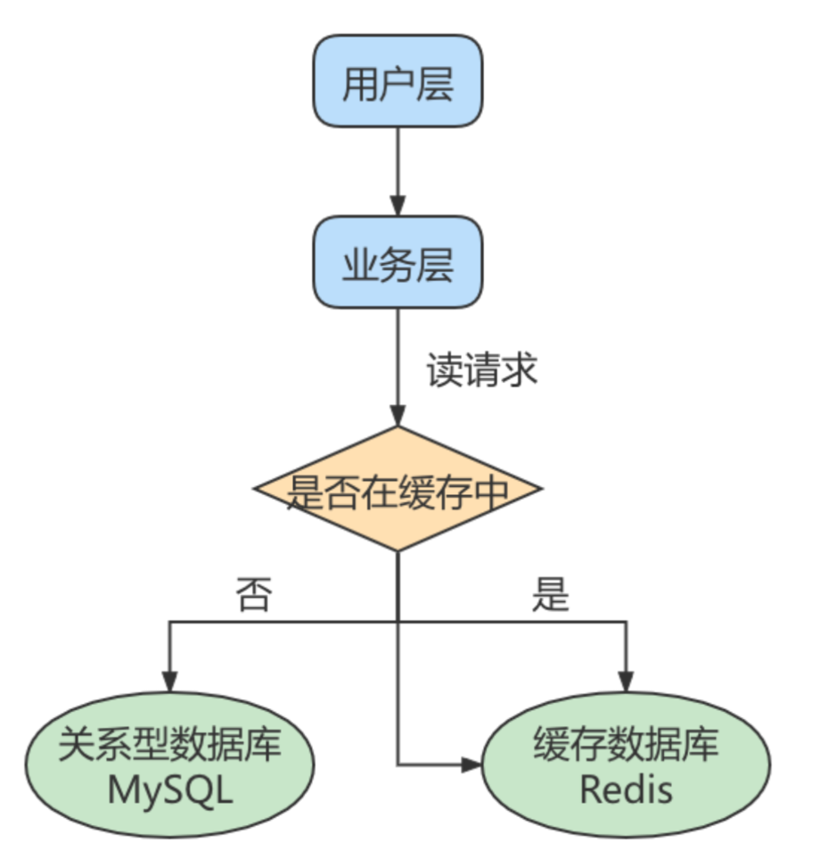


此外，一般应用对数据库而言都是“`读多写少`”，也就说对数据库读取数据的压力比较大，有一个思路就是采用数据库集群的方案，做`主从架构`、进行`读写分离`，这样同样可以提升数据库的并发处理能力。但并不是所有的应用都需要对数据库进行主从架构的设置，毕竟设置架构本身是有成本的。

如果我们的目的在于提升数据库高并发访问的效率，那么首先考虑的是如何优化`SQL和索引`，这种方式简单有效；其次才是采用`缓存的策略`，比如使用 Redis将热点数据保存在内存数据库中，提升读取的效率；最后才是对数据库采用`主从架构`，进行读写分离。

## 1. 2 主从复制的作用

主从同步设计不仅可以提高数据库的吞吐量，还有以下 3 个方面的作用。

**第 1 个作用：读写分离。**我们可以通过主从复制的方式来同步数据，然后通过读写分离提高数据库并发处理能力


**第 2 个作用就是数据备份。**我们通过主从复制将主库上的数据复制到了从库上，相当于是一种热备份机制，也就是在主库正常运行的情况下进行的备份，不会影响到服务。

**第 3 个作用是具有高可用性。**数据备份实际上是一种冗余的机制，通过这种冗余的方式可以换取数据库的高可用性，也就是当服务器出现`故障`或`宕机`的情况下，可以`切换`到从服务器上，保证服务的正常运行。

关于高可用性的程度，我们可以用一个指标衡量，即正常可用时间/全年时间。比如要达到全年99.999%的时间都可用，就意味着系统在一年中的不可用时间不得超过`365*24*60*(1-99.999%)=5.256`分钟(含系统崩溃的时间、日常维护操作导致的停机时间等)，其他时间都需要保持可用的状态。

实际上，更高的高可用性，意味着需要付出更高的成本代价。在现实中我们需要结合业务需求和成本来进行选择。

## 2. 主从复制的原理

`Slave`会从`Master`读取`binlog`来进行数据同步。

### 2. 1 原理剖析

##### 三个线程

实际上主从同步的原理就是基于 binlog 进行数据同步的。在主从复制过程中，会基于 `3 个线程`来操作，一个主库线程，两个从库线程。

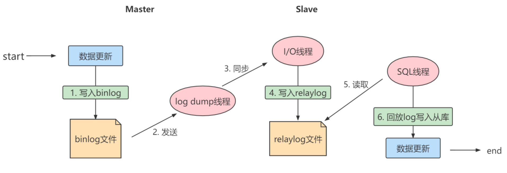

`二进制日志转储线程`（Binlog dump thread）是一个主库线程。当从库线程连接的时候， 主库可以将二进
制日志发送给从库，当主库读取事件（Event）的时候，会在 Binlog 上`加锁`，读取完成之后，再将锁释
放掉。

`从库 I/O 线程会连接到主库`，向主库发送请求更新 Binlog。这时从库的 I/O 线程就可以读取到主库的
二进制日志转储线程发送的 Binlog 更新部分，并且拷贝到本地的中继日志 （Relay log）。

`从库 SQL 线程会`读取从库中的中继日志，并且执行日志中的事件，将从库中的数据与主库保持同步。

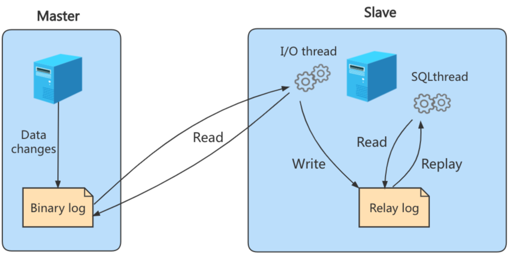

> 注意:
> 不是所有版本的MySQL都默认开启服务器的二进制日志。在进行主从同步的时候，我们需要先检查服务器是否已经开启了二进制日志。
>
> 除非特殊指定，默认情况下从服务器会执行所有主服务器中保存的事件。也可以通过配置，使从服务器执行特定的事件。

##### 复制三步骤

步骤 1 ：`Master`将写操作记录到二进制日志（`binlog`）。

步骤 2 ：`Slave`将`Master`的binary log events拷贝到它的中继日志（`relay log`）；

步骤 3 ：`Slave`重做中继日志中的事件，将改变应用到自己的数据库中。 MySQL复制是异步的且串行化
的，而且重启后从`接入点`开始复制。

**复制的问题**

复制的最大问题：`延时`

### 2. 2 复制的基本原则

- 每个`Slave`只有一个`Master`
- 每个`Slave`只能有一个唯一的服务器ID
- 每个`Master`可以有多个`Slave`

## 3. 一主一从架构搭建

一台`主机`用于处理所有`写请求`，一台从机负责所有读请求，架构图如下：


### 3. 1 准备工作

1 、准备 `2 台`CentOS 虚拟机

2 、每台虚拟机上需要安装好MySQL (可以是MySQL8.0 )

说明：前面我们讲过如何克隆一台CentOS。大家可以在一台CentOS上安装好MySQL，进而通过克隆的方
式复制出 1 台包含MySQL的虚拟机。

注意：克隆的方式需要修改新克隆出来主机的：① `MAC地址` ② `hostname` ③ `IP 地址` ④ `UUID`。

此外，克隆的方式生成的虚拟机（包含MySQL Server），则克隆的虚拟机MySQL Server的UUID相同，必
须修改，否则在有些场景会报错。比如：`show slave status\G`，报如下的错误：


```bash
Last_IO_Error: Fatal error: The slave I/O thread stops because master and slave have
equal MySQL server UUIDs; these UUIDs must be different for replication to work.
```
修改MySQL Server 的UUID方式：

```bash
vim /var/lib/mysql/auto.cnf
systemctl restart mysqld
```


### 3. 2 主机配置文件

建议mysql版本一致且后台以服务运行，主从所有配置项都配置在[mysqld]节点下，且都是小写字母。

具体参数配置如下：

**必选**

```properties
#[必须]主服务器唯一ID
server-id= 1

#[必须]启用二进制日志,指名路径。比如：自己本地的路径/log/mysqlbin
log-bin=atguigu-bin
```
**可选**

```properties
#[可选] 0（默认）表示读写（主机）， 1 表示只读（从机）
read-only= 0

#设置日志文件保留的时长，单位是秒
binlog_expire_logs_seconds= 6000

#控制单个二进制日志大小。此参数的最大和默认值是1GB
max_binlog_size=200M

#[可选]设置不要复制的数据库
binlog-ignore-db=test

#[可选]设置需要复制的数据库,默认全部记录。比如：binlog-do-db=atguigu_master_slave
binlog-do-db=需要复制的主数据库名字

#[可选]设置binlog格式
binlog_format=STATEMENT
```


**binlog格式设置：**

格式 1 ：`STATEMENT模式`（基于SQL语句的复制(statement-based replication, SBR)）

```properties
binlog_format=STATEMENT
```


每一条会修改数据的sql语句会记录到binlog中。这是默认的binlog格式。

- SBR 的优点：
  - 历史悠久，技术成熟
  - 不需要记录每一行的变化，减少了binlog日志量，文件较小
  - binlog中包含了所有数据库更改信息，可以据此来审核数据库的安全等情况
  - binlog可以用于实时的还原，而不仅仅用于复制
  - 主从版本可以不一样，从服务器版本可以比主服务器版本高
- SBR 的缺点：
  - 不是所有的UPDATE语句都能被复制，尤其是包含不确定操作的时候
- 使用以下函数的语句也无法被复制：LOAD_FILE()、UUID()、USER()、FOUND_ROWS()、SYSDATE()(除非启动时启用了 --sysdate-is-now 选项)
  - INSERT ... SELECT 会产生比 RBR 更多的行级锁
  - 复制需要进行全表扫描(WHERE 语句中没有使用到索引)的 UPDATE 时，需要比 RBR 请求更多的行级锁
  - 对于有 AUTO_INCREMENT 字段的 InnoDB表而言，INSERT 语句会阻塞其他 INSERT 语句
  - 对于一些复杂的语句，在从服务器上的耗资源情况会更严重，而 RBR 模式下，只会对那个发生变化的记录产生影响
  - 执行复杂语句如果出错的话，会消耗更多资源
  - 数据表必须几乎和主服务器保持一致才行，否则可能会导致复制出错

**② ROW模式（基于行的复制(row-based replication, RBR)）**

```properties
binlog_format=ROW
```

5.1.5版本的MySQL才开始支持，不记录每条sql语句的上下文信息，仅记录哪条数据被修改了，修改成什么样了。

- RBR 的优点：
  - 任何情况都可以被复制，这对复制来说是最`安全可靠`的。（比如：不会出现某些特定情况下的存储过程、function、trigger的调用和触发无法被正确复制的问题）
  - 多数情况下，从服务器上的表如果有主键的话，复制就会快了很多
  - 复制以下几种语句时的行锁更少：INSERT ... SELECT、包含 AUTO_INCREMENT 字段的 INSERT、没有附带条件或者并没有修改很多记录的 UPDATE 或 DELETE 语句
  - 执行 INSERT，UPDATE，DELETE 语句时锁更少
  - 从服务器上采用`多线程`来执行复制成为可能
- RBR 的缺点：
  - binlog 大了很多
  - 复杂的回滚时 binlog 中会包含大量的数据
  - 主服务器上执行 UPDATE 语句时，所有发生变化的记录都会写到 binlog 中，而 SBR 只会写一次，这会导致频繁发生 binlog 的并发写问题
  - 无法从 binlog 中看到都复制了些什么语句

**③ MIXED模式（混合模式复制(mixed-based replication, MBR)）**

```properties
binlog_format=MIXED
```

从5.1.8版本开始，MySQL提供了Mixed格式，实际上就是Statement与Row的结合。

在Mixed模式下，一般的语句修改使用statment格式保存binlog。如一些函数，statement无法完成主从复制的操作，则采用row格式保存binlog。

MySQL会根据执行的每一条具体的sql语句来区分对待记录的日志形式，也就是在Statement和Row之间选择一种。

### 3. 3 从机配置文件

要求主从所有配置项都配置在my.cnf的[mysqld]栏位下，且都是小写字母。

**必选**

```properties
#[必须]从服务器唯一ID
server-id= 2
```

**可选**

```properties
#[可选]启用中继日志
relay-log=mysql-relay
```


重启后台mysql服务，使配置生效。

> 注意：主从机都关闭防火墙
>
> service iptables stop #CentOS 6
>
> systemctl stop firewalld.service #CentOS 7


### 3. 4 主机：建立账户并授权

```mysql
#在主机MySQL里执行授权主从复制的命令
GRANT REPLICATION SLAVE ON *.* TO 'slave1'@'从机器数据库IP' IDENTIFIED BY 'abc123';
#5.5,5.
```


**注意：如果使用的是MySQL8，需要如下的方式建立账户，并授权slave：**

```mysql
CREATE USER 'slave1'@'%' IDENTIFIED BY '123456';
GRANT REPLICATION SLAVE ON *.* TO 'slave1'@'%';

#此语句必须执行。否则见下面。
ALTER USER 'slave1'@'%' IDENTIFIED WITH mysql_native_password BY '123456';

flush privileges;
```


> 注意：在从机执行show slave status\G时报错：
>
> Last_IO_Error: error connecting to master 'slave1@192.168.1.150:3306' - retry-time: 60 retries: 1
> message: Authentication plugin 'caching_sha2_password' reported error: Authentication requires
> secure connection.


查询Master的状态，并记录下File和Position的值。

```mysql
show master status;

```

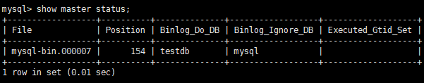

- 记录下File和Position的值

> 注意：执行完此步骤后 不要再操作主服务器MySQL ，防止主服务器状态值变化。


### 3. 5 从机：配置需要复制的主机

**步骤 1 ： 从机上复制主机的命令**

```mysql
CHANGE MASTER TO
MASTER_HOST='主机的IP地址',
MASTER_USER='主机用户名',
MASTER_PASSWORD='主机用户名的密码',
MASTER_LOG_FILE='mysql-bin.具体数字',
MASTER_LOG_POS=具体值;
```


举例：

```mysql
CHANGE MASTER TO
MASTER_HOST='192.168.1.150',MASTER_USER='slave1',MASTER_PASSWORD='123456',MASTER_LOG_F
ILE='atguigu-bin.000007',MASTER_LOG_POS= 154 ;
```
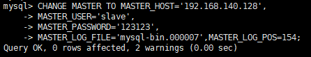

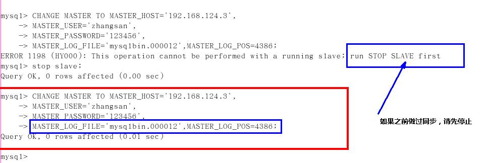


步骤 2 ：

```mysql
#启动slave同步
START SLAVE;
```

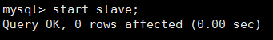

如果报错：

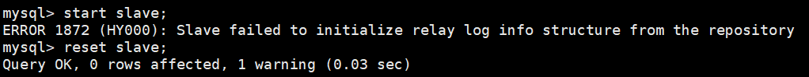

可以执行如下操作，删除之前的relay_log信息。然后重新执行 CHANGE MASTER TO ...语句即可。

```mysql
mysql> reset slave; #删除SLAVE数据库的relaylog日志文件，并重新启用新的relaylog文件
```
接着，查看同步状态：

```mysql
SHOW SLAVE STATUS\G;
```
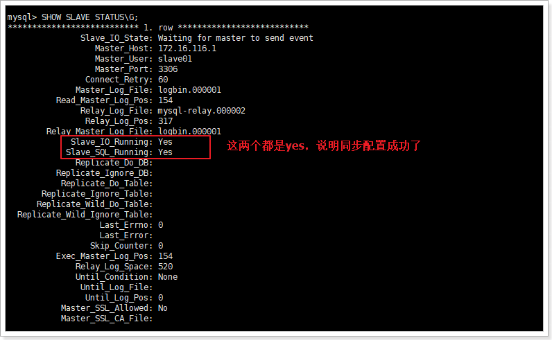

> 上面两个参数都是Yes，则说明主从配置成功！

**显式如下的情况，就是不正确的。可能错误的原因有：**

1. 网络不通
2. 账户密码错误
3. 防火墙
4. mysql配置文件问题
5. 连接服务器时语法
6. 主服务器mysql权限

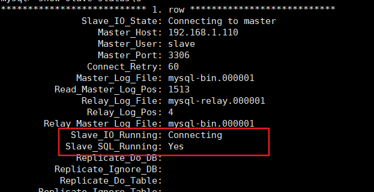

### 3. 6 测试

主机新建库、新建表、insert记录，从机复制：

```mysql
CREATE DATABASE atguigu_master_slave;
CREATE TABLE mytbl(id INT,NAME VARCHAR( 16 ));		
INSERT INTO mytbl VALUES( 1 , 'zhang3');
INSERT INTO mytbl VALUES( 2 ,@@hostname);
```


### 3. 7 停止主从同步

- 停止主从同步命令：

  ```mysql
  stop slave;
  ```

- 如何重新配置主从

  如果停止从服务器复制功能，再使用需要重新配置主从。否则会报错如下：

  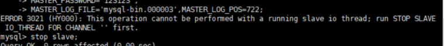

  重新配置主从，需要在从机上执行：

  ```mysql
  stop slave;
  
  reset master; #删除Master中所有的binglog文件，并将日志索引文件清空，重新开始所有新的日志文件(慎用)
  ```

  

### 3. 8 后续

##### 搭建主从复制：双主双从

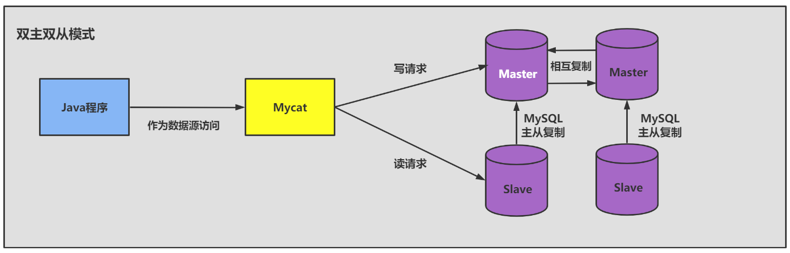


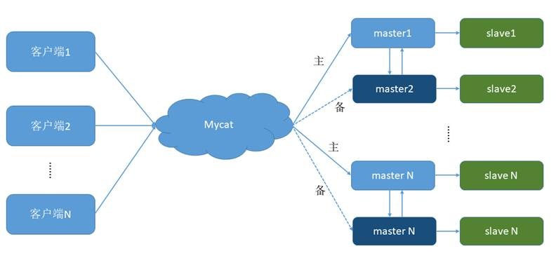

## 4. 同步数据一致性问题

**主从同步的要求：**

- 读库和写库的数据一致(最终一致)；
- 写数据必须写到写库；
- 读数据必须到读库(不一定)；

### 4. 1 理解主从延迟问题

进行主从同步的内容是二进制日志，它是一个文件，在进行`网络传输`的过程中就一定会`存在主从延迟`（比如 500 ms），这样就可能造成用户在从库上读取的数据不是最新的数据，也就是主从同步中的`数据不一致性`问题。

**举例:**导致主从延迟的时间点主要包括以下三个:

1.主库A执行完成一个事务，写入binlog，我们把这个时刻记为T1;

2之后传给从库B，我们把从库B接收完这个binlog的时刻记为T2;

3．从库B执行完成这个事务，我们把这个时刻记为T3。

### 4. 2 主从延迟问题原因

在网络正常的时候，日志从主库传给从库所需的时间是很短的，即T 2 - T 1 的值是非常小的。即，网络正常情况下，主备延迟的主要来源是备库接收完binlog和执行完这个事务之间的时间差。


**主备延迟最直接的表现是，从库消费中继日志（relay log）的速度，比主库生产binlog的速度要慢。** 造成原因：

1 、从库的机器性能比主库要差

2 、从库的压力大

3 、大事务的执行


**举例 1 ：** 一次性用delete语句删除太多数据

结论：后续再删除数据的时候，要控制每个事务删除的数据量，分成多次删除。

**举例 2 ：** 一次性用insert...select插入太多数据

**举例: 3 ：** 大表DDL

比如在主库对一张500W的表添加一个字段耗费了 10 分钟，那么从节点上也会耗费 10 分钟。

### 4. 3 如何减少主从延迟

**若想要减少主从延迟的时间，可以采取下面的办法：**

1. 降低多线程大事务并发的概率，优化业务逻辑
1. 优化SQL，避免慢SQL，`减少批量操作`，建议写脚本以update-sleep这样的形式完成。
3. `提高从库机器的配置`，减少主库写binlog和从库读binlog的效率差。
4. 尽量采用`短的链路`，也就是主库和从库服务器的距离尽量要短，提升端口带宽，减少binlog传输的网络延时。
5. 实时性要求的业务读强制走主库，从库只做灾备，备份。


### 4. 4 如何解决一致性问题

如果操作的数据存储在同一个数据库中，那么对数据进行更新的时候，可以对记录加写锁，这样在读取的时候就不会发生数据不一致的情况。但这时从库的作用就是备份，并没有起到读写分离，分担主库读压力的作用。

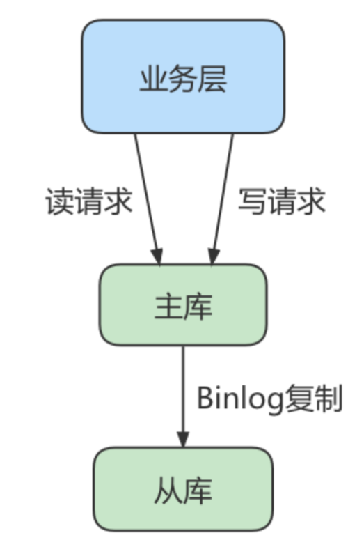

读写分离情况下，解决主从同步中数据不一致的问题， 就是解决主从之间`数据复制方式`的问题，如果按照数据一致性`从弱到强来`进行划分，有以下 3 种复制方式。

#### 方法 1 ：异步复制

异步模式就是客户端提交COMMIT之后不需要等从库返回任何结果，而是直接将结果返回给客户端，这样做的好处是不会影响主库写的效率，但可能会存在主库宕机，而Binlog还没有同步到从库的情况，也就是此时的主库和从库数据不一致。这时候从从库中选择一个作为新主，那么新主则可能缺少原来主服务器中已提交的事务。所以，这种复制模式下的数据一致性是最弱的。


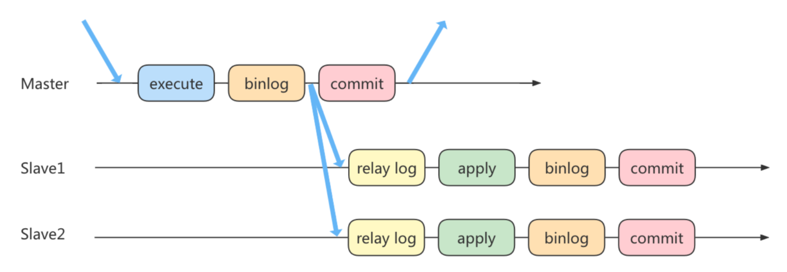

#### 方法 2 ：半同步复制

MySQL5.5版本之后开始支持半同步复制的方式。原理是在客户端提交COMMIT之后不直接将结果返回给客户端，而是等待至少有一个从库接收到了Binlog，并且写入到中继日志中，再返回给客户端。

这样做的好处就是提高了数据的一致性，当然相比于异步复制来说，至少多增加了一个网络连接的延迟，降低了主库写的效率。

在MySQL5.7版本中还增加了一个rpl_semi_sync_master_wait_for_slave_count参数，可以对应答的从库数量进行设置，默认为1，也就是说只要有1个从库进行了响应，就可以返回给客户端。如果将这个参数调大，可以提升数据一致性的强度，但也会增加主库等待从库响应的时间。

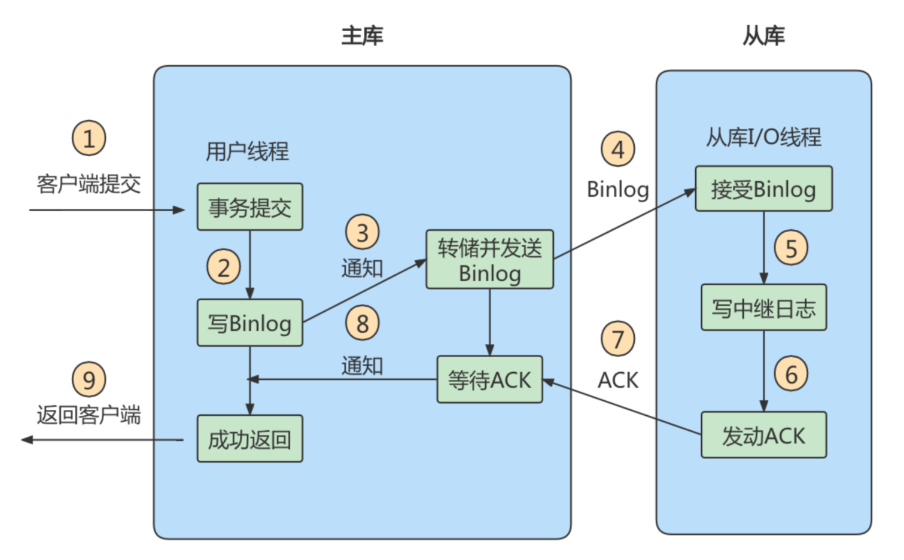

#### 方法 3 ：组复制

异步复制和半同步复制都无法最终保证数据的一致性问题，半同步复制是通过判断从库响应的个数来决定是否返回给客户端，虽然数据一致性相比于异步复制有提升，但仍然无法满足对数据一致性要求高的场景，比如金融领域。MGR 很好地弥补了这两种复制模式的不足。

组复制技术，简称 MGR（MySQL Group Replication）。是 MySQL 在 5.7.17 版本中推出的一种新的数据复
制技术，这种复制技术是基于 Paxos 协议的状态机复制。

**MGR 是如何工作的**

首先我们将多个节点共同组成一个复制组，在`执行读写（RW）事务`的时候，需要通过一致性协议层
（Consensus 层）的同意，也就是读写事务想要进行提交，必须要经过组里“大多数人”（对应 Node 节
点）的同意，大多数指的是同意的节点数量需要大于 （N/2+1），这样才可以进行提交，而不是原发起
方一个说了算。而针对`只读（RO）事务`则不需要经过组内同意，直接 COMMIT 即可。

在一个复制组内有多个节点组成，它们各自维护了自己的数据副本，并且在一致性协议层实现了原子消
息和全局有序消息，从而保证组内数据的一致性。

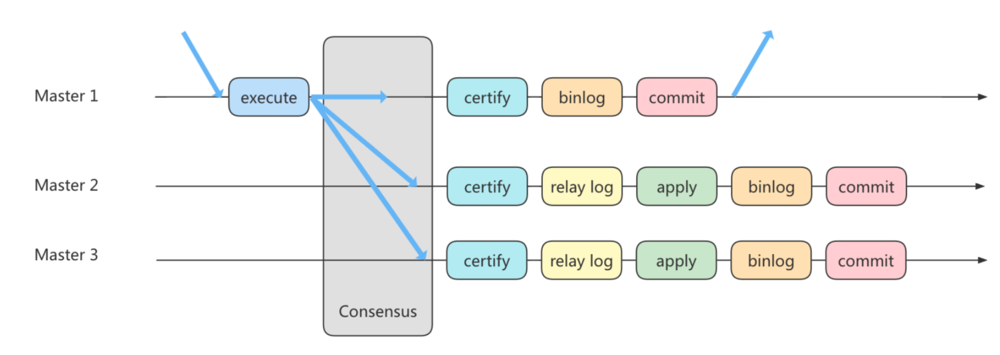

MGR 将 MySQL 带入了数据强一致性的时代，是一个划时代的创新，其中一个重要的原因就是MGR 是基
于 Paxos 协议的。Paxos 算法是由 2013 年的图灵奖获得者 Leslie Lamport 于 1990 年提出的，有关这个算
法的决策机制可以搜一下。事实上，Paxos 算法提出来之后就作为`分布式一致性算法`被广泛应用，比如
Apache 的 ZooKeeper 也是基于 Paxos 实现的。

## 5. 知识延伸

在主从架构的配置中，如果想要采取读写分离的策略，我们可以`自己编写程序`，也可以通过`第三方的中间件`来实现。

- 自己编写程序的好处就在于比较自主，我们可以自己判断哪些查询在从库上来执行，针对实时性要求高的需求，我们还可以考虑哪些查询可以在主库上执行。同时，程序直接连接数据库，减少了中间件层，相当于减少了性能损耗。

- 采用中间件的方法有很明显的优势，功能强大，使用简单。但因为在客户端和数据库之间增加了中间件层会有一些性能损耗，同时商业中间件也是有使用成本的。我们也可以考虑采取一些优秀的开源工具。

  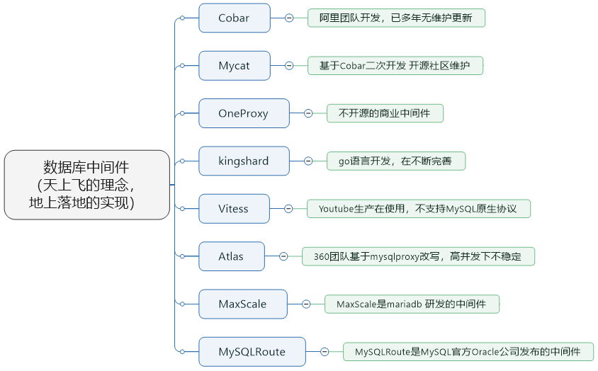

① Cobar属于阿里B2B事业群，始于 2008 年，在阿里服役 3 年多，接管3000+个MySQL数据库的schema,集群日处理在线SQL请求 50 亿次以上。由于Cobar发起人的离职，Cobar停止维护。

② Mycat是开源社区在阿里cobar基础上进行二次开发，解决了cobar存在的问题，并且加入了许多新的功能在其中。青出于蓝而胜于蓝。

③ OneProxy基于MySQL官方的proxy思想利用c语言进行开发的，OneProxy是一款商业收费的中间件。舍弃了一些功能，专注在性能和稳定性上。

④ kingshard由小团队用go语言开发，还需要发展，需要不断完善。

⑤ Vitess是Youtube生产在使用，架构很复杂。不支持MySQL原生协议，使用需要大量改造成本。

⑥ Atlas是 360 团队基于mysql proxy改写，功能还需完善，高并发下不稳定。

⑦ MaxScale是mariadb（MySQL原作者维护的一个版本） 研发的中间件

⑧ MySQLRoute是MySQL官方Oracle公司发布的中间件

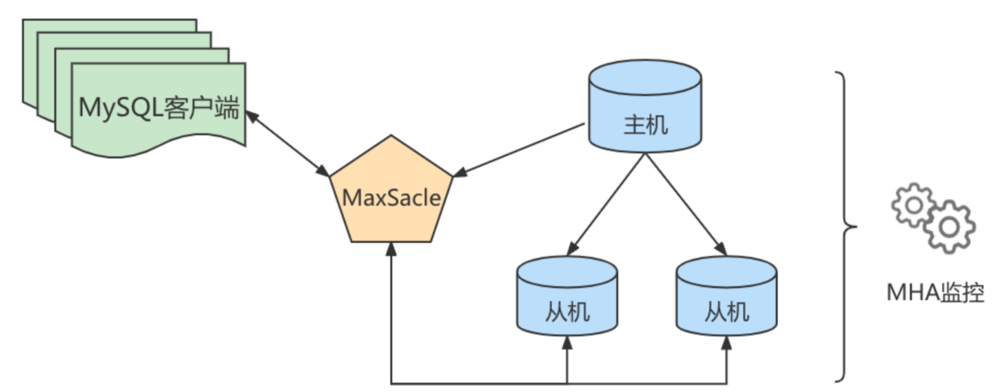

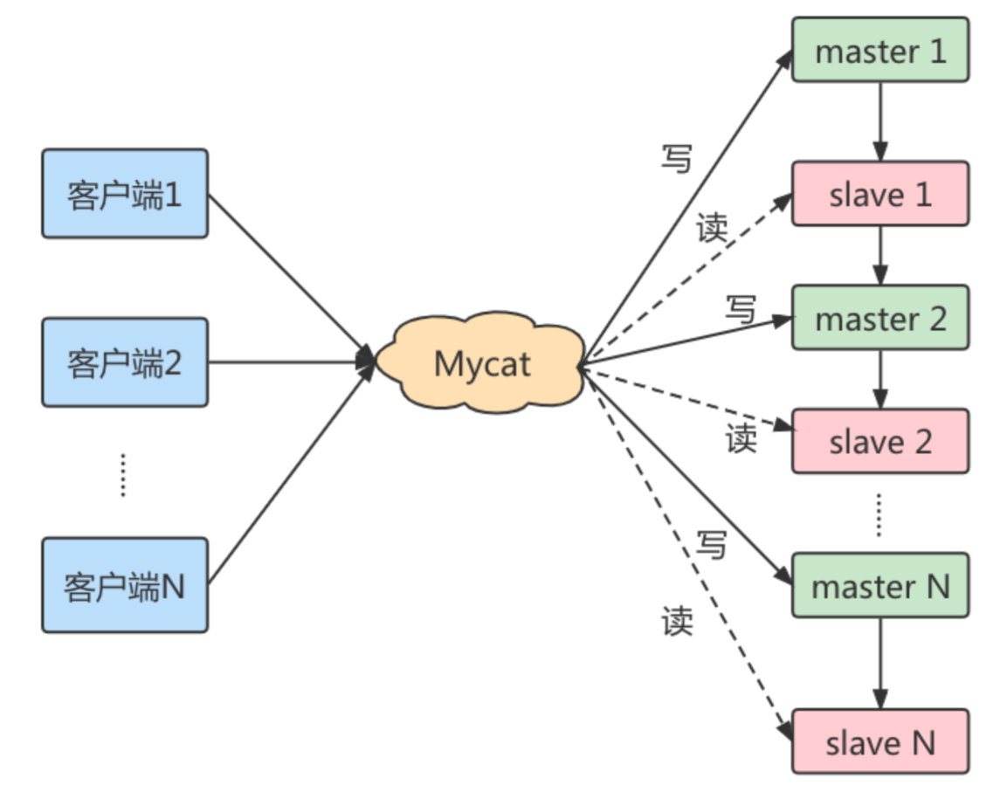

主备切换：

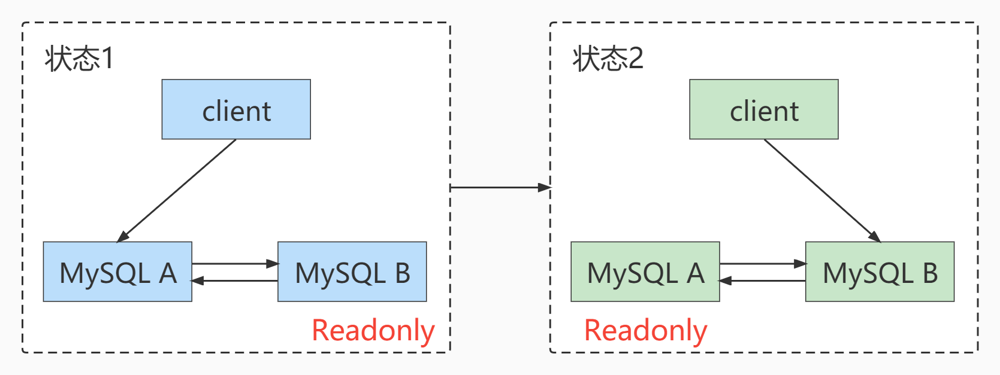

- 主动切换
- 被动切换

- 如何判断主库出问题了？如何解决过程中的数据不一致性问题？