[TOC]

# 学习Redis


## 单线程架构

每次客户端调用：

1.发送命令--------------> 2.执行命令-----------> 3.返回结果

其中第2步是要重点讨论的，因为Reddis 是的单线程处理命令的，所以一条命令从客户端达到服务端不会立刻被执行，所有命令都会进入到一个队列中逐个被执行。


### 为什么单线程能这么快

1. 纯内存访问。
2. 非阻塞IO,Redis 使用epoll作为IO多路复用技术的实现。加上Redis自身的事件处理模型将epoll中的链接、读写、关闭都转换成时间，不在网络IO上浪费过多的时间。

​		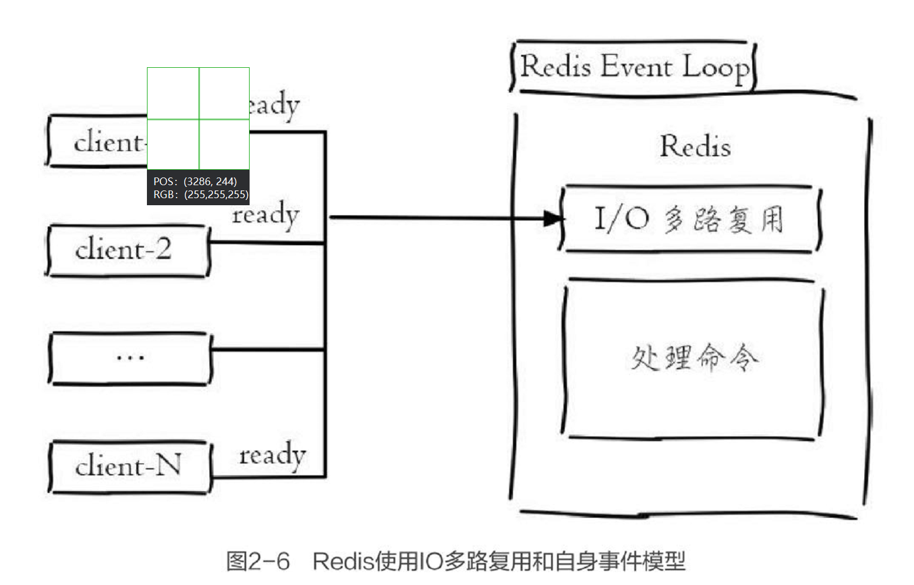

3. 单线程避免了线程切换和静态产生的消耗


## 数据结构

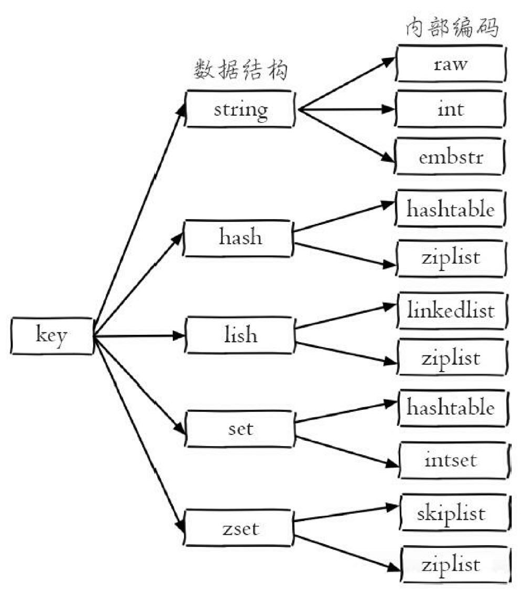

### String 

内部数据结构

1. int
2. embstr： <= 39个字节的字符串
3. raw: > 39的字符串

#### 使用场景

- 缓存功能

- 计数器，

  - 订单号。

  		- 点赞数

  - 共享session

  - 限速

    例如短信接口不能频繁访问 1分钟只能发5次

### 哈希

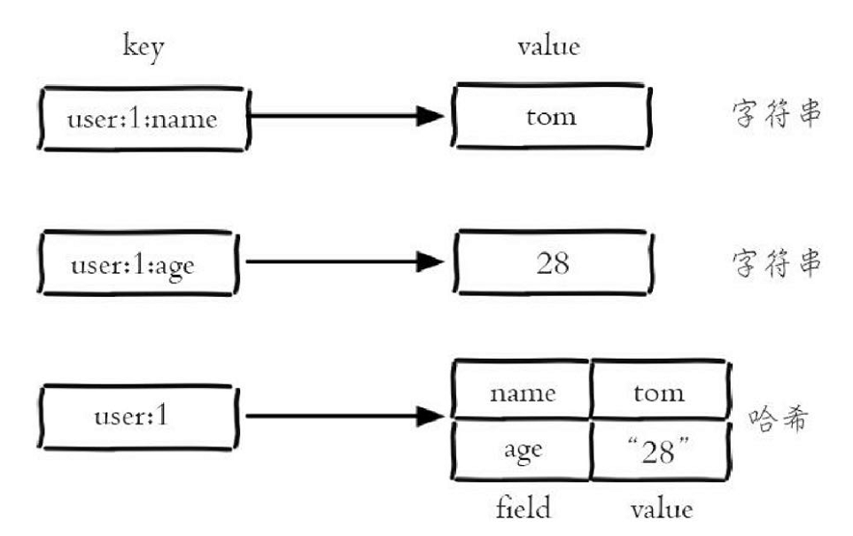


#### 内部编码

- ziplist（压缩列表）

  当哈希类型元素个数小于hash-max-ziplist-entries配置（默认512个）、同时所有值都小于hash-max-ziplist-value配置（默认64字节）时，Redis会使用ziplist作为哈希的内部实现，ziplist使用更加紧凑的结构实现多个元素的连续存储，所以在节省内存方面比hashtable更加优秀。

- hashtable （哈希表）

  当哈希类型无法满足ziplist的条件时，Redis会使用hashtable作为哈希的内部实现，因为此时ziplist的读写效率会下降，而hashtable的读写时间复杂度为O（1）。

  

下面的示例演示了哈希类型的内部编码，以及相应的变化。

 1）当field个数比较少且没有大的value时，内部编码为ziplist：

```bash
 127.0.0.1:6379> hmset hashkey f1 v1 f2 v2 
 OK 
 127.0.0.1:6379> object encoding hashkey 
 "ziplist"
```


 2.1）当有value大于64字节，内部编码会由ziplist变为hashtable：

```bash
 127.0.0.1:6379> hset hashkey f3 "one string is bigger than 64 byte...忽略..." 
 OK 
 127.0.0.1:6379> object encoding hashkey 
 "hashtable"
```


2.2）当field个数超过512，内部编码也会由ziplist变为hashtable：

```bash
 127.0.0.1:6379> hmset hashkey f1 v1 f2 v2 f3 v3 ...忽略... f513 v513 
 OK 
 127.0.0.1:6379> object encoding hashkey 
 "hashtable"
```

#### 使用场景

可以将用户的信息放到hashMap里面。

对比三种缓存方法缓存用户的优缺点。

1）原生字符串类型：每个属性一个键。

```bash
 set user:1:name tom 
 set user:1:age 23 
 set user:1:city beijing
```


 优点：简单直观，每个属性都支持更新操作。

缺点：占用过多的键，内存占用量较大，同时用户信息内聚性比较差，所以此种方案一般不会在生产环境使用。

 2）序列化字符串类型：将用户信息序列化后用一个键保存。

```bash
 set user:1 serialize(userInfo)
```


 优点：简化编程，如果合理的使用序列化可以提高内存的使用效率。
 缺点：序列化和反序列化有一定的开销，同时每次更新属性都需要把全部数据取出进行反序列化，更新后再序列化到Redis中。

 3）哈希类型：每个用户属性使用一对field-value，但是只用一个键保存。

```bash
 hmset user:1 name tom age 23 city beijing
```


 优点：简单直观，如果使用合理可以减少内存空间的使用。
 缺点：要控制哈希在ziplist和hashtable两种内部编码的转换，hashtable会消耗更多内存。


### 列表List

一个列表最多可以存储 2^32-1个元素。


| 操作类型 | 操作                 |
| -------- | -------------------- |
| 添加     | rpush lpush linsert  |
| 查询     | lrange index llen    |
| 删除     | lpop rpop lrem ltrim |
| 修改     | lset                 |
| 阻塞操作 | blpop brpop          |


#### 操作

没用过的进行笔记

- linsert :  

  向某个元素前或者后插入元素

  ```bash
  linsert key before|after pivot value
  ```

  

   linsert命令会从列表中找到等于pivot的元素，在其前（before）或者后（after）插入一个新的元素value，例如下面操作会在列表的元素b前插入java：

  ```bash
   127.0.0.1:6379> linsert listkey before b java 
   (integer) 4
  ```

   返回结果为4，代表当前命令的长度，当前列表变为个

- lrem: 删除指定元素

  lrem命令会从列表中找到等于value的元素进行删除，根据count的不同分为三种情况：

  - count>0，从左到右，删除最多count个元素。
  - count<0，从右到左，删除最多count绝对值个元素。
  - ount=0，删除所有。	

  例如向列表从左向右插入5个a，那么当前列表变为“a a a a a java b a”，下面操作将从列表左边开始删除4个为a的元素：

  ```bash
  127.0.0.1:6379> lrem listkey 4 a 
  (integer) 4 
  127.0.0.1:6379> lrange listkey 0 -1 
  1) "a" 
  2) "java" 
  3) "b" 
  4) "a"
  ```

  

​	

- ltrim 留下索引范围的列表

  ```bash 
  ltrim key start end
  # start 到 end 部分会被留下，其他删除

- blpop： 弹出元素如果没有的话，会等到时间结束。如果timeout = 0 ，客户端会一直阻塞下去。

#### 内部编码

- ziplist（压缩列表）：当列表的元素个数小于list-max-ziplist-entries配置（默认512个），同时列表中每个元素的值都小于list-max-ziplist-value配置时（默认64字节），Redis会选用ziplist来作为列表的内部实现来减少内存的使用。
- linkedlist（链表）：当列表类型无法满足ziplist的条件时，Redis会使用linkedlist作为列表的内部实现。


#### 使用场景

- 消息队列
  - 可以用阻塞式'抢'列表尾部元素

- 文章列表

  每个用户有属于自己的文章列表，需要分页展示文章列表。

- 开发提示
  - lpush + lpop = stack （栈）
  - lpush + rpop = queue （队列）
  - lpush + ltrim = Capped Collection （有限集合）
  - lpush + brpop = message queue (消息队列)

### 集合

常用命令，

| 命令z                                 | 作用                         |
| ------------------------------------- | ---------------------------- |
| sadd key element  [element ...]       | 增加成员                     |
| srem key element [element...]         | 删除成员                     |
| scard key                             | 计算元素个数                 |
| sismember key element                 | 是否在集合中                 |
| srandmember key [count]               | 随机拿出count 个成员         |
| spop key                              | 随机弹出一个                 |
| smembers key                          | 拿出所有成员                 |
| sinter key [key ...]                  | 交集                         |
| suion key [key ...]                   | 并集                         |
| sdiff key [key ...]                   | key1 - key2                  |
| sinterstore destination key [key ...] | 交集保存到destination        |
| suionstore destination key [key ...]  | 保存到destination            |
| sdiffstore destination key [key ...]  | key1 - key2保存到destination |

#### 内部编码

- intset（整数集合）：当集合中的元素都是整数且元素个数小于set-max-intset-entries配置（默认512个）时，Redis会选用intset来作为集合的内部实现，从而减少内存的使用。
- hashtable（哈希表）：当集合类型无法满足intset的条件时，Redis会使用hashtable作为集合的内部实现。

下面用示例来说明：
 1）当元素个数较少且都为整数时，内部编码为intset：

 ```bash
 127.0.0.1:6379> sadd setkey 1 2 3 4 
 (integer) 4 
 127.0.0.1:6379> object encoding setkey
 "intset"
 ```


 2.1）当元素个数超过512个，内部编码变为hashtable：

```bashf
 127.0.0.1:6379> sadd setkey 1 2 3 4 5 6 ... 512 513 
 (integer) 509 
 127.0.0.1:6379> scard setkey 
 (integer) 513 
 127.0.0.1:6379> object encoding listkey 
 "hashtable"
```


 2.2）当某个元素不为整数时，内部编码也会变为hashtable：

```bash
127.0.0.1:6379> sadd setkey a 
(integer) 1 
127.0.0.1:6379> object encoding setkey 
"hashtable"
```


#### 使用场景

- 贴标签

​		集合类型比较典型的使用场景是标签（tag）。例如一个用户可能对娱乐、体育比较感兴趣，另一个用户可能对历史、新闻比较感兴趣，这些兴趣点就是标签。有了这些数据就可以得到喜欢同一个标签的人，以及用户的共同喜好的标签，这些数据对于用户体验以及增强用户黏度比较重要。例如一个电子商务的网站会对不同标签的用户做不同类型的推荐，比如对数码产品比较感兴趣的人，在各个页面或者通过邮件的形式给他们推荐最新的数码产品，通常会为网站带来更多的利益。

- 开发提示
  - sadd = Tagging (标签)
  - spop/srandmember = Random item (生成随机数， 比如抽奖)
  - sadd + sinter = Social Graph (社交需求)


### 有序集合


#### 操作


| 命令                                                         | 作用                                              |
| ------------------------------------------------------------ | ------------------------------------------------- |
| zadd key score member [score member ...]                     | 添加成员                                          |
| zcard key                                                    | 统计成员个数                                      |
| zscore key member                                            | 获得成员分数                                      |
| zrank key member                                             | 成员排多少名，升序从0开始计算。无并列同一名的情况 |
| zrevrank key member                                          | 倒序                                              |
| zrem key member [member ...]                                 | 删除成员                                          |
| zincrby key increment member                                 | 增加成员分数                                      |
| zrange key start end [withscores]                            | 返回指定排名。加上withscores会顺带返回分数。      |
| zrevrange key start end [withscores]                         |                                                   |
| zrangebyscore key min max [withscores] [limit offset count]  | 返回指定分数的成员                                |
| zrevrangebyscore key min max [withscores] [limit offset count] |                                                   |
| zcount key min max                                           | 返回指定分数有多少成员                            |
| zremrangebyrank key start end                                | 删除排名成员                                      |
| zremrangebyscore key min max                                 | 删除指定成绩成员                                  |
| zinterstore destination numkeys key [key ...]                | 交集                                              |
| zunionstore destination numberkeys key [key ...]             | 并集                                              |
|                                                              |                                                   |


#### 内部编码


- ziplist（压缩列表）：当有序集合的元素个数小于zset-max-ziplist-entries配置（默认128个），同时每个元素的值都小于zset-max-ziplist-value配置（默认64字节）时，Redis会用ziplist来作为有序集合的内部实现，ziplist可以有效减少内存的使用。

- skiplist（跳跃表）：当ziplist条件不满足时，有序集合会使用skiplist作为内部实现，因为此时ziplist的读写效率会下降。

   下面用示例来说明：
   1）当元素个数较少且每个元素较小时，内部编码为skiplist：

  ```bash
  127.0.0.1:6379> zadd zsetkey 50 e1 60 e2 30 e3 (integer) 3 127.0.0.1:6379> object encoding zsetkey "ziplist"
  ```

   2.1）当元素个数超过128个，内部编码变为ziplist：

  ```bash
   127.0.0.1:6379> zadd zsetkey 50 e1 60 e2 30 e3 12 e4 ...忽略... 84 e129 
   (integer) 
   129 127.0.0.1:6379> object encoding zsetkey 
   "skiplist"
  ```

   2.2）当某个元素大于64字节时，内部编码也会变为hashtable：

  ```bash
  127.0.0.1:6379> zadd zsetkey 20 "one string is bigger than 64 byte.............     ..................." 
  (integer) 1 
  127.0.0.1:6379> object encoding zsetkey
  "skiplist"
  ```

  - 跳表是什么？
    - 跳表实际是做了多级索引，例如每3个元素抽一个元素出来做索引。这样可以加快查找。
    - 
  - 为什么不用红黑树或者二叉树呢？
    - 跳表实现了范围查找，而且比红黑树简单。

#### 使用场景

排名系统


### 键管理

- 单个键

- 遍历键

- 数据库

  

#### 单个键

- 键重命名： rename key newkey,会覆盖已经存在的key
  - `renamenx key newkey` 可以防止被覆盖
  - 在使用重命名命令时，有两点需要注意：
    - 由于重命名键期间会执行del命令删除旧的键，如果键对应的值比较大，会存在阻塞Redis的可能性，这点不要忽视。
    - 如果rename和renamenx中的key和newkey如果是相同的，在Redis3.2和之前版本返回结果略有不同。
- 随机返回一个key: randomkey
- 键过期：
  -  `expire key seconds` 
  - `expireat key timestamp` 键在秒级时间戳 timestamp后过期
  - 还有毫秒级方案 ...
  - ttl 剩余生命 秒
    - -1 ：没有设置过期
    - -2 ：不存在
  - pttl 剩余毫秒
  - 注意
    - expire key 的键不存在 返回结果0
    - persist 可以删除过期时间
    - 对于字符串类型，**执行set 命令会去掉过期时间**

##### 迁移键

迁移键功能非常重要，因为有时候我们只想把部分数据由一个Redis迁移到另一个Redis（例如从生产环境迁移到测试环境），Redis发展历程中提供了move、dump+restore、migrate三组迁移键的方法，它们的实现方式以及使用的场景不太相同，下面分别介绍。

**(1）move**

```bash
 move key db
```


 如图2-26所示，move命令用于在Redis内部进行数据迁移，Redis内部可以有多个数据库，由于多个数据库功能后面会进行介绍，这里只需要知道Redis内部可以有多个数据库，彼此在数据上是相互隔离的，move key db就是把指定的键从源数据库移动到目标数据库中，但笔者认为多数据库功能不建议在生产环境使用，所以这个命令读者知道即可。

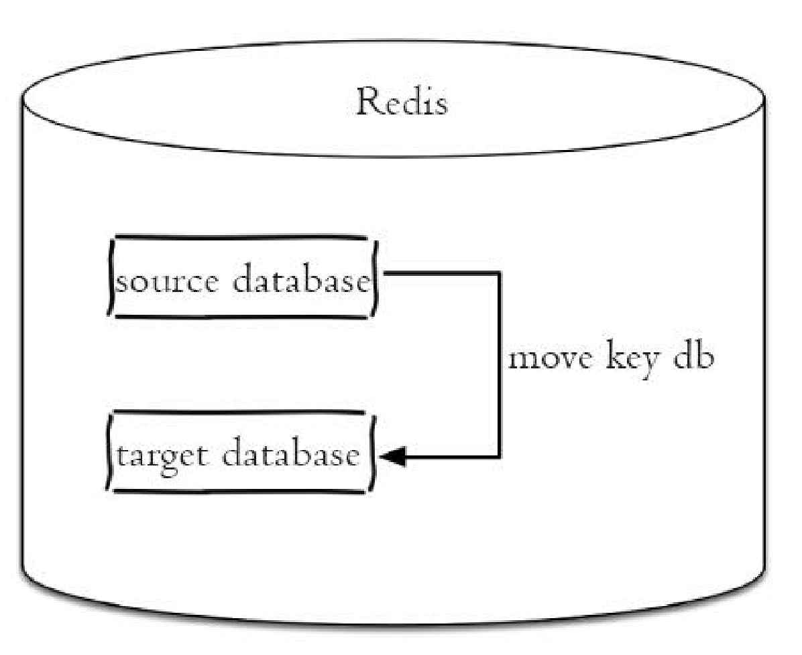

**（2）dump+restore**

```java
 dump key 
 restore key ttl value
```


 dump+restore可以实现在不同的Redis实例之间进行数据迁移的功能，整个迁移的过程分为两步：
 1）在源Redis上，dump命令会将键值序列化，格式采用的是RDB格式。
 2）在目标Redis上，restore命令将上面序列化的值进行复原，其中ttl参数代表过期时间，如果ttl=0代表没有过期时间。
 整个过程如图2-27所示。

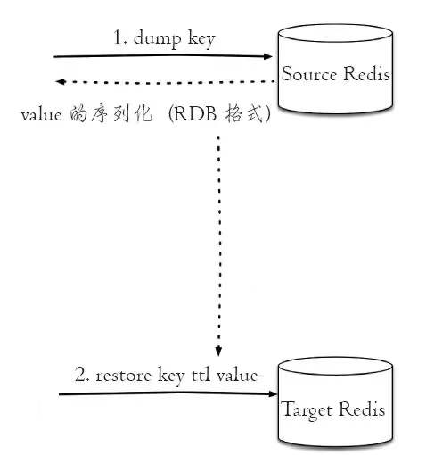

有两点需要注意：第一，整个迁移过程并非原子性的，而是通过客户端分步完成的。第二，迁移过程是开启了两个客户端连接，所以dump的结果不是在源Redis和目标Redis之间进行传输，下面用一个例子演示完整过程。
 1）在源Redis上执行dump：

```bash
 redis-source> set hello world 
 OK 
 redis-source> dump hello 
 "\x00\x05world\x06\x00\x8f<T\x04%\xfcNQ"
```


 2）在目标Redis上执行restore：

```bash
redis-target> get hello 
(nil) 
redis-target> restore hello 0 
"\x00\x05world\x06\x00\x8f<T\x04%\xfcNQ" OK 
redis-target> get hello 
"world"
```

**（3）migrate**

```bash
 migrate host port key|"" destination-db timeout [copy] [replace] [keys key [key ...]]
```


migrate命令也是用于在Redis实例间进行数据迁移的，实际上migrate命令就是将dump、restore、del三个命令进行组合，从而简化了操作流程。migrate命令具有原子性，而且从Redis3.0.6版本以后已经支持迁移多个键的功能，有效地提高了迁移效率，migrate在10.4节水平扩容中起到重要作用。

 整个过程如下图所示，实现过程和dump+restore基本类似，但是有3点不太相同：第一，整个过程是原子执行的，不需要在多个Redis实例上开启客户端的，只需要在源Redis上执行migrate命令即可。第二，migrate命令的数据传输直接在源Redis和目标Redis上完成的。第三，目标Redis完成restore后会发送OK给源Redis，源Redis接收后会根据migrate对应的选项来决定是否在源Redis上删除对应的键。

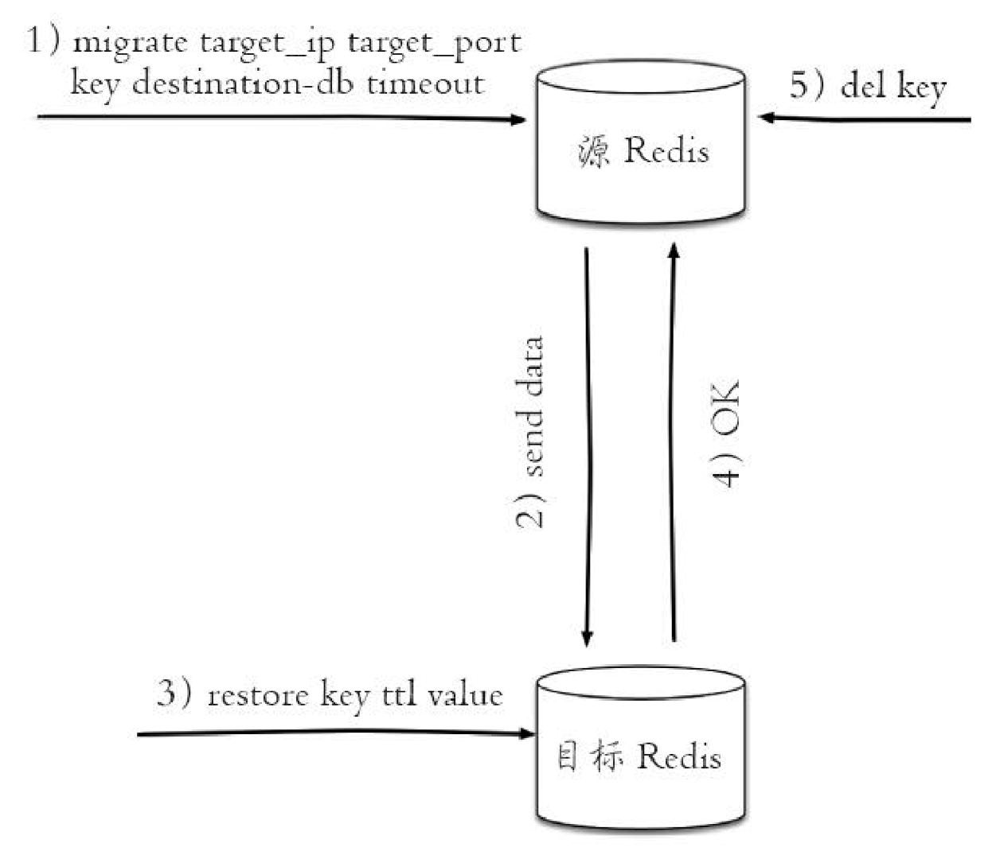


详细操作翻书


###### 总结

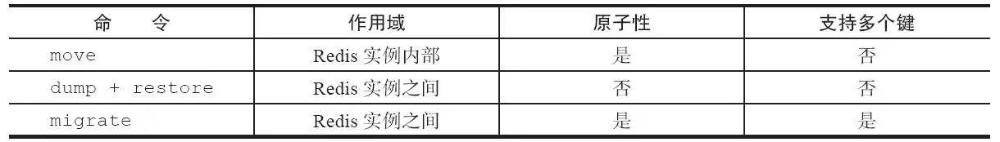


#### 遍历键

全量遍历：keys 

渐进式：scan

##### 0.glob风格通配符

- 符号：？

​		含义：匹配一个字符

- 符号：*

​		含义：匹配任意个（包括0个）字符

- 符号：[]

  含义：匹配括号间的任一字符，可以使用“-”符号表示一个范围，如a[b-d]，可以匹配ab,ac,ad

  ```bash
  127.0.0.1:6379> keys [j,r]edis
  1) "jedis" 
  2) "redis"
  ```

- 符号：\x

​		含义：匹配字符x，用于转义符号。例如匹配“?”就需要使用 ?


##### 1. 全量遍历键

```bash
keys pattern
# pattern 使用glob风格通配符
```

在使用keys 可以轻松获取key,但如果考虑到Redis的单线程架构就不那么美妙了，如果Redis包含了大量的键，执行keys命令很可能会造成Redis阻塞，所以一般建议不要在生产环境下使用keys命令。但有时候确实有遍历键的需求该怎么办，可以在以下三种情况使用：

- 在一个不对外提供服务的Redis从节点上执行，这样不会阻塞到客户端的请求，但是会影响到主从复制
- 如果确认键值总数确实比较少，可以执行该命令。
- 使用下面要介绍的scan命令渐进式的遍历所有键，可以有效防止阻塞。

##### 2. 渐进式遍历键

```bash
scan cursor [match pattern] [count number]
```

将数据库分区来进行扫描，扫描后返回偏移量，直到偏移量变成0 则遍历完


###### 其他scan

除了scan ，还有为了解决 hgetall、smembers、zrange，可以使用hscan、sscan、zscan


###### 注意

渐进式遍历可以有效的解决keys命令可能产生的阻塞问题，但是scan并非完美无瑕，如果在scan的过程中如果有键的变化（增加、删除、修改），那么遍历效果可能会碰到如下问题：**新增的键可能没有遍历到**，遍历出了重复的键等情况，也就是说scan并不能保证完整的遍历出来所有的键，这些是我们在开发时需要考虑的。

#### 数据库管理

- dbsize
- select 
- flushdb/flushall ： 删除自身/删除全部

##### 切换数据库

```bash
select dbindex
```

多个数据库看起来很美好，但Redis3.0中已经逐渐弱化这个功能，例如Redis的分布式实现Redis Cluster只允许使用0号数据库，只不过为了向下兼容老版本的数据库功能，该功能没有完全废弃掉，下面分析一下为什么要废弃掉这个“优秀”的功能呢？总结起来有三点：

- Redis是单线程的。如果使用多个数据库，那么这些数据库仍然是使用一个CPU，彼此之间还是会受到影响的。
- 多数据库的使用方式，会让调试和运维不同业务的数据库变的困难，假如有一个慢查询存在，依然会影响其他数据库，这样会使得别的业务方定位问题非常的困难。
- 部分Redis的客户端根本就不支持这种方式。即使支持，在开发的时候来回切换数字形式的数据库，很容易弄乱。

## 辅助功能

- 慢查询分析：通过慢查询分析，找到有问题的命令进行优化。
- Redis Shell：功能强大的Redis Shell会有意想不到的实用功能。
-  Pipeline：通过Pipeline（管道或者流水线）机制有效提高客户端性能。
-  事务与Lua：制作自己的专属原子命令。
-  Bitmaps：通过在字符串数据结构上使用位操作，有效节省内存，为开发提供新的思路。
- HyperLogLog：一种基于概率的新算法，难以想象地节省内存空间。
- 发布订阅：基于发布订阅模式的消息通信机制。
- GEO：Redis3.2提供了基于地理位置信息的功能。

### 慢查询分析

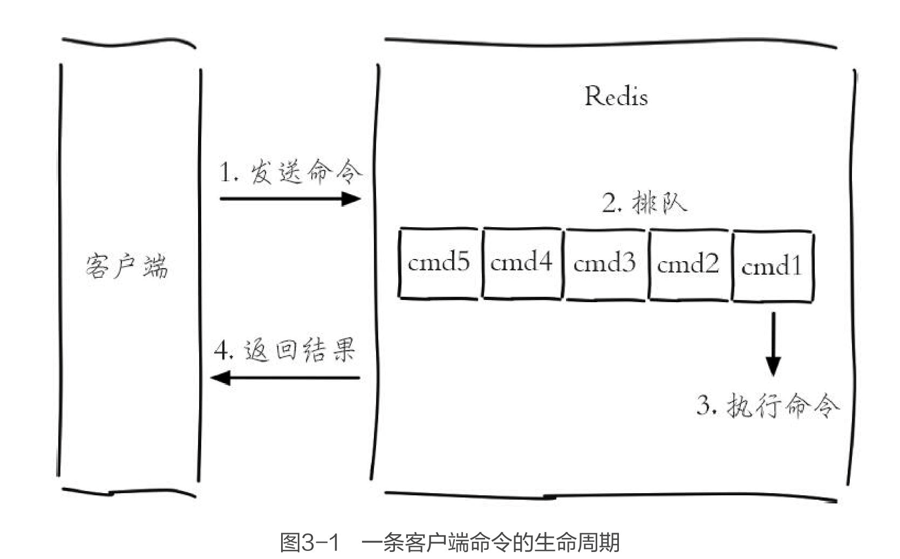

生命周期：1）发送命令 --------->2）命令排队----------->3）命令执行----->4）返回结果

需要注意，慢查询只统计步骤3）的时间，所以没有慢查询并不代表客户端没有超时问题。


### Redis Shell

### Pipline

 当多个redis命令之间没有依赖、顺序关系（例如第二条命令依赖第一条命令的结果）时，建议使用pipline；如果命令之间有依赖或顺序关系时，pipline就无法使用，此时可以考虑才用lua脚本的方式来使用；

#### Pipelining 的优势


- 将多条命令打包一次性发送给服务端，减少了客户端与服务端之间的网络调用次数，节省了 RTT

- 避免了上下文切换，当客户端/服务端需要从网络中读写数据时，都会产生一次系统调用，系统调用是非常耗时的操作，其中设计到程序由用户态切换到内核态，再从内核态切换回用户态的过程。当我们执行 10 条 redis 命令的时候，就会发生 10 次用户态到内核态的上下文切换，但如果我们使用 Pipeining 将多条命令打包成一条一次性发送给服务端，就只会产生一次上下文切换
  

我们都知道， redis 执行命令的时候是单线程执行的，所以 redis 中的所有命令都具备原子性，这意味着 redis 并不会在执行某条命令的中途停止去执行另一条命令

但是 Pipelining 并不具备原子性，想象一下有两个客户端 client1 和 client2 同时向 redis 服务端发送 Pipelining 命令，每条 Pipelining 包含 5 条 redis 命令。 redis 可以保证 client1 管道中的命令始终是顺序执行的， client2 管道中的命令也是一样，始终按照管道中传入的顺序执行命令

但是 redis 并不能保证等 client1 管道中的所有命令执行完成，再执行 client2 管道中的命令，因此，在服务端中的命令执行顺序有可能是下面这种情况
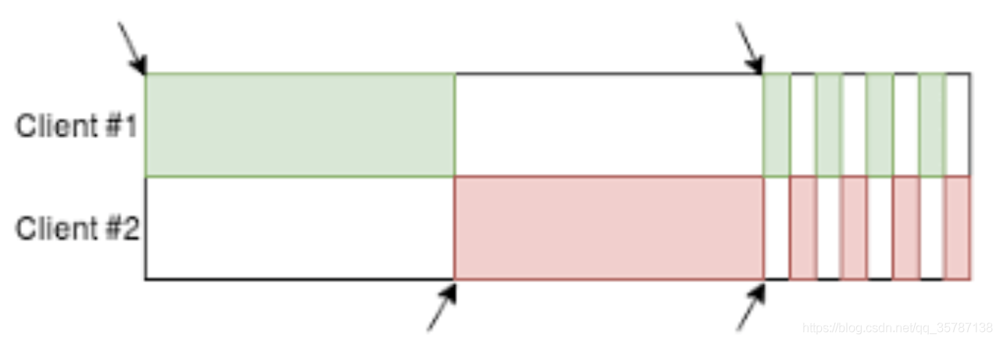

这种行为显示 `Pipelining` 在执行的时候并不会阻塞服务端。即使 `client1` 向客户端发送了包含多条指令的 `Pipelining` ，其他客户端也不会被阻塞，因为他们发送的指令可以插入到 `Pipelining` 中间执行

只有在 Pipelining 内所有命令执行完后，服务端才会把执行结果通过数组的方式返回给客户端。在执行 Pipelining 内的命令的时候，如果某些指令执行失败， Pipelining 仍会继续执行

比如下面的例子

```bash
$ printf "SET name huangxy\r\nINCR name\r\nGET name\r\n" | nc localhost 6379
+OK
-ERR value is not an integer or out of range
$6
huangxy
```


Pipelining 中第二条指令执行失败， **Pipelining 并不会停止**，而是会继续执行，等所有命令都执行完的时候，再将结果返回给客户端，其中第二条指令返回的是错误信息

Pipelining 的这个特性会导致一个问题，就是当 Pipelining 中的指令需要读取之前指令设置 key 的时候，需要额外小心，因为 key 的值有可能会被其他客户端修改。此时 Pipelining 的执行结果往往就不是我们所预期的


#### 事务

事务的优点
事务提供了 WATCH 命令，使我们可以实现 CAS 功能，比如通过事务，我们可以实现跟 INCR 命令一样的功能

```bash
WATCH mykey
val = GET mykey
val = val + 1
MULTI
SET mykey $val
EXEC
```

##### 事务的原子性

redis 事务具备原子性，当一个事务正在执行时，服务端会阻塞其接收到的其他命令，只有在事务执行完成时，才会执行接下来的命令，因此事务具备原子性

##### 事务的局限性

跟 Pipelining 一样，只有在事务执行完成时，才会把事务中多个命令的结果一并返回给客户端，因此客户端在事务还没有执行完的时候，无法获取其命令的执行结果

如果事务中的其中一个命令发生错误，会有以下两种可能性：

- 当发生语法错误，在执行 EXEC 命令的时候，事务将会被丢弃，不会执行
- 当发生运行时错误（操作了错误的数据类型）时， redis 会将报错信息缓存起来，继续执行后面的命令，并在最后将所有命令的执行结果返回给客户端（报错信息也会返回）。这意味着 redis 事务中没有回滚机制

##### 事务使用场景

- 需要原子地执行多个命令
- 不需要事务中间命令的执行结果来编排后面的命令

#### Lua 脚本

`redis` 从 2.6 版本开始引入对 Lua 脚本的支持，通过在服务器中嵌入 Lua 环境， `redis` 客户端可以直接使用 Lua 脚本，在服务端原子地执行多个 `redis` 命令

##### Lua脚本的优势

与 `Pipelining` 和 事务不同的是，在脚本内部，我们可以在脚本中获取中间命令的返回结果，然后根据结果值做相应的处理（如 if 判断）

```lua
local key = KEYS[1]
local new = ARGV[1]

local current = redis.call('GET', key)
if (current == false) or (tonumber(new) < tonumber(current)) then
  redis.call('SET', key, new)
  return 1
else
  return 0
end

```


同时， redis 服务端还支持对 Lua 脚本进行缓存（使用 SCRIPT LOAD 或 EVAL 执行过的脚本服务端都会对其进行缓存），下次可以使用 EVALSHA 命令调用缓存的脚本，节省带宽

##### Lua 脚本的原子性

Lua 脚本跟事务一样具备原子性，当脚本执行中时，服务端接收到的命令会被阻塞

##### Lua 脚本的局限性

Lua 脚本在功能上没有过多的限制，但要注意的一点是，Lua 脚本在执行的时候，会阻塞其他命令的执行，所以不宜在脚本中写太耗时的处理逻辑

##### Lua 脚本的使用场景

- 需要原子性地执行多个命令
- 需要中间值来组合后面的命令
- 需要中间值来编排后面的命令
- 常用于扩展 redis 功能，实现符合自己业务场景的命令


### 事务与Lua


编写lua:

- redis.call 函数实现对redis 的访问。

- redis.pcall()函数可以忽略函数继续执行。

实例：

热点key放在list 里面，实现热点事件批量 + 1

初始设置：

构建list

```bash
lpush hot:user:list user:1:ratio  user:8:ratio  user:3:ratio   user:99:ratio   user:72:ratio  

 mset user:1:ratio 986  user:8:ratio 762  user:3:ratio  556 user:99:ratio  400 user:72:ratio  101
```


lua脚本

```lua
local mylist = redis.call("lrange", KEYS[1], 0, -1)

local count = 0 

for index, key in ipairs(mylist)
do
	redis.call("incr",key)
	count = count + 1
end
return count
```


执行脚本：

```bash
redis-cli --pass 123456  --eval lrange_and_mincr.lua hot:user:list
```


#### redis 管理lua脚本


##### 加载脚本

```bash
[root@localhost ~]# redis-cli --pass 123456  script load "$(cat lrange_and_mincr.lua)"
Warning: Using a password with '-a' or '-u' option on the command line interface may not be safe.
"52bb7f1bcdf5c1d5e904a867877e182153f5a253"

```


##### 查询脚本是否存在

```bash
127.0.0.1:6379> script exists 52bb7f1bcdf5c1d5e904a867877e182153f5a253
1) (integer) 1
```

##### 清空所有脚本

```bash
script flush
```

##### 杀死正在运行的脚本

```bash
script kill 
```


可以模拟脚本死循环

```bash
eval 'while 1==1 do end' 0 
```

Redis提供了一个lua-time-limit参数，默认是5秒，它是Lua脚本的“超时时间”，但这个超时时间仅仅是当Lua脚本时间超过lua-time-limit后，向其他命令调用发送BUSY的信号，但是并不会停止掉服务端和客户端的脚本执行，所以当达到lua-time-limit值之后，其他客户端在执行正常的命令时，将会收到“Busy Redis is busy running a script”错误，并且提示使用script kill或者shutdown nosave命令来杀掉这个busy的脚本：


### 发布订阅


## 客户端


### 客户端协议

主流编程语言都有Redis客户端，原因：

1. 客户端与服务端的通信协议是在TCP协议之上构建的
2. Redis构建了RESP (Redis Serialization Protocol ）实现了客户端与服务端的正常交互，这种协议简单高效，既能被机器解析，又容易被人类阅读。


**1. 发送命令格式**
 RESP的规定一条命令的格式如下，CRLF代表"\r\n"。

```bash
 *<参数数量> CRLF 
 $<参数1的字节数量> CRLF 
 <参数1> CRLF
 ... 
 $<参数N的字节数量> CRLF 
 <参数N> CRLF


```

 依然以set hell world这条命令进行说明。

 参数数量为3个，因此第一行为：

```bash
 *3
```

 参数字节数分别是355，因此后面几行为：

```bash
 $3 
 SET 
 $5 
 hello 
 $5 
 world
```

有一点要注意的是，上面只是格式化显示的结果，实际传输格式为如下代码，整个过程如图4-1所示：

```bash
 *3\r\n$3\r\nSET\r\n$5\r\nhello\r\n$5\r\nworld\r\n
```

有一点要注意的是，上面只是格式化显示的结果，实际传输格式为如下代码，整个过程如图4-1所示：

 *3\r\n$3\r\nSET\r\n$5\r\nhello\r\n$5\r\nworld\r\n

有一点要注意的是，上面只是格式化显示的结果，实际传输格式为如下代码，整个过程如图4-1所示：

 *3\r\n$3\r\nSET\r\n$5\r\nhello\r\n$5\r\nworld\r\n

 **2.返回结果格式**
 Redis的返回结果类型分为以下五种，如图4-2所示：

- 状态回复：在RESP中第一个字节为"+"。
- 错误回复：在RESP中第一个字节为"-"。
- 整数回复：在RESP中第一个字节为"："。
- 字符串回复：在RESP中第一个字节为"$"。
- 多条字符串回复：在RESP中第一个字节为"*"。

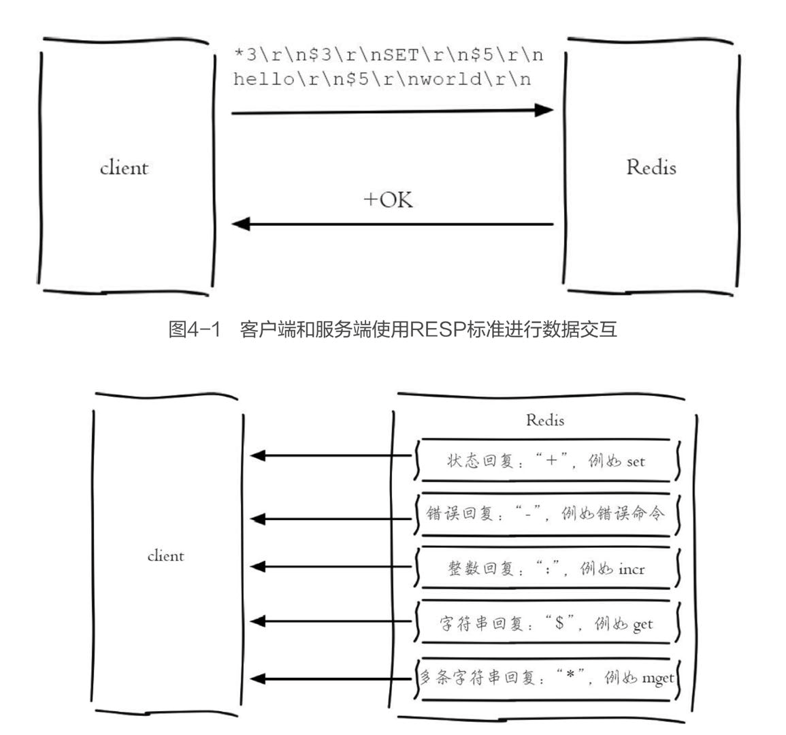


## 持久化


持久化有两种RDB (redis data base) 和 AOF (append only file)


### RDB 

数据快照

#### 触发机制

手动触发：

- save 命令: 保存会造成阻塞，线上不使用

- bgsave 命令： fork子进程时会阻塞

  bgsave 是save的优化版本，redis内部涉及rdb都使用bgsave.

  

自动触发：

- 配置文件 `# save 300 100` 在300秒内发生100个key变化触发bgsave
- 从节点执行全量复制 操作， 主节点自动执行bgsave生成RDB文件发送给从节点
- 执行debug reload 命令重新加载redis时
- 默认情况下执行shutdown，没有开启AOF持久化功能时


#### 流程说明

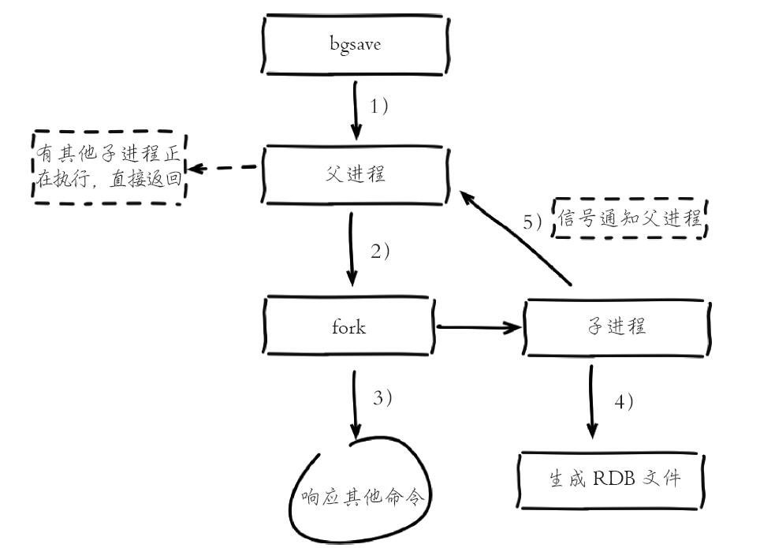


1）执行bgsave命令，Redis父进程判断当前是否存在正在执行的子进程，如RDB/AOF子进程，如果存在bgsave命令直接返回。

2）父进程执行fork操作创建子进程，fork操作过程中父进程会阻塞，通过info stats命令查看latest_fork_usec选项，可以获取最近一个fork操作的耗时，单位为微秒。

3）父进程fork完成后，bgsave命令返回“Background saving started”信息并不再阻塞父进程，可以继续响应其他命令。

4）子进程创建RDB文件，根据父进程内存生成临时快照文件，完成后对原有文件进行原子替换。执行lastsave命令可以获取最后一次生成RDB的时间，对应info统计的rdb_last_save_time选项。

5）进程发送信号给父进程表示完成，父进程更新统计信息，具体见info Persistence下的rdb_*相关选项。


### AOF

记录每次命令，重新执行命令达到恢复数据的目的。AOF主要是解决了数据持久化的实时性。对兼顾数据安全性和性能非常有帮助。

开启AOF功能需要设置配置：appendonly yes，默认不开启。AOF文件名通过appendfilename配置设置，默认文件名是appendonly.aof。保存路径同RDB持久化方式一致，通过dir配置指定。AOF的工作流程操作：命令写入（append）、文件同步（sync）、文件重写（rewrite）、重启加载（load），如图5-2所示。

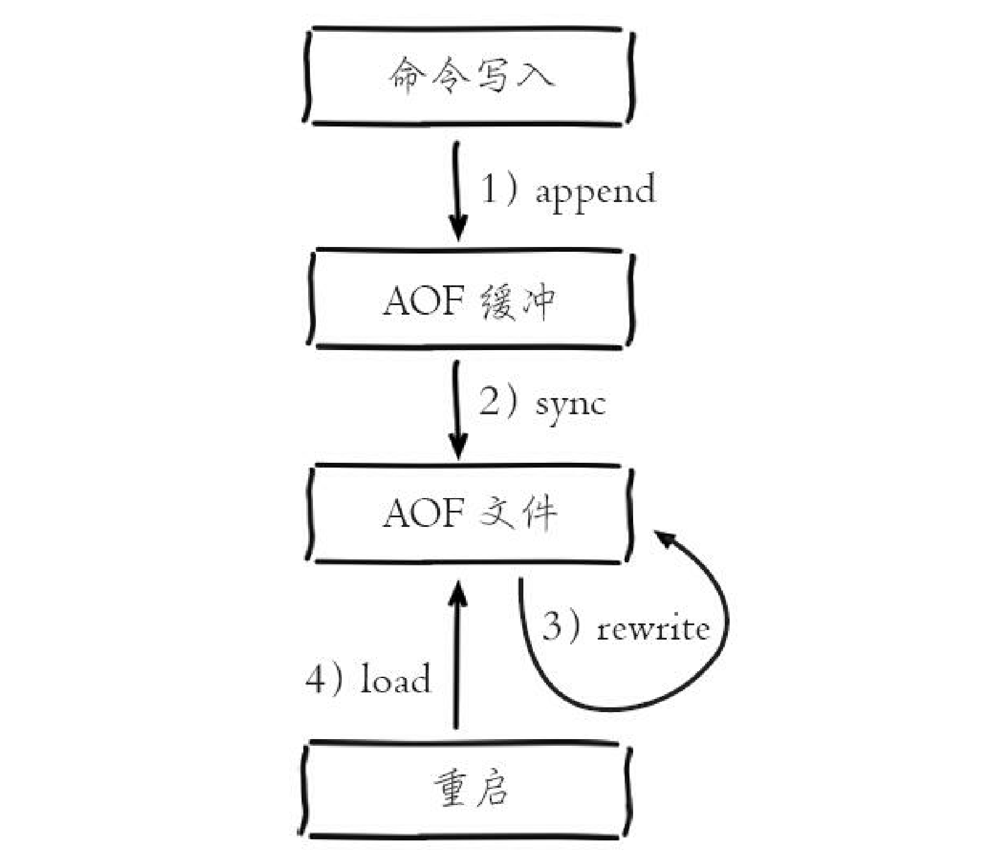流程如下：
	1）所有的写入命令会追加到aof_buf（缓冲区）中。

​	2）AOF缓冲区根据对应的策略向硬盘做同步操作。

​	3）随着AOF文件越来越大，需要定期对AOF文件进行重写，达到压缩的目的。

​	4)当Redis服务器重启时，可以加载AOF文件进行数据恢复。
​	

了解AOF工作流程之后，下面针对每个步骤做详细介绍。


#### 命令写入

AOF命令写入的内容直接是Redis文本协议格式。例如set hello world这条命令，在AOF缓冲区会追加如下文本：
	 
```aof
*3\r\n$3\r\nset\r\n$5\r\nhello\r\n$5\r\nworld\r\n
```

AOF的两个疑惑：
1）AOF为什么直接采用文本协议格式？可能的理由如下：

- 文本协议具有很好的兼容性。
- 开启AOF后，所有写入命令都包含追加操作，直接采用协议格式，避免了二次处理开销。
- 文本协议具有可读性，方便直接修改和处理。

2）AOF为什么把命令追加到**aof_buf**中？

​	Redis使用单线程响应命令，如果每次写AOF文件命令都直接追加到硬盘，那么性能完全取决于当前硬盘负载。先写入缓冲区aof_buf中，还有另一个好处，Redis可以提供多种缓冲区同步硬盘的策略，在性能和安全性方面做出平衡。

#### 文件同步

​	Redis提供了多种AOF缓冲区同步文件策略，由参数appendfsync控制，不同值的含义如表所示。
​	 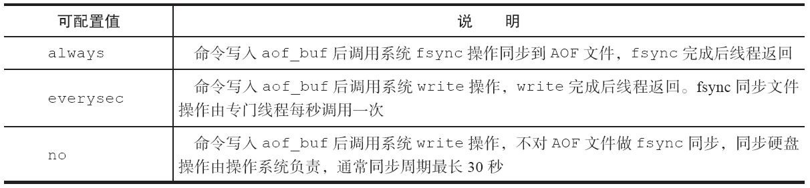


系统调用write和fsync说明：

- write操作会触发延迟写（delayed write）机制。Linux在内核提供页缓冲区用来提高硬盘IO性能。write操作在写入系统缓冲区后直接返回。同步硬盘操作依赖于系统调度机制，例如：缓冲区页空间写满或达到特定时间周期。同步文件之前，如果此时系统故障宕机，缓冲区内数据将丢失。
- fsync针对单个文件操作（比如AOF文件），做强制硬盘同步，fsync将阻塞直到写入硬盘完成后返回，保证了数据持久化。
  除了write、fsync，Linux还提供了sync、fdatasync操作，具体API说明参见：http://linux.die.net/man/2/write，http://linux.die.net/man/2/fsync，http://linux.die.net/man/2/sync，http://linux.die.net/man/2/fdatasync。

​       -----------------好像文件同步策略是用了fsync

- 配置为always时，每次写入都要同步AOF文件，在一般的SATA硬盘上，Redis只能支持大约几百TPS写入，显然跟Redis高性能特性背道而驰，不建议配置。
- 配置为no，由于操作系统每次同步AOF文件的周期不可控，而且会加大每次同步硬盘的数据量，虽然提升了性能，但数据安全性无法保证。
- 配置为**everysec，是建议的同步策略**，也是默认配置，做到兼顾性能和数据安全性。理论上只有在系统突然宕机的情况下丢失1秒的数据。（严格来说最多丢失1秒数据是不准确的，后面会做具体介绍到。）

#### 重写机制

​	随着命令不断写入AOF，文件会越来越大，为了解决这个问题，Redis引入AOF重写机制压缩文件体积。AOF文件重写是把Redis进程内的数据转化为写命令同步到新AOF文件的过程。

**重写后的AOF文件为什么可以变小**？有如下原因：

 	1. 进程内已经超时的数据不再写入文件。
 	2.  旧的AOF文件含有无效命令，如del key1、hdel key2、srem keys、set a111、set a222等。重写使用进程内数据直接生成，这样新的AOF文件只保留最终数据的写入命令。
 	3. 多条写命令可以合并为一个，如：lpush list a、lpush list b、lpush list c可以转化为：lpush list a b c。为了防止单条命令过大造成客户端缓冲区溢出，对于list、set、hash、zset等类型操作，以64个元素为界拆分为多条。

**AOF 重写意义**

​	AOF重写降低了文件占用空间，除此之外，另一个目的是：更小的AOF文件可以更快地被Redis加载。
​	

**AOF重写过程可以手动触发和自动触发：**

- 手动触发：直接调用bgrewriteaof命令。
- 自动触发：根据auto-aof-rewrite-min-size和auto-aof-rewrite-percentage参数确定自动触发时机。
  -  auto-aof-rewrite-min-size：表示运行AOF重写时文件最小体积，默认为64MB。
  - auto-aof-rewrite-percentage：代表当前AOF文件空间（aof_current_size）和上一次重写后AOF文件空间（aof_base_size）的比值。
    
  - 自动触发时机=aof_current_size>auto-aof-rewrite-min-size&&（aof_current_size-aof_base_size）/aof_base_size>=auto-aof-rewrite-percentage
    - 其中aof_current_size和aof_base_size可以在info Persistence统计信息中查看。
    - 当触发AOF重写时，内部做了哪些事呢？下面结合图5-3介绍它的运行流程。

#### 重写流程

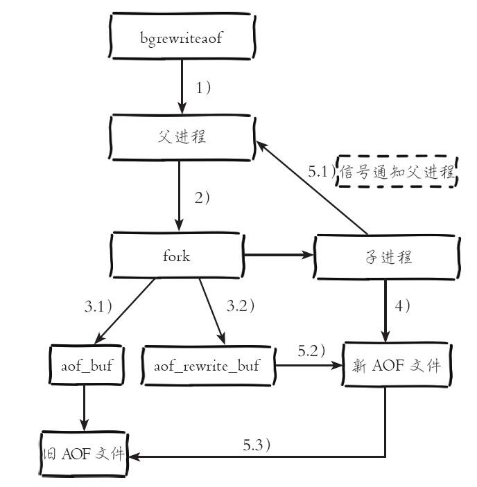

流程说明：

1）执行AOF重写请求。
	

如果当前进程正在执行AOF重写，请求不执行并返回如下响应：

```bash
ERR Background append only file rewriting already in progress
```

如果当前进程正在执行bgsave操作，重写命令延迟到bgsave完成之后再执行，返回如下响应：

```bash
Background append only file rewriting scheduled
```

2）父进程执行fork创建子进程，开销等同于bgsave过程。

3.1）主进程fork操作完成后，继续响应其他命令。所有修改命令依然写入AOF缓冲区并根据appendfsync策略同步到硬盘，保证原有AOF机制正确性。

3.2）由于fork操作运用写时复制技术，子进程只能共享fork操作时的内存数据。由于父进程依然响应命令，Redis使用“AOF重写缓冲区”保存这部分新数据，防止新AOF文件生成期间丢失这部分数据。

4）子进程根据内存快照，按照命令合并规则写入到新的AOF文件。每次批量写入硬盘数据量由配置aof-rewrite-incremental-fsync控制，默认为32MB，防止单次刷盘数据过多造成硬盘阻塞。

5.1）新AOF文件写入完成后，子进程发送信号给父进程，父进程更新统计信息，具体见info persistence下的aof_*相关统计。

5.2）父进程把AOF重写缓冲区的数据写入到新的AOF文件。

5.3）使用新AOF文件替换老文件，完成AOF重写。


### 重启加载


#### 流程

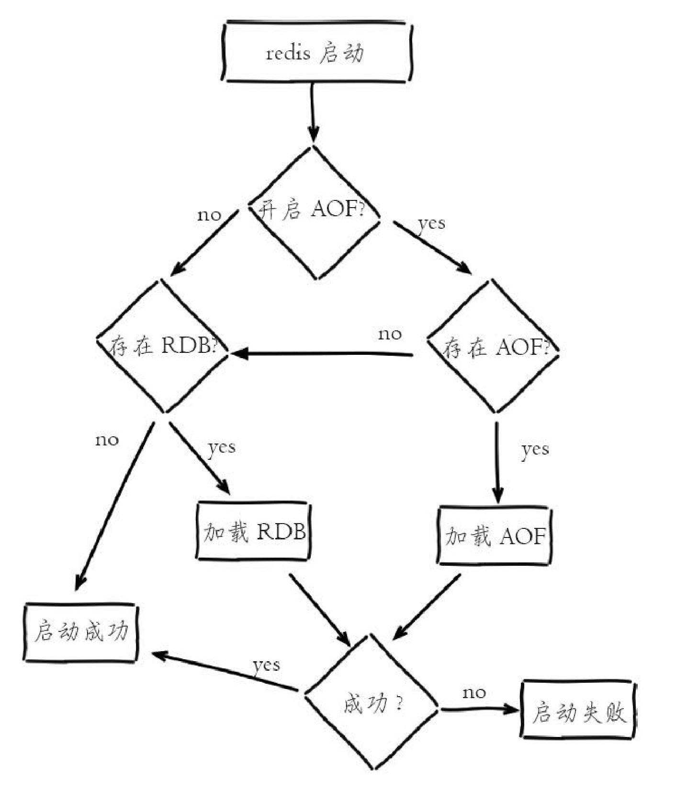

 优先使用AOF


#### 文件校验

AOF 加载失败可以用`redis-check-aof --fix` 命令修复


### 问题定位与优化


#### fork操作

做RDB或者AOF重写，都需要执行fork操作，大多数操作系统来说fork是个重量级的错误。

虽然fork创建的子进程不需要拷贝父进程的物理内存空间，但是会复制父进程的空间内存页表。

​	例如对于10GB的Redis进程，需要复制大约20MB的内存页表，因此fork操作耗时跟进程总内存量息息相关，如果使用虚拟化技术，特别是Xen虚拟机，fork操作会更耗时。

 fork耗时问题定位：

​	对于高流量的Redis实例OPS可达5万以上，如果fork操作耗时在秒级别将拖慢Redis几万条命令执行，对线上应用延迟影响非常明显。正常情况下fork耗时应该是每GB消耗20毫秒左右。可以在info stats统计中查latest_fork_usec指标获取最近一次fork操作耗时，单位微秒。

#####  如何改善fork操作的耗时：

 1）优先使用物理机或者高效支持fork操作的虚拟化技术，避免使用Xen。

 2）控制Redis实例最大可用内存，fork耗时跟内存量成正比，线上建议每个Redis实例内存控制在10GB以内。

 3）合理配置Linux内存分配策略，避免物理内存不足导致fork失败

 4）降低fork操作的频率，如适度放宽AOF自动触发时机，避免不必要的全量复制等。

1


## 理解内存

### 内存消耗

内存消耗：

- 进程自身消耗
- 子进程消耗

#### 内存使用统计

命令：info memory

```bash
127.0.0.1:6379> info memory
# Memory
used_memory:873624
used_memory_human:853.15K
used_memory_rss:10170368
used_memory_rss_human:9.70M
mem_fragmentation_ratio:12.22

```

需要重点关注的指标有：used_memory_rss和used_memory以及它们的比值mem_fragmentation_ratio。

- mem_fragmentation_ratio（碎片率） = used_memory_rss/ 
- used_memory ：Redis的分配内存大小
- used_memory_rss ：Redis实例进程所占物理内存的大小（系统角度）

 当mem_fragmentation_ratio>1时，说明used_memory_rss-used_memory多出的部分内存并没有用于数据存储，而是被内存碎片所消耗，如果两者相差很大，说明碎片率严重。

当mem_fragmentation_ratio<1时，这种情况一般出现在操作系统把Redis内存交换（Swap）到硬盘导致，出现这种情况时要格外关注，由于硬盘速度远远慢于内存，Redis性能会变得很差，甚至僵死。

#### 内存消耗划分

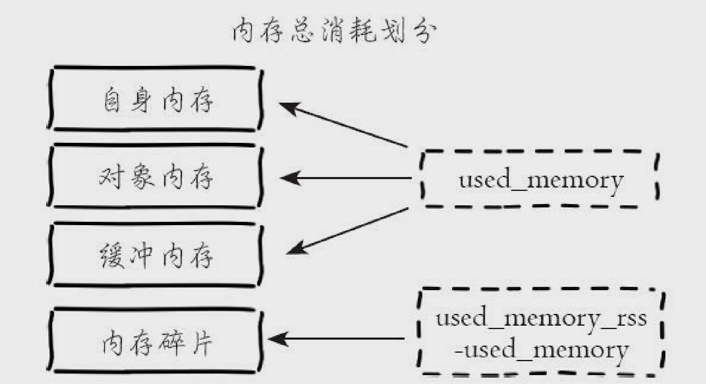

**对象内存**

 每次创建数据都要创建key 对象和value 对象。可以简单的理解为sizeof(keys) + sizeof(value).

所以key要尽量避免使用过长的key。

**缓冲内存**

- 客户端缓冲
- 复制积压缓冲区
- AOF缓冲区


**内存碎片**

Redis默认的内存分配器采用jemalloc，可选的分配器还有：glibc、tcmalloc。内存分配器为了更好地管理和重复利用内存，分配内存策略一般采用固定范围的内存块进行分配。例如jemalloc在64位系统中将内存空间划分为：小、大、巨大三个范围。每个范围内又划分为多个小的内存块单位，如下所示：

- 小：[8byte]，[16byte，32byte，48byte，...，128byte]，[192byte，256byte，...，512byte]，[768byte，1024byte，...，3840byte]
- 大：[4KB，8KB，12KB，...，4072KB]
- 巨大：[4MB，8MB，12MB，...]

比如当保存5KB对象时jemalloc可能会采用8KB的块存储，而剩下的3KB空间变为了内存碎片不能再分配给其他对象存储。内存碎片问题虽然是所有内存服务的通病，但是jemalloc针对碎片化问题专门做了优化，一般不会存在过度碎片化的问题，正常的碎片率（mem_fragmentation_ratio）在1.03左右。但是当存储的数据长短差异较大时，以下场景容易出现高内存碎片问题：

- 频繁做更新操作，例如频繁对已存在的键执行append、setrange等更新操作。
- 大量过期键删除，键对象过期删除后，释放的空间无法得到充分利用，导致碎片率上升。

 **出现高内存碎片问题时常见的解决方式如下：**

- 数据对齐：在条件允许的情况下尽量做数据对齐，比如数据尽量采用数字类型或者固定长度字符串等，但是这要视具体的业务而定，有些场景无法做到。
-  安全重启：重启节点可以做到内存碎片重新整理，因此可以利用高可用架构，如Sentinel或Cluster，将碎片率过高的主节点转换为从节点，进行安全重启。

#### 子内存消耗

lLinux具有写时复制技术（copy-on-write），父子进程会共享相同的物理内存页，当父进程处理写请求时会对需要修改的页复制出一份副本完成写操作，而子进程依然读取fork时整个父进程的内存快照。
 Linux Kernel在2.6.38内核增加了Transparent Huge Pages（THP）机制，而有些Linux发行版即使内核达不到2.6.38也会默认加入并开启这个功能，如Redhat Enterprise Linux在6.0以上版本默认会引入THP。

 ```bash
 // 开启THP: 
 C * AOF rewrite: 1039 MB of memory used by copy-on-write 
 // 关闭THP: 
 C * AOF rewrite: 9 MB of memory used by copy-on-write
 ```


 这两个日志出自同一Redis进程，used_memory总量为1.5GB，子进程执行期间每秒写命令量都在200左右。当分别开启和关闭THP时，子进程内存消耗有天壤之别。如果在高并发写的场景下开启THP，子进程内存消耗可能是父进程的数倍，极易造成机器物理内存溢出，从而触发SWAP或OOM killer，更多关于THP细节见12.1节“Linux配置优化”。

**总结**

- Redis产生的子进程并不需要消耗1倍的父进程内存，实际消耗根据期间写入命令量决定，但是依然要预留出一些内存防止溢出。
- 需要设置sysctl vm.overcommit_memory=1允许内核可以分配所有的物理内存，防止Redis进程执行fork时因系统剩余内存不足而失败。
- 排查当前系统是否支持并开启THP，如果开启建议关闭，防止copy-on-write期间内存过度消耗

## 内存管理

#### 设置内存上限

Redis使用**maxmemory**参数限制最大可用内存。限制内存的目的主要有：

- 用于缓存场景，当超出内存上限maxmemory时使用LRU等删除策略释放空间。
-  防止所用内存超过服务器物理内存。

 需要注意，maxmemory限制的是Redis实际使用的内存量，也就是**used_memory**统计项对应的内存。由于内存碎片率的存在，实际消耗的内存可能会比**maxmemory设置的更大**，实际使用时要小心这部分内存溢出。通过设置内存上限可以非常方便地实现一台服务器部署多个Redis进程的内存控制。

比如一台24GB内存的服务器，为系统预留4GB内存，预留4GB空闲内存给其他进程或Redis fork进程，留给Redis16GB内存，这样可以部署4个maxmemory=4GB的Redis进程。得益于Redis单线程架构和内存限制机制，即使没有采用虚拟化，不同的Redis进程之间也可以很好地实现CPU和内存的隔离性，如图8-2所示。

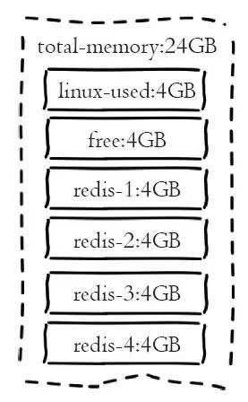

**动态调整内存上限**
 Redis的内存上限可以通过config set maxmemory进行动态修改，即修改最大可用内存。例如之前的示例，当发现Redis-2没有做好内存预估，实际只用了不到2GB内存，而Redis-1实例需要扩容到6GB内存才够用，这时可以分别执行如下命令进行调整：

```bash
 Redis-1>config set maxmemory 6GB 
 Redis-2>config set maxmemory 2GB
```


 通过动态修改maxmemory，可以实现在当前服务器下动态伸缩Redis内存的目的，如图所示。

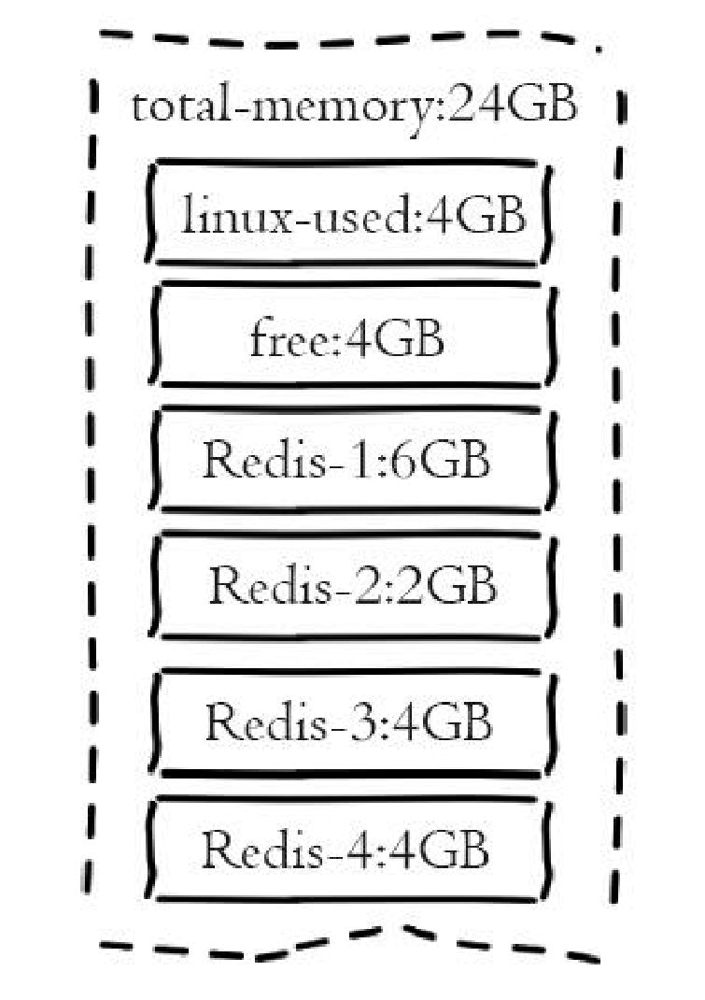

这个例子过于理想化，如果此时Redis-3和Redis-4实例也需要分别扩容到6GB，这时超出系统物理内存限制就不能简单的通过调整maxmemory来达到扩容的目的，需要采用在线迁移数据或者通过复制切换服务器来达到扩容的目的。具体细节见“哨兵”和“集群”部分。
  **运维提示**
 Redis默认无限使用服务器内存，为防止极端情况下导致系统内存耗尽，**建议所有的Redis进程都要配置maxmemory**。

 在保证物理内存可用的情况下，系统中所有Redis实例可以调整maxmemory参数来达到自由伸缩内存的目的。


#### 动态调整内存上限

#### 内存回收策略

主要体现在两个方面：

- 删除过期的键对象
- 内存使用达到maxmemory上限时触发内存溢出控制策略


##### 删除过期键对象

- 惰性删除

  - 会占用内存

- 到期删除

  - 太耗费CPU

- 定时任务删除(折中处理)：

  Redis内部维护一个定时任务，默认每秒运行10次（通过配置hz控制）。定时任务中删除过期键逻辑采用了自适应算法，根据键的过期比例、使用快慢两种速率模式回收键，流程如图8-4所示。

  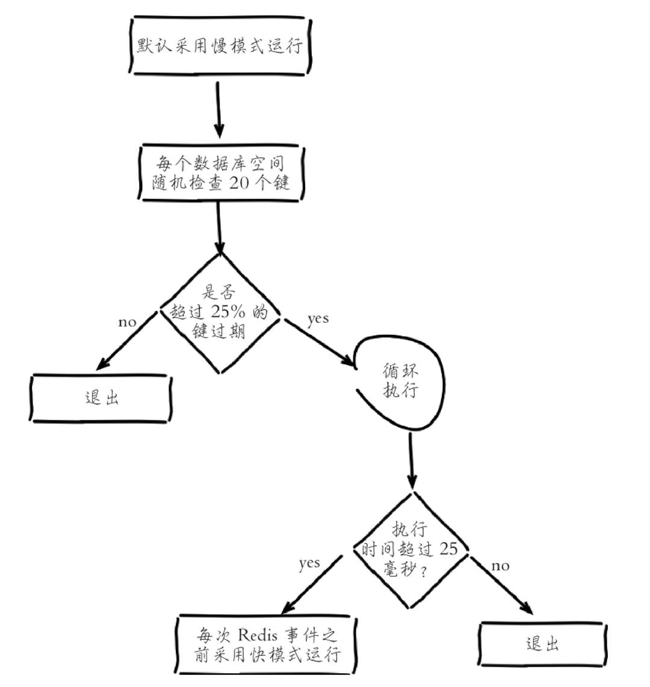

内存溢出策略：

当Redis所用内存达到maxmemory上限时会触发相应的溢出控制策略。具体策略受maxmemory-policy参数控制，Redis支持6种策略，如下所示：

>  1）noeviction：默认策略，不会删除任何数据，拒绝所有写入操作并返回客户端错误信息（error）OOM command not allowed when used memory，此时Redis只响应读操作。
>  2）volatile-lru：根据LRU算法删除设置了超时属性（expire）的键，直到腾出足够空间为止。如果没有可删除的键对象，回退到noeviction策略。
>  3）allkeys-lru：根据LRU算法删除键，不管数据有没有设置超时属性，直到腾出足够空间为止。
>  4）allkeys-random：随机删除所有键，直到腾出足够空间为止。
>  5）volatile-random：随机删除过期键，直到腾出足够空间为止。
>  6）volatile-ttl：根据键值对象的ttl属性，删除最近将要过期数据。如果没有，回退到noeviction策略。

内存溢出控制策略可以采用config set maxmemory-policy{policy}动态配置。Redis支持丰富的内存溢出应对策略，可以根据实际需求灵活定制，比如当设置volatile-lru策略时，保证具有过期属性的键可以根据LRU剔除，而未设置超时的键可以永久保留。还可以采用allkeys-lru策略把Redis变为纯缓存服务器使用。当Redis因为内存溢出删除键时，可以通过执行info stats命令查看evicted_keys指标找出当前Redis服务器已剔除的键数量。

> evicted_keys: 由于 maxmemory 限制，而被回收内存的 key 的总数

每次Redis执行命令时如果设置了maxmemory参数，都会尝试执行回收内存操作。当Redis一直工作在内存溢出（used_memory>maxmemory）的状态下且设置非noeviction策略时，会频繁地触发回收内存的操作，影响Redis服务器的性能。回收内存逻辑伪代码如下：

频繁执行回收内存成本很高，主要包括查找可回收键和删除键的开销，如果当前Redis有从节点，回收内存操作对应的删除命令会同步到从节点，导致写放大的问题

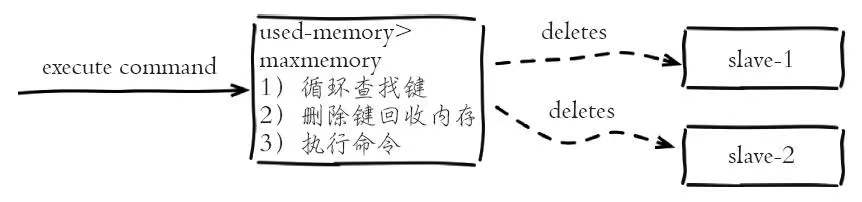

> 运维提示：
>
> 建议线上Redis内存工作在maxmemory>used_memory状态下，避免频繁内存回收开销。
>  对于需要收缩Redis内存的场景，可以通过调小maxmemory来实现快速回收。比如对一个实际占用6GB内存的进程设置maxmemory=4GB，之后第一次执行命令时，如果使用非noeviction策略，它会一次性回收到maxmemory指定的内存量，从而达到快速回收内存的目的。注意，此操作会导致数据丢失和短暂的阻塞问题，一般在缓存场景下使用。


### 内存优化

#### redisObject 对象


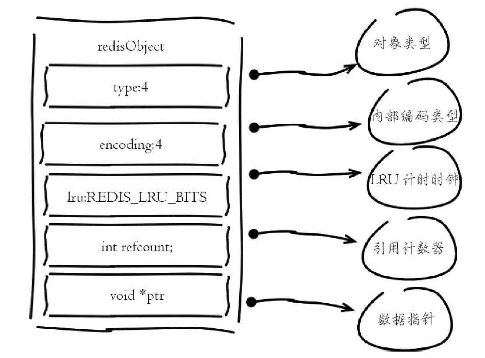

Redis存储的数据都使用redisObject来封装，包括string、hash、list、set、zset在内的所有数据类型。理解redisObject对内存优化非常有帮助，下面针对每个字段做详细说明：

- type字段：表示当前对象使用的数据类型，Redis主要支持5种数据类型：string、hash、list、set、zset。可以使用type{key}命令查看对象所属类型，type命令返回的是值对象类型，键都是string类型。

-  encoding字段：表示Redis内部编码类型，encoding在Redis内部使用，代表当前对象内部采用哪种数据结构实现。理解Redis内部编码方式对于优化内存非常重要，同一个对象采用不同的编码实现内存占用存在明显差异。

-  lru字段：记录对象最后一次被访问的时间，当配置了maxmemory和maxmemory-policy=volatile-lru或者allkeys-lru时，用于辅助LRU算法删除键数据。可以使用object idletime{key}命令在不更新lru字段情况下查看当前键的空闲时间

  > 开发提示：

​		可以使用scan+object idletime命令批量查询哪些键长时间未被访问，找出长时间不访问的键进行清理，可降低内存占用。

- refcount字段：记录当前对象被引用的次数，用于通过引用次数回收内存，当refcount=0时，可以安全回收当前对象空间。使用object refcount{key}获取当前对象引用。当对象为整数且范围在[0-9999]时，Redis可以使用共享对象的方式来节省内存。具体细节见之后8.3.3节“共享对象池”部分。

-  *ptr字段：与对象的数据内容相关，如果是整数，直接存储数据；否则表示指向数据的指针。Redis在3.0之后对值对象是字符串且长度<=39字节的数据，内部编码为embstr类型，字符串sds和redisObject一起分配，从而只要一次内存操作即可。

  > 开发提示: 
  >  高并发写入场景中，在条件允许的情况下，建议字符串长度控制在39字节以内，减少创建redisObject内存分配次数，从而提高性能。 

  

#### 缩减值对象

降低Redis内存使用最直接的方式就是缩减键（key）和值（value）的长度。

- key长度：如在设计键时，在完整描述业务情况下，键值越短越好。如user：{uid}：friends：notify：{fid}可以简化为u：{uid}：fs：nt：{fid}。

-  value长度：值对象缩减比较复杂，常见需求是把业务对象序列化成二进制数组放入Redis。

  - 首先应该在业务上精简业务对象，去掉不必要的属性避免存储无效数据。
  - 其次在序列化工具选择上，应该选择更高效的序列化工具来降低字节数组大小。
    - 以Java为例，内置的序列化方式无论从速度还是压缩比都不尽如人意，这时可以选择更高效的序列化工具，如：protostuff、kryo等。-
  -  值对象除了存储二进制数据之外，通常还会使用通用格式存储数据比如：json、xml等作为字符串存储在Redis中。这种方式优点是方便调试和跨语言，但是同样的数据相比字节数组所需的空间更大，在内存紧张的情况下，可以使用通用压缩算法压缩json、xml后再存入Redis，从而降低内存占用，例如使用GZIP压缩后的json可降低约60%的空间。

  > 开发提示：
  >
  > 当频繁压缩解压json等文本数据时，开发人员需要考虑压缩速度和计算开销成本，这里推荐使用Google的Snappy压缩工具，在特定的压缩率情况下效率远远高于GZIP等传统压缩工具，且支持所有主流语言环境。

#### 共享池对象

其实就是整数池 Redis内部维护了[0-9999] 的整数池对象。创建大量的整数类型redisObject存在内存开销，每个redisObject内部结构至少占**16字节，甚至超过了整数自身空间消耗**。所以Redis内存维护一个[0-9999]的整数对象池，用于节约内存。除了整数值对象，其他类型如list、hash、set、zset内部元素也可以使用整数对象池。因此开发中在满足需求的前提下，尽量使用整数对象以节省内存。
 整数对象池在Redis中通过变量REDIS_SHARED_INTEGERS定义，不能通过配置修改。可以通过object refcount命令查看对象引用数验证是否启用整数对象池技术，如下：

```bash
 redis> set foo 100 
 OK 
 redis> object refcount foo 
 (integer) 2 
 redis> set bar 100 
 OK 
 redis> object refcount bar 
 (integer) 3


```

 设置键foo等于100时，直接使用共享池内整数对象，因此引用数是2，再设置键bar等于100时，引用数又变为3，如图8-8所示。

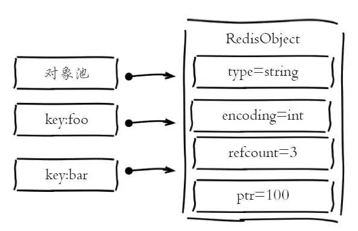

```bash
redis> set key:1 99 
OK              // 设置key:1=99 
redis> object refcount key:1 
(integer) 2     // 使用了对象共享,引用数为2 
redis> config set maxmemory-policy volatile-lru
OK              // 开启LRU淘汰策略 
redis> set key:2 99
OK              // 设置key:2=99 
redis> object refcount key:2 
(integer) 3     // 使用了对象共享,引用数变为3 
redis> config set maxmemory 1GB 
OK              // 设置最大可用内存 
redis> set key:3 99 OK              // 设置key:3=99 
redis> object refcount key:3 
(integer) 1     // 未使用对象共享,引用数为1 
redis> config set maxmemory-policy volatile-ttl 
OK              // 设置非LRU淘汰策略 
redis> set key:4 99 
OK              // 设置key:4=99 
redis> object refcount key:4 
(integer) 4     // 又可以使用对象共享,引用数变为4
```


 为什么**开启maxmemory和LRU淘汰策略**后对象池**无效**？

 LRU算法需要获取对象最后被访问时间，以便淘汰最长未访问数据，每个对象最后访问时间存储在redisObject对象的lru字段。对象共享意味着多个引用共享同一个redisObject，这时lru字段也会被共享，导致无法获取每个对象的最后访问时间。如果没有设maxmemory，直到内存被用尽Redis也不会触发内存回收，所以共享对象池可以正常工作。

 综上所述，共享对象池与maxmemory+LRU策略冲突，使用时需要注意。对于ziplist编码的值对象，即使内部数据为整数也无法使用共享对象池，因为ziplist使用压缩且内存连续的结构，对象共享判断成本过高，ziplist编码细节后面内容详细说明。

 **为什么只有整数对象池**？

 首先整数对象池复用的几率最大，其次对象共享的一个关键操作就是判断相等性，Redis之所以只有整数对象池，是因为整数比较算法时间复杂度为O（1），只保留一万个整数为了防止对象池浪费。如果是字符串判断相等性，时间复杂度变为O（n），特别是长字符串更消耗性能（浮点数在Redis内部使用字符串存储）。对于更复杂的数据结构如hash、list等，相等性判断需要O（n2）。对于单线程的Redis来说，这样的开销显然不合理，因此Redis只保留整数共享对象池。


#### 字符串优化

字符串对象是Redis内部最常用的数据类型。所有的键都是字符串类型，值对象数据除了整数之外都使用字符串存储。比如执行命令：lpush cache：type"redis""memcache""tair""levelDB"，Redis首先创建"cache：type"键字符串，然后创建链表对象，链表对象内再包含四个字符串对象，排除Redis内部用到的字符串对象之外至少创建5个字符串对象。可见字符串对象在Redis内部使用非常广泛，因此深刻理解Redis字符串对于内存优化非常有帮助。

 ##### 1.字符串结构

 Redis没有采用原生C语言的字符串类型而是自己实现了字符串结构，内部简单动态字符串（simple dynamic string，SDS）。结构如图8-9所示。

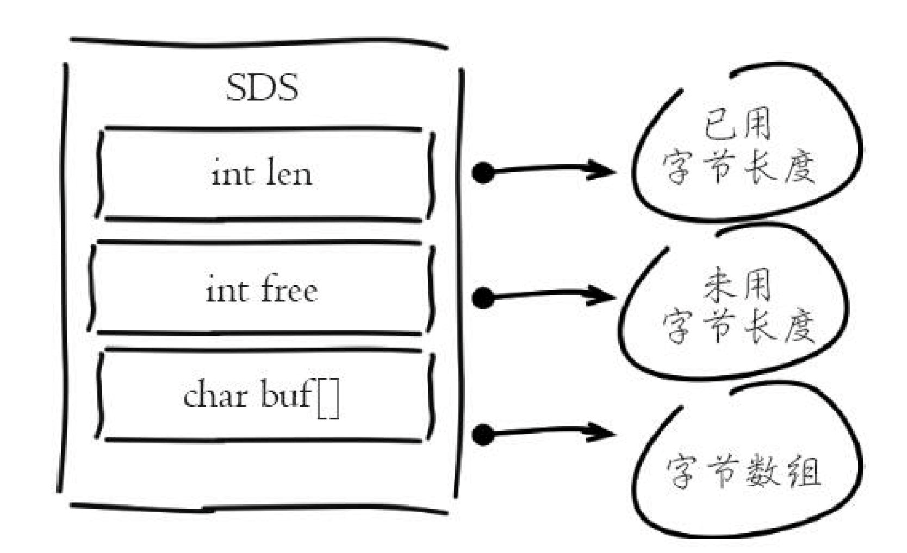

Redis自身实现的字符串结构有如下特点：

- O（1）时间复杂度获取：字符串长度、已用长度、未用长度。
- 可用于保存字节数组，支持安全的二进制数据存储。
- 内部实现空间预分配机制，降低内存再分配次数。
- 惰性删除机制，字符串缩减后的空间不释放，作为预分配空间保留。

#####  2.预分配机制

 因为字符串（SDS）存在预分配机制，日常开发中要小心预分配带来的内存浪费，例如表8-3的测试用例。

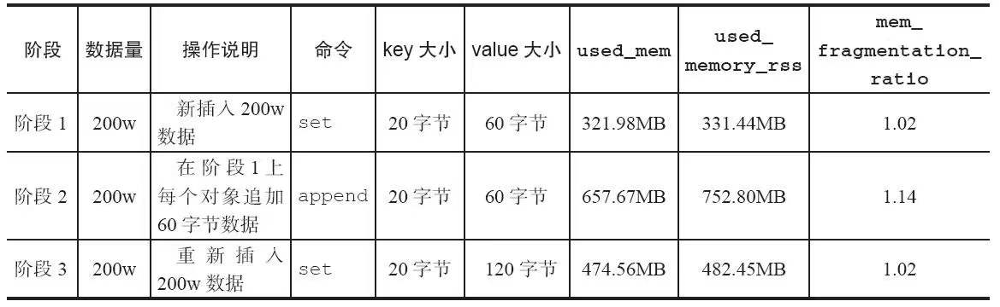


从测试数据可以看出，同样的数据追加后内存消耗非常严重，下面我们结合图来分析这一现象。阶段1每个字符串对象空间占用如图8-10所示。


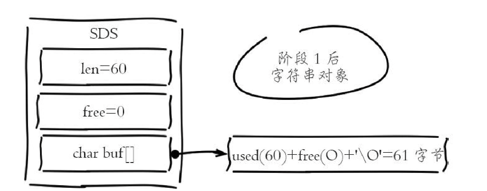

阶段1插入新的字符串后，free字段保留空间为0，总占用空间=实际占用空间+1字节，最后1字节保存‘\0’标示结尾，这里忽略int类型len和free字段消耗的8字节。在阶段1原有字符串上追加60字节数据空间占用如图8-11所示。

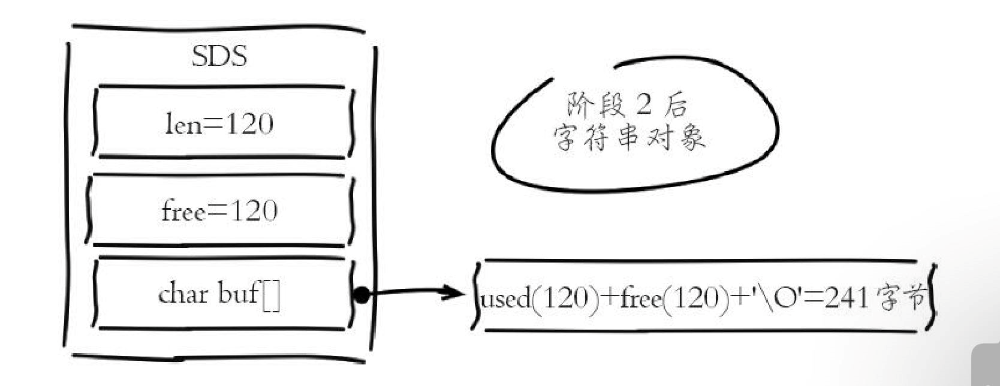

追加操作后字符串对象预分配了一倍容量作为预留空间，而且大量追加操作需要内存重新分配，造成内存碎片率（mem_fragmentation_ratio）上升。直接插入与阶段2相同数据的空间占用，如图8-12所示。

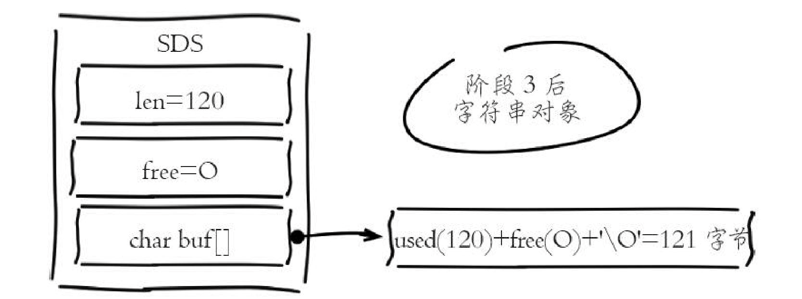


阶段3直接插入同等数据后，相比阶段2节省了每个字符串对象预分配的空间，同时降低了碎片率。

 字符串之所以采用预分配的方式是防止修改操作需要不断重分配内存和字节数据拷贝。但同样也会造成内存的浪费。字符串预分配每次并不都是翻倍扩容，空间预分配规则如下：

-  1）**第一次创建len属性等于数据实际大小，free等于0，不做预分配。**

- 2）修改后如果已有free空间不够且数据小于1M，每次预分配一倍容量。如原有len=60byte，free=0，再追加60byte，预分配120byte，总占用空间：60byte+60byte+120byte+1byte。

- 3）修改后如果已有free空间不够且数据大于1MB，每次预分配1MB数据。如原有len=30MB，free=0，当再追加100byte，预分配1MB，总占用空间：1MB+100byte+1MB+1byte。


> **开发提示：**
>
> 尽量减少字符串频繁修改操作如append、setrange，改为直接使用set修改字符串，降低预分配带来的内存浪费和内存碎片化。

 3.字符串重构

 字符串重构：指不一定把每份数据作为字符串整体存储，像json这样的数据可以使用hash结构，使用二级结构存储也能帮我们节省内存。同时可以使用hmget、hmset命令支持字段的部分读取修改，而不用每次整体存取。例如下面的json数据：

```json
 {
    "vid": "413368768",
    "title": "搜狐屌丝男士",
    "videoAlbumPic": "http://photocdn.sohu.com/60160518/vrsa_ver8400079_ae433_pic26.jpg",
    "pid": "6494271",
    "type": "1024",
    "playlist": "6494271",
    "playTime": "468"
}
```

 分别使用字符串和hash结构测试内存表现，如表8-4所示。

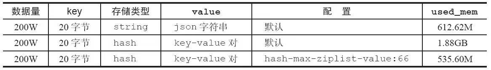

根据测试结构，第一次默认配置下使用hash类型，内存消耗不但没有降低反而比字符串存储多出2倍，而调整hash-max-ziplist-value=66之后内存降低为535.60M。因为json的videoAlbumPic属性长度是65，而hash-max-ziplist-value默认值是64，Redis采用hashtable编码方式，反而消耗了大量内存。调整配置后hash类型内部编码方式变为ziplist，相比字符串更省内存且支持属性的部分操作。下一节将具体介绍ziplist编码优化细节。


#### 编码优化

##### 1. 了解编码

Redis对外提供了string、list、hash、set、zet等类型，但是Redis内部针对不同类型存在编码的概念，所谓编码就是具体使用哪种底层数据结构来实现。编码不同将直接影响数据的内存占用和读写效率。使用object encoding{key}命令获取编码类型。如下所示：

```bash
 redis> set str:1 hello 
 OK 
 redis> object encoding str:1 
 "embstr"                // embstr编码字符串 
 redis> lpush list:1 1 2 3 
 (integer) 3 
 redis> object encoding list:1 
 "ziplist"               // ziplist编码列表
```


 Redis针对每种数据类型（type）可以采用至少两种编码方式来实现

String:

| 编码方式 | 数据结构                 | 出现条件            |
| -------- | ------------------------ | ------------------- |
| raw      | 动态字符串编码           | <= 39个字节的字符串 |
| embstr   | 优化内存分配的字符串编码 | > 39个字节的字符串  |
| int      | 整数编码                 | 整数                |

hash:

| 编码方式  | 数据结构     | 出现条件                                                     |
| --------- | ------------ | ------------------------------------------------------------ |
| hashtable | 散列表编码   |                                                              |
| ziplist   | 压缩列表编码 | hash-max-ziplist-entries配置（默认512个） && hash-max-ziplist-value配置（默认64字节） |

ziplist使用更加紧凑的结构实现多个元素的连续存储，所以在节省内存方面比hashtable更加优秀。

list：

| 编码方式   | 数据结构     | 出现条件                                                     |
| ---------- | ------------ | ------------------------------------------------------------ |
| linkedlist | 双向列表编码 |                                                              |
| ziplist    | 压缩列表编码 | 小于list-max-ziplist-entries配置（默认512个) && 小于list-max-ziplist-value配置时（默认64字节） |
| quicklist  |              |                                                              |


set:

| 编码方式  | 数据结构     | 出现条件                                                     |
| --------- | ------------ | ------------------------------------------------------------ |
| hashtable | 散列表编码   |                                                              |
| intset    | 整数集合编码 | 小于zset-max-ziplist-entries配置（默认128个）&&小于zset-max-ziplist-value配置（默认64字节） |

zset：

| 编码方式 | 数据结构     | 出现条件                                                     |
| -------- | ------------ | ------------------------------------------------------------ |
| skiplist | 跳跃表编码   |                                                              |
| ziplist  | 压缩列表编码 | set-max-ziplist-entries配置（默认128个）&&小于zset-max-ziplist-value配置（默认64字节） |


**为什么使用内部结构？**

主要原因是Redis作者想通过不同编码实现效率和空间的平衡。比如当我们的存储只有10个元素的列表，当使用双向链表数据结构时，必然需要维护大量的内部字段如每个元素需要：前置指针，后置指针，数据指针等，造成空间浪费，如果采用连续内存结构的压缩列表（ziplist），将会节省大量内存，而由于数据长度较小，存取操作时间复杂度即使为O（n2）性能也可满足需求。


##### 2.控制编码类型

编码类型转换在Redis写入数据时自动完成，这个转换过程是不可逆的，转换规则只能从小内存编码向大内存编码转换。例如：

```bash
redis> lpush list:1 a b c d 
(integer) 4     // 存储4个元素 
redis> object encoding list:1 
"ziplist"               // 采用ziplist压缩列表编码 
redis> config set list-max-ziplist-entries 4 
OK              // 设置列表类型ziplist编码最大允许4个元素 
redis> lpush list:1 e 
(integer) 5     // 写入第5个元素e 
redis> object encoding list:1 
"linkedlist"    // 编码类型转换为链表 
redis> rpop list:1 
"a"             // 弹出元素a 
redis> llen list:1 (integer) 4     
// 列表此时有4个元素 
redis> object encoding list:1 
"linkedlist"    // 编码类型依然为链表，未做编码回退
```


 以上命令体现了list类型编码的转换过程，其中Redis之所以不支持编码回退，主要是数据增删频繁时，数据向压缩编码转换非常消耗CPU，得不偿失。以上示例用到了list-max-ziplist-entries参数，这个参数用来决定列表长度在多少范围内使用ziplist编码。当然还有其他参数控制各种数据类型的编码，如表8-6所示。

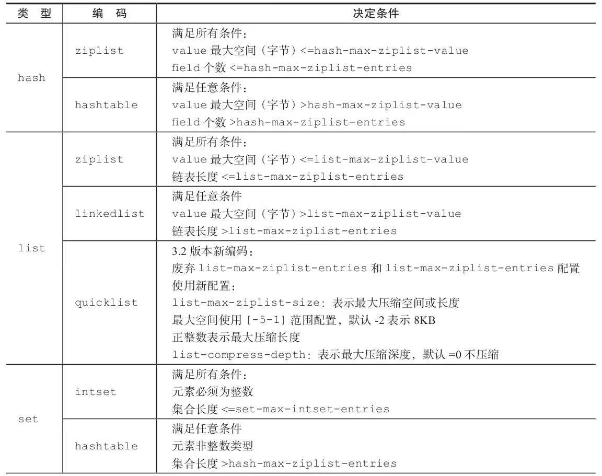

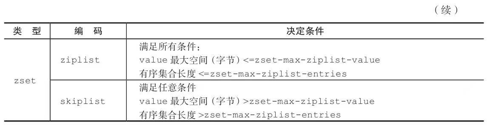


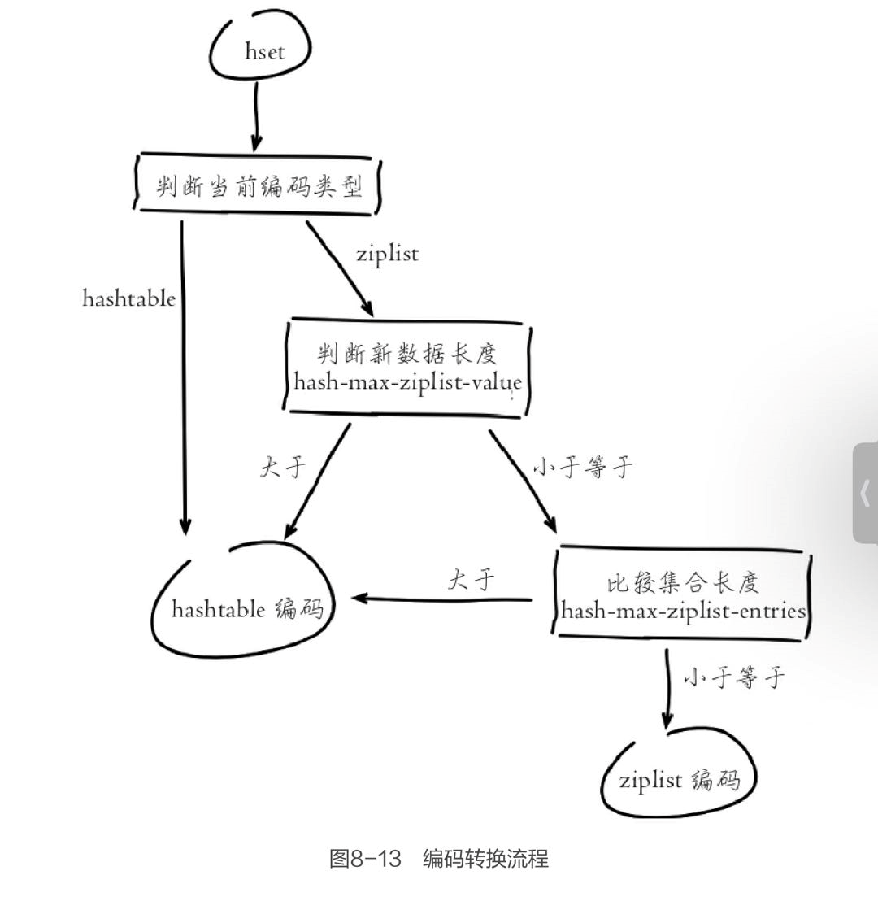


##### 3.ziplist编码

ziplist编码主要目的是为了节约内存，因此所有数据都是采用线性连续的内存结构。ziplist编码是应用范围最广的一种，可以分别作为hash、list、zset类型的底层数据结构实现。首先从ziplist编码结构开始分析，它的内部结构类似这样：

```txt
<zlbytes><zltail><zllen><entry-1><entry-2><....><entry-n><zlend>
```

。一个ziplist可以包含多个entry（元素），每个entry保存具体的数据（整数或者字节数组），内部结构如图8-14所示。

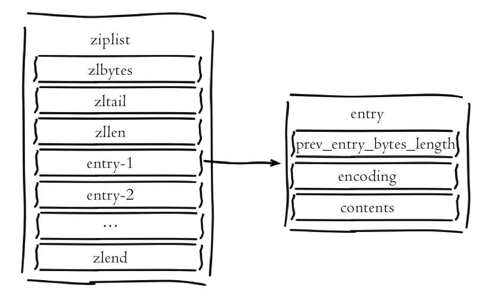

字段含义：

- 1）zlbytes：记录整个压缩列表所占字节长度，方便重新调整ziplist空间。类型是int-32，长度为4字节。

-  2）zltail：记录距离尾节点的偏移量，方便尾节点弹出操作。类型是int-32，长度为4字节。

-  3）zllen：记录压缩链表节点数量，当长度超过216-2时需要遍历整个列表获取长度，一般很少见。类型是int-16，长度为2字节。

-  4）entry：记录具体的节点，长度根据实际存储的数据而定。

  -  a）prev_entry_bytes_length：记录前一个节点所占空间，用于快速定位上一个节点，可实现列表反向迭代。
  -  b）encoding：标示当前节点编码和长度，前两位表示编码类型：字符串/整数，其余位表示数据长度。
  -  c）contents：保存节点的值，针对实际数据长度做内存占用优化。

-  5）zlend：记录列表结尾，占用一个字节。

  

根据以上对ziplist字段说明，可以分析出该数据结构特点如下：

- 内部表现为数据紧凑排列的一块连续内存数组。
- 可以模拟双向链表结构，以O（1）时间复杂度入队和出队。
- 新增删除操作涉及内存重新分配或释放，加大了操作的复杂性。
- 读写操作涉及复杂的指针移动，最坏时间复杂度为O（n2）。
- 适合存储小对象和长度有限的数据。

测试数据采用100W个36字节数据，划分为1000个键，每个类型长度统一为1000。从测试结果可以看出：

 1）使用ziplist可以分别作为hash、list、zset数据类型实现。

 2）使用ziplist编码类型可以**大幅降低内存占用**。

 3）ziplist实现的数据类型相比原生结构，命令操作更加耗时，不同类型耗时排序：list<hash<zset。

 ziplist压缩编码的性能表现跟值长度和元素个数密切相关，正因为如此Redis提供了{type}-max-ziplist-value和{type}-max-ziplist-entries相关参数来做控制ziplist编码转换。最后再次强调使用ziplist压缩编码的原则：追求空间和时间的平衡。

> **开发提示:**
>  针对性能要求较高的场景使用ziplist，建议长度不要超过1000，每个元素大小控制在512字节以内。
>  命令平均耗时使用info Commandstats命令获取，包含每个命令调用次数、总耗时、平均耗时，单位为微妙

##### 4.intset编码

intset编码是集合（set）类型编码的一种，内部表现为**存储有序**、不重复的整数集。当集合只包含整数且长度不超过set-max-intset-entries配置时被启用。执行以下命令查看intset表现：

```bash
redis> sadd set:test 3 4 2 6 8 9 2 
(integer) 6             // 乱序写入6个整数 
Redis> object encoding set:test 
"intset"                        // 使用intset编码 
Redis> smembers set:test 
"2" "3" "4" "6" "8" "9"         // 排序输出整数结合 
redis> config set set-max-intset-entries 6 
OK                              // 设置intset最大允许整数长度 
redis> sadd set:test 5 
(integer) 1                     // 写入第7个整数 5 
redis> object encoding set:test 
"hashtable"                     // 编码变为hashtable 
redis> smembers set:test "8" "3" "5" "9" "4" "2" "6"     // 乱序输出
```


 以上命令可以看出intset对写入整数进行排序，通过O（log（n））时间复杂度实现查找和去重操作，intset编码结构如图8-15所示。

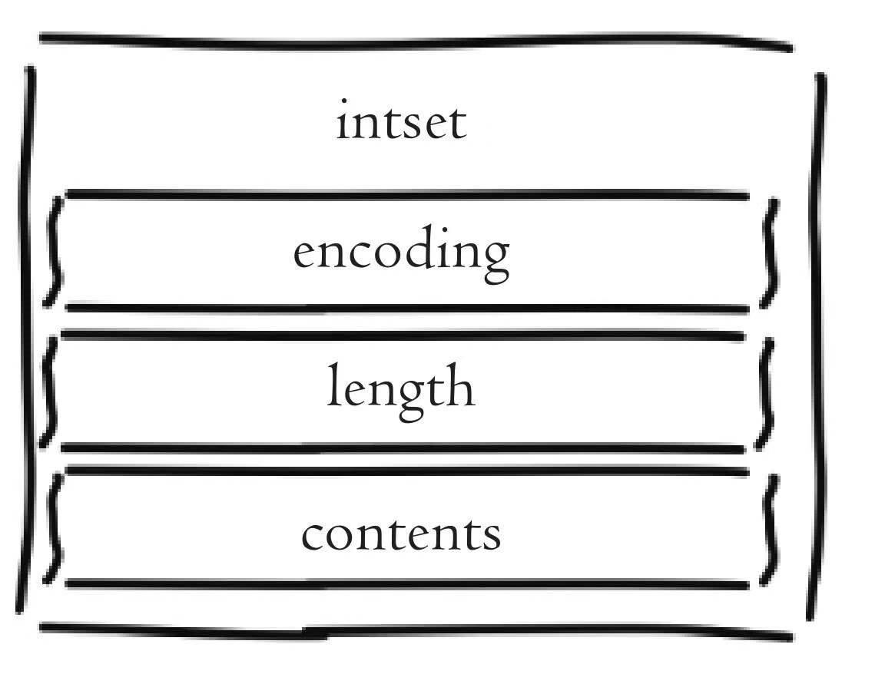


intset的字段结构含义：
 1）encoding：整数表示类型，根据集合内最长整数值确定类型，整数类型划分为三种：int-16、int-32、int-64。
 2）length：表示集合元素个数。
 3）contents：整数数组，按从小到大顺序保存。
 intset保存的整数类型根据长度划分，当保存的整数超出当前类型时，将会触发自动升级操作且升级后不再做回退。升级操作将会导致重新申请内存空间，把原有数据按转换类型后拷贝到新数组。

>   **开发提示**
>
>  使用intset编码的集合时，尽量保持整数范围一致，如都在int-16范围内。防止个别大整数触发集合升级操作，产生内存浪费。


#### 控制键的数量

可以通过将String  转成hash 来减少键的数量，，如果需要在hash里面做过期判断，可以定期使用hscan 只好出hash内超市的数据项并删除。

#### 本章回顾

-  1）Redis实际内存消耗主要包括：键值对象、缓冲区内存、内存碎片。
- 2）通过调整maxmemory控制Redis最大可用内存。当内存使用超出时，根据maxmemory-policy控制内存回收策略。
- 3）内存是相对宝贵的资源，通过合理的优化可以有效地降低内存的使用量，内存优化的思路包括：
  - 精简键值对大小，键值字面量精简，使用高效二进制序列化工具。
  - 使用对象共享池优化小整数对象。
  - 数据优先使用整数，比字符串类型更节省空间。
  - 优化字符串使用，避免预分配造成的内存浪费。
  - 使用ziplist压缩编码优化hash、list等结构，注重效率和空间的平衡。
  - 使用intset编码优化整数集合。
  - 使用ziplist编码的hash结构降低小对象链规模。


