# 多服务

## 哨兵

### 基本概念


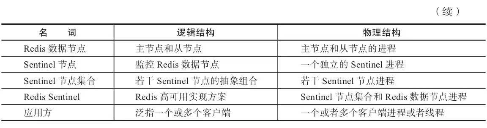

#### 主从复制问题

Redis的主从复制模式可以将主节点的数据改变同步给从节点，这样从节点就可以起到两个作用：

第一，作为主节点的一个备份，一旦主节点出了故障不可达的情况，从节点可以作为后备“顶”上来，并且保证数据尽量不丢失（主从复制是最终一致性）。

第二，从节点可以扩展主节点的读能力，一旦主节点不能支撑住大并发量的读操作，从节点可以在一定程度上帮助主节点分担读压力。
**问题：**

- ·一旦主节点出现故障，需要手动将一个从节点晋升为主节点，同时需要修改应用方的主节点地址，还需要命令其他从节点去复制新的主节点，整个过程都需要人工干预。
- 主节点的写能力受到单机的限制。（）
- 主节点的存储能力受到单机的限制。 

#### 高可用

主节点挂了，需要手动修改从节点做故障转移。手动处理的架构不是高可用的，所以引出了 **哨兵模式**

#### Redis Sentinel 的高可用性

当主节点出现故障时，Redis Sentinel能**自动完成故障发现和故障转移**，并通知应用方，从而实现真正的高可用。

 Redis Sentinel是一个分布式架构，其中包含若干个Sentinel节点和Redis数据节点，每个Sentinel节点会对**数据节点**和**其余Sentinel**节点进行监控，当它发现节点不可达时，会对节点做下线标识。如果被标识的是主节点，它还会和其他Sentinel节点进行“协商”，当大多数Sentinel节点都认为主节点不可达时，它们会选举出一个Sentinel节点来完成自动故障转移的工作，同时会将这个变化实时通知给Redis应用方。整个过程完全是自动的，不需要人工来介入，所以这套方案很有效地解决了Redis的高可用问题。
  **注意**
 这里的分布式是指：Redis数据节点、Sentinel节点集合、客户端分布在多个物理节点的架构，不要Redis Cluster分布式混淆。
 如图9-6所示，Redis Sentinel与Redis主从复制模式只是多了若干Sentinel节点，所以Redis Sentinel并没有针对Redis节点做了特殊处理，这里是很多开发和运维人员容易混淆的。

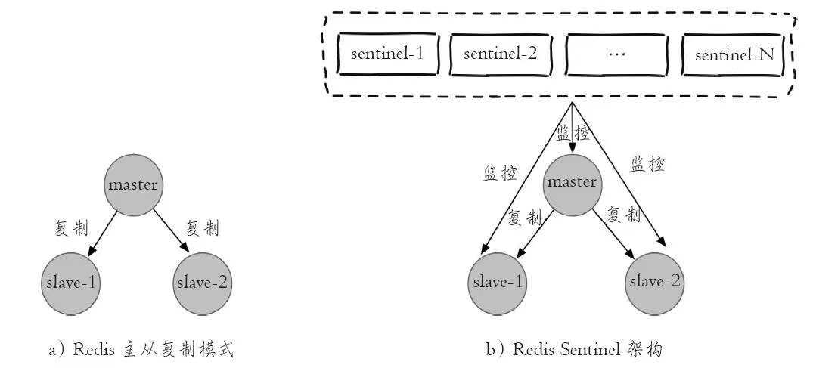


故障转移处理步骤：

1. 发现故障。多个Sentinel 对主节点的故障达成一致。

2. 选举出一个Sentinel 来做故障转移

3. Sentinel 节点处理故障

   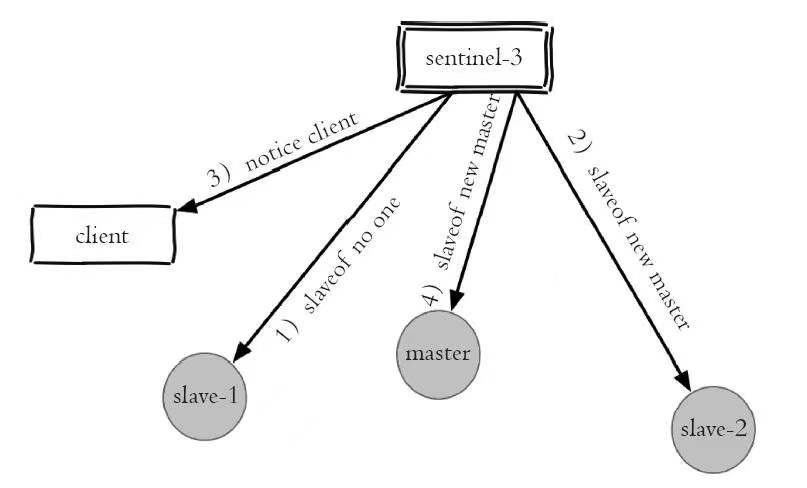

   4. 通知应用


### 安装部署

```bash
port 26379 
# 守护进程开启
daemonize yes   
logfile "sentinel_26379.log"   
dir /root/redis   
sentinel monitor mymaster 127.0.0.1 6379 2   
# 下线30秒 为不可达
sentinel down-after-milliseconds mymaster 30000   
# 同步机子个数
sentinel parallel-syncs mymaster 1   
# 故障转移失败时间
sentinel failover-timeout mymaster 180000  
```


### API

 ### 客户端链接

### 实现原理

一套合理的监控机制是Sentinel节点判定节点不可达的重要保证，Redis Sentinel通过三个定时监控任务完成对各个节点发现和监控

#### 三个定时任务 1）每隔10秒，每个Sentinel节点会向主节点和从节点发送info命令获取最新的拓扑结构，如图9-26所示


例如下面就是在一个主节点上执行info replication的结果片段：

```bash
#Replication 
role:master
connected_slaves:2
slave0:ip=127.0.0.1,port=6380,state=online,offset=4917,lag=1 slave1:ip=127.0.0.1,port=6381,state=online,offset=4917,lag=1
```

 Sentinel节点通过对上述结果进行解析就可以找到相应的从节点。
 这个定时任务的**作用**具体可以表现在三个方面：

- 通过向主节点执行info命令，获取从节点的信息，这也是为什么Sentinel节点不需要显式配置监控从节点。
- 当有新的从节点加入时都可以立刻感知出来。
- 节点不可达或者故障转移后，可以通过info命令实时更新节点拓扑信息。


2）每隔2秒，每个Sentinel节点会向Redis数据节点的\__sentinel\__：hello频道上发送该Sentinel节点对于主节点的判断以及当前Sentinel节点的信息（如图9-27所示），同时每个Sentinel节点也会订阅该频道，来了解其他Sentinel节点以及它们对主节点的判断

作用：

- 发现新的Sentinel节点：通过订阅主节点的\__sentinel\__：hello了解其他的Sentinel节点信息，如果是新加入的Sentinel节点，将该Sentinel节点信息保存起来，并与该Sentinel节点创建连接。
- Sentinel节点之间交换主节点的状态，作为后面客观下线以及领导者选举的依据。

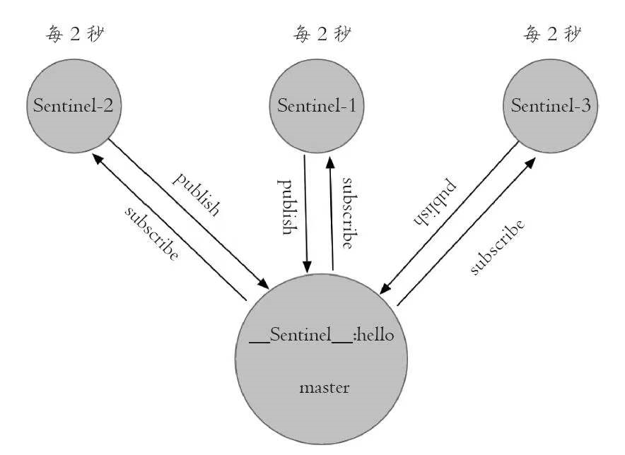

3）每隔1秒，每个Sentinel节点会向主节点、从节点、其余Sentinel节点发送一条ping命令做一次心跳检测，来确认这些节点当前是否可达。如图9-28所示。通过上面的定时任务，Sentinel节点对主节点、从节点、其余Sentinel节点都建立起连接，实现了对每个节点的监控，**这个定时任务是节点失败判定的重要依据**。

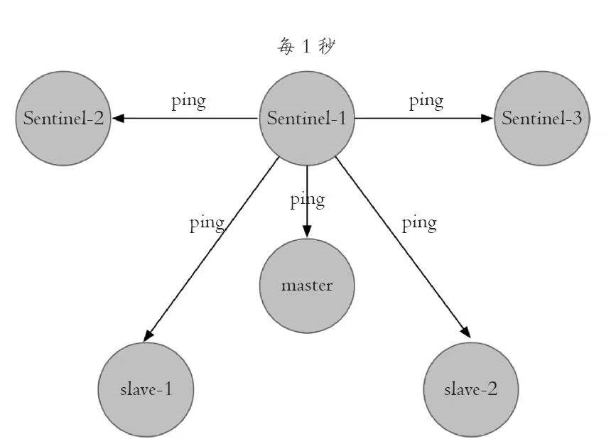

#### 主管下线和客观下线

**1.主观下线**
 上一小节介绍的第三个定时任务，每个Sentinel节点会每隔1秒对主节点、从节点、其他Sentinel节点发送ping命令做心跳检测，当这些节点超过down-after-milliseconds没有进行有效回复，Sentinel节点就会对该节点做失败判定，这个行为叫做主观下线。从字面意思也可以很容易看出主观下线是当前Sentinel节点的一家之言，存在误判的可能，如图9-29所示。


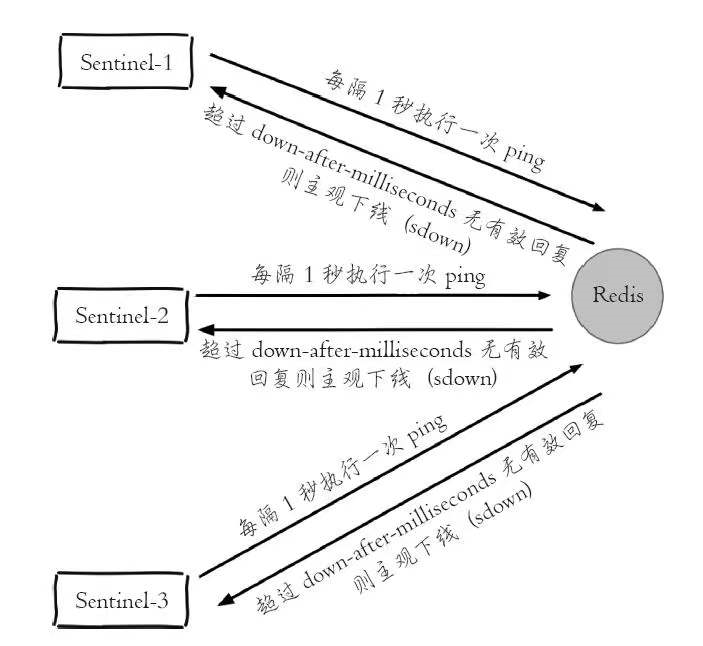


**2、客观下线**

当Sentinel主观下线的节点是主节点时，该Sentinel节点会通过sentinel is-master-down-by-addr命令向其他Sentinel节点询问对主节点的判断，当超过`<quorum>`个数，Sentinel节点认为主节点确实有问题，这时该Sentinel节点会做出客观下线的决定，这样客观下线的含义是比较明显了，也就是大部分Sentinel节点都对主节点的下线做了同意的判定，那么这个判定就是客观的，如图9-30所示。
  **注意**
 从节点、Sentinel节点在主观下线后，没有后续的故障转移操作。

 这里有必要对sentinel is-master-down-by-addr命令做一个介绍，它的使用方法如下：

```bash
 sentinel is-master-down-by-addr <ip> <port> <current_epoch> <runid>
```

- ip：主节点IP。
- port：主节点端口。
- current_epoch：当前配置纪元。
- runid：此参数有两种类型，不同类型决定了此API作用的不同。
  - 当runid等于“*”时，作用是Sentinel节点直接交换对主节点下线的判定。
  - 当runid等于当前Sentinel节点的runid时，作用是当前Sentinel节点希望目标Sentinel节点同意自己成为领导者的请求，有关Sentinel领导者选举，后面会进行介绍。

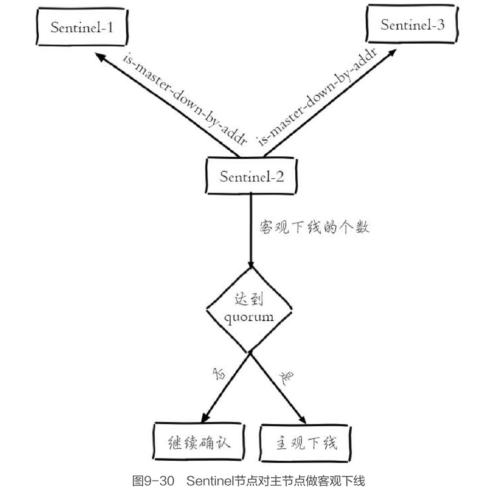

例如sentinel-1节点对主节点做主观下线后，会向其余Sentinel节点（假设sentinel-2和sentinel-3节点）发送该命令：

```bash
 sentinel is-master-down-by-addr 127.0.0.1 6379 0 *
```

 返回结果包含三个参数，如下所示：

- down_state：目标Sentinel节点对于主节点的下线判断，1是下线，0是在线。
-  leader_runid：当leader_runid等于“*”时，代表返回结果是用来做主节点是否不可达，当leader_runid等于具体的runid，代表目标节点同意runid成为领导者。
- leader_epoch：领导者纪元。


#### Sentinel 领导者选举

通过Raft算法实现选举

大致思路：

- 1）每个在线的Sentinel节点都有资格成为领导者，当它确认主节点主观下线时候，会向其他Sentinel节点发送sentinel is-master-down-by-addr命令，要求将自己设置为领导者。

-  2）收到命令的Sentinel节点，如果没有同意过其他Sentinel节点的sentinel is-master-down-by-addr命令，将同意该请求，否则拒绝。

-  3）如果该Sentinel节点发现自己的票数已经大于等于max（quorum，num（sentinels）/2+1），那么它将成为领导者。

-  4）如果此过程没有选举出领导者，将进入下一次选举。

  

 图9-31展示了一次领导者选举的大致过程：

- 1）s1（sentinel-1）最先完成了客观下线，它会向s2（sentinel-2）和s3（sentinel-3）发送sentinel is-master-down-by-addr命令，s2和s3同意选其为领导者。
- 2）s1此时已经拿到2张投票，满足了大于等于max（quorum，num（sentinels）/2+1）=2的条件，所以此时s1成为领导者。 

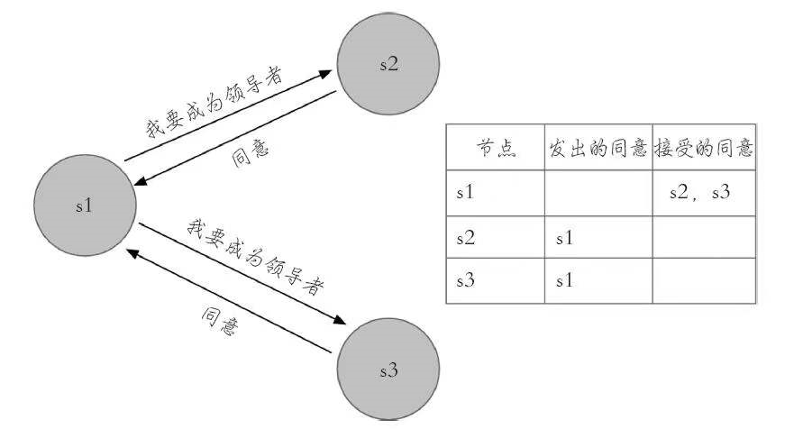

#### 故障转移

领导者选举出的Sentinel节点负责故障转移，具体步骤如下：

-  1）在从节点列表中选出一个节点作为新的主节点，选择方法如下：

  - a）过滤：“不健康”（主观下线、断线）、5秒内没有回复过Sentinel节点ping响应、与主节点失联超过down-after-milliseconds*10秒。

  - b）选择slave-priority（从节点优先级）最高的从节点列表，如果存在则返回，不存在则继续。

  - c）选择复制偏移量最大的从节点（复制的最完整），如果存在则返回，不存在则继续。

  - d）选择runid最小的从节点。

 整个过程如图9-34所示。

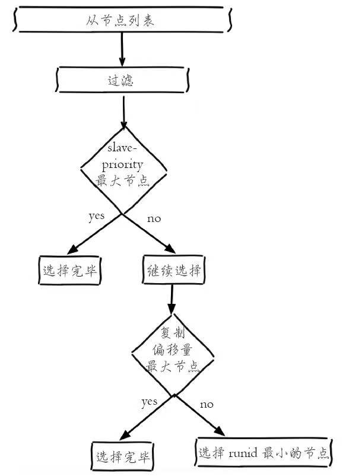


-  2）Sentinel领导者节点会对第一步选出来的从节点执行slaveof no one命令让其成为主节点。
- 3）Sentinel领导者节点会向剩余的从节点发送命令，让它们成为新主节点的从节点，复制规则和parallel-syncs参数有关。
- 4）Sentinel节点集合会将原来的主节点更新为从节点，并保持着对其关注，当其恢复后命令它去复制新的主节点。

### 本章重点

- 1）Redis Sentinel是Redis的高可用实现方案：故障发现、故障自动转移、配置中心、客户端通知。
- 2）Redis Sentinel从Redis2.8版本开始才正式生产可用，之前版本生产不可用。
-  3）尽可能在不同物理机上部署Redis Sentinel所有节点。
-  4）Redis Sentinel中的Sentinel节点个数应该为大于等于3且最好为奇数。
-  5）Redis Sentinel中的数据节点与普通数据节点没有区别。
- 6）客户端初始化时连接的是Sentinel节点集合，不再是具体的Redis节点，但Sentinel只是配置中心不是代理。
- 7）Redis Sentinel通过三个定时任务实现了Sentinel节点对于主节点、从节点、其余Sentinel节点的监控。
-  8）Redis Sentinel在对节点做失败判定时分为主观下线和客观下线。
-  9）看懂Redis Sentinel故障转移日志对于Redis Sentnel以及问题排查非常有帮助。
-  10）Redis Sentinel实现读写分离高可用可以依赖Sentinel节点的消息通知，获取Redis数据节点的状态变化。


## 集群

### 数据分布

#### 数据分布理论

分布式数据库首先要解决把整个数据集按照分区规则映射到多个节点的问题，即把数据集划分到多个节点上，每个节点负责整体数据的一个子集。如图10-1所示。

 需要重点关注的是数据分区规则。常见的分区规则有哈希分区和顺序分区两种，表10-1对这两种分区规则进行了对比。

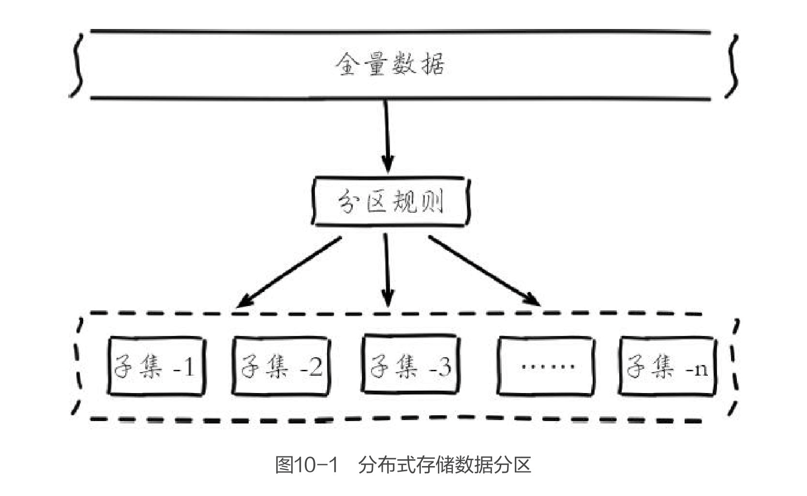

由于Redis Cluster采用哈希分区规则，这里我们重点讨论哈希分区，常见的**哈希分区规则**有几种，下面分别介绍。

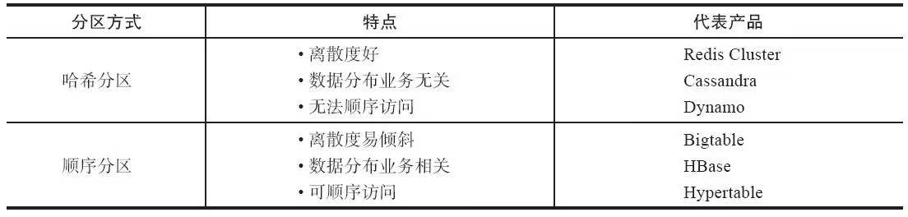

 **1.节点取余分区**

 使用特定的数据，如Redis的键或用户ID，再根据节点数量N使用公式：hash（key）%N计算出哈希值，用来决定数据映射到哪一个节点上。这种方案存在一个问题：当节点数量变化时，如扩容或收缩节点，数据节点映射关系需要重新计算，会导致数据的重新迁移。
 这种方式的突出优点是简单性，常用于数据库的分库分表规则，一般采用预分区的方式，提前根据数据量规划好分区数，比如划分为512或1024张表，保证可支撑未来一段时间的数据量，再根据负载情况将表迁移到其他数据库中。扩容时通常采用翻倍扩容，避免数据映射全部被打乱导致全量迁移的情况，如图10-2所示。


 **2.一致性哈希分区**

节点指的是一台redis 服务器

 一致性哈希分区（Distributed Hash Table）实现思路是为系统中每个节点分配一个token，范围一般在0~232，这些token构成一个哈希环。数据读写执行节点查找操作时，先根据key计算hash值，然后顺时针找到第一个大于等于该哈希值的token节点，如图10-3所示。

> 意思是没个redis 节点分配一个token。。。在根据token 放到哈希环上。。。。。数据hash 根据哈希环顺时针找就是要存储的redis节点

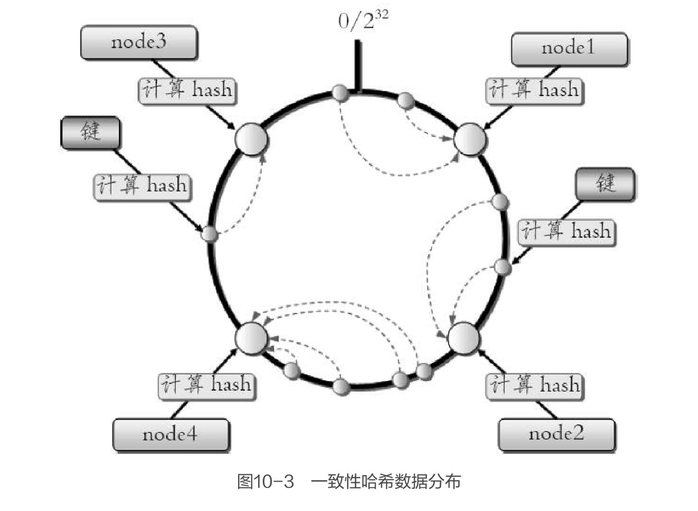

这种方式相比节点取余最大的好处在于加入和删除节点只影响哈希环中相邻的节点，对其他节点无影响。但一致性哈希分区存在几个**问题：**

- 加减节点会造成哈希环中部分数据无法命中，需要手动处理或者忽略这部分数据，因此一致性哈希常用于缓存场景。
- 当使用少量节点时，节点变化将大范围影响哈希环中数据映射，因此这种方式不适合少量数据节点的分布式方案。
- 普通的一致性哈希分区在增减节点时需要增加一倍或减去一半节点才能保证数据和负载的均衡。

 正因为一致性哈希分区的这些缺点，一些分布式系统采用虚拟槽对一致性哈希进行改进，比如Dynamo系统。

 **3.虚拟槽分区**

 虚拟槽分区巧妙地使用了哈希空间，使用分散度良好的哈希函数把所有数据映射到一个固定范围的整数集合中，整数定义为槽（slot）。这个范围一般远远大于节点数，比如Redis Cluster槽范围是0~16383。槽是集群内数据管理和迁移的基本单位。采用大范围槽的主要目的是为了方便数据拆分和集群扩展。每个节点会负责一定数量的槽，如图10-4所示。

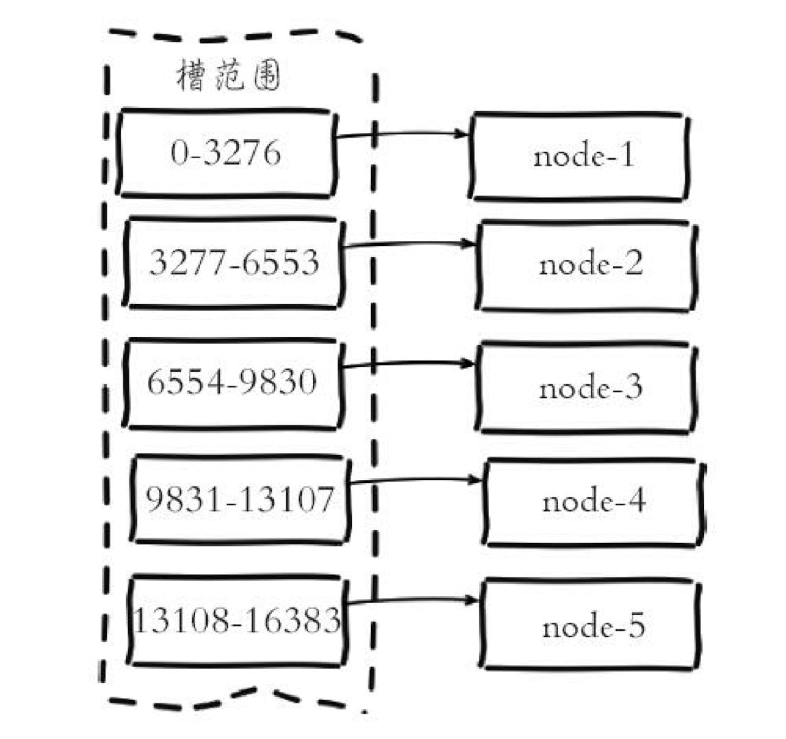 当前集群有5个节点，每个节点平均大约负责3276个槽。由于采用高质量的哈希算法，每个槽所映射的数据通常比较均匀，将数据平均划分到5个节点进行数据分区。Redis Cluster就是采用虚拟槽分区，下面就介绍Redis数据分区方法。

#### Redis 数据分区

Redis Cluser采用虚拟槽分区，所有的键根据哈希函数映射到0~16383整数槽内，计算公式：slot=CRC16（key）&16383。每一个节点负责维护一部分槽以及槽所映射的键值数据，如图10-5所示。


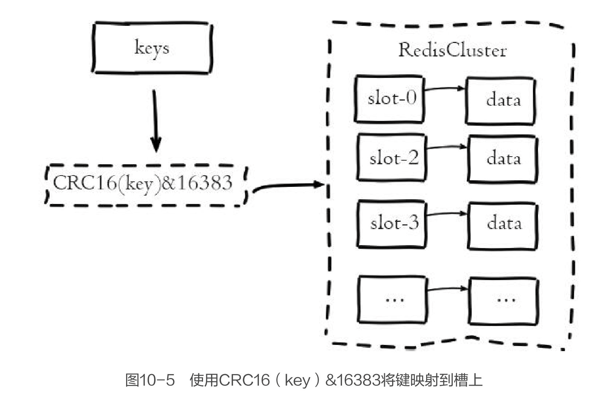

**Redis虚拟槽分区的特点：**

- 解耦数据和节点之间的关系，简化了节点扩容和收缩难度。
- 节点自身维护槽的映射关系，不需要客户端或者代理服务维护槽分区元数据。
- 支持节点、槽、键之间的映射查询，用于数据路由、在线伸缩等场景。

 数据分区是分布式存储的核心，理解和灵活运用数据分区规则对于掌握Redis Cluster非常有帮助。

#### 集群功能限制

- 1）key批量操作支持有限。如mset、mget，目前只支持具有相同slot值的key执行批量操作。对于映射为不同slot值的key由于执行mget、mget等操作可能存在于多个节点上因此不被支持。
-  2）key事务操作支持有限。同理只支持多key在同一节点上的事务操作，当多个key分布在不同的节点上时无法使用事务功能。
-  3）key作为数据分区的最小粒度，因此不能将一个大的键值对象如hash、list等映射到不同的节点。
-  4）不支持多数据库空间。单机下的Redis可以支持16个数据库，集群模式下只能使用一个数据库空间，即db0。
-  5）复制结构只支持一层，从节点只能复制主节点，不支持嵌套树状复制结构。

### 集群搭建

### 节点通信

### 集群伸缩

### 请求路由

### 故障转移

